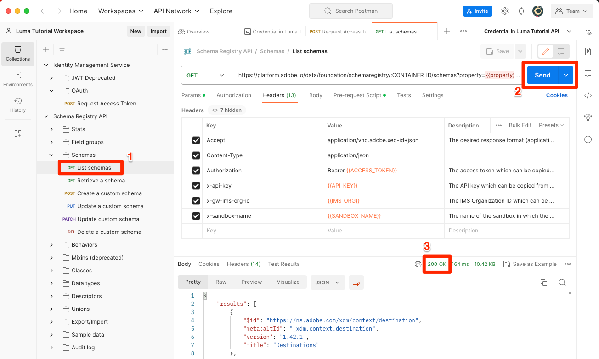

# Developer Consoleと [!DNL Postman] のセットアップ

<!--30min-->

このレッスンでは、Adobe Developer Consoleでプロジェクトを設定し、[!DNL Postman] のコレクションをダウンロードして、Platform API の使用を開始します。

このチュートリアルの API の演習を完了するには、[ お使いのオペレーティングシステム用のPostman アプリをダウンロードします。](https://www.postman.com/downloads/) Experience PlatformAPI を使用するために必須ではありませんが、Postmanを使用すると API ワークフローが容易になり、Adobe Experience Platformには API 呼び出しを実行し、その動作を学ぶのに役立つ多数のPostman コレクションが用意されています。 このチュートリアルの残りの部分では、Postmanに関する実務知識を前提としています。 サポートについては、[Postmanのドキュメント ](https://learning.postman.com/) を参照してください。

Platform は、API ファーストで構築されています。 すべての主要タスクに対してインターフェイスオプションも存在しますが、どこかの時点で Platform API を使用したい場合があります。 例えば、データの取り込み、サンドボックス間での項目の移動、ルーチンタスクの自動化、Platform の新機能の使用などを、ユーザーインターフェイスが作成される前に行います。

**データアーキテクト** および **データエンジニア** は、このチュートリアル以外で Platform API の使用が必要になる場合があります。

## 必要な権限

[ 権限の設定 ](configure-permissions.md) レッスンでは、このレッスンを完了するために必要なすべてのアクセス制御を設定します。

<!--
* Permission item Sandboxes > `Luma Tutorial`
* Developer-role access to the `Luma Tutorial Platform` product profile
-->

## Adobe Developer Consoleの設定

Adobe Developer ConsoleからAdobeAPI や SDK にアクセスしたり、ほぼリアルタイムのイベントをリッスンしたり、ランタイムで関数を実行したり、プラグインやApp Builder アプリケーションを構築したりできます。 Experience PlatformAPI にアクセスする際に使用します。 詳しくは、[Adobe Developer Consoleのドキュメントを参照してください ](https://www.adobe.io/apis/experienceplatform/console/docs.html)

1. このチュートリアルで使用するファイル用に、`Luma Tutorial Assets` という名前のフォルダーをローカルマシンに作成します。

1. [Adobe Developer Console](https://console.adobe.io){target="_blank"} を開きます

1. ログインし、正しい組織に属していることを確認します

1. [!UICONTROL &#x200B; クイックスタート &#x200B;] メニューの **[!UICONTROL 新規プロジェクトを作成]** を選択します。

   

1. 新しく作成されたプロジェクトで、「**[!UICONTROL プロジェクトを編集]**」ボタンを選択します
1. **[!UICONTROL プロジェクトタイトル]** を `Luma Tutorial API Project` に変更します（会社の複数のユーザーがこのチュートリアルを受講している場合は、最後に名前を追加します）。
1. 「**[!UICONTROL 保存]**」を選択します

   

1. 「**[!UICONTROL API を追加]**」を選択します。

   

1. **[!UICONTROL Adobe Experience Platform]** を選択してリストをフィルター

1. 使用可能な API の一覧で、「**[!UICONTROL Experience PlatformAPI]**」を選択し、「**[!UICONTROL 次へ]**」を選択します。

   

1. 資格情報として **[!UICONTROL OAuth サーバー間]** を選択し、「**[!UICONTROL 次へ]**」を選択します。
   

1. `AEP-Default-All-Users` 製品プロファイルを選択し、「**[!UICONTROL 設定済み API を保存]**」を選択します。

   

1. これで、Developer Console プロジェクトが作成されました。

1. ページの **[!UICONTROL 試す]** セクションで、「**[!UICONTROL Postman用にダウンロード]**」を選択し、「**[!UICONTROL OAuth サーバー間]**」を選択して [!DNL Postman] 環境の JSON ファイルをダウンロードします。 `oauth_server_to_server.postman_environment.json` を `Luma Tutorial Assets` フォルダーに保存します。

   

## システム管理者に、API 資格情報を役割に追加してもらいます。

API 認証情報を使用してシステムとやり取りするには、Experience Platform管理者に、前のレッスンで作成したロールに API 認証情報を割り当てる必要があります。  システム管理者でない場合は、次のアドレスを送信します。

1. API 資格情報の [!UICONTROL &#x200B; 名前 &#x200B;] （`Credential in Luma Tutorial API Project`）
1. 資格情報の [!UICONTROL &#x200B; テクニカルアカウントメール &#x200B;] （これは、システム管理者が資格情報を見つけるのに役立ちます）

   資格情報の ![[!UICONTROL &#x200B; 名前 &#x200B;] と [!UICONTROL &#x200B; テクニカルアカウントメール &#x200B;]](assets/postman-credentialDetails.png)

システム管理者の手順を次に示します。

1. [Adobe Experience Platform](https://platform.adobe.com) にログインします
1. 左側のナビゲーションで **[!UICONTROL 権限]** を選択すると [!UICONTROL &#x200B; 役割 &#x200B;] 画面に移動します
1. `Luma Tutorial Platform` の役割を開きます
   
1. 「**[!UICONTROL API 資格情報]**」タブを選択します。
1. 「**[!UICONTROL API 資格情報を追加]**」を選択します。
   
1. リストが長い場合は、チュートリアル参加者から提供された [!UICONTROL &#x200B; テクニカルアカウントメール &#x200B;] を使用してフィルタリングする、`Credential in Luma Tutorial API Project` しい資格情報を見つけます
1. 認証情報の選択
1. 「**[!UICONTROL 保存]**」を選択します

   

## Postmanの設定

>[!CAUTION]
>
>Postman インターフェイスは定期的に更新されています。 このチュートリアルのスクリーンショットは、Postman v10.15.1 for Macで撮られていましたが、インターフェイスオプションが変更された可能性があります。

1. [[!DNL Postman]](https://www.postman.com/downloads/) のダウンロードとインストール
1. [!DNL Postman] を開き、ワークスペースを作成します
   

1. ダウンロードした json 環境ファイル `oauth_server_to_server.postman_environment.json` を読み込みます。
   
1. [!DNL Postman] で、ドロップダウンから環境を選択します

1. 環境変数を表示するアイコンを選択します。

   

### サンドボックス名とテナント ID を追加

`SANDBOX_NAME` 変数、`TENANT_ID` 変数および `CONTAINER_ID` 変数はAdobe Developer Consoleの書き出しに含まれていないので、手動で追加します。

1. [!DNL Postman] で、**環境変数** を開きます。
1. 環境名の右側にある **編集** リンクを選択します
1. **新しい変数を追加** フィールドで、`SANDBOX_NAME` と入力します
1. 両方の値フィールドに、前のレッスンでサンドボックスに付けた名前「`luma-tutorial`」を入力します。 サンドボックスに異なる名前（例：luma-tutorial-ignatiusjreilly）を使用した場合は、その値を使用していることを確認してください。
1. **新しい変数を追加** フィールドで、`TENANT_ID` と入力します
1. Web ブラウザーに切り替え、Experience Platformーのインターフェイスに移動して URL の部分（@記号の後 *を抽出し、会社のテナント ID を検索し* す。 例えば、テナント ID は `techmarketingdemos` ですが、現在の ID は異なります。

   

1. この値をコピーして、環境の管理画面 [!DNL Postman] 戻ります
1. テナント ID を両方の値フィールドに貼り付けます
1. **新しい変数を追加** フィールドで、`CONTAINER_ID` と入力します
1. 両方の値フィールドに `global` を入力します

   >[!NOTE]
   >
   >`CONTAINER_ID` は、チュートリアル中に値が複数回変更されるフィールドです。 `global` を使用すると、API は Platform アカウントのAdobe提供の要素とやり取りします。 `tenant` を使用すると、API は独自のカスタム要素とやり取りします。

1. 「**保存**」を選択します

   環境変数として追加された 

## API 呼び出しの実行

### アクセストークンの取得

Adobeは、Experience Platformの API を調べるのに役立つ豊富な [!DNL Postman] コレクションのセットを提供します。 これらのコレクションは、[Adobe Experience Platform Postman サンプル GitHub リポジトリ ](https://github.com/adobe/experience-platform-postman-samples) にあります。 このリポジトリは、このチュートリアル全体で何度も使用するため、また後で自社のExperience Platformを実装する際に、ブックマークに追加する必要があります。

最初のコレクションは、AdobeIdentity Management サービス（IMS） API で動作します。 これは、Postman内からアクセストークンを取得する便利な方法です。

アクセストークンを生成するには：

1. [Identity Management サービス API コレクション ](https://github.com/adobe/experience-platform-postman-samples/blob/master/apis/ims/Identity%20Management%20Service.postman_collection.json) を `Luma Tutorial Assets` フォルダーにダウンロードします
1. コレクションの [!DNL Postman] への読み込み
1. リクエスト **oAuth：リクエストアクセストークン** リクエストを選択し、「**送信**」を選択します。
1. 応答にアクセストークンを含む `200 OK` 応答が返されます。

   

1. アクセストークンは、[!DNL Postman] 環境の **ACCESS_TOKEN** 環境変数として自動的に保存される必要があります。

   

### Platform API とのインタラクション

次に、Platform API 呼び出しを実行して、すべてが正しく設定されていることを確認します。

[GitHub のExperience Platform [!DNL Postman]  コレクション ](https://github.com/adobe/experience-platform-postman-samples/tree/master/apis/experience-platform) を開きます。 このページには、様々な Platform API 用の多くのコレクションがあります。 ブックマークすることを強くお勧めします。

次に、最初の API 呼び出しを行います。

1. [ スキーマレジストリ API コレクション ](https://raw.githubusercontent.com/adobe/experience-platform-postman-samples/master/apis/experience-platform/Schema%20Registry%20API.postman_collection.json) を `Luma Tutorial Assets` フォルダーにダウンロードします
1. [!DNL Postman] への読み込み
1. **スキーマレジストリ API/スキーマ/スキーマをリスト** を開きます。
1. 「**パラメーター**」タブと「**ヘッダー**」タブを見て、以前に入力した環境変数の一部がどのように含まれているかを確認します。
1. **ヘッダー/値を許可フィールド** は `application/vnd.adobe.xed-id+json` に設定されています。 スキーマレジストリ API には、これらの [ 指定された Accept ヘッダー値 ](https://experienceleague.adobe.com/docs/experience-platform/xdm/api/getting-started.html?lang=en#accept) のいずれかが必要で、応答で異なる形式を提供します。
1. 「**送信**」を選択して、最初の Platform API 呼び出しを行います。

以下の図に示すように、サンドボックスでAdobeが提供する使用可能な XDM スキーマのリストを含む、`200 OK` 応答が成功することを願っています。

呼び出しが成功しなかった場合は、API 呼び出しのエラー応答の詳細を使用してデバッグし、上記の手順を確認してください。 問題が発生した場合は、[ コミュニティフォーラム ](https://experienceleaguecommunities.adobe.com/t5/adobe-experience-platform/ct-p/adobe-experience-platform-community?profile.language=ja) でヘルプをリクエストするか、このページの右側にあるリンクを使用して「問題を記録」してください。

Platform の権限、サンドボックスおよび [!DNL Postman] を設定すると、[ スキーマのデータをモデル化 ](model-data-in-schemas.md) する準備が整います。
