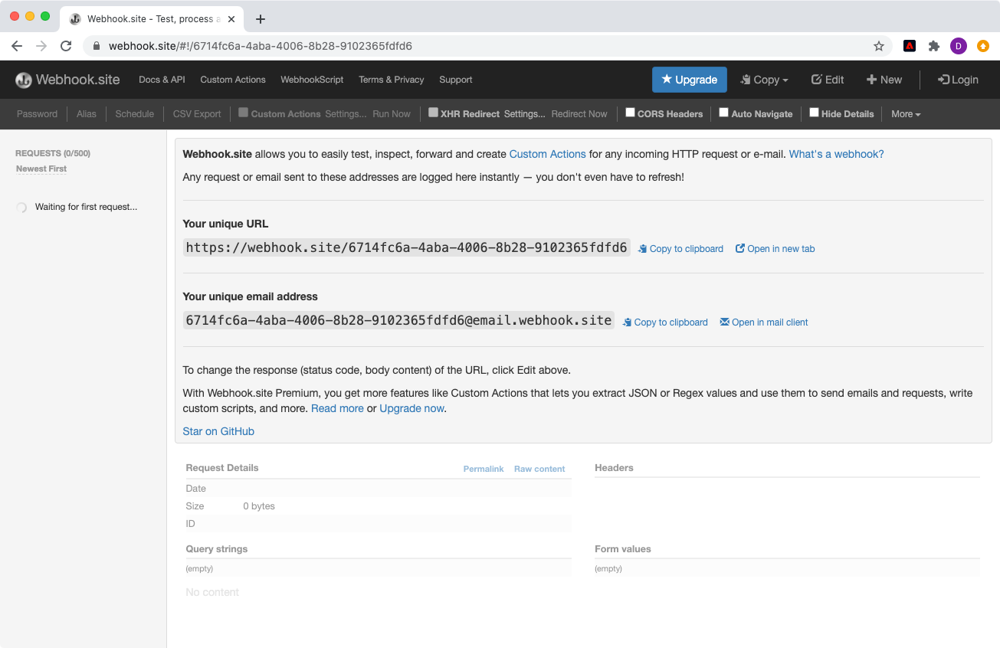
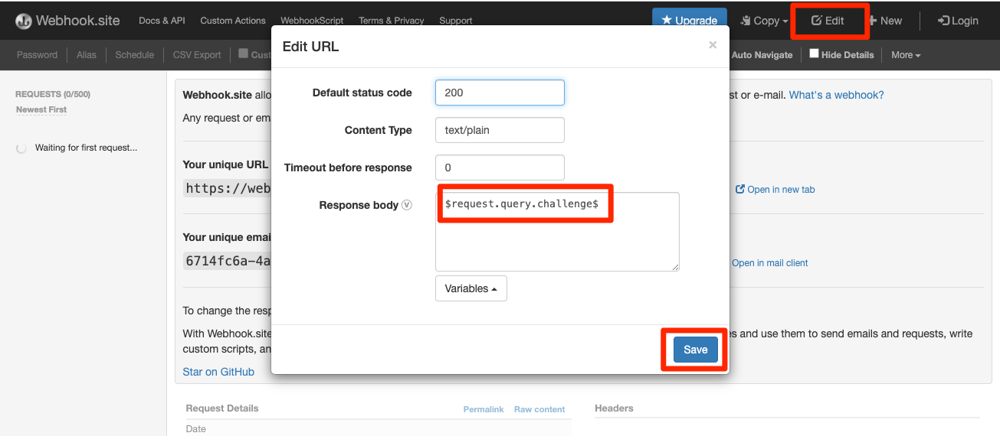
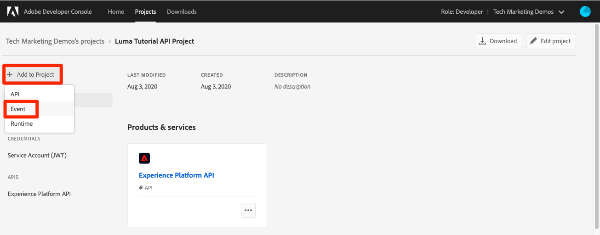
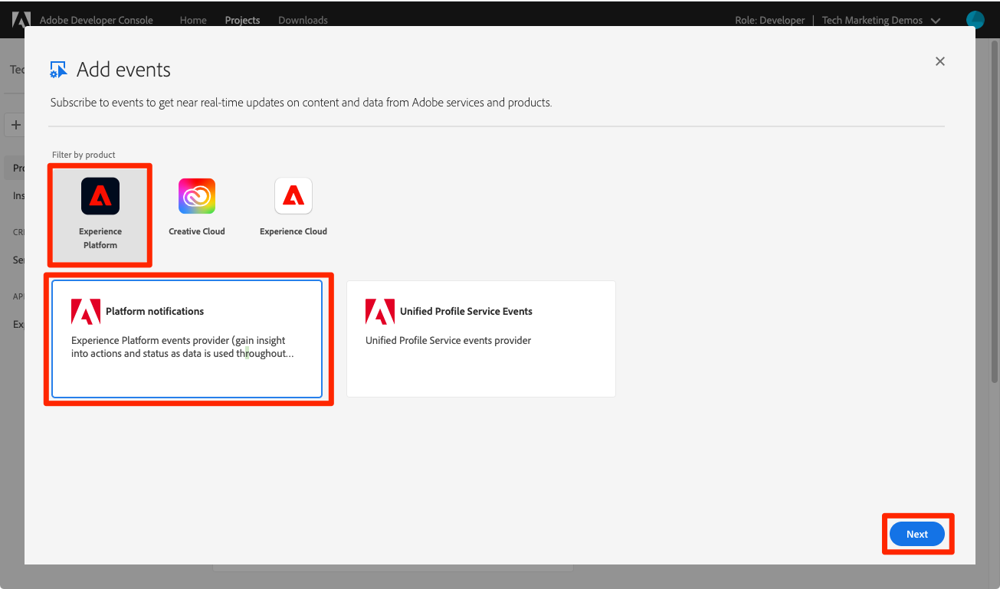
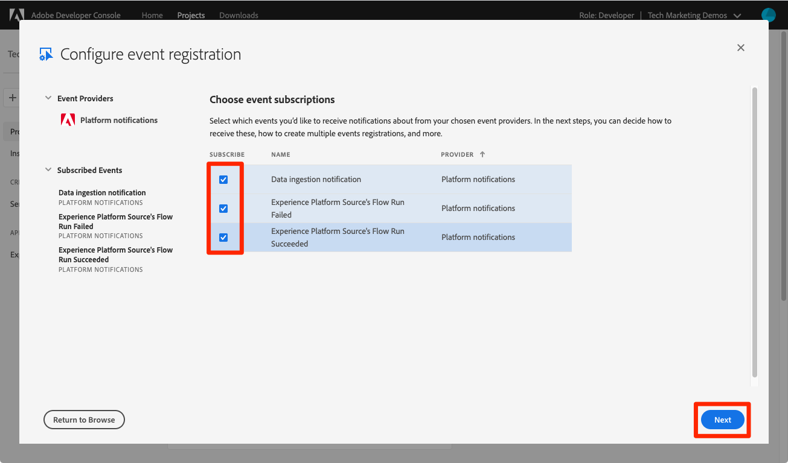
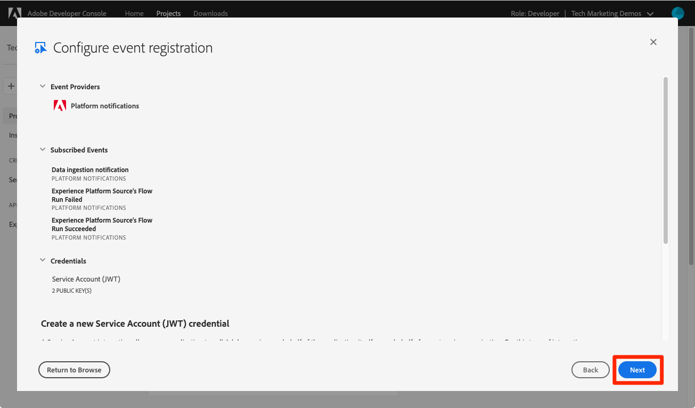
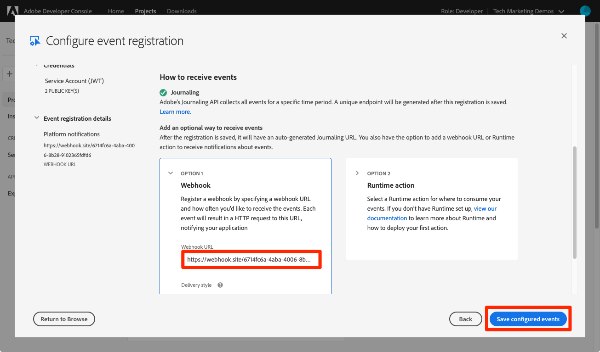
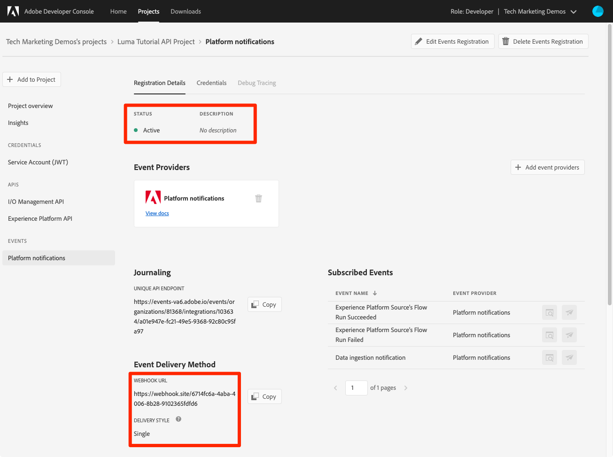
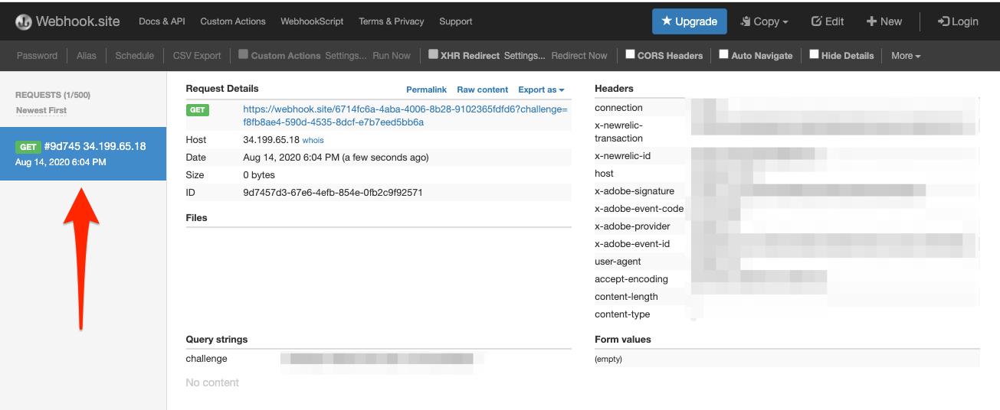

# データ取得イベントへのサブスクライブ

<!--25min-->

このレッスンでは、Adobe Developer Consoleとオンライン Webhook開発ツールを使用してWebhookを設定することで、データ取り込みイベントを購読します。 これらのイベントを使用して、以降のレッスンでデータ取り込みジョブのステータスを監視します。

**データエンジニア**は、このチュートリアル以外でデータ取り込みイベントを購読する必要があります。
**データアーキテクト** _はこのレッスン_&#x200B;をスキップして、[ バッチ取り込みレッスン ](ingest-batch-data.md)に移動できます。

## 権限が必要です

[権限の設定](configure-permissions.md) レッスンでは、このレッスンを完了するために必要なすべてのアクセス制御を設定します。具体的には次のようになります。

<!--* Developer-role access to the `Luma Tutorial Platform` product profile (for API)-->

>[!IMPORTANT]
>
> データ取り込みイベントによってトリガーされるこれらの通知は、_だけでなく、_&#x200B;すべてのサンドボックス `Luma Tutorial`に適用されます。 アカウント内の他のデータ取り込みイベントから送信された通知が表示される場合もあります。

## Webhookの設定

この演習では、webhook.siteというオンラインツールを使用してwebhookを作成します（使用する他のwebhook開発ツールを自由に置き換えてください）。

1. 別のブラウザータブで、web サイト [https://webhook.site/](https://webhook.site/)を開きます
1. 固有のURLが割り当てられます。これは、後でデータ取り込みレッスンで返す際に、ブックマークする必要があります。

   
1. 上部ナビゲーションの「**編集**」ボタンを選択します
1. 応答本文として、`$request.query.challenge$`と入力します。 このレッスンで後ほど設定したAdobe I/O Events通知は、Webhookにチャレンジを送信し、レスポンス本文に含める必要があります。
1. 「**保存**」ボタンを選択します

   

## 設定

1. 別のブラウザータブで、[Adobe Developer Console](https://console.adobe.io/)を開きます
1. `Luma Tutorial API Project`を開きます
1. 「**[!UICONTROL プロジェクトに追加]**」ボタンを選択し、**[!UICONTROL イベント]**&#x200B;を選択します

   
1. **[!UICONTROL Experience Platform]**&#x200B;を選択してリストをフィルタリング
1. **[!UICONTROL プラットフォーム通知]**&#x200B;を選択
1. 「**[!UICONTROL 次へ]**」ボタンを選択
   
1. すべてのイベントを選択し
1. 「**[!UICONTROL 次へ]**」ボタンを選択
   
1. 資格情報を設定する次の画面で、**[!UICONTROL 次へ]** ボタンをもう一度選択します
   
1. **[!UICONTROL イベント登録名]**&#x200B;として、`Platform notifications`と入力します
1. 下にスクロールして選択し、**[!UICONTROL Webhook]** セクションを開きます
1. **[!UICONTROL Webhook URL]**&#x200B;として、Webhook.siteの&#x200B;**一意のURL** フィールドから値を貼り付けます
1. 「**[!UICONTROL 設定済みイベントを保存]**」ボタンを選択します
   
1. 設定が保存されるのを待つと、`Platform notifications` イベントがWebhookの詳細でアクティブであり、エラーメッセージがないことを確認できます
   
1. 「webhook.site」タブに切り替えると、Developer Console設定の検証に起因するwebhookへの最初のリクエストが表示されます。
   での最初のリクエスト

今のところ、データを取り込むときに次のレッスンでこれらの通知について詳しく説明します。

## その他のリソース

* [Webhook.site](https://webhook.site/)
* [ データ取り込み通知ドキュメント ](https://experienceleague.adobe.com/docs/experience-platform/ingestion/quality/subscribe-events.html)
* [Adobe I/O Eventsの概要ドキュメント ](https://www.adobe.io/apis/experienceplatform/events/docs.html)

それでは、最後に[ データの取り込みを開始しましょう](ingest-batch-data.md)!
