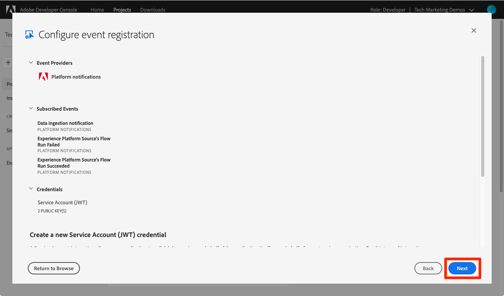

# データ取得イベントへのサブスクライブ

<!--25min-->

このレッスンでは、Adobe Developer Consoleとオンラインの Webhook 開発ツールを使用して Webhook を設定し、データ取得イベントをサブスクライブします。 これらのイベントを使用して、後続のレッスンでデータ取り込みジョブのステータスを監視します。

**データエンジニア** は、このチュートリアル以外でデータ取り込みイベントを購読する必要があります。
**データアーキテクト**_このレッスンをスキップして_[ バッチ取り込みレッスン ](ingest-batch-data.md) に進むことができます。

## 必要な権限

[ 権限の設定 ](configure-permissions.md) レッスンでは、このレッスンを完了するために必要なすべてのアクセス制御を設定します。

<!--* Developer-role access to the `Luma Tutorial Platform` product profile (for API)
-->

>[!IMPORTANT]
>
> データ取り込みイベントによってトリガーされるこれらの通知は、`Luma Tutorial` ーザーだけでなく、_すべてのサンドボックス_ に適用されます。 お使いのアカウントに他のデータ取り込みイベントに起因する通知が表示される場合もあります。

## Webhook の設定

この演習では、webhook.site と呼ばれるオンラインツールを使用して webhook を作成します（使用したい他の webhook 開発ツールがあれば、自由に置き換えてください）。

1. 別のブラウザータブで、web サイト [https://webhook.site/](https://webhook.site/) を開きます
1. 一意の URL が割り当てられ、データ取り込みのレッスンで後から戻る際にブックマークに追加する必要があります。

   
1. 上部ナビゲーションの「**編集**」ボタンを選択します。
1. 応答本文として、「`$request.query.challenge$`」と入力します。 このレッスンの後半で設定するAdobe I/Oイベント通知は、Webhook にチャレンジを送り、応答本文に含める必要があります。
1. 「**保存** ボタンを選択します

   

## 設定

1. 別のブラウザータブで、[Adobe Developer Console](https://console.adobe.io/) を開きます
1. `Luma Tutorial API Project` を開きます
1. 「**[!UICONTROL プロジェクトに追加]**」ボタンを選択し、「**[!UICONTROL イベント]**」を選択します

   
1. **[!UICONTROL Experience Platform]** を選択してリストをフィルター
1. 「**[!UICONTROL Platform 通知]**」を選択します。
1. 「**[!UICONTROL 次へ]**」ボタンを選択します
   
1. すべてのイベントを選択します
1. 「**[!UICONTROL 次へ]**」ボタンを選択します
   
1. 認証情報を設定するための次の画面で、もう一度「**[!UICONTROL 次へ]**」ボタンを選択します
   
1. **[!UICONTROL イベント登録名]** として、`Platform notifications` と入力します
1. 下にスクロールして、選択して「**[!UICONTROL Webhook]**」セクションを開きます
1. **[!UICONTROL Webhook URL]** として、webhook.site の **一意の URL** フィールドから値を貼り付けます
1. 「**[!UICONTROL 設定済みのイベントを保存]**」ボタンを選択します
   
1. 設定が保存されるのを待つと、Webhook の詳細を使用して `Platform notifications` イベントがアクティブになり、エラーメッセージが表示されないことがわかります
   
1. Webhook.site タブに戻ると、Developer Console設定の検証による、webhook への最初のリクエストが表示されます。
   

以上で、データの取り込み時に、次のレッスンでこれらの通知について詳しく説明します。

## その他のリソース

* [Webhook.site](https://webhook.site/)
* [ データ取得通知ドキュメント ](https://experienceleague.adobe.com/docs/experience-platform/ingestion/quality/subscribe-events.html)
* [Adobe I/Oイベントの概要ドキュメント ](https://www.adobe.io/apis/experienceplatform/events/docs.html)

それでは、最後に [ データの取り込み ](ingest-batch-data.md) を開始します。
