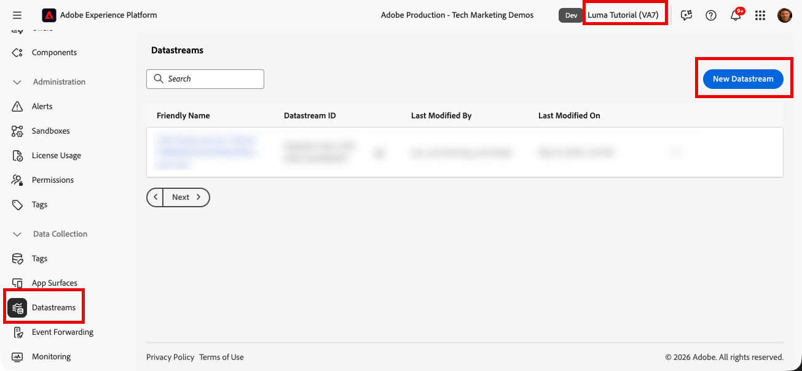
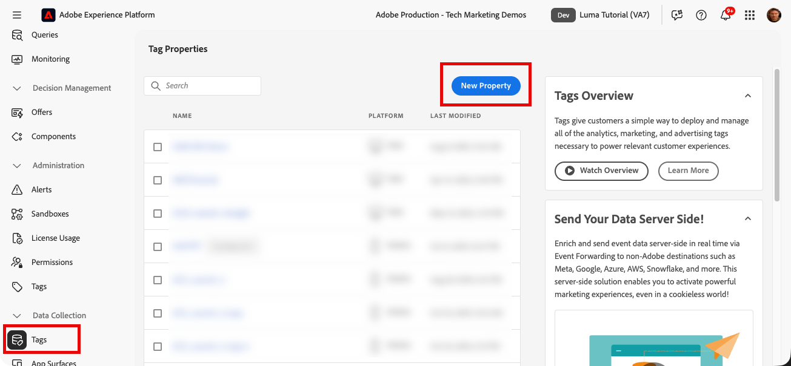
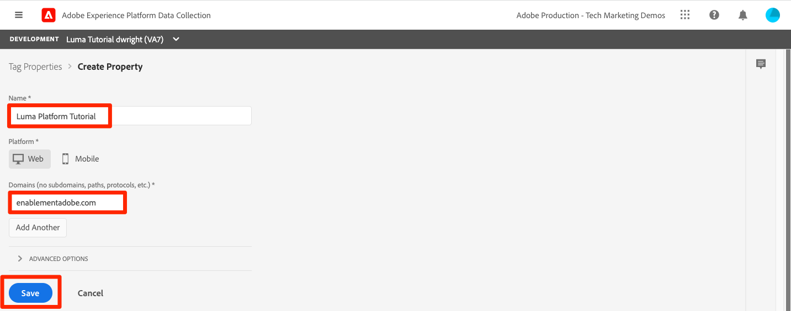
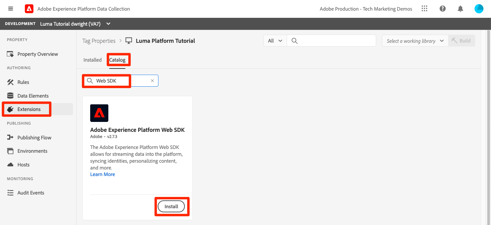
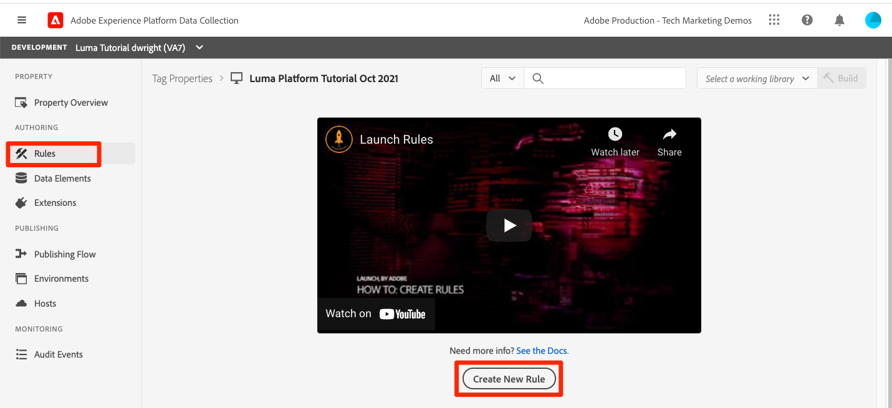
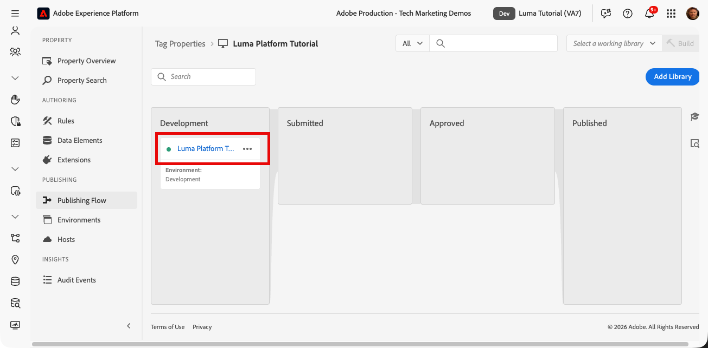
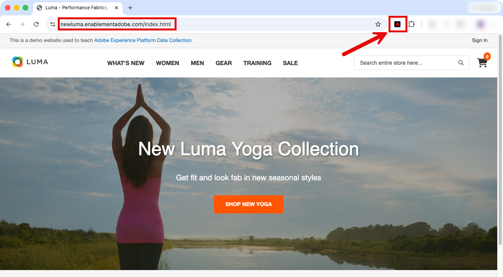
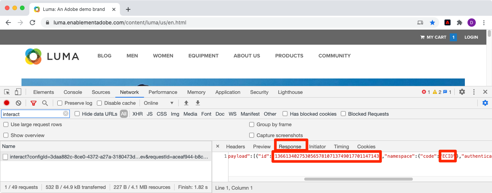
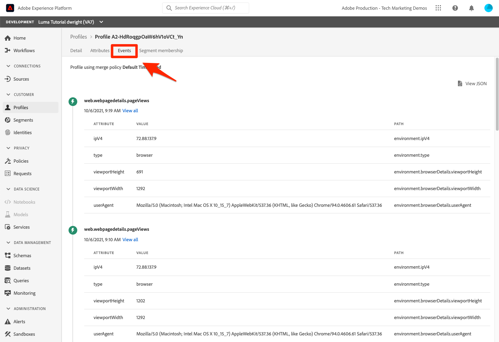
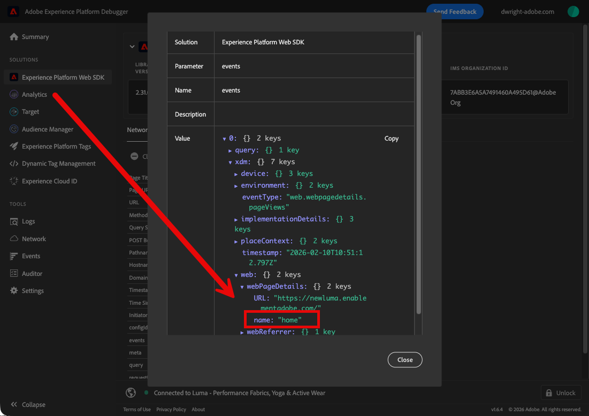

# ストリーミングデータの取り込み

<!--1hr-->

このレッスンでは、Adobe Experience Platform web SDKを使用してデータをストリーミングします。

>[!WARNING]
>
> このチュートリアルで使用する Luma の web サイトは、2026 年 2 月 16 日の週に置き換えられる予定です。 このチュートリアルの一部で行った作業は、新しい web サイトには適用されない場合があります。

データ収集タスクには、主に次の 2 つがあります。

* Luma web サイトに web SDKを実装して、顧客イベントをExperience Platform Edge Networkにストリーミングします。

* データストリームを設定して、Edge NetworkがExperience Platformの `Luma Web Events Dataset` にデータを転送できるようにします。

**データエンジニア** は、このチュートリアル以外でストリーミングデータを取り込む必要があります。 Web 開発者は通常 Web SDKを web サイトに実装しますが、そのプロセスがどのように機能するかを知ることが重要です。 Web 開発者でなくても、この基本的な実装を完了できます。

演習を開始する前に、次の 2 つの短いビデオを視聴して、ストリーミングデータ取得と web SDKについて詳しく学びます。

>[!VIDEO](https://video.tv.adobe.com/v/31657?captions=jpn&learn=on&enablevpops)

>[!VIDEO](https://video.tv.adobe.com/v/37263?captions=jpn&learn=on&enablevpops)

>[!NOTE]
>
>このチュートリアルでは、Web SDKで web サイトからストリーミングで取り込む方法に重点を置いていますが、[Mobile SDK](https://experienceleague.adobe.com/ja/docs/platform-learn/implement-mobile-sdk/overview)、[Edge Network Server API](https://experienceleague.adobe.com/ja/docs/platform-learn/data-collection/server-api/overview) および [HTTP API](https://experienceleague.adobe.com/ja/docs/experience-platform/sources/connectors/streaming/http) を使用してデータをストリーミングすることもできます。

## 権限が必要です

[&#x200B; 権限の設定 &#x200B;](configure-permissions.md) レッスンでは、このレッスンを完了するために必要なすべてのアクセス制御を設定します。

## データストリームの設定

まず、データストリームを設定します。 データストリームは、web Edge Network呼び出しからデータを受信した後に、データを送信する場所をExperience Platform SDKに指示します。 例えば、データをExperience Platform、Adobe AnalyticsまたはAdobe Targetに送信しますか？

[!UICONTROL &#x200B; データストリーム &#x200B;] を作成するには：

1. サンドボックスにいることを確認 ` Luma Tutorial` ます
1. 左側のナビゲーションで **[!UICONTROL データストリーム]** を選択します
1. 右上隅の **[!UICONTROL 新しいデータストリーム]** ボタンを選択します

   

1. **[!UICONTROL 名前]** には、「`Luma Platform Tutorial`」と入力します（このチュートリアルを社内の複数のユーザーが受講している場合は、最後に名前を追加します）
1. 「**[!UICONTROL 保存]** ボタンを選択します

   

データがEdgeに到達すると、[!UICONTROL &#x200B; データストリーム &#x200B;] は、設定済みの [!UICONTROL &#x200B; サービス &#x200B;] にデータを転送します。 データをExperience Platformに送信するには：

1. 「**[!UICONTROL サービスを追加]**」を選択します。
   

1. Select `Adobe Experience Platform`
1. `Luma Web Events Dataset` を選択
1. 「**[!UICONTROL 保存]**」を選択します

   

データストリーム設定にはプロファイルデータセット オプションがありますが、通常の XDM 個人プロファイルデータを Platform に送信する場合は、これを使用しないでください。 この設定は、同意、プッシュトークン、ユーザーアクティビティ地域の詳細を送信する場合にのみ使用してください。

[!UICONTROL Offer Decisioning]、[!UICONTROL Edge セグメント化、]Edgeの宛先 [!UICONTROL 、]Personalization[!UICONTROL &#x200B; のチェックボックスを使用して &#x200B;]Adobe Journey Optimizer上のデータをアクティブ化できますが、このチュートリアルでは使用しません。

## Web SDKの実装

### プロパティを追加

まず、タグプロパティ（以前のタグプロパティ）を作成する必要があります。 プロパティは、web ページから詳細を収集して様々な場所に送信するために必要なすべてのJavaScript、ルール、その他の機能のコンテナです。

プロパティを作成するには：

1. 左側のナビゲーションの **[!UICONTROL タグ]** に移動します
1. **[!UICONTROL 新規プロパティ]** を選択します。
   
1. **[!UICONTROL 名前]** として、`Luma Platform Tutorial` と入力します（会社の複数のユーザーがこのチュートリアルを受講している場合は、最後に名前を追加します）。
1. **[!UICONTROL ドメイン]** として、`enablementadobe.com` と入力します（後で説明します）。
1. 「**[!UICONTROL 保存]**」を選択します
   

### プロパティに拡張機能を追加

プロパティが用意できたので、拡張機能を使用して web SDKを追加できます。 拡張機能は、タグプロパティと実装に機能を追加するコードのパッケージです。 拡張機能を追加するには：

1. タグプロパティを開きます
1. 左ナビゲーションの **[!UICONTROL 拡張機能]** に移動します
1. 「**[!UICONTROL カタログ]** タブに移動します
1. タグに使用できる拡張機能は多数あります。 `Web SDK` という用語でカタログをフィルタリングします
1. **[!UICONTROL Adobe Experience Platform Web SDK]** 拡張機能を選択して、サイドパネルを開きます
1. 「**[!UICONTROL インストール]**」ボタンを選択します
   
1. Web SDK拡張機能で使用できる設定はいくつかありますが、このチュートリアルで設定する設定は 2 つだけです。 **[!UICONTROL Edge ドメイン]** を `data.enablementadobe.com` に更新します。 この設定を使用すると、Web SDKの実装でファーストパーティ Cookie を設定できます。これは推奨されます。 Web SDKを独自の web サイトに実装する場合、独自のデータ収集目的（例：`data.YOUR_DOMAIN.com`）で CNAME を作成することをお勧めします。
1. 「**[!UICONTROL データストリーム]**」セクションの実稼動環境では、`Luma Tutorial` サンドボックスと `Luma Platform Tutorial` データストリームを選択します。
1. 他の設定オプションを自由に確認して（ただし、変更しないでください）、「**[!UICONTROL 保存]**」を選択します。
   

拡張機能カタログ画面から、Adobe Client Data Layer 拡張機能をインストールします。 この拡張機能は、Luma の web サイトからデータレイヤーを読み取るのに役立ちます。

拡張機能では設定は必要ないので、ライブラリに保存するだけです。

## データを送信するルールの作成

次に、データを Platform に送信するルールを作成します。 ルールは、タグに何かをするように指示するイベント、条件、アクションの組み合わせです。 ルールを作成するには：

1. **[!UICONTROL ルール]** に移動します。
1. 「**[!UICONTROL 新規ルールを作成]**」ボタンを選択します
   
1. ルール名を設定します。`adobeDataLayer event`
1. **[!UICONTROL イベント]** で「**[!UICONTROL 追加]**」ボタンを選択します
   
1. **[!UICONTROL Adobe Client Data Layer]** **[!UICONTROL Extension]** を使用し、**[!UICONTROL Event Type]** として **[!UICONTROL Data Pushed]** を選択します。
1. **[!UICONTROL リスニング]** を選択します。 **[!UICONTROL すべてのイベント]**。
1. 「**[!UICONTROL 変更を保持]**」を選択して、メインのルール画面に戻ります
   
1. **[!UICONTROL アクション]** で「**[!UICONTROL 追加]**」ボタンを選択します
1. **[!UICONTROL Adobe Experience Platform Web SDK]** **[!UICONTROL Extension]** を使用し、**[!UICONTROL Action Type]** として **[!UICONTROL Send Event]** を選択します
1. 右側の **[!UICONTROL タイプ]** ドロップダウンから「**[!UICONTROL Web web web ページ詳細ページ表示]**」を選択します。 これにより、`Luma Web Events Schema` の eventType フィールドに値が設定されます
1. 「**[!UICONTROL 変更を保持]**」を選択して、メインのルール画面に戻ります
   
1. 「**[!UICONTROL 保存]**」を選択して、ルールを保存します\
   

## ライブラリへのルールの公開

次に、ルールが機能することを検証できるように、開発環境に公開します。

ライブラリを作成するには：

1. 左側のナビゲーションの **[!UICONTROL 公開フロー]** に移動します
1. 「**[!UICONTROL ライブラリを追加]**」を選択します。
   
1. **[!UICONTROL 名前]** に `Luma Platform Tutorial` と入力します
1. **[!UICONTROL 環境]** で、「`Development`」を選択します。
1. 「**[!UICONTROL 変更されたすべてのリソースを追加]**」ボタンを選択します。 （[!UICONTROL Adobe Experience Platform Web SDK] 拡張機能と `adobeDataLayer event` ルールに加えて、すべてのタグの web プロパティに必要な基本JavaScriptを含んだ [!UICONTROL Core] 拡張機能も追加されます。）
1. 「**[!UICONTROL 開発用に保存してビルド]** ボタンを選択します
   

ライブラリのビルドには数分かかる場合があり、完了すると、ライブラリ名の左側に緑のドットが表示されます。

[!UICONTROL &#x200B; 公開フロー &#x200B;] 画面で確認できるように、公開プロセスには多くの詳細があり、これはこのチュートリアルの範囲外です。 開発環境では、単一のライブラリを使用します。

## リクエスト内のデータを検証します

### Adobe Experience Platform Debuggerを追加

Experience Platform Debugger は、Chromeで使用できる拡張機能で、web ページに実装されたAdobe テクノロジーを確認するのに役立ちます。 使用するブラウザーのバージョンをダウンロードします。

* [Chrome拡張機能 &#x200B;](https://chrome.google.com/webstore/detail/adobe-experience-platform/bfnnokhpnncpkdmbokanobigaccjkpob)

デバッガーをまだ使用したことがない場合は、次の 5 分間の概要ビデオをご覧ください。

>[!VIDEO](https://video.tv.adobe.com/v/36086?captions=jpn&learn=on&enablevpops)

### Luma web サイトを開きます

このチュートリアルでは、Luma デモ web サイトの公開バージョンを使用します。 これを開いて、ブックマークします。

1. 新しいブラウザータブで、[Luma web サイト &#x200B;](https://newluma.enablementadobe.com) を開きます。
1. チュートリアルの残りの部分で使用するために、ページをブックマークします

このホストされる web サイトで `enablementadobe.com`、最初のタグプロパティ設定の [!UICONTROL Domains] フィールドに使用した理由と、`data.enablementadobe.com`Adobe Experience Platform web SDK[!UICONTROL &#x200B; 拡張機能のファーストパーティドメインとして &#x200B;] を使用した理由です。 見て、私は計画を持っていた！

### Experience Platform Debugger を使用して、タグプロパティにマッピングします

Experience Platform Debugger には、既存のタグプロパティを別のプロパティに置き換えることができる優れた機能があります。 これは検証に役立ち、このチュートリアルの多くの実装手順をスキップできます。

1. Luma サイトが開いていることを確認し、Experience Platform Debugger 拡張機能アイコンを選択します
1. デバッガーが開き、ハードコーディングされた実装の詳細が表示されます。これは、このチュートリアルとは無関係です（デバッガーを開いた後に Luma サイトをリロードする必要がある場合があります）
1. 次の図に示すように、デバッガーが「**[!UICONTROL Luma に接続]**」されていることを確認し、「**[!UICONTROL lock]**」アイコンを選択して、デバッガーを Luma サイトにロックします。
1. 右上の **[!UICONTROL ログイン]** ボタンを選択して、認証します。
1. 左側のナビゲーションの **[!UICONTROL Experience Platform タグ]** に移動します
1. 「設定」タブを選択します。
1. **[!UICONTROL ページ埋め込みコード]** が表示されている場所の右側で、「**[!UICONTROL アクション]**」ドロップダウンを開き、「**[!UICONTROL 置換]**」を選択します
   
1. 認証されたので、Debugger は使用可能なタグプロパティと環境を取り込みます。 `Luma Platform Tutorial` プロパティを選択します
1. `Development` 環境を選択します
1. 「**[!UICONTROL 適用]** ボタンを選択します
   
1. Luma web サイトが _タグプロパティを使用して_ 再読み込みされるようになりました。
   
1. 左側のナビゲーションの **[!UICONTROL 概要]** に移動して、[!UICONTROL &#x200B; タグ &#x200B;] プロパティの詳細を確認します
   
1. 左側のナビゲーションで **[!UICONTROL Experience Platform Web SDK]** に移動して、**[!UICONTROL ネットワークリクエスト]** を確認します
1. **[!UICONTROL events]** 行を選択します

   

1. `web.webpagedetails.pageView` イベントの送信 [!UICONTROL &#x200B; アクションで指定した &#x200B;] イベントタイプが表示されます
   

1. リクエストの詳細は、ブラウザーの web 開発者ツールの「ネットワーク **タブにも表示さ** ます。 ファイルを開き、ページをリロードします。 `interact` を使用して呼び出しをフィルタリングし、呼び出しを見つけて選択し、「**ヘッダー**」タブの **リクエストペイロード** 領域を探します。
   
1. 「**応答**」タブに移動し、ECID 値が応答にどのように含まれるかを確認します。 この値をコピーします。次の演習では、この値を使用してプロファイル情報を検証します。
   

## Experience Platformのデータの検証

データに到着したデータのバッチを調べることで、データが Platform にランディングしていることを検証で `Luma Web Events Dataset` ます。 （ストリーミングデータ取り込みと呼ばれますが、今はバッチで到着すると言っています。 リアルタイムでプロファイルにストリーミングするので、リアルタイムのセグメント化とアクティベーションに使用できますが、データレイクに 15 分ごとにバッチで送信されます）。

データを検証するには：

1. Platform ユーザーインターフェイスの左側のナビゲーションで **[!UICONTROL データセット]** に移動します
1. `Luma Web Events Dataset` を開き、バッチが到着したことを確認します。 バッチは 15 分ごとに送信されるので、バッチが表示されるまで待つ必要がある場合があります。
1. 「**[!UICONTROL データセットをプレビュー]**」ボタンを選択します
   
1. プレビューモーダルでは、左側でスキーマの様々なフィールドを選択して、それらの特定のデータポイントをプレビューする方法に注意してください。
   

また、新しいプロファイルが表示されていることを確認することもできます。

1. Platform ユーザーインターフェイスで、左側のナビゲーションの **[!UICONTROL プロファイル]** に移動します
1. **[!UICONTROL ECID]** 名前空間を選択し、ECID 値を検索します（応答からコピーします）。 プロファイルには、ECID とは別に独自の ID が割り当てられます。
1. **[!UICONTROL プロファイル ID]** を選択して、プロファイルを開きます
   。
1. **[!UICONTROL イベント]** タブを選択して、表示したページを表示します
   \
   <!---->

## イベントへのカスタムデータの追加

Web SDKでは多くの XDM フィールドが自動的に入力されますが、web サイトから追加のフィールドを収集するには、実装をカスタマイズする必要が生じる場合があります。 これは非常に複雑ですが、いくつかの簡単な例を示します。

### XDM データを格納するデータ要素の作成

1. `Luma Platform Tutorial` タグプロパティに戻ります
1. **[!UICONTROL 作業ライブラリを選択]** ドロップダウンを開き、`Luma Platform Tutorial` 動ライブラリを選択します。 この設定により、ライブラリに追加の更新を公開しやすくなります。
1. 左ナビゲーションの **[!UICONTROL データ要素]** に移動します
1. 「**[!UICONTROL 新しいデータ要素の作成]** ボタンを選択します

   

**[!UICONTROL データ要素]** ページで、次の操作を行います。

1. **[!UICONTROL 名前]** として、`XDM data` と入力します
1. **[!UICONTROL 拡張機能]** として、「`Adobe Experience Platform Web SDK`」を選択します
1. **[!UICONTROL データ要素タイプ]** として、「`Variable`」を選択します
1. **[!UICONTROL サンドボックス]** として、`Luma Tutorial` のサンドボックスを選択します
1. **[!UICONTROL スキーマ]** として、`Luma Web Events Schema` を選択します
1. 作業ライブラリとして「`Luma Platform Tutorial`」が選択されていることを確認します
1. 「**[!UICONTROL ライブラリに保存]**」を選択します
   

### ページ名のデータ要素を作成

1. 新しいデータ要素の作成
1. **[!UICONTROL 名前]** として、`Page Name` と入力します
1. **[!UICONTROL データ要素タイプ]** として、「`JavaScript Variable`」を選択します
1. **[!UICONTROL JavaScript変数名]** として、`adobeDataLayer.0.page.name` と入力します
1. 値の形式を標準化するには、「小文字の値を強制 **[!UICONTROL 」および「テキストをクリーン]** のチェックボックスをオンに **[!UICONTROL ま]**。
1. 「**[!UICONTROL ライブラリに保存]**」を選択します
   

### XDM データをイベントを送信アクションに追加します

XDM フィールドにマッピングされたデータがあるので、イベントを送信アクションに含めることができます。

1. **[!UICONTROL ルール]** 画面に移動します
1. `adobeDataLayer event` ルールを開きます
1. `Adobe Experience Platform Web SDK - Send Event` アクションを開く
1. **[!UICONTROL XDM]** として、アイコンを選択してデータ要素選択モーダルを開き、`XDM data` データ要素を選択します
1. 「**[!UICONTROL 変更を保持]**」を選択します
   

1. ルールに新しいアクションを追加します
1. `Adobe Experience Platform Web SDK` **[!UICONTROL 拡張機能]** を選択します
1. `Update Variable`**[!UICONTROL アクションタイプ]**」を選択します。
1. `Page Name` データ要素を `web.webPageDetails.name` として入力します
1. 「**[!UICONTROL 変更を保持]**」を選択します
   

1. [!UICONTROL Send イベント &#x200B;] の前に [!UICONTROL &#x200B; 変数を更新 &#x200B;] が発生するように [!UICONTROL Actions] を並べ替えます
1. 前回の演習 `Luma Platform Tutorial` 作業ライブラリとしてを選択したので、最近の変更はライブラリに直接保存されています。 公開フロー画面を使用して変更を公開する代わりに、ドロップダウンを開いて「**[!UICONTROL ライブラリに保存してビルド]**」を選択するだけです
   

これにより、今追加した 3 つの変更を含む新しいタグライブラリの作成が開始されます。

### XDM データの検証

先ほど学んだように、デバッガーを使用してタグプロパティにマッピングしながら、Luma ホームページを再読み込みできるようになりました。また、ページ名フィールドがリクエストに入力されていることがわかります。

また、データセットとプロファイルをプレビューすることで、Platform で受信したページ名データを検証することもできます。

## 追加の ID を送信

これで、Web SDK実装が、Experience Cloud ID （ECID）をプライマリ ID とするイベントを送信するようになりました。 ECID は、web SDKによって自動的に生成され、デバイスとブラウザーごとに一意です。 1 人の顧客は、使用しているデバイスとブラウザーに応じて、複数の ECID を持つことができます。 では、どうすれば、この顧客の統一されたビューを取得し、顧客のオンラインアクティビティを CRM、ロイヤルティ、オフライン購入データにリンクできるでしょうか。 これを行うには、セッション中に追加の ID を収集し、ID サービスでそれらを確定的にリンクできるようにします。

先ほど思い出していただいたように、[ID のマッピング &#x200B;](map-identities.md) レッスンでは、ECID と CRM ID を web データの ID として使用しています。 Web SDKで CRM ID を収集します。

### CRM ID に対応するデータ要素の追加

まず、CRM ID をデータ要素に格納します。

1. タグインターフェイスで、`CRM Id` という名前のデータ要素を追加します。
1. **[!UICONTROL Data Element Type]** として、「**[!UICONTROL JavaScript変数]**」を選択します
1. **[!UICONTROL JavaScript変数名]** として、`adobeDataLayer.0.user.id` と入力します
1. 「**[!UICONTROL ライブラリに保存]**」ボタンを選択します（作業ライブラリ `Luma Platform Tutorial` 残ります）。
   

### CRM ID を ID マップデータ要素に追加します

CRM ID 値を取得したので、それを [!UICONTROL ID マップ &#x200B;] データ要素と呼ばれる特別なデータ要素タイプに関連付ける必要があります。

1. `Identity Map` という名前のデータ要素を追加
1. **[!UICONTROL Extension]** として、「**[!UICONTROL Adobe Experience Platform Web SDK]**」を選択します
1. **[!UICONTROL データ要素タイプ]** として、「**[!UICONTROL ID マップ]**」を選択します
1. **[!UICONTROL 名前空間]** として、前のレッスンで作成した `Luma CRM Id` 名前空間  を選択または入力します。

1. **[!UICONTROL ID]** として、このアイコンを選択してデータ要素選択モーダルを開き、`CRM Id` データ要素を選択します
1. **[!UICONTROL 認証状態]** として、「**[!UICONTROL 認証済み]**」を選択します
1. **[!UICONTROL プライマリを確認]**

   >[!TIP]
   >
   > Adobeでは、`Luma CRM Id` などの人物を表す ID を [!UICONTROL &#x200B; プライマリ &#x200B;] ID として送信することをお勧めします。
   >
   > ID マップに人物識別子（例：`Luma CRM Id`）が含まれる場合、その人物識別子は [!UICONTROL &#x200B; プライマリ &#x200B;] ID になります。 それ以外の場合は、`ECID` が [!UICONTROL &#x200B; プライマリ &#x200B;] ID になります。

1. 「**[!UICONTROL ライブラリに保存]**」ボタンを選択します（作業ライブラリ `Luma Platform Tutorial` 残ります）。
   

>[!NOTE]
>
>[!UICONTROL ID マップ &#x200B;] データタイプを使用して、複数の識別子を渡すことができます。

### ID マップデータ要素を XDM 変数に追加します

次に、ID マップを含めるようにルールの XDM 変数アクションを更新する必要があります。 心配しないでください。このレッスンはもうほとんど終わりです。

1. `adobeDataLayer event` ルールを開きます
1. `Update variable` アクションを開く
1. `Identity Map` XDM フィールドに `identityMap` データ要素を選択します。
1. 「**[!UICONTROL 変更を保持]**」を選択します
   
1. 最後の演習で作業ライブラリとして `Luma Platform Tutorial` を選択したので、「**[!UICONTROL ライブラリに保存してビルド]**」を選択します

   

<!--U1770721295408-->

### ID の検証

CRM ID が現在 Web SDKから送信されていることを検証するには、次の手順に従います。

1. [Luma web サイト &#x200B;](https://luma.enablementadobe.com/content/luma/us/en.html) を開きます。
1. 前の手順に従って、デバッガーを使用してタグプロパティにマッピングします。
1. Luma web サイトの右上にある **ログイン** リンクを選択します
1. 資格情報 `test@test.com`/`test` を使用してログイン
1. 認証されたら、デバッガー（最新のリクエストの **[!UICONTROL Adobe Experience Platform Web SDK]**/**[!UICONTROL ネットワークリクエスト]**/**[!UICONTROL イベント]**）でExperience Platform Web SDK呼び出しを調べ、`lumaCrmId` が表示されます。
   
1. ECID 名前空間を使用してユーザープロファイルを検索し、値を再度設定します。 プロファイルには、CRM ID とロイヤルティ ID、名前や電話番号などのプロファイルの詳細が表示されます。 すべての ID とデータは、単一のリアルタイム顧客プロファイルにステッチされています。
   

## その他のリソース

* [Web SDK を使用した Adobe Experience Cloud の実装](/help/tutorial-web-sdk/overview.md)
* [&#x200B; ストリーミング取得ドキュメント &#x200B;](https://experienceleague.adobe.com/docs/experience-platform/ingestion/streaming/overview.html?lang=ja)
* [ストリーミング取得 API リファレンス](https://developer.adobe.com/experience-platform-apis/references/streaming-ingestion/)

お疲れ様でした。 Web SDKとタグに関する多くの情報でした。 本格的な実装にはさらに多くの関与がありますが、Platform で開始して結果を確認するのに役立つ基本です。

>[!NOTE]
>
>ストリーミング取り込みレッスンが完了したので、[!UICONTROL &#x200B; 製品プロファイルから &#x200B;]Prod`Luma Tutorial Platform` サンドボックスを削除できます

データエンジニアの方は、[&#x200B; クエリを実行のレッスン &#x200B;](run-queries.md) に進んでください。

データアーキテクトは、[&#x200B; 結合ポリシー &#x200B;](create-merge-policies.md) に進むことができます。
