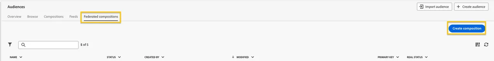

# オーディエンス作成演習

この演習では、Federated Audience Composition を使用してData Warehouseからオーディエンスを作成する手順を説明します。 SecurFinancial の信用スコアが 650 以上で、現在 SecurFinancial ポートフォリオにローンを持っていない SecurFinancial のお客様を選定するオーディエンスを作成します。

## 手順

1. **顧客/オーディエンス** ポータルで、「**Federated コンポジション**」タブをクリックします。
2. **コンポジションを作成** をクリックします。

   

3. コンポジションに `SecurFinancial Customers - No Loans, Good Credit + [your lab user ID]` のラベルを付けます。 「**作成**」をクリックします。

4. キャンバスで「**+**」ボタンをクリックし、「**オーディエンスを作成**」を選択します。 右側のレールが表示されます。

5. 「**スキーマを選択**」をクリックして、「**FSI_CRM**」スキーマを選択し、「**確認**」をクリックします。

6. 「**続行**」をクリックします。Query Builder ウィンドウで、「**+**」ボタン、「**カスタム条件** の順にクリックします。 次の条件を作成します。
   - `CURRENTPRODUCTS does not contain loan`
   - `AND`
   - `CREDITSCORE greater than or equal to 650`
   - マーケティング環境設定データを使用して、メールを好みのコミュニケーションチャネルとして選択した顧客をセグメント化します。
   - `AND`
   - `CONSENTSMARKETINGPREFERRED equal to email`

   **メモ：** 値フィールドでは大文字と小文字が区別されます。

   クエリは次のようになります。

   

7. 次の **+** ボタンをクリックし、「**オーディエンスを保存**」をクリックします。

   この手順に `SecurFinancial Customers - No Loans, Good Credit + [your lab user ID]` というラベルを付けます。 オーディエンスラベルと同じ値を使用します。

8. 次のオーディエンスマッピングを追加します。
   - **Source オーディエンスフィールド：** メール
   - **Source オーディエンスフィールド：** CURRENTPRODUCTS
   - **Source オーディエンスフィールド：** 名

9. プロファイルに使用するプライマリ ID と名前空間を選択：
   - **プライマリ ID フィールド：** メール
   - **ID 名前空間：** メール

10. 「**保存**」をクリックし、次に「**開始**」をクリックして、作成したコンポジションのクエリを実行します。

**メモ：** 製品とクレジット情報を使用して、クレジットスコアなどの機密データをアクティベーション用のダウンストリームプラットフォームに移動しないオーディエンスを作成しました。

オーディエンス構成について詳しくは、[Experience League](https://experienceleague.adobe.com/ja/docs/federated-audience-composition/using/compositions/create-composition/create-composition){target="_blank"} を参照してください。

federated audience が作成されたので、次に進みます [S3 アカウントへのマッピング ](map-federated-audience-to-s3.md)。
