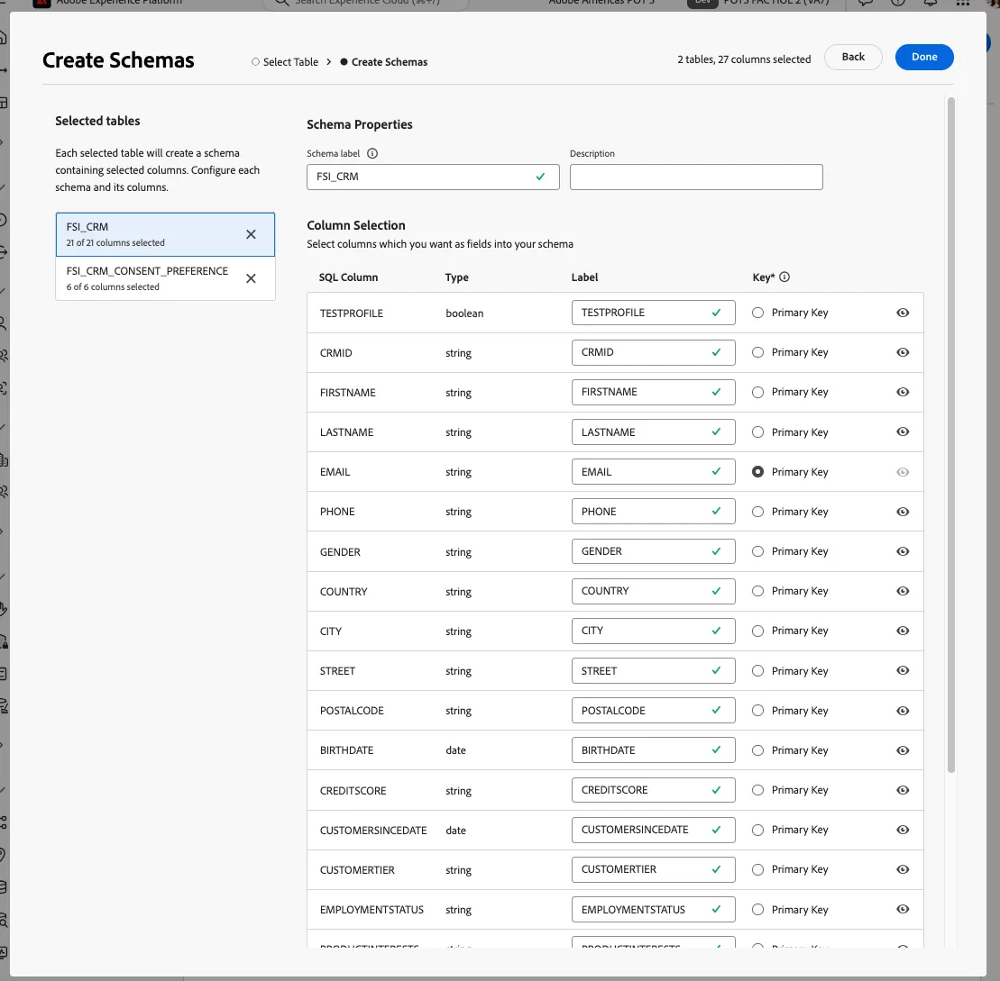

# Data Warehouse接続

このレッスンでは、Adobe Experience Platformと Enterprise Data Warehouseの間の接続を設定して、Federated Audience Composition を有効にします。 これにより、レプリケーションを行わずに、サポートされているウェアハウスから直接データに対してクエリを実行できます。 さらに、Data Warehouse テーブルに基づいてスキーマとデータモデルを作成します。

このラボでは、Snowflake アカウントに接続します。 Federated Audience Composition では、増え続けるクラウドウェアハウス接続のリストをサポートしています。 統合の最新のリスト [ を参照してください ](https://experienceleague.adobe.com/ja/docs/federated-audience-composition/using/start/access-prerequisites){target="_blank"}。

## 手順

1. 左側のパネルで **FEDERATED DATA** セクションを参照します。
2. **連合データベース** リンクで、「**連合データベースを追加**」ボタンをクリックします。
3. 名前を追加して、「**Snowflake**」を選択します。
4. 詳細を入力し、「**接続をテスト**」ボタン、「**関数をデプロイ**」ボタンの順にクリックします。

   

   

   

## スキーマの作成

Federated Audience Composition でスキーマを作成するには、次の手順に従います。

1. **FEDERATED DATA** セクションで、「**モデル**」をクリックします。
2. 「**スキーマ**」タブを参照し、「**スキーマを作成**」ボタンをクリックします。
3. リストでソースデータベースを選択し、「**テーブルを追加**」タブをクリックします。
4. 次のテーブルを選択します。
   - FSI_CRM
   - FSI_CRM_CONSENT_PREFERENCE

   

   

テーブルを選択したら、各テーブルの列を確認し、プライマリキーを選択します。 この演習では、両方のテーブルのプライマリキーとして **EMAIL** を選択します。

## スキーマ内のデータのプレビュー

スキーマが表すテーブルのデータをプレビューするには、「**データ**」タブを参照します。

**計算** リンクをクリックして、合計レコード数をプレビューします。

## データモデルを作成

データモデルを使用すると、テーブル間のリンクを作成できます。 リンクは、同じデータベース内のテーブル（Snowflakeのテーブルなど）間に作成することも、異なるデータベース内のテーブル間（SnowflakeのテーブルとAmazon Redshift のテーブルの間のリンクなど）に作成することもできます。

Federated Audience Composition でデータモデルを作成するには、次の手順に従います。

1. 「**FEDERATED DATA**」セクションで、「**モデル**」をクリックし、「**データモデル**」をクリックします。
2. 「**データモデルを作成**」ボタンをクリックします。
3. データモデルの名前を指定します。
4. 「**スキーマを追加**」をクリックし、「**FSI_CRM**」および「**FSI_CRM_CONSENT_PREFERENCE**」スキーマを選択します。
5. **リンクを作成** をクリックして、これらのテーブル間にリンクを作成します。

リンクを作成する場合は、該当するカーディナリティを選択します。

- **1-N**：ソーステーブルの 1 つのオカレンスを、ターゲットテーブルの複数のオカレンスに対応させることができますが、ターゲットテーブルの 1 つのオカレンスは、最大でソーステーブルの 1 つのオカレンスに対応させることができます。
- **N-1**：ターゲットテーブルの 1 つのオカレンスを、ソーステーブルの複数のオカレンスに対応させることができますが、ソーステーブルの 1 つのオカレンスは、最大でターゲットテーブルの 1 つのオカレンスに対応させることができます。
- **1-1**：ソーステーブルの 1 つのオカレンスを、ターゲットテーブルの最大 1 つのオカレンスに対応させることができます。

以下は、ラボの演習用に作成されたリンクのプレビューです。 リンクにより、**EMAIL** のプライマリキーを使用して CRM と同意テーブルを結合し、結合を実行できます。

次に、[ 作成とオーディエンス ](audience-creation-exercise.md) の準備を行います。
