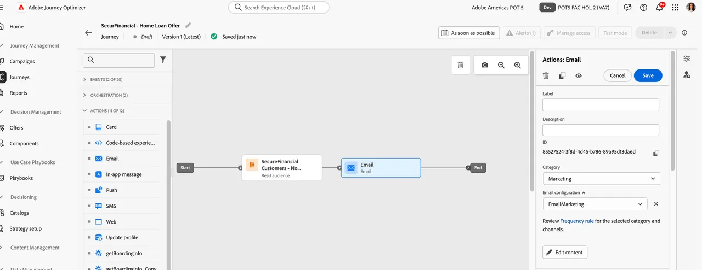
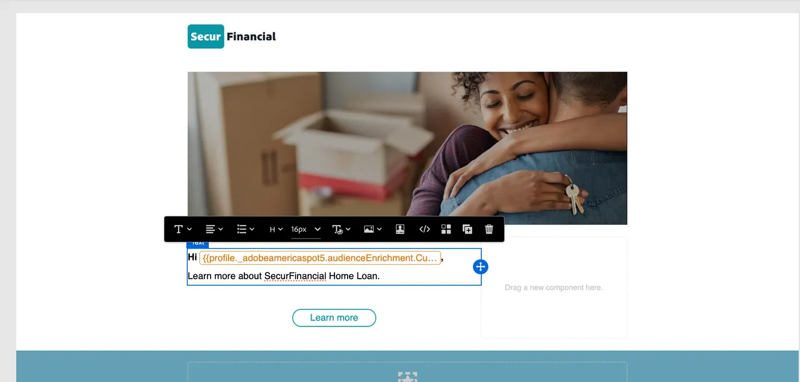

# Federated Audience とのジャーニーの作成

フェデレーションされたオーディエンスは、Adobe Journey Optimizer（AJO）内のジャーニーで使用できます。 これには、Federated Audience Composition からクエリされた属性を使用してメッセージをパーソナライズすることが含まれます。

SecurFinancial の話、特に顧客のリターゲティングとパーソナライゼーションのユースケースを続けるために、事前認定済み顧客のジャーニーを調整します。 目標は、SecurFinancial のData Warehouseから統合された属性に基づいて、パーソナライズされた電子メールを送信することです。

## 手順

### オーディエンスを読み取りジャーニーを作成

1. **ジャーニー** ポータルに移動し、「**ジャーニーを作成**」ボタンをクリックします。

   

2. 新しい名前でジャーニープロパティを更新します。 私たちの例では **`SecurFinancial - Home Loan Offer`** です。

3. **オーケストレーション** をクリックし、**オーディエンスを読み取り** タイルをキャンバスにドラッグ&amp;ドロップします。

4. 画面の右側にあるオーディエンスボックスの横にある **鉛筆アイコン** をクリックします。

5. 検索バーでオーディエンスを検索します。 この例では **`SecureFinancial Customers - No Loans, Good Credit`** です。 「**保存**」をクリックします。

   

6. 右側のメニューで、すべての設定をデフォルトのままにして、「**保存**」をクリックします。

   

### メールをパーソナライズ

1. **アクション** をクリックし、「**メール**」タイルをクリックしてキャンバスにドラッグします。

2. 右側のメニューで「**メール設定**」をクリックし、「**メールマーケティング**」を選択します。 次に、「**コンテンツを編集** をクリックします。

3. 件名を追加します。 この例では **`Learn more about SecurFinancial Home Loan`** です。 次に、「**メール本文を編集**」をクリックします。

4. 右上隅の **コンテンツテンプレート** ボタンをクリックします。 適切なテンプレートを検索して選択します。 この例では、`SecureFinancial Template` を使用します。 次に、「**確認**」をクリックします。

   

   

5. テンプレートを確認し、「**テンプレートを使用**」をクリックします。

6. メールDesignerに移動します。 `{profile.person.name.firstName}` マクロの上にマウスポインターを置いて、「**パーソナライゼーションアバター**」をクリックします。

7. パーソナライゼーションウィンドウで、アップロードされた federated audience を含むフォルダーパスにドリルダウンします。 この例では、**`[sandbox] > audienceEnrichment > CustomerAudienceUpload`** です。

8. **オーディエンスを読み取り** フォルダーをクリックします。 フェデレーションされたオーディエンスのエンリッチメント属性は、こちらで確認できます。

9. 式ビルダーに **名** 属性を選択します。 メールは、顧客の名の値を動的に表して、メールをパーソナライズします。

10. 「**保存**」をクリックします。

11. 名のパーソナライゼーションが追加されたので、パーソナライゼーション変数の前に `Hi, ` を追加します。 次に、「**保存**」をクリックします。

   

12. 「**戻る** ボタンを 2 回クリックして、ジャーニーキャンバスに戻ります。 次に、右側の **アクション：メール** メニューで、「**保存**」をクリックします。

   

AJOで、federated audience 属性と federated enrichment 属性を使用してジャーニーを作成しました。

次に、Data Warehouse のフェデレーティッドデータを使用して、Experience Platformで [ 既存のオーディエンスを強化 ](federated-audience-composition.md) する方法を見ていきます。
