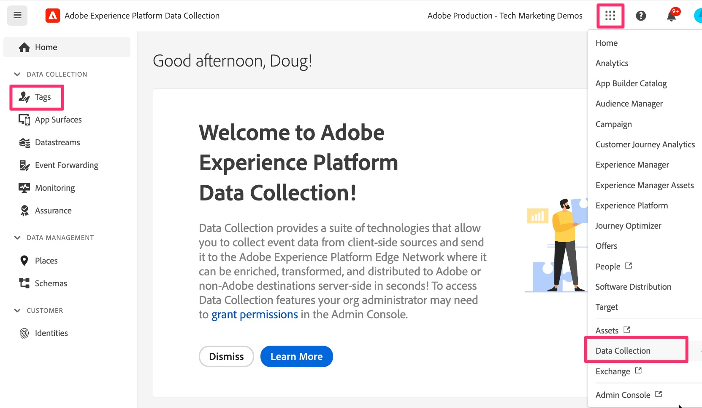

# Web SDK拡張機能を追加して設定します。

タグプロパティに web SDK拡張機能を追加および設定し、移行を完了するために今後のレッスンで必要な機能を提供する方法について説明します。
拡張機能を追加して設定するには、次の手順に従います。

1. Experience Platformデータ収集に移動します。 これは、次の 2 つの方法のいずれかで実現できます。
   1. [Adobe Experience Platform インターフェイス ](https://platform.adobe.com/) に移動し、左ナビゲーションの下部付近にある **[!UICONTROL タグ]** を選択します。

      
   1. Platform へのアクセス権がない場合は、ウィンドウの右上にあるアプリケーション切り替えボタン（9 つのドット）を使用し、（Experience.Adobe.comにログインした後に）「データ収集」を選択します。

      
1. Web SDKに移行するタグプロパティを見つけて選択します。
1. タグプロパティの左側のナビゲーションで、「**[!UICONTROL 拡張機能]**」を選択します。
1. 上部付近の **[!UICONTROL カタログ]** を選択すると、使用可能なすべての拡張機能のリストが表示されます。
1. **[!UICONTROL Adobe Experience Platform Web SDK]** 拡張機能を検索して選択し、右側の **[!UICONTROL インストール]** をクリックします。

   {style="border:1px solid lightslategray"}

1. 拡張機能の設定が表示されます。 「データストリーム」セクションを探し、この移行に使用するExperience Platformサンドボックスを設定します（3 つのすべての環境に対して「環境」ドロップダウン）。 Adobe Analyticsのみを移行し、Adobe Experience Platformにデータを送信しない場合は、「**実稼動** サンドボックスを選択します。 この行動分析データをExperience Platformに送信して、そこでアプリケーションで使用する場合は、に使用するサンドボックスを選択します。 移行が完了し、Platform サービスの追加やテストが完了するまで、最初に開発用サンドボックスを選択する必要があるでしょう。
1. 非常に重要なことは、実稼働、ステージングおよび開発環境用に前の手順で作成したデータストリームを選択して、タグのコードと設定をEdgeに接続することです。

   {style="border:1px solid lightslategray"}

1. 下にスクロールして、「**ID**」設定がデフォルトで選択されていることを確認します。 Web SDKへの移行時にサイト訪問者を正しく識別できるように、これらのチェックボックスをオンのままにします。 詳しくは、以下にリンクされているドキュメントを参照してください。

1. 「**[!UICONTROL 保存]**」を選択します。

>[!NOTE]
>
>これで、タグプロパティに Web SDK拡張機能の基本的なインストールと設定が追加されました。 この移行チュートリアルの間に、Web SDK拡張機能の一部を使用して、データ要素とルールを作成または変更しますが、チュートリアルでは拡張機能の設定項目はそれ以上変更しません。 追加の設定項目は、追加のユースケースに使用でき、またそうする必要があります。 これらの設定に関する詳細なドキュメントについては、[Web SDK タグ拡張機能の設定 ](https://experienceleague.adobe.com/en/docs/experience-platform/tags/extensions/client/web-sdk/web-sdk-extension-configuration) を参照してください。
