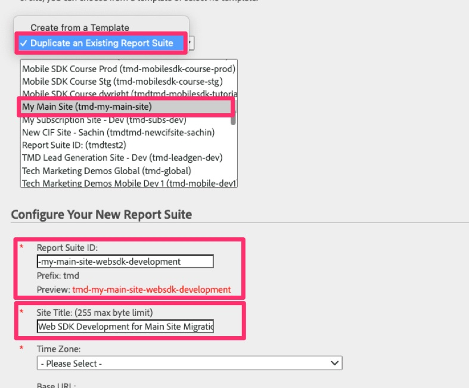

# 検証レポートスイートの作成

Adobe Analyticsでレポートスイートを作成し、古い実装からサイトを移行する際に web SDK データの検証に使用できます。

Analytics 実装の規模と複雑さによっては、web SDKへの移行に時間がかかる場合があります。 その間、データがAdobe Analytics レポートに正しく送信されていることを確認して、作業を検証する必要があります。 そのデータを実稼働データや他の開発データと共にレポートスイートにプッシュする代わりに、この移行に使用できる新しいレポートスイートを作成することをお勧めします。 次のレッスンでは、開発、ステージング、実稼動用に新しい「データストリーム」を作成し、設定します。 その際は、設定のレポートスイート ID を把握しておく必要があります。

## 新しいレポートスイートの作成

1. Adobe Analyticsを開き、Admin Consoleの **レポートスイート** 設定に移動します

   。

1. **[!UICONTROL レポートスイートを追加]** を選択します

   

1. 新しいレポートスイートを作成するには、フォームに入力します。 テンプレートから新しいレポートスイートを作成することもできますが（空白のテンプレートでも）、「**既存のレポートスイートを複製**」オプションを選択して、Web SDKに移行するレポートスイートを選択する方が適切な場合があります。 これにより、新しく移行したデータをテストする際と同じ名前と設定を使用できるので、途中での検証が容易になります。 すべての必須フィールドに入力し、新しい移行開発レポートスイートを保存します。

   

1. 新しいレポートスイートの ID をメモします。これは、次のレッスンで、Web SDK実装用のデータストリームを設定する際に必要になります。 サイトのタイトルも覚えておくと便利です。Analysis Workspaceで使用して、Analytics プロジェクトで移行開発レポートスイートを選択できるからです。

>[!TIP]
>
>レポートスイートの作成に関するビデオウォークスルーについては、[&#x200B; レポートスイートの概要と作成 &#x200B;](https://experienceleague.adobe.com/ja/docs/analytics-learn/tutorials/intro-to-analytics/analytics-basics/understanding-and-creating-report-suites){target="_blank"} を参照してください。

