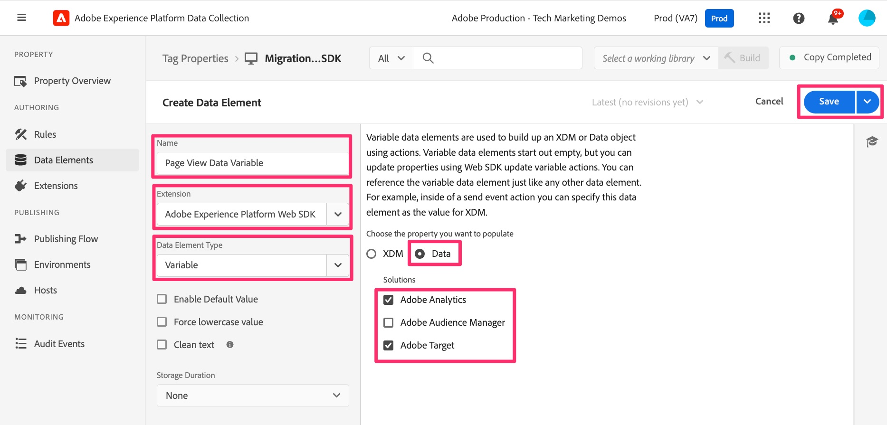

# 可変データ要素の作成

複数のルールで作成されたデータ要素を追加し、Edge Networkに送信してAdobe Analyticsに転送します。

この data 要素は、「Data」オブジェクトを作成します。このオブジェクトは、Adobe Analytics変数（prop、eVar、event など）をAdobe AnalyticsとAdobe Targetに戻すために使用されます。 そのため、Analytics のAppMeasurement実装での「s オブジェクト」の構築と同様に、ルールをまたいでアクセスおよび更新される type:Variable オブジェクトを構築し、prop と eVar を Analytics に入力するために使用できます。

1. データ収集インターフェイスで、左側のナビゲーションにある **データ要素** をクリックします。

   データ要素ランディングページが表示され、既存のデータ要素がすべて表示されます。 移行を容易にするために、新しいデータ要素を作成する必要があります。 「**データ要素を追加**」をクリックします。

   

1. データ要素を設定します。
   1. データ要素に好きな名前を付けます。これは、ページ上でデータを構築しており、これが「変数」タイプになることを覚えておくのに役立ちます。 このチュートリアルでは、**ページビューデータ変数** と呼びます。
   1. 拡張機能ドロップダウンから **0&rbrace;Adobe Experience Platform Web SDK&rbrace; を選択します。**
   1. **データ要素タイプ** ドロップダウンから **変数** を選択します。
   1. 右側のパネルで「**データ**」ラジオボタンを選択します。
   1. **Adobe Analytics** ソリューションと、移行中の他のソリューションのどちらか（例：**Adobe Target**）も確認します（このスクリーンショットに表示）。
1. 「**保存**」をクリックします。

   
