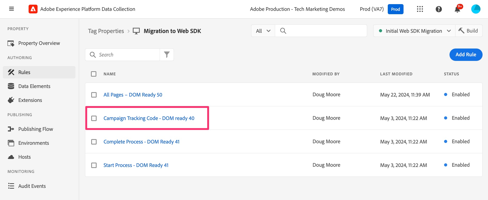
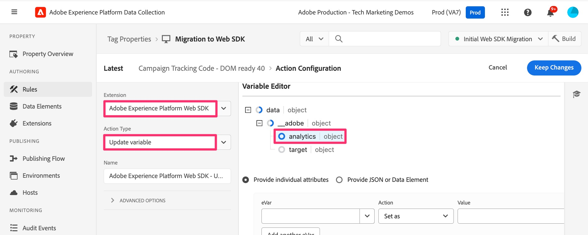

# 追加のページルールを移行

この演習では、追加のページベースのルールを Web SDK拡張機能に移行する方法を説明します。 これは、デフォルトのページ読み込みルールを Web SDKに移行する際に既に行った演習と同様です。 メソッドは引き続き適用されます。 最大の違いは、これらのルールでは「イベントを送信」アクションを追加しないことです。ほとんどの場合、ルールには Analytics 拡張機能の「ビーコンを送信」アクションが含まれていないからです。

## 概要

少しバックアップして、Adobe Analytics タグ拡張機能を使用した場合の Analytics 実装（JavaScript ファイルの名前なので「AppMeasurement」実装とも呼ばれます）について説明します。

実装の仕組みを正確に理解しているとは思いませんが、Experience Platformタグを使用する多くの実装では、ページまたは URL の何かに基づいて、条件付きでのみ実行されるルールがいくつかあります。 例えば、次のようなものがあります。

* 検索結果ルール（内部検索が実行され、検索結果ページが表示された場合にのみ起動）
* Campaign ランディングページのルール。URL にトラッキングコードがある場合にのみ起動します
* ページタイプルール：特定のタイプのページ（製品の詳細ページ、買い物かごページなど）に対してのみ実行します。
* 条件付きで起動するその他のページ

ここでの重要な点は、これらのユースケースはすべてページでのみ **場合によっては** 実行され、デフォルトのページルールが実行される **場合** も期待できるということです。 したがって、これらのルールに Send ビーコン（AA 拡張機能）や Send イベント（Web SDK拡張機能）を含めないでください。含める場合、同じページ読み込みに対して 2 つのヒットが発生します。

したがって、これらのルールはオブジェクトを作成しますが、データを送信しません。 これらのルールがデフォルトのページ読み込みルールの **前** に実行されることを確認し、ルールがオブジェクトを作成した後、デフォルトのページ読み込みルールに対する「ビーコンを送信」または「イベントを送信」アクションがすべてで送信されるようにします。 多くの場合、これらの情報はすべて把握しています。それがサイトのセットアップ方法です。 ただし、独自の実装を初めて使用する場合や、この方法に似せて実装を「修正」する必要がある場合は、この演習が特に役に立ちます。

## 条件付きルールの移行の例

条件付きで起動するルールの移行例を次に示します。 ここでは、上記のキャンペーンランディングページの例を使用します。 上記で述べたように、これは、デフォルトのページルールで既に操作したのと同じパターンに従います。ただし、変数を設定するだけで、ヒットを発生させないので、さらに簡単です。

1. 条件付きルールを見つけます。 この例では、キャンペーントラッキングコードルールを見つけて選択します。

   

1. ルールが開くと、このルールがクエリ文字列パラメーターに基づいて起動する条件があることがわかります。 イベントや条件ではなく、アクションを更新または移行するだけなので、条件に関する変更は必要ありません。
1. **Adobe Analytics – 変数を設定** アクションをクリックします
1. アクションで設定されている内容をメモします。 この例では、**event101** と **Campaign** 変数が設定されています。

   
   

1. ここではクリックするだけでメモを作成します。何も変更する必要はありません。ここでは、「**キャンセル**」をクリックするだけです。
1. 「アクション」セクションの **プラスアイコン** をクリックして、新しいアクションを作成します

   

1. 新しいルールの設定
   1. 拡張機能ドロップダウンから **0}Adobe Experience Platform Web SDK} を選択します。**
   1. 「アクションタイプ」ドロップダウンから **変数を更新** を選択します。
   1. 右側のパネルで、データオブジェクト内の **Analytics** オブジェクトを選択します

      

1. 次に、event101 と campaign 変数を、既存のアクションで設定したのと同じ値に設定します。

   
   

1. これで **変更を保持** および **ライブラリに保存** でき、ルールが Web SDKに移行されました。

>[!IMPORTANT]
>
>デフォルトのページ読み込みルールと同様に、Analytics 拡張機能の **変数を設定** アクションをルールに残したので、移行を検証しながらデータを比較できます。 最終クリーンアップを行う際は、後で戻って、Analytics 拡張機能のアクションを削除することを忘れないでください。
