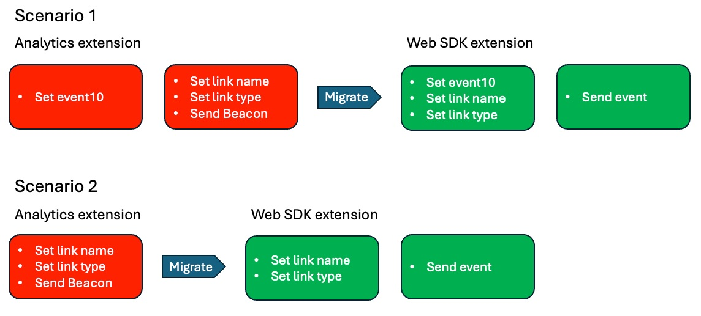

# カスタム リンク ルールを移行する

この演習では、（ページビューではなく）カスタムリンクヒットで送信されるルールを移行する方法を説明します。

## 概要

Analytics 拡張機能またはAppMeasurementコードを使用してカスタムリンクヒットで送信する場合、**ビーコンを送信** アクションを設定する際に、ページビューヒットとカスタムリンクヒットのどちらを送信するかを選択します。また、カスタムリンクヒットを選択すると、そのヒットの **リンク名** と **リンクタイプ** を要求されます。 リンク名とタイプ以外の他の変数データを送信しない場合は、変数（prop、eVar およびイベント）を設定する追加のアクションは必要ありません。
このため、カスタム リンク ルールであるルールを移行すると、ルールには次の **いずれか** のシナリオが含まれます。

1. 既存のルールには、**Adobe Analytics – 変数を設定** prop、eVar、イベントなどを設定するアクションと、ヒットをカスタムリンクヒット（別名：s.tl （）ヒット）に設定し、リンク名とタイプを設定し、データで送信する **Adobe Analytics - ビーコンを送信** アクションが含まれます。
   1. この場合、データがAdobeサーバーに送信された後に変数の値を「ゼロアウト」するために **** Adobe Analytics – 変数をクリアと呼ばれる最終的なアクションも含まれる可能性があります。
1. 既存のルールには、**Adobe Analytics - ビーコンを送信** アクションのみが含まれます。このアクションは、ヒットをカスタムリンクヒットに設定し、リンク名とタイプを設定し、データを送信します。

### 重要な変更

Adobe Analyticsの実装を web SDKに移行する際にこれが重要な理由は、次のとおりです。
ヒットがカスタムリンクヒットになるために必要なリンク名とタイプの設定が、「ビーコン相当を送信」アクション（送信イベント）にありません。 代わりに、リンク名とタイプの設定は、「変数同等の設定」アクション（変数を更新）にあります。
その結果、上記のシナリオ 1 とシナリオ 2 のいずれを使用しているかに関係なく、変数の更新アクションとイベントの送信アクションの両方を実行する必要があります。

以下に、実装の違いを視覚的に示します。

## 移行手順

ルールのカスタムリンクルールを開き、上からシナリオ 1 とシナリオ 2 のどちらに似ているかを特定します。
**ルールがシナリオ 1 に類似している場合：**

1. 「変数を設定」アクションを開き、そのアクションで設定されているすべての変数（prop、eVar、イベントなど）を書き留めます（例えば、上の画像では event10 が設定されています）。
1. 「ビーコンを送信」アクションを開き、s.tl （） ヒットを送信するように設定されていることを確認します。 「リンクタイプ」と「リンク名」の値を書き留めます。
1. カスタムリンクルールの「アクション」セクションで、プラスアイコンをクリックして別のルールを追加します。

   

1. アクションの設定
   1. **Extension** をAdobe Experience Platform Web SDKに設定します。
   1. **アクションタイプ** を「変数を更新」に設定します。
   1. **Analytics** オブジェクトを選択します
   1. Analytics の変数を設定アクション（この例では event10）から prop、eVar およびイベントを設定します

      

   1. 同じルールで、「**追加のプロパティ**」ドロップダウンフィールドまでスクロールダウンし、「**リンク名**」フィールドを追加して、「ビーコンを送信」ルールから取得した値に設定します。 次の画像では、この例で、名前を文字列値「menu click」に設定しています。
   1. また、同じドロップダウンから「**リンクタイプ**」フィールドを追加し、値として「o」を追加します（ビーコンを送信アクションのリンクタイプが「カスタムリンク」であった場合）。 これは、リンクタイプ「other」で送信されます。これはカスタムリンクに相当します。 リンクタイプがダウンロードリンクの場合、この新しいリンクタイプフィールドの値として「d」を選択します。リンクタイプが離脱リンクの場合、この新しいリンクタイプフィールドの値として「e」を選択します。

      

1. 「その他のプロパティ」の下に、「**既存の値をクリア**」というラベルの付いたチェックボックスが表示されます。 既存のルールに **Adobe Analytics – 変数のクリア アクション** （上記の手順 3 を参照）がある場合は、このチェックボックスをオンにするだけで、web SDKに変数のクリア アクションを追加する必要はありません。

   

1. プラスアイコンをクリックして、別のアクションを追加します。
1. イベント送信アクションの設定
   1. **Extension** をAdobe Experience Platform Web SDKに設定します。
   1. **アクションタイプ** を「送信済み」イベントに設定します。
   1. データ要素アイコンをクリックし、「**ページビューデータ変数**」データ要素を選択します

   

1. **変更を保持**、**ライブラリに保存** および作業ライブラリが既に設定されているので、同じページからライブラリを **ビルド** できます。

## 重要な移行結論を導き出す

* このレッスンでは、カスタム リンク ルールをマイグレートする方法を学習しました。
* [ デフォルトのページ読み込みルールを移行 ](migrate-your-default-page-load-rule.md) 演習では、変数を設定すると共に Analytics ビーコンでも送信するルールを移行する方法を学びました。
* [ その他のページルールの移行 ](migrate-additional-page-rules.md) レッスンでは、変数を設定してもAdobe Analyticsにビーコンを送信しないルールを移行する方法を学びました。

ご想像のとおり、多くの異なるルールで同じ方法を使用して、Analytics 拡張機能を Web SDKに移行できます。
ほとんどの場合、ルールでは単に **アクションを更新** します。 イベントや、イベントが発生した条件は変更しません。 ルールが実行されたときに、「アクション」セクションで何が起こっているかを変更するだけです。
すべてではないにしても、ほとんどのルールがこれらのカテゴリに分類されます。 存在しないルールがある場合は、ルールをトリガーしたものではなく、アクションを移行するのと同じパラダイムを考慮します。
