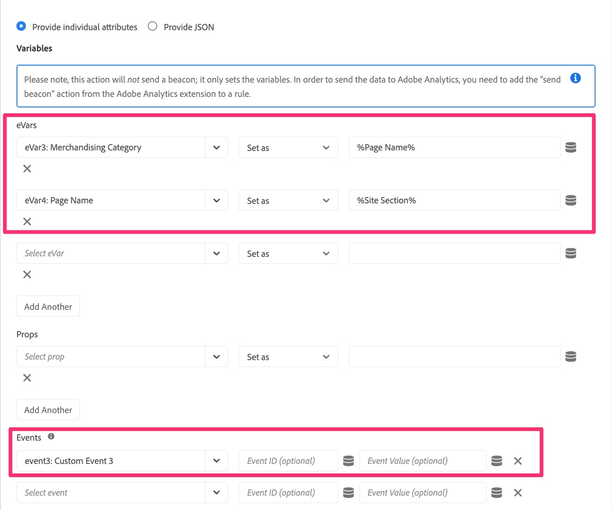
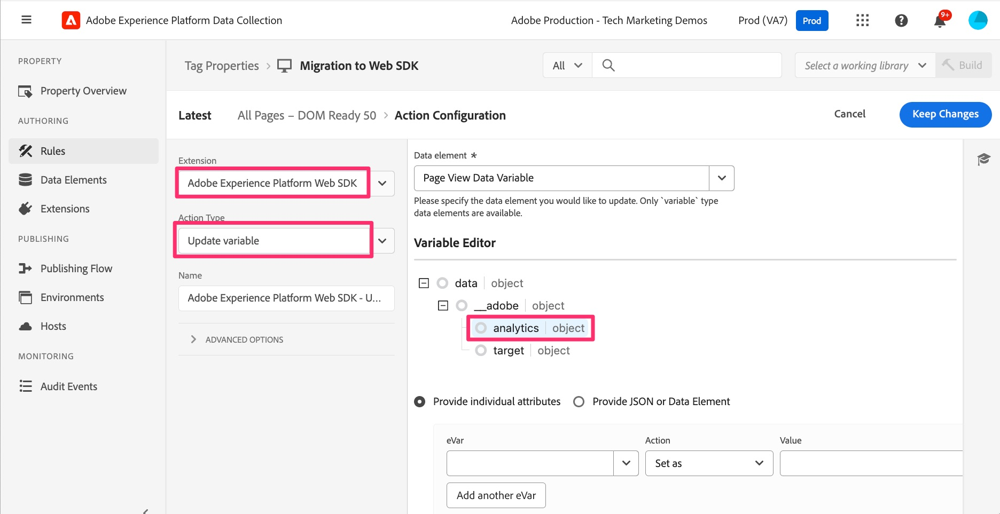
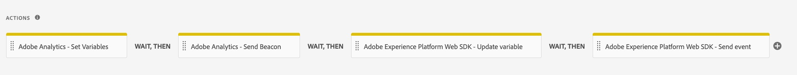

# デフォルトのページロードルールを移行

この演習では、Adobe Experience Cloud タグのデフォルトのページ読み込みルールを Analytics 拡張機能から Web SDK拡張機能に移行する方法について説明します。

## 概要

少し戻ろう。 タグには、すべてのページで実行されるルールがある可能性があります。このルールは、1 つ以上のデフォルト変数を設定し、Adobe Analyticsに対してビーコンまたはヒットを実行します。 このルールは、現在、これらの操作を行うためにAdobe Analytics拡張機能の「アクション」を使用しています。 実装を Web SDKに移行する際には、Analytics 拡張機能への参照（アクションなど）を削除し、Web SDKに属するアクションに置き換える必要があります。 以下の手順では、上記を想定します。つまり、変数を設定し、Analytics へのトラッキングビーコンで送信するデフォルトのページ読み込みルールがあります。

## 「変数を設定」アクションの移行

このアクティビティでは、Adobe Analytics拡張機能の **変数を設定** アクションと同等の Web SDK アクションを作成します。

1. データ収集 UI とプロパティで、左側のナビゲーションで **[!UICONTROL ルール]** 画面を選択して移動します。
1. **Analytics のデフォルトの読み込みルール** となるルールを選択します。 デフォルトの読み込みルールがどのルールかわからない場合は、ルールとルールの内容を知っているユーザーに問い合わせてください。 ここでも、すべてのページで実行され、デフォルト変数（ページ名など）を設定してから、Analytics にビーコンを送信するルールを探しています。 私たちはこの規則を変更することになっている。 私のは「すべてのページ - DOM Ready 50」と呼ばれますが、あなたのは何でも名前を付けることができます。

   

1. Analytics 拡張機能から Web SDK拡張機能に現在のアクションを移行するには、どのような変数が設定されているかを把握する必要があります。 そのため、**Adobe Analytics – 変数を設定** アクションをクリックすると、設定されている変数（PageName、prop、eVar、events など）を確認できます。

   
   1. そのルールで設定されている変数に注意してください
      

1. ページ上部で、ラジオボタンを **JSON を提供** に変更すると、設定された変数のコードビューが表示されます。 このコードビューと UI ビューは置き換え可能で、一方の UI で設定した内容は、もう一方の UI でも更新されます。

   

1. このデータをクリップボードにコピーするか、すぐに使用するファイルに保存します。次の手順では、そのコードを新しい Web SDK アクションに貼り付けます。
1. Analytics の「変数を設定」アクションをキャンセルして、ルールに戻ります。

   >[!IMPORTANT]
   >
   >この手順では、次のような選択肢があります。
   >1. 新しいアクションを追加する代わりに、既存のアクションを変更するだけで、保存すると新しい Web SDK レポートスイートにすべてのデータが即座に切り取られ、現在の Analytics レポートスイートには表示されなくなります。
   >1. 今のところ Analytics アクションを有効にしておいて、Web SDK経由で Analytics にデータを送信する新しいアクションを作成することができます。 これにより、新しい web SDK レポートスイートのデータを現在の Analytics レポートスイートと比較できます。 **これは、このチュートリアルで行う操作です。** この方法を使用すると、データを比較する際に重複ヒットが発生し、古い Analytics 拡張機能のアクションを削除するまで、追加のサーバーコールのコストも発生することに注意してください。 明らかに、Analytics 拡張機能のアクションを永久に保持するのではなく、データが新しい web SDK拡張機能のレポートスイートに正しく送られていることを検証するのに十分な時間を確保する必要があります。

1. **プラスボタン** をクリックして、新しい web SDK アクションを追加します。

   

1. 拡張機能ドロップダウンから **0}Adobe Experience Platform Web SDK} を選択します。**
1. 「アクションタイプ」ドロップダウンから **変数を更新** を選択します。
1. 右側のパネルで、データオブジェクト内の **Analytics** オブジェクトを選択します
1. また、右側のパネルの上部にリストされているデータ要素が、新しい変数タイプのデータ要素であることも確認してください。

   

1. 次に、ラジオボタンを **JSON またはデータ要素を指定** に変更し、前の手順で変数を設定からコピーしたコードをこのコードウィンドウに貼り付けます。 このチュートリアルで示すものは、例に過ぎません。 独自の変数をコピー&amp;ペーストします。

   
この JSON コピーツールは、特に移行を容易にするために作成されました。古いアクションから大規模なメモを作成して新しいアクションに適用する代わりに、これがいかに簡単かを確認できると確信しています。

1. ラジオボタンを前後に切り替えることで、コードバージョン（上記）または UI バージョンで値を確認したり、属性を確認したりできます。 **個々の属性を指定** ラジオボタンを選択して、属性が入力されていることを確認します。

   
   

1. 変数が正しく設定されていることを確認するには、「**変更を保持/保存**」をクリックします。

## ビーコン送信アクションの移行

このアクティビティでは、Analytics の「ビーコンを送信」アクションと同等の Web SDK「イベントを送信 **を作成し** す。

1. 直前に使用したデフォルトのページルールに戻ります。
1. 「アクション」セクションで、「**プラス」ボタン** をクリックして別のアクションを追加します。 これが **イベントを送信** アクションになります。

   

1. アクションを設定するには、拡張機能ドロップダウンから「**Adobe Experience Platform Web SDK**」を選択します。
1. アクションタイプから **イベントを送信** を選択します。
1. 右側のパネルで、**Data** オブジェクトの横にあるデータ要素アイコンを選択します。

   

1. ページビューデータ変数（または新しい「data」タイプのデータ要素と呼ばれるものを）を選択し、「**選択**」ボタンをクリックします。

   

1. **変更を保持/保存** をクリックします。
1. これで、ルールに 4 つのアクション（2 つの古いアクションと 2 つの新しいアクション）がすべて表示されます

   

## Analytics 拡張機能のアクションを削除する必要はありますか？

素晴らしい質問です。 答えは、古いものを取り除く前に新しいアクションを検証したいかどうかにあります。 前述のように、データを送信する Analytics アクションと Web SDK アクション（ビーコンの送信とイベントの送信）の両方をそのままにすると、このチュートリアルで選択したように、同じデータが 2 つのレポートスイート（つまり、Analytics 拡張機能の実稼動レポートスイートと、Web SDK拡張機能の新しい検証レポートスイート）に送信されます。 その結果、Analytics へのサーバー呼び出しが 2 倍になり、関連するコストが発生します。 ただし、古いデータを遮断する前に新しいデータを検証できるようにするために、これを選択する顧客の数です。 このチュートリアルの最後には、検証に満足したら古い要素をクリーンアップする方法を示す演習を行います。ただし、サーバー呼び出しを保存し、検証について心配しない場合は、チュートリアルの最後までスキップするか、ルールから Analytics 拡張機能のアクションを削除するだけです。
