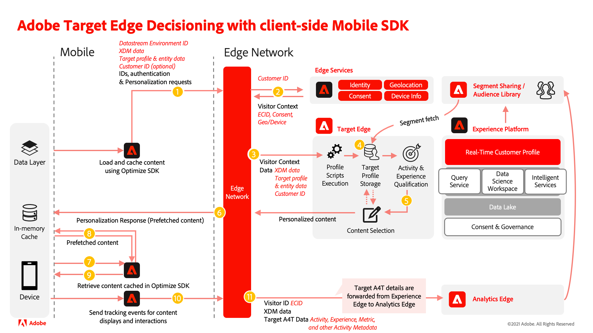

# Target 拡張機能と Decisioning 拡張機能の比較

Adobe Journey Optimizer - Decisioning 拡張機能は、モバイルアプリ用のAdobe Target拡張機能とは異なります。 次の表は、移行プロセスの間に注意が必要になる実装領域を評価する際に役立つリファレンスです。

以下の情報を確認し、現在の Target 拡張機能の実装状況を評価すると、次のことを理解できます。

- Adobe Journey Optimizerでサポートされている Target 機能 – Decisioning
- Adobe Journey Optimizerを持つAdobe Target拡張機能はどれか – 決定の同等の機能
- Adobe Journey Optimizerでの Target 設定の適用方法 – Decisioning
- Adobe Journey Optimizer - Decisioning 拡張機能を使用したデータのフロー

## 運用の違い

| | ターゲット拡張機能 | Decisioning 拡張機能 |
|---|---|---|
| プロセス | Target 実装に対する変更は、Analytics などの他のアプリケーションとは異なるケイデンスや QA 要件を持つプロセスに従う場合があります。 | 意思決定拡張機能の実装を変更する場合は、すべてのダウンストリームアプリケーションを考慮し、それに応じて QA および公開プロセスを調整する必要があります。 |
| コラボレーション | Target に固有のデータは、Target 呼び出しで直接渡すことができます。 Target レポートソースがAdobe Analytics（A4T）の場合、Target コンテンツの表示とインタラクションのために Target 拡張機能で適切なトラッキングメソッドが呼び出される際に、Target に固有のデータをAdobe Analyticsに渡すこともできます。 | Target レポートソースがAdobe Analytics（A4T）で、データストリームでAdobe Analyticsが有効になっており、Target コンテンツが表示および操作される際に、Decisioning 拡張機能の適切なトラッキングメソッドが呼び出される場合、Decisioning 拡張機能の呼び出しで渡されるデータは、Target と Analytics の両方に転送できます。 |

## 基本的な違い

| | ターゲット拡張機能 | Decisioning 拡張機能 |
|---|---|---|
| 依存関係 | Mobile Core SDKにのみ依存 | Mobile Core とEdge Network SDKに依存 |
| ライブラリ機能 | Adobe Targetからのコンテンツの取得のみをサポート | Adobe Targetおよび Offer Decisioning からのコンテンツ取得のサポート |
| リクエスト | Target 呼び出しは、他のネットワーク呼び出しからほとんど独立しています | Target ネットワーク呼び出しは、Edge SDKでのメッセージングなどの他のEdge ベースのソリューションのネットワーク呼び出しと共にキューに入れられ、連続して実行されます。 |
| Edge Network | Target サーバーの値またはAdobe Experience Cloud Edge Networkを、クライアントコード（clientcode.tt.omtrdc.net）と共に使用します。どちらも、データ収集 UI の [Target 設定 ](https://developer.adobe.com/client-sdks/solution/adobe-target/#configure-the-target-extension-in-the-data-collection-ui) で指定されています | データ収集 UI のEdge [Edge Network configuration](https://developer.adobe.com/client-sdks/edge/edge-network/#configure-the-edge-network-extension-in-data-collection-ui) で指定されたAdobe Experience Platform ネットワークドメインを使用します。 |
| 基本用語 | mbox、TargetParameters | DecisionScope, Map （Android）/Dictionary （iOS） （Target パラメーター用） |
| デフォルトコンテンツ | ネットワーク呼び出しが失敗した場合やエラーが発生した場合に返される、クライアントサイドのデフォルトコンテンツを TargetRequest で渡すことを許可します。 | クライアントサイドのデフォルトコンテンツを渡すことはできません。 ネットワーク呼び出しが失敗した場合やエラーが発生した場合に、コンテンツを返さない。 |
| ターゲットパラメーター | リクエストごとにグローバル TargetParameters を渡し、mbox ごとに異なる TargetParameters を渡すことができます。 | リクエストごとにグローバル TargetParameters のみを渡すことができます |

## 機能の比較

| 機能 | ターゲット拡張機能 | Decisioning 拡張機能（Edgeを介した Target） |
|---|---|---|
| プリフェッチ モード | サポートあり | サポートあり |
| 実行モード | サポートあり | サポートなし |
| カスタムパラメーター | サポートあり | サポート* |
| プロファイルパラメーター | サポートあり | サポート* |
| エンティティパラメーター | サポートあり | サポート* |
| ターゲットオーディエンス | サポートあり | サポートあり |
| Real-Time CDP オーディエンス | サポートなし | サポートあり |
| Real-Time CDP属性 | サポートなし | サポートあり |
| ライフサイクル指標 | サポートあり | データ収集ルールを使用したサポート |
| thirdPartyId （mbox3rdPartyId） | サポートあり | データストリームの ID マップおよび Target サードパーティ ID 名前空間を介してサポートされます |
| 通知（表示、クリック） | サポートあり | サポートあり |
| レスポンストークン | サポートあり | サポートあり |
| モバイルプレビュー（QA モード） | サポートあり | Assuranceでの限定的なサポート |

>[!IMPORTANT]
>
> \* リクエストで送信されるパラメーターは、リクエスト内のすべてのスコープに適用されます。 異なるスコープに異なるパラメーターを設定する必要がある場合は、追加のリクエストを行う必要があります。

## 注目のコールアウト

>[!NOTE]
>
>アプリコードを Decisioning 拡張機能に移行した後も、Target 拡張機能タグの設定と設定を保持します。 これにより、まだ新しいバージョンにアプリを更新していないお客様でも、Target が引き続き機能するようにします。
>
>Analytics for Target 統合（A4T）を使用している場合は、Target 実装を Decisioning 拡張機能に移行するのと同時に、Analytics 実装をEdge Bridge拡張機能と共に移行してください。

>[!IMPORTANT]
>
> アプリコードを Decisioning 拡張機能に移行した後も、Target 拡張機能の設定を保持します。 これにより、まだアプリを更新していないユーザーに対しても、Target が引き続き機能するようになります。

## 意思決定拡張機能のシステム図

次の図は、Adobe Journey Optimizer - Decisioning 拡張機能を使用したデータフローを理解するのに役立ちます。

>[!NOTE]
>
>アドビは、Target 拡張機能から Decisioning 拡張機能への Mobile Target の移行を成功させるために取り組んでいます。 移行の際に問題が発生した場合、またはこのガイドに重要な情報が欠落していると感じる場合は、[ このコミュニティのディスカッション ](https://experienceleaguecommunities.adobe.com/t5/adobe-experience-platform-data/tutorial-discussion-migrate-target-from-at-js-to-web-sdk/m-p/575587#M463) に投稿してお知らせください。
