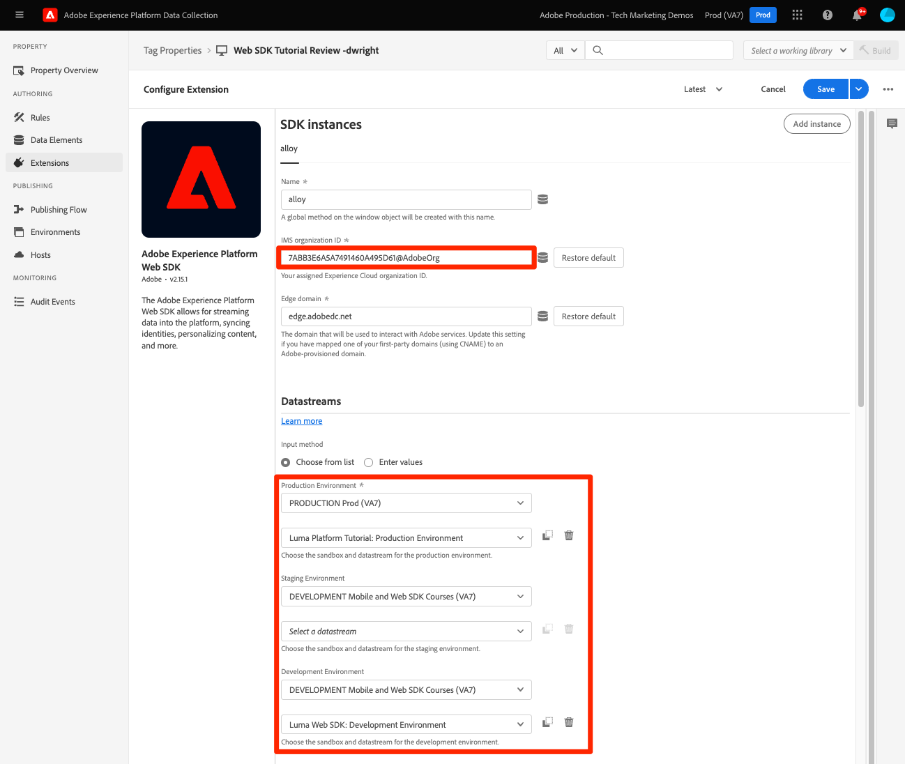

# at.js ライブラリを Platform Web SDK に置き換える

at.js から Platform Web SDK に移行するために、ページ上のAdobe Target実装を置き換える方法について説明します。 基本的な置き換えは、次の手順で構成されます。

* Target の管理設定を確認し、IMS 組織 ID をメモします
* at.js ライブラリを Platform Web SDK に置き換える
* 同期ライブラリ実装の事前非表示スニペットを更新する
* Platform Web SDK の設定

>[!NOTE]
>
>ここで示す例は、例として用いられており、実際の Target 実装は異なる場合があります。 既存の Target 実装でAdobeのデータ収集タグマネージャーを使用している場合は、 [Platform Web SDK Target の実装に関するチュートリアル](https://experienceleague.adobe.com/docs/platform-learn/implement-web-sdk/applications-setup/setup-target.html) を参照してください。


## Target 管理設定の確認

Target を Platform Web SDK に移行する最初の手順は、Target インターフェイスの **[!UICONTROL 管理]** 」セクションに入力します。

### [!UICONTROL 実装]

#### [!UICONTROL アカウントの詳細]

* **[!UICONTROL IMS 組織 ID]** - Platform Web SDK を設定する必要があるので、この値をメモしておきます。
* **[!UICONTROL オンデバイス判定]**  — この機能は、Platform Web SDK ではサポートされていません。 この設定は、移行後、および Web サイトで at.js を使用しなくなった場合、または On-Device Decisioning のサーバー側の使用例がない場合に、無効にすることができます。

#### [!UICONTROL 実装方法]

以下の編集可能なすべての設定 **[!UICONTROL 実装方法]** セクションは at.js にのみ適用されます。 これらの設定は、実装用にカスタマイズされた at.js ライブラリを生成するために使用されます。 これらの設定を確認して、カスタムコードがあるか、クロスドメインの使用例に対してファーストパーティおよびサードパーティ Cookie を設定しているかを確認します。

この **[!UICONTROL プロファイルの有効期間]** 設定は、カスタマーケアによるAdobeのみ変更できます。 Target 訪問者プロファイルの有効期間は、実装アプローチの影響を受けません。 at.js と Platform Web SDK の両方で、同じ訪問者プロファイルの有効期間が使用されます。

#### [!UICONTROL プライバシー]

* **[!UICONTROL 訪問者の IP アドレスを難読化]**  — この設定は、ジオターゲティング機能に影響を与えます。 at.js と Platform Web SDK の両方で、ジオターゲティングの目的で、同じバックエンド IP 難読化設定を使用します。

### [!UICONTROL 環境]

Platform Web SDK は、データストリーム設定を使用します。この設定では、 [!UICONTROL 環境 ID] 別々の開発、ステージングおよび実稼動のデータストリーム用。 この設定の主な使用例は、環境を簡単に区別するために URL が存在しないモバイルアプリの実装です。 設定はオプションですが、すべてのリクエストが指定した環境に正しく関連付けられるようにするために使用できます。 これは、ドメインおよびホストグループルールに基づいて Target 環境を割り当てる必要がある at.js 実装とは異なります。

>[!NOTE]
>
>データストリーム設定で環境 ID が指定されていない場合、Target は、 **ホスト** 」セクションに入力します。

詳しくは、 [データストリーム設定](https://experienceleague.adobe.com/docs/experience-platform/edge/datastreams/configure.html#target) ガイドと Target [ホスト](https://experienceleague.adobe.com/docs/target/using/administer/hosts.html?lang=ja) ドキュメント。

## Platform Web SDK のデプロイ

Target 機能は、at.js と Platform Web SDK の両方で提供されます。 両方のライブラリを同時に使用すると、レンダリングとトラッキングの問題が発生する場合があります。 Platform Web SDK に正常に移行するには、最初の手順として、at.js を削除し、Platform Web SDK(alloy.js) に置き換えます。

at.js を使用した単純な Target 実装を想定します。

* ページの上部付近にあるデータレイヤーが、Target や他のアプリケーションの情報を提供します
* Target アクティビティで機能を使用できる 1 つ以上のサードパーティのヘルパーライブラリ（jQuery など）
* ちらつきを軽減するための事前非表示スニペット
* Target at.js ライブラリは、デフォルト設定で非同期的に読み込まれ、アクティビティを自動的に要求およびレンダリングします。

+++HTMLページでの at.js 実装例

```HTML
<!doctype html>
<html>
<head>
  <title>Example page</title>
  <!--Data Layer to enable rich data collection and targeting-->
  <script>
    var digitalData = { 
      // Data layer information goes here
    };
  </script>
  <!--Third party libraries that may be used by Target offers and modifications-->
  <script src="https://ajax.googleapis.com/ajax/libs/jquery/3.6.1/jquery.min.js"></script>
  <!--prehiding snippet for Target with asynchronous deployment-->
  <script>
    ;(function(win, doc, style, timeout) {
      var STYLE_ID = 'at-body-style';

      function getParent() {
        return doc.getElementsByTagName('head')[0];
      }

      function addStyle(parent, id, def) {
        if (!parent) {
          return;
        }
        var style = doc.createElement('style');
        style.id = id;
        style.innerHTML = def;
        parent.appendChild(style);
      }

      function removeStyle(parent, id) {
        if (!parent) {
          return;
        }
        var style = doc.getElementById(id);
        if (!style) {
          return;
        }
        parent.removeChild(style);
      }
      addStyle(getParent(), STYLE_ID, style);
      setTimeout(function() {
        removeStyle(getParent(), STYLE_ID);
      }, timeout);
    }(window, document, "body {opacity: 0 !important}", 3000));
  </script>
  <!--Target at.js library loaded asynchonously-->
  <script src="/libraries/at.js" async></script>
</head>
<body>
  <h1 id="title">Home Page</h1><br><br>
  <p id="bodyText">Navigation</p><br><br>
  <a id="home" class="navigationLink" href="#">Home</a><br>
  <a id="pageA" class="navigationLink" href="#">Page A</a><br>
  <a id="pageB" class="navigationLink" href="#">Page B</a><br>
  <a id="pageC" class="navigationLink" href="#">Page C</a><br>
  <div>Homepage Hero Banner Content</div>
</body>
</html>
```

+++

Platform Web SDK を使用するように Target をアップグレードするには、まず at.js を削除します。

```HTML
<!--Target at.js library loaded asynchonously-->
<script src="/libraries/at.js" async></script>
```

また、 alloy JavaScript ライブラリまたはタグ埋め込みコードとAdobe Experience Platform Web SDK 拡張機能に置き換えます。

>[!BEGINTABS]

>[!TAB JavaScript]

```HTML
<!--Platform Web SDK base code-->
<script>
  !function(n,o){o.forEach(function(o){n[o]||((n.__alloyNS=n.__alloyNS||
  []).push(o),n[o]=function(){var u=arguments;return new Promise(
  function(i,l){n[o].q.push([i,l,u])})},n[o].q=[])})}
  (window,["alloy"]);
</script>
<!--Platform Web SDK loaded asynchonously. Change the src to use the latest supported version.-->
<script src="https://cdn1.adoberesources.net/alloy/2.13.1/alloy.min.js" async></script>
```

>[!TAB タグ]

```HTML
<!--Tags Header Embed Code: REPLACE WITH THE INSTALL CODE FROM YOUR OWN ENVIRONMENT-->
<script src="//assets.adobedtm.com/launch-EN93497c30fdf0424eb678d5f4ffac66dc.min.js" async></script>
```

タグプロパティに、 Adobe Experience Platform Web SDK 拡張機能を追加します。

{zoomable=&quot;yes&quot;}


>[!ENDTABS]

事前にビルドされたスタンドアロンバージョンでは、「alloy」という名前のグローバル関数を作成するページに直接「ベースコード」を追加する必要があります。 この関数を使用して SDK を操作します。グローバル関数に別の名前を付けたい場合は、 `alloy` 名前。

詳しくは、 [Platform Web SDK のインストール](https://experienceleague.adobe.com/docs/experience-platform/edge/fundamentals/installing-the-sdk.html?lang=ja) ドキュメントを参照してください。


## コンテンツを事前に非表示にする方法を更新

Platform Web SDK の実装では、ライブラリが非同期で読み込まれるか同期的に読み込まれるかに応じて、非表示のスニペットが必要になる場合があります。

### 非同期実装

at.js と同様、Platform Web SDK ライブラリが非同期で読み込まれる場合、Target がコンテンツの入れ替えを実行する前に、ページのレンダリングが完了する可能性があります。 この動作により、Target で指定し、パーソナライズされたコンテンツに置き換えられる前に、デフォルトのコンテンツが短時間表示される、「ちらつき」と呼ばれる現象が発生する場合があります。 このちらつきを回避するには、非同期の Platform Web SDK スクリプト参照またはタグ埋め込みコードの直前に、特別な事前非表示スニペットを追加することをお勧めします。

上記の例のように実装が非同期的な場合は、at.js 非表示スニペットを、Platform Web SDK と互換性のある次のバージョンに置き換えます。

```HTML
<!--Prehiding snippet for Target with asynchronous Web SDK deployment-->
<script>
  !function(e,a,n,t){var i=e.head;if(i){
  if (a) return;
  var o=e.createElement("style");
  o.id="alloy-prehiding",o.innerText=n,i.appendChild(o),setTimeout(function(){o.parentNode&&o.parentNode.removeChild(o)},t)}}
  (document, document.location.href.indexOf("mboxEdit") !== -1, ".body { opacity: 0 !important }", 3000);
</script>
```

事前非表示スニペットにより、選択した CSS 定義を使用して、ページの先頭に style タグが作成されます。 このスタイルタグは、Target からの応答を受信したとき、またはタイムアウトに達したときに削除されます。

事前非表示の動作は、スニペットの最後にある 2 つの設定で制御します。

* `body { opacity: 0 !important }` で、Target が読み込まれるまでの間に事前非表示に使用する CSS 定義を指定します。 デフォルトでは、ページ全体が非表示になっています。 この定義を、非表示にするセレクターと、非表示にする方法に合わせて更新できます。 この値は事前非表示のスタイルタグに挿入される値なので、複数の定義を含めることができます。 ナビゲーションの下のコンテンツをラッピングする、識別しやすいコンテナ要素がある場合は、この設定を使用して、事前非表示をそのコンテナ要素に限定できます。

* `3000` 事前非表示のタイムアウトをミリ秒単位で指定します。 タイムアウト前に Target からの応答を受信しなかった場合、事前非表示の style タグは削除されます。 このタイムアウトに達することはまれです。

>[!IMPORTANT]
>
>Platform Web SDK は、 `alloy-prehiding`. at.js の事前非表示スニペットを使用する場合は、正しく機能しない可能性があります。

### 同期実装

Adobeでは、ページ全体のパフォーマンスを最高にするために、Platform Web SDK を非同期で実装することをお勧めします。 ただし、alloy.js ライブラリまたはタグ埋め込みコードが同期的に読み込まれる場合は、事前に非表示にするスニペットは不要です。 代わりに、Platform Web SDK の設定で、事前非表示のスタイルを指定します。

同期実装の事前非表示スタイルは、 [`prehidingStyle`](https://experienceleague.adobe.com/docs/experience-platform/edge/fundamentals/configuring-the-sdk.html#prehidingStyle) オプション。 Platform Web SDK の設定については、次の節で説明します。

Platform Web SDK でちらつきを制御する方法について詳しくは、ガイドの節を参照してください。  [パーソナライズされたエクスペリエンスのちらつきの管理](https://experienceleague.adobe.com/docs/experience-platform/edge/personalization/manage-flicker.html)

## Platform Web SDK の設定

Platform Web SDK は、ページが読み込まれるたびに設定する必要があります。 次の例では、サイト全体が 1 つのデプロイメントで Platform Web SDK にアップグレードされると想定しています。

>[!BEGINTABS]

>[!TAB JavaScript]

この `configure` コマンドは、常に、と呼び出す最初の SDK コマンドである必要があります。 この `edgeConfigId` が [!UICONTROL データストリーム ID]

```JavaScript
alloy("configure", {
  "edgeConfigId": "ebebf826-a01f-4458-8cec-ef61de241c93",
  "orgId":"ADB3LETTERSANDNUMBERS@AdobeOrg"
});
```

>[!TAB タグ]

タグ実装では、多くのフィールドが自動入力されるか、ドロップダウンメニューから選択できます。 異なるプラットフォームに注意してください [!UICONTROL サンドボックス] および [!UICONTROL datastreams] は、各環境に対して選択できます。 データストリームは、公開プロセスでのタグライブラリの状態に基づいて変化します。

{zoomable=&quot;yes&quot;}
>[!ENDTABS]

ページごとに at.js から Platform Web SDK に移行する予定がある場合は、次の設定オプションが必要です。


>[!BEGINTABS]

>[!TAB JavaScript]

```JavaScript
alloy("configure", {
  "edgeConfigId": "ebebf826-a01f-4458-8cec-ef61de241c93",
  "orgId":"ADB3LETTERSANDNUMBERS@AdobeOrg",
  "targetMigrationEnabled":true,
  "idMigrationEnabled":true
});
```

>[!TAB タグ]

{zoomable=&quot;yes&quot;}

>[!ENDTABS]

Target に関する注目すべき設定オプションを以下に示します。

| オプション | 説明 | 例 value |
| --- | --- | --- |
| `edgeConfigId` | データストリーム ID | `ebebf826-a01f-4458-8cec-ef61de241c93` |
| `orgId` | Adobe Experience Cloud organization ID | `ADB3LETTERSANDNUMBERS@AdobeOrg` |
| `targetMigrationEnabled` | Web SDK が at.js で使用される従来の mbox Cookie と mboxEdgeCluster Cookie の読み取りと書き込みを有効にするには、このオプションを使用します。 これにより、Web SDK を使用するページから at.js ライブラリを使用するページに移動する際に、訪問者プロファイルを保持できます。 | `true` |
| `idMigrationEnabled` | true の場合、SDK は古い AMCV Cookie を読み取って設定します。 このオプションは、サイトの一部で引き続き Visitor.js を使用している間に、Platform Web SDK の使用に移行する際に役立ちます。 | `true` |
| `thirdPartyCookiesEnabled` | アドビのサードパーティ Cookie の設定を有効にします。SDK は、訪問者 ID をサードパーティのコンテキストで保持し、同じ訪問者 ID をサイト全体で使用できるようにします。 複数のサイトがある場合は、このオプションを使用します。ただし、プライバシー上の理由から、このオプションが望ましくない場合があります。 | `true` |
| `prehidingStyle` | パーソナライズされたコンテンツをサーバーから読み込む際に、Web ページのコンテンツ領域を非表示にする CSS スタイル定義を作成するために使用します。これは、SDK の同期デプロイメントでのみ使用されます。 | `body { opacity: 0 !important }` |

オプションの完全なリストについては、 [Platform Web SDK の設定](https://experienceleague.adobe.com/docs/experience-platform/edge/fundamentals/configuring-the-sdk.html?lang=ja) ガイド。

## 実装例

Platform Web SDK を適切に配置すると、サンプルページは次のようになります。

>[!BEGINTABS]

>[!TAB JavaScript]

```HTML
<!doctype html>
<html>
<head>
  <title>Example page</title>
  <!--Data Layer to enable rich data collection and targeting-->
  <script>
    var digitalData = { 
      // Data layer information goes here
    };
  </script>

  <!--Third party libraries that may be used by Target offers and modifications-->
  <script src="https://ajax.googleapis.com/ajax/libs/jquery/3.6.1/jquery.min.js"></script>

  <!--Prehiding snippet for Target with asynchronous Web SDK deployment-->
  <script>
    !function(e,a,n,t){var i=e.head;if(i){
    if (a) return;
    var o=e.createElement("style");
    o.id="alloy-prehiding",o.innerText=n,i.appendChild(o),setTimeout(function(){o.parentNode&&o.parentNode.removeChild(o)},t)}}
    (document, document.location.href.indexOf("mboxEdit") !== -1, ".body { opacity: 0 !important }", 3000);
  </script>

  <!--Platform Web SDK base code-->
  <script>
    !function(n,o){o.forEach(function(o){n[o]||((n.__alloyNS=n.__alloyNS||
    []).push(o),n[o]=function(){var u=arguments;return new Promise(
    function(i,l){n[o].q.push([i,l,u])})},n[o].q=[])})}
    (window,["alloy"]);
  </script>

  <!--Platform Web SDK loaded asynchonously. Change the src to use the latest supported version.-->
  <script src="https://cdn1.adoberesources.net/alloy/2.13.1/alloy.min.js" async></script>
  
  <!--Configure Platform Web SDK-->
  <script>
    alloy("configure", {
      "edgeConfigId": "ebebf826-a01f-4458-8cec-ef61de241c93",
      "orgId":"ADB3LETTERSANDNUMBERS@AdobeOrg"
    });
  </script>
</head>
<body>
  <h1 id="title">Home Page</h1><br><br>
  <p id="bodyText">Navigation</p><br><br>
  <a id="home" class="navigationLink" href="#">Home</a><br>
  <a id="pageA" class="navigationLink" href="#">Page A</a><br>
  <a id="pageB" class="navigationLink" href="#">Page B</a><br>
  <a id="pageC" class="navigationLink" href="#">Page C</a><br>
  <div id="homepage-hero">Homepage Hero Banner Content</div>
</body>
</html>
```

>[!TAB タグ]

ページコード：

```HTML
<!doctype html>
<html>
<head>
  <title>Example page</title>
  <!--Data Layer to enable rich data collection and targeting-->
  <script>
    var digitalData = { 
      // Data layer information goes here
    };
  </script>

  <!--Third party libraries that may be used by Target offers and modifications-->
  <script src="https://ajax.googleapis.com/ajax/libs/jquery/3.6.1/jquery.min.js"></script>

  <!--Prehiding snippet for Target with asynchronous Web SDK deployment-->
  <script>
    !function(e,a,n,t){var i=e.head;if(i){
    if (a) return;
    var o=e.createElement("style");
    o.id="alloy-prehiding",o.innerText=n,i.appendChild(o),setTimeout(function(){o.parentNode&&o.parentNode.removeChild(o)},t)}}
    (document, document.location.href.indexOf("mboxEdit") !== -1, ".body { opacity: 0 !important }", 3000);
  </script>

    <!--Tags Header Embed Code: REPLACE WITH THE INSTALL CODE FROM YOUR OWN ENVIRONMENT-->
    <script src="//assets.adobedtm.com/launch-EN93497c30fdf0424eb678d5f4ffac66dc.min.js" async></script>
</head>
<body>
  <h1 id="title">Home Page</h1><br><br>
  <p id="bodyText">Navigation</p><br><br>
  <a id="home" class="navigationLink" href="#">Home</a><br>
  <a id="pageA" class="navigationLink" href="#">Page A</a><br>
  <a id="pageB" class="navigationLink" href="#">Page B</a><br>
  <a id="pageC" class="navigationLink" href="#">Page C</a><br>
  <div id="homepage-hero">Homepage Hero Banner Content</div>
</body>
</html>
```

タグに、Adobe Experience Platform Web SDK 拡張機能を追加します。

{zoomable=&quot;yes&quot;}

また、必要な設定を追加します。
{zoomable=&quot;yes&quot;}


>[!ENDTABS]


上記のように Platform Web SDK ライブラリを含めて設定するだけでは、Adobe Edge Network へのネットワーク呼び出しは実行されないことに注意してください。

次に、 [VEC ベースのアクティビティのリクエストと適用](render-vec-activities.md) をページに追加します。

>[!NOTE]
>
>at.js から Web SDK への Target の移行を成功に導くための支援に努めています。 移行時に障害が発生した場合や、このガイドに重要な情報が欠落していると思われる場合は、 [このコミュニティディスカッション](https://experienceleaguecommunities.adobe.com/t5/adobe-experience-platform-data/tutorial-discussion-migrate-target-from-at-js-to-web-sdk/m-p/575587#M463).