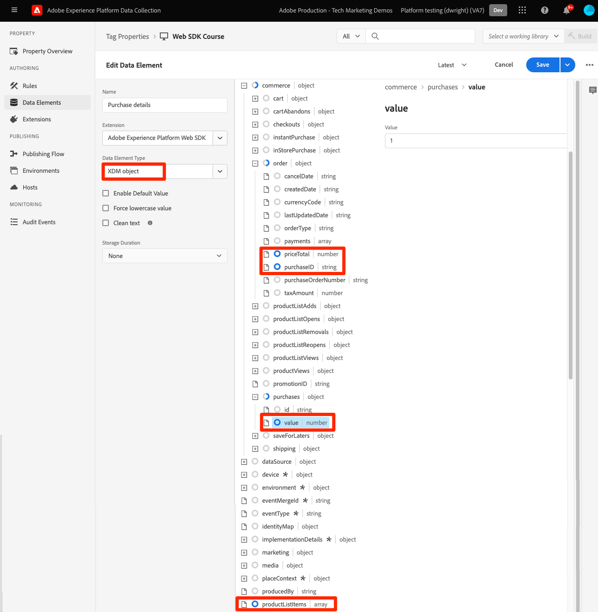
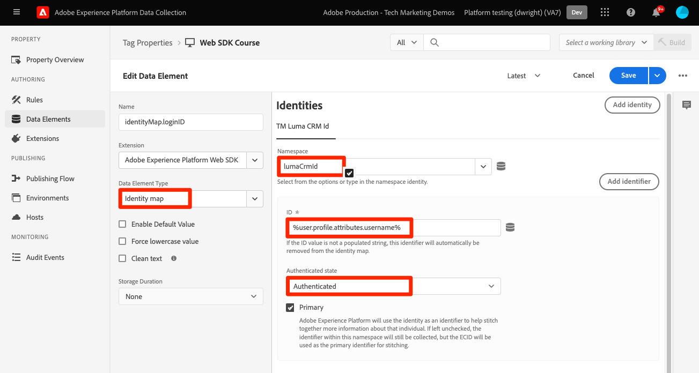
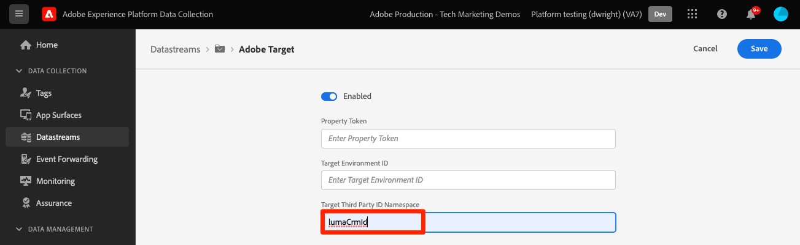

# Platform Web SDK を使用した Target へのパラメーターの送信

Target の実装は、サイトのアーキテクチャ、ビジネス要件、使用される機能により、web サイト間で異なります。 ほとんどの Target 実装には、コンテキスト情報、オーディエンスおよびコンテンツの推奨事項に関する様々なパラメーターの受け渡しが含まれています。

単純な製品の詳細ページと注文確認ページを使用して、Target にパラメーターを渡す際のライブラリ間の違いを示します。

at.js を使用した次の 2 つのサンプルページについて考えてみます。

+++製品の詳細ページのat.js:

```HTML
<!doctype html>
<html>
<head>
  <title>Product Details - Men's Shirt</title>
  <!--Target parameters -->
  <script>
    targetPageParams = function() {
      return {
        // Property token
        "at_property": "5a0fd9bb-67de-4b5a-0fd7-9cc09f50a58d",
        // Mbox parameters
        "pageName": "product detail",
        // Profile parameters
        "profile.gender": "male",
        "user.categoryId": "clothing",
        // Entity parameters for Target Recomendations
        "entity.id": "SKU-00001-LARGE",
        "entity.categoryId": "clothing,shirts",
        "entity.customEntity": "some value",
        "cartIds": "SKU-00002,SKU-00003",
        "excludedIds": "SKU-00001-SMALL",
        // Customer ID for cross-device profile synching and Customer Attributes
        "mbox3rdPartyId": "TT8675309",
      };
    };
  </script>
  <!--Target at.js library loaded asynchonously-->
  <script src="/libraries/at.js" async></script>
</head>
<body>
  <h1 id="title">Men's Large Shirt</h1>
  <p>SKU: SKU-00001-LARGE</p>
</body>
</html>
```

+++


+++注文確認ページのat.js:

```HTML
<!doctype html>
<html>
<head>
  <title>Order Confirmation</title>-->
  <!--Target parameters -->
  <script>
    targetPageParams = function() {
      return {
        // Property token
        "at_property": "5a0fd9bb-67de-4b5a-0fd7-9cc09f50a58d",
        // Order confirmation parameters
        "orderId": "ABC123",
        "productPurchasedId": "SKU-00002,SKU-00003",
        "orderTotal": 1337.89,
        // Customer ID for cross-device profile synching and Customer Attributes
        "mbox3rdPartyId": "TT8675309",
      };
    };
  </script>
  <!--Target at.js library loaded asynchonously-->
  <script src="/libraries/at.js" async></script>
</head>
<body>
  <h1 id="title">Order Confirmation</h1>
  <p>Thank you for your order</p>
</body>
</html>
```

+++


## パラメーターマッピングの概要

これらのページの Target パラメーターの送信は、Platform Web SDK を使用して異なります。 at.js を使用して Target にパラメーターを渡す方法は複数あります。

- ページ読み込みイベント `targetPageParams()` 関数で設定します（このページの例で使用）
- ページ上のすべて `targetPageParamsAll()`Target リクエストに対して関数で設定します
- 1 か所に対して `getOffer()` 関数を使用してパラメーターを直接送信
- 1 つ以上の場所に対して `getOffers()` 関数を使用してパラメーターを直接送信する


Platform Web SDK は、追加の関数を必要とせずにデータを送信する、一貫性のある単一の方法を提供します。 すべてのパラメーターは、`sendEvent` コマンドを使用してペイロードで渡す必要があり、次の 2 つのカテゴリに分類されます。

- `xdm` オブジェクトから自動的にマッピングされる
- `data.__adobe.target` オブジェクトを使用して手動で渡す

次の表に、Platform Web SDK を使用してサンプルのパラメーターを再マッピングする方法の概要を示します。

| at.js パラメーターの例 | Platform Web SDK オプション | メモ |
| --- | --- | --- |
| `at_property` | なし | プロパティトークンは [datastream](https://experienceleague.adobe.com/docs/experience-platform/edge/datastreams/configure.html?lang=ja#target) で設定され、`sendEvent` 呼び出しでは設定できません。 |
| `pageName` | `xdm.web.webPageDetails.name` | すべての Target mbox パラメーターは、`xdm` オブジェクトの一部として渡され、XDM ExperienceEvent クラスを使用してスキーマに準拠する必要があります。 Mbox パラメーターを `data` オブジェクトの一部として渡すことはできません。 |
| `profile.gender` | `data.__adobe.target.profile.gender` | 適切にマッピングするには、すべての Target プロファイルパラメーターを `data` オブジェクトの一部として渡し、`profile.` のプレフィックスを付ける必要があります。 |
| `user.categoryId` | `data.__adobe.target.user.categoryId` | `data` オブジェクトの一部として渡す必要がある Target のカテゴリ親和性機能に使用される予約済みのパラメーター。 |
| `entity.id` | `data.__adobe.target.entity.id` <br> または <br> `xdm.productListItems[0].SKU` | エンティティ ID は、Target Recommendationsの行動カウンターに使用されます。 これらのエンティティ ID は、`data` オブジェクトの一部として渡すことも、実装でそのフィールドグループを使用している場合は `xdm.productListItems` 配列の最初の項目から自動的にマッピングすることもできます。 |
| `entity.categoryId` | `data.__adobe.target.entity.categoryId` | エンティティ カテゴリ ID は、`data` オブジェクトの一部として渡すことができます。 |
| `entity.customEntity` | `data.__adobe.target.entity.customEntity` | カスタムエンティティパラメーターは、Recommendations商品カタログの更新に使用されます。 これらのカスタムパラメーターは、`data` オブジェクトの一部として渡す必要があります。 |
| `cartIds` | `data.__adobe.target.cartIds` | Target の買い物かごベースのレコメンデーションアルゴリズムに使用します。 |
| `excludedIds` | `data.__adobe.target.excludedIds` | Recommendations デザインで特定のエンティティ ID が返されるのを防ぐために使用します。 |
| `mbox3rdPartyId` | `xdm.identityMap` オブジェクトに設定 | デバイスや顧客属性をまたいで Target プロファイルを同期するために使用します。 顧客 ID に使用する名前空間は、[&#x200B; データストリームの Target 設定 &#x200B;](https://experienceleague.adobe.com/docs/experience-platform/edge/personalization/adobe-target/using-mbox-3rdpartyid.html?lang=ja) で指定する必要があります。 |
| `orderId` | `xdm.commerce.order.purchaseID` | Target コンバージョントラッキングの一意の順序を識別するために使用します。 |
| `orderTotal` | `xdm.commerce.order.priceTotal` | Target のコンバージョンと最適化の目標で、注文の合計をトラッキングするために使用します。 |
| `productPurchasedId` | `data.__adobe.target.productPurchasedId` <br> または <br> `xdm.productListItems[0-n].SKU` | Target のコンバージョントラッキングとレコメンデーションアルゴリズムに使用します。 詳しくは、以下の [&#x200B; エンティティパラメーター &#x200B;](#entity-parameters) の節を参照してください。 |
| `mboxPageValue` | `data.__adobe.target.mboxPageValue` | [&#x200B; カスタムスコア &#x200B;](https://experienceleague.adobe.com/docs/target/using/activities/success-metrics/capture-score.html?lang=ja) アクティビティ目標に使用します。 |

{style="table-layout:auto"}

## カスタムパラメーター

カスタム mbox パラメーターは、`sendEvent` コマンドで XDM データとして渡す必要があります。 XDM スキーマに、Target 実装に必要なすべてのフィールドが含まれていることを確認することが重要です。

を使用した at.js`targetPageParams()` 例：

```JavaScript
targetPageParams = function() {
  return {
    "pageName": "product detail"
  };
};
```

`sendEvent` コマンドを使用した Platform Web SDK JavaScriptの例：

>[!BEGINTABS]

>[!TAB JavaScript]

```JavaScript
alloy("sendEvent", {
  "xdm": {
    "web": {
      "webPageDetails": {
        // Other attributes included according to xdm schema
        "name": "product detail"
      }
    }
  }
});
```

>[!TAB タグ]

タグでは、まず [!UICONTROL XDM object] データ要素を使用して XDM フィールドにマッピングします。

{zoomable="yes"}

次に、[!UICONTROL XDM オブジェクト &#x200B;] を [!UICONTROL &#x200B; 送信イベント &#x200B;][!UICONTROL &#x200B; アクション &#x200B;] に含めます（複数の [!UICONTROL XDM オブジェクト &#x200B;][&#x200B; 結合 &#x200B;](https://experienceleague.adobe.com/docs/experience-platform/tags/extensions/client/core/overview.html?lang=ja#merged-objects) できます）。

{zoomable="yes"}

>[!ENDTABS]


>[!NOTE]
>
>カスタム mbox パラメーターは `xdm` のオブジェクトの一部なので、新しい名前を使用して、これらの mbox パラメーターを参照するオーディエンス、アクティビティまたはプロファイルスクリプトを更新する必要があります。 詳しくは、このチュートリアルの [Platform Web SDK 互換性のための Target オーディエンスとプロファイルスクリプトの更新 &#x200B;](update-audiences.md) ページを参照してください。


## プロファイルパラメーター

ターゲットプロファイルパラメーターは、Platform Web SDK `sendEvent` コマンドペイロードの `data.__adobe.target` オブジェクトで渡す必要があります。

at.js と同様に、すべてのプロファイルパラメーターには、`profile.` のプレフィックスも付けて、値が永続的な Target プロファイル属性として適切に保存されるようにする必要があります。 Target のカテゴリ親和性機能用に予約された `user.categoryId` パラメーターには、`user.` というプレフィックスが付きます。

を使用した at.js`targetPageParams()` 例：

```JavaScript
targetPageParams = function() {
  return {
    "profile.gender": "male",
    "user.categoryId": "clothing"
  };
};
```

`sendEvent` コマンドを使用した Platform Web SDK の例：

>[!BEGINTABS]

>[!TAB JavaScript]

```JavaScript
alloy("sendEvent", {
  "data": {
    "__adobe": {
      "target": {
        "profile.gender": "male",
        "user.categoryId": "clothing"
      }
    }
  }
});
```

>[!TAB タグ]

タグで、最初にデータ要素を作成して、`data.__adobe.target` のオブジェクトを定義します。

{zoomable="yes"}

次に、データオブジェクトを [!UICONTROL &#x200B; 送信イベント &#x200B;][!UICONTROL &#x200B; アクション &#x200B;] に含めます（複数の [!UICONTROL &#x200B; オブジェクト &#x200B;][&#x200B; 結合 &#x200B;](https://experienceleague.adobe.com/docs/experience-platform/tags/extensions/client/core/overview.html?lang=ja#merged-objects) できます）。

{zoomable="yes"}

>[!ENDTABS]

## エンティティパラメーター

エンティティパラメーターは、Target Recommendationsの行動データと追加のカタログ情報を渡すために使用されます。 at.js でサポートされているすべての [&#x200B; エンティティパラメーター &#x200B;](https://experienceleague.adobe.com/docs/target/using/recommendations/entities/entity-attributes.html?lang=ja) も、Platform Web SDK でサポートされています。 プロファイルパラメーターと同様に、すべてのエンティティパラメーターは、Platform Web SDK `sendEvent` コマンドペイロードの `data.__adobe.target` オブジェクトの下に渡す必要があります。

適切にデータを取得するには、特定の項目のエンティティパラメーターの先頭に `entity.` を付ける必要があります。 Recommendations アルゴリズムの予約済みの `cartIds` と `excludedIds` のパラメーターにはプレフィックスを付けてはいけません。また、それぞれの値には、エンティティ ID のコンマ区切りリストを含める必要があります。

を使用した at.js`targetPageParams()` 例：

```JavaScript
targetPageParams = function() {
  return {
    "entity.id": "SKU-00001-LARGE",
    "entity.categoryId": "clothing,shirts",
    "entity.customEntity": "some value",
    "cartIds": "SKU-00002,SKU-00003",
    "excludedIds": "SKU-00001-SMALL"
  };
};
```

`sendEvent` コマンドを使用した Platform Web SDK の例：

>[!BEGINTABS]

>[!TAB JavaScript]

```JavaScript
alloy("sendEvent", {
  "data": {
    "__adobe": {
      "target": {
        "entity.id": "SKU-00001-LARGE",
        "entity.categoryId": "clothing,shirts",
        "entity.customEntity": "some value",
        "cartIds": "SKU-00002,SKU-00003",
        "excludedIds": "SKU-00001-SMALL"
      }
    }
  }
});
```

>[!TAB タグ]

タグで、最初にデータ要素を作成して、`data.__adobe.target` のオブジェクトを定義します。

{zoomable="yes"}

次に、データオブジェクトを [!UICONTROL &#x200B; 送信イベント &#x200B;][!UICONTROL &#x200B; アクション &#x200B;] に含めます（複数の [!UICONTROL &#x200B; オブジェクト &#x200B;][&#x200B; 結合 &#x200B;](https://experienceleague.adobe.com/docs/experience-platform/tags/extensions/client/core/overview.html?lang=ja#merged-objects) できます）。

{zoomable="yes"}

>[!ENDTABS]

>[!NOTE]
>
>`commerce` フィールドグループが使用され、`productListItems` 配列が XDM ペイロードに含まれている場合、製品ビューを増分するために、この配列の最初の `SKU` 値が `entity.id` にマッピングされます。


## 購入パラメーター

購入パラメーターは、注文が成功した後、注文確認ページで渡され、Target のコンバージョンと最適化の目標に使用されます。 Platform Web SDK の実装では、これらのパラメーターは、`commerce` フィールドグループの一部として渡される XDM データから自動的にマッピングされます。

を使用した at.js`targetPageParams()` 例：

```JavaScript
targetPageParams = function() {
  return {
    "orderId": "ABC123",
    "productPurchasedId": "SKU-00002,SKU-00003"
    "orderTotal": 1337.89
  };
};
```

`commerce` フィールドグループが `1` に設定されている場合、購入情報 `purchases.value`Target に渡されます。 注文 ID と注文合計は、`order` オブジェクトから自動的にマッピングされます。 `productListItems` 配列が存在する場合、`SKU` の値が `productPurchasedId` に使用されます。

`sendEvent` を使用した Platform Web SDK の例：

>[!BEGINTABS]

>[!TAB JavaScript]

```JavaScript
alloy("sendEvent", {
  "xdm": {
    "commerce": {
      "order": {
        "purchaseID": "ABC123",
        "priceTotal": 1337.89
      },
      "purchases": {
        "value": 1
      }
    },
    "productListItems": [{
      "SKU": "SKU-00002"
    }, {
      "SKU": "SKU-00003"
    }],
      "_experience": {
          "decisioning": {
              "propositions": [{
                  "scope": "<your_mbox>"
              }],
              "propositionEventType": {
                  "display": 1
              }
          }
      }
  }
});
```

>[!TAB タグ]

タグでは、まず [!UICONTROL XDM オブジェクト &#x200B;] データ要素を使用して、必須の XDM フィールド（JavaScriptの例を参照）およびオプションのカスタムスコープにマッピングします。

{zoomable="yes"}

次に、[!UICONTROL XDM オブジェクト &#x200B;] を [!UICONTROL &#x200B; 送信イベント &#x200B;][!UICONTROL &#x200B; アクション &#x200B;] に含めます（複数の [!UICONTROL XDM オブジェクト &#x200B;][&#x200B; 結合 &#x200B;](https://experienceleague.adobe.com/docs/experience-platform/tags/extensions/client/core/overview.html?lang=ja#merged-objects) できます）。

{zoomable="yes"}

>[!ENDTABS]

>[!IMPORTANT]
>
> 呼び出しを使用して Target 指標を増分するには、`_experience.decisioning.propositionEventType` を `display: 1` で設定する必要があります。

>[!NOTE]
>
> Target 指標定義でカスタムの場所/mbox 名（例：`orderConfirmPage`）を使用する場合は、上の例のように、`_experience.decisioning.propositions` 配列にカスタム範囲を入力します。

>[!NOTE]
>
>`productPurchasedId` の値は、`data` オブジェクトの下で、エンティティ ID のコンマ区切りリストとして渡すこともできます。


## 顧客 Id （mbox3rdPartyId）

Target では、単一の顧客 ID を使用して、デバイスやシステム間でプロファイルを同期できます。 at.js の場合、これは Target リクエストの `mbox3rdPartyId` として、または Customer ID サービスに送信される最初のExperience CloudID として設定できます。 at.js とは異なり、Platform Web SDK 実装では、複数の場合に `mbox3rdPartyId` として使用する顧客 ID を指定できます。 例えば、企業にグローバル顧客 ID があり、異なる事業部門の別々の顧客 ID がある場合、Target が使用する ID を設定できます。

クロスデバイス属性と顧客属性のユースケースでは、ID 同期を設定する手順がいくつかあります。

1. データ収集または Platform の **[!UICONTROL ID]** 画面で、顧客 ID の **[!UICONTROL ID 名前空間]** を作成
1. 顧客属性の **[!UICONTROL エイリアス]** が名前空間の **[!UICONTROL ID 記号]** と一致することを確認します
1. データストリームの Target 設定で、**[!UICONTROL identy 記号]** を **[!UICONTROL Target サードパーティ ID 名前空間]** として指定します
1. `identityMap` フィールドグループを使用して `sendEvent` コマンドを実行します

を使用した at.js`targetPageParams()` 例：

```JavaScript
targetPageParams = function() {
  return {
    "mbox3rdPartyId": "TT8675309"
  };
};
```

`sendEvent` コマンドを使用した Platform Web SDK の例：

>[!BEGINTABS]

>[!TAB JavaScript]

```JavaScript
alloy("sendEvent", {
  "xdm": {
    "identityMap": {
      "GLOBAL_CUSTOMER_ID": [{
        "id": "TT8675309",
        "authenticatedState": "authenticated",
        "primary": true
      }]
    }
  }
});
```

>[!TAB タグ]

[!UICONTROL ID] 値、[!UICONTROL &#x200B; 認証状態 &#x200B;] および [!UICONTROL &#x200B; 名前空間 &#x200B;] は、[!UICONTROL ID マップ &#x200B;] データ要素に取り込まれます。
{zoomable="yes"}

次に、[!UICONTROL Identity map] データ要素を使用して、[!UICONTROL XDM オブジェクト &#x200B;] データ要素の [!UICONTROL identityMap] フィールドを設定します。
{zoomable="yes"}

次に、[!UICONTROL XDM オブジェクト &#x200B;] がルールの [!UICONTROL &#x200B; イベントを送信 &#x200B;] アクションに含まれます。

{zoomable="yes"}

データストリームのAdobe Target サービスで、[!UICONTROL Target サードパーティ ID 名前空間 &#x200B;] を [!UICONTROL ID マップ &#x200B;] データ要素で使用されているのと同じ名前空間に設定してください。
{zoomable="yes"}

>[!ENDTABS]

>[!NOTE]
>
> Adobeでは、認証済み ID などの人物を表す名前空間をプライマリ ID として送信することをお勧めします。


## Platform Web SDK の例

様々な Target パラメーターが Platform Web SDK を使用してどのようにマッピングされるかを理解できたので、以下に示すように、2 つのサンプルページを at.js から Platform Web SDK に移行できます。 ページの例を次に示します。

- 非同期ライブラリ実装の Target 事前非表示スニペット
- Platform Web SDK ベースコード
- Platform Web SDK JavaScript ライブラリ
- ライブラリを初期化する `configure` コマンド
- データを送信し、レンダリングする Target コンテンツをリクエストする `sendEvent` コマンド

+++製品詳細ページの Web SDK:

```HTML
<!doctype html>
<html>
<head>
  <title>Product Details - Men's Shirt</title>

  <!--Prehiding snippet for Target with asynchronous Web SDK deployment-->
  <script>
    !function(e,a,n,t){var i=e.head;if(i){
    if (a) return;
    var o=e.createElement("style");
    o.id="alloy-prehiding",o.innerText=n,i.appendChild(o),setTimeout(function(){o.parentNode&&o.parentNode.removeChild(o)},t)}}
    (document, document.location.href.indexOf("mboxEdit") !== -1, ".body { opacity: 0 !important }", 3000);
  </script>

  <!--Platform Web SDK base code-->
  <script>
    !function(n,o){o.forEach(function(o){n[o]||((n.__alloyNS=n.__alloyNS||
    []).push(o),n[o]=function(){var u=arguments;return new Promise(
    function(i,l){n[o].q.push([i,l,u])})},n[o].q=[])})}
    (window,["alloy"]);
  </script>

  <!--Platform Web SDK loaded asynchonously. Change the src to use the latest supported version.-->
  <script src="https://cdn1.adoberesources.net/alloy/2.6.4/alloy.min.js" async></script>

  <!--Configure Platform Web SDK and send event-->
  <script>
    alloy("configure", {
      "edgeConfigId": "ebebf826-a01f-4458-8cec-ef61de241c93",
      "orgId":"ADB3LETTERSANDNUMBERS@AdobeOrg"
    });
    alloy("sendEvent", {
      "renderDecisions": true,
      "xdm": {
        "identityMap": {
          "GLOBAL_CUSTOMER_ID": [{
            "id": "TT8675309",
            "authenticatedState": "authenticated",
            "primary": true
          }]
        },
        "web": {
          "webPageDetails": {
            // Other attributes included according to XDM schema
            "pageName": "product detail"
          }
        }
      },
      "data": {
        "__adobe": {
          "target": {
            "profile.gender": "male",
            "user.categoryId": "clothing",
            "entity.id": "SKU-00001-LARGE",
            "entity.categoryId": "clothing,shirts",
            "entity.customEntity": "some value",
            "cartIds": "SKU-00002,SKU-00003",
            "excludedIds": "SKU-00001-SMALL"
          }
        }
      }
    });
  </script>
</head>
<body>
  <h1 id="title">Men's Large Shirt</h1>
  <p>SKU: SKU-00001-LARGE</p>
</body>
</html>
```

+++

+++注文確認ページの Web SDK:

```HTML
<!doctype html>
<html>
<head>
  <title>Order Confirmation</title>


  <!--Prehiding snippet for Target with asynchronous Web SDK deployment-->

  <script>
    !function(e,a,n,t){var i=e.head;if(i){
    if (a) return;
    var o=e.createElement("style");
    o.id="alloy-prehiding",o.innerText=n,i.appendChild(o),setTimeout(function(){o.parentNode&&o.parentNode.removeChild(o)},t)}}
    (document, document.location.href.indexOf("mboxEdit") !== -1, ".body { opacity: 0 !important }", 3000);
  </script>

  <!--Platform Web SDK base code-->

  <script>
    !function(n,o){o.forEach(function(o){n[o]||((n.__alloyNS=n.__alloyNS||
    []).push(o),n[o]=function(){var u=arguments;return new Promise(
    function(i,l){n[o].q.push([i,l,u])})},n[o].q=[])})}
    (window,["alloy"]);
  </script>
  <!--Platform Web SDK loaded asynchonously. Change the src to use the latest supported version.-->
  <script src="https://cdn1.adoberesources.net/alloy/2.6.4/alloy.min.js" async></script>

  <!--Configure Platform Web SDK and send event-->
  <script>
    alloy("configure", {
      "edgeConfigId": "ebebf826-a01f-4458-8cec-ef61de241c93",
      "orgId":"ADB3LETTERSANDNUMBERS@AdobeOrg"
    });
    alloy("sendEvent", {
      "xdm": {
        "identityMap": {
          "GLOBAL_CUSTOMER_ID": [{
            "id": "TT8675309",
            "authenticatedState": "authenticated",
            "primary": true
          }]
        },
        "commerce": {
          "order": {
            "purchaseID": "ABC123",
            "priceTotal": 1337.89
          },
          "purchases": {
            "value": 1
          }
        },
        "productListItems": [{
          "SKU": "SKU-00002"
        }, {
          "SKU": "SKU-00003"
        }],
        "_experience": {
            "decisioning": {
                "propositions": [{
                    "scope": "<your_mbox>"
                }],
                "propositionEventType": {
                    "display": 1
                }
            }
        }
      }
    });
  </script>
</head>
<body>
  <h1 id="title">Order Confirmation</h1>
  <p>Thank you for your order</p>
</body>
</html>
```

+++

次に、Platform Web SDK を使用して Target コンバージョンイベントを [&#x200B; トラッキング &#x200B;](track-events.md) する方法について説明します。

>[!NOTE]
>
>アドビは、at.js から Web SDK への Target の移行を成功させるために取り組んでいます。 移行の際に問題が発生した場合、またはこのガイドに重要な情報が欠落していると感じる場合は、[&#x200B; このコミュニティのディスカッション &#x200B;](https://experienceleaguecommunities.adobe.com/t5/adobe-experience-platform-data/tutorial-discussion-migrate-target-from-at-js-to-web-sdk/m-p/575587?profile.language=ja#M463) に投稿してお知らせください。
