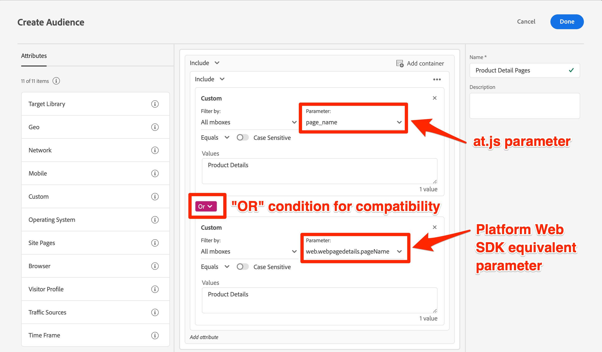

# Platform Web SDK の互換性を考慮した Target オーディエンスとプロファイルスクリプトの更新

Target を Platform Web SDK に移行するためのテクニカルアップデートが完了したら、スムーズな移行を実現するために、オーディエンス、プロファイルスクリプトおよびアクティビティの一部を更新する必要が生じる場合があります。

すべての Target mbox パラメーターは、Platform Web SDK 実装を使用して XDM 形式で渡す必要があります。 変更を実稼動環境に公開する前に、次の操作を行う必要があります。

* mbox パラメーターを使用するオーディエンスの更新
* mbox パラメーターを使用するプロファイルスクリプトの更新
* すべてのオファーおよびアクティビティを更新し、mbox パラメータートークンの置き換えを使用します ( 例： `${mbox.parameter_name}`)


>[!WARNING]
>
> 2022 年 10 月 2 日以降に開始された Platform Web SDK 実装では、 [プリフェッチ回避策](prefetch-workaround.md) このページで説明した機能の一部を正しく使用するために。

## オーディエンスを調整

カスタム mbox パラメーターを使用するオーディエンスは、新しい XDM パラメーター名を使用するように更新する必要があります。 例えば、 `page_name` は、次のようにマッピングされる可能性が高くなります： `web.webpagedetails.pageName`.

at.js と Platform Web SDK の両方との互換性を確保する 1 つの方法は、関連するオーディエンスを更新して `OR` 条件は、次に示すように使用されます。



## プロファイルスクリプトの編集

プロファイルスクリプトを更新して、オーディエンスと同様に新しい XDM パラメーター名を参照する必要があります。 mbox パラメーター名の変更に加えて、at.js と Platform Web SDK 実装の間でのプロファイルスクリプトの動作に違いはありません。

互換性を確保するための 1 つのアプローチは、 `OR` 条件を設定します。

プロファイルスクリプトの例：

```Javascript
if(mbox.param('pageName') == 'Product Details'){
  return true
}
```

Platform Web SDK の互換性に関するプロファイルスクリプトを更新しました。

```Javascript
if((mbox.param('pageName') == 'Product Details') || (mbox.param('page.webpagedetails.pageName') =='Product Details')){
  return true
}
```

詳細およびベストプラクティスについては、 [プロファイルスクリプト](https://experienceleague.adobe.com/docs/target/using/audiences/visitor-profiles/profile-parameters.html).

## 動的コンテンツのパラメータートークンを更新

を使用するオファー、レコメンデーションデザインまたはアクティビティがある場合 [動的コンテンツ置換](https://experienceleague.adobe.com/docs/target/using/experiences/offers/passing-profile-attributes-to-the-html-offer.html)の場合は、新しい XDM パラメーター名を考慮するために、適宜更新する必要がある場合があります。

mbox パラメーターにトークン置き換えを使用している方法に応じて、古いパラメーター名と新しいパラメーター名の両方を考慮して、既存の設定を拡張できます。 ただし、JSON オファーなど、カスタム JavaScript コードが使用できない状況では、移行が完了して実稼動サイトで稼働した後に、コピーを作成して更新する必要があります。

JSON オファーの例：

```JSON
{
  "pageName" : "${mbox.page_name}",
  "layoutVariation" : "grid"
}
```

Platform Web SDK のパラメーター名を使用した JSON オファーの例：

```JSON
{
  "pageName" : "${mbox.web.webpagedetails.pageName}",
  "layoutVariation" : "grid"
}
```

新しい XDM mbox パラメーター名を考慮に入れるように移行後に調整を行う場合は、訪問者にアクティビティの表示エラーが表示されないように、移行イベント中に影響を受けたアクティビティを必ず一時停止してください。

次に、 [Target の実装を検証する](validate.md).

>[!NOTE]
>
>at.js から Web SDK への Target の移行を成功に導くための支援に努めています。 移行時に障害が発生した場合や、このガイドに重要な情報が欠落していると思われる場合は、 [このコミュニティディスカッション](https://experienceleaguecommunities.adobe.com/t5/adobe-experience-platform-launch/tutorial-discussion-implement-adobe-experience-cloud-with-web/td-p/444996).