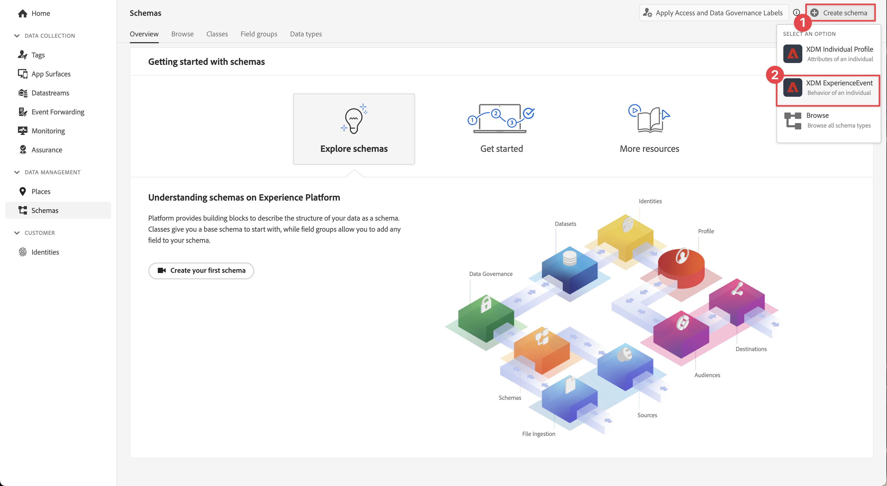
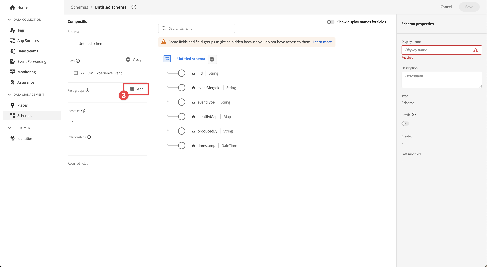
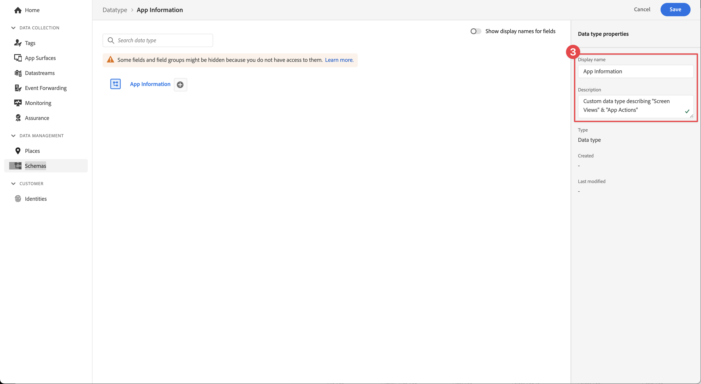
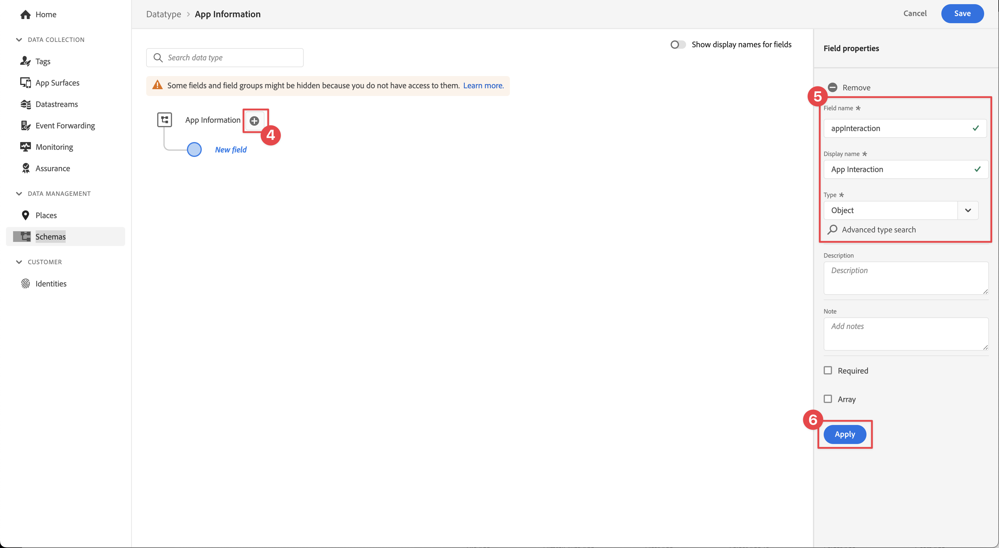
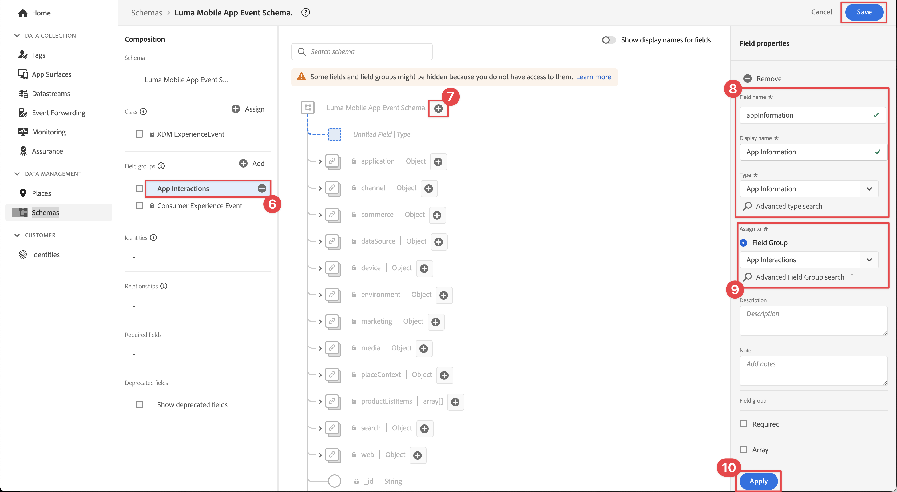

# XDM スキーマの作成

モバイルアプリイベント用の XDM スキーマを作成する方法を説明します。

標準化と相互運用性は、Adobe Experience Platform の背後にある重要な概念です。アドビが推進するエクスペリエンスデータモデル（XDM）は、顧客体験データを標準化し、顧客体験管理のスキーマを定義する取り組みです。

## XDM スキーマとは

XDM はパブリックに文書化された仕様であり、デジタルエクスペリエンスのパワーを向上させるために設計されています。任意のアプリケーションが Platform サービスと通信するための共通の構造と定義を提供します。 XDM 標準に準拠することで、すべての顧客体験データを共通の表現に組み込み、より迅速かつ統合的な方法でインサイトを得ることができます。顧客の行動から貴重なインサイトを得たり、セグメントを通じて顧客のオーディエンスを定義したり、パーソナライゼーションの目的で顧客属性を使用したりできます。

Experience Platform では、スキーマを使用して、一貫性のある再利用可能な方法でデータの構造を記述します。システムをまたいで一貫したデータを定義することで、意味を保有しやすくなり、データから価値を得ることができます。

データを Platform に取り込む前に、スキーマを構成して、データの構造を記述し、各フィールドに含めることができるデータの種類を制限する必要があります。スキーマは、基本クラスと 0 個以上のスキーマフィールドグループで構成されます。

デザインの原則やベストプラクティスなど、スキーマ構成モデルについて詳しくは、 [スキーマ構成の基本](https://experienceleague.adobe.com/docs/experience-platform/xdm/schema/composition.html?lang=ja) またはコース [XDM を使用した顧客体験データのモデル化](https://experienceleague.adobe.com/?recommended=ExperiencePlatform-D-1-2021.1.xdm&amp;lang=ja).

>[!TIP]
>
>Analytics ソリューションデザインリファレンス (SDR) に詳しい方は、スキーマをより堅牢な SDR と考えることができます。

## 前提条件

レッスンを完了するには、レッスンスキーマを作成する権限が必要ですExperience Platform。

## 学習内容

このレッスンでは、次の操作を実行します。

* データ収集インターフェイスでのスキーマの作成
* 標準フィールドグループをスキーマに追加する
* カスタムフィールドグループを作成してスキーマに追加する

## スキーマに移動

1. Adobe Experience Cloud にログインします。

1. このチュートリアルで使用しているExperience Platformサンドボックス内にいることを確認します。

1. アプリ切り替えボタンを開く   （右上）

1. 選択 **[!UICONTROL データ収集]** を選択します。

   

   >[!NOTE]
   >
   > Real-Time CDPなどの Platform ベースのアプリケーションのお客様は、このチュートリアルで開発サンドボックスを使用する必要があります。 他のお客様は、デフォルトの実稼動サンドボックスを使用します。

1. 選択 **[!UICONTROL スキーマ]** under **[!UICONTROL データ管理]** をクリックします。

   

これで、メインスキーマページに移動し、既存のスキーマのリストが表示されます。 また、スキーマの主要な構築ブロックに対応するタブを確認できます。

* **フィールドグループ** は、個人の詳細、ホテルの環境設定、住所など、特定のデータを取り込むための 1 つ以上のフィールドを定義する再利用可能なコンポーネントです。
* **クラス** スキーマに含まれるデータの行動面を定義します。 例： `XDM ExperienceEvent` は時系列、イベントデータ、 `XDM Individual Profile` は、個人に関する属性データをキャプチャします。
* **データタイプ** は、基本リテラルフィールドと同じ方法で、クラスまたはフィールドグループの参照フィールドタイプとして使用されます。

上記の説明は、概要です。 詳しくは、 [スキーマ構築ブロック](https://experienceleague.adobe.com/docs/platform-learn/tutorials/schemas/schema-building-blocks.html?lang=ja) ビデオまたは読み取り [スキーマ構成の基本](https://experienceleague.adobe.com/docs/experience-platform/xdm/schema/composition.html?lang=ja) （製品ドキュメント内）。

このチュートリアルでは、消費者エクスペリエンスイベントフィールドグループを使用し、カスタムフィールドグループを作成してプロセスを示します。

>[!NOTE]
>
>Adobeは、引き続き標準のフィールドグループを追加します。これらのフィールドはExperience Platformサービスで暗黙的に認識され、Platform コンポーネント間で使用する場合は一貫性が高まるので、可能な限り使用する必要があります。 標準フィールドグループを使用すると、Platform の Analytics および AI 機能での自動マッピングなどの有形のメリットが得られます。

## Luma アプリスキーマのアーキテクチャ

実際のシナリオでは、スキーマのデザインプロセスは次のようになります。

* ビジネス要件を収集します。
* できるだけ多くの要件をカバーする事前に作成されたフィールドグループを見つけます。
* すき間のカスタムフィールドグループを作成します。

学習のために、事前に作成されたフィールドグループとカスタムフィールドグループを使用します。

* **消費者エクスペリエンスイベント**：多くの共通フィールドを持つ事前に作成されたフィールドグループ。
* **アプリの情報**:TrackState/TrackAction Analytics の概念を模倣するように設計されたカスタムフィールドグループ。

<!--Later in the tutorial, you can [update the schema](lifecycle-data.md) to include the **[!UICONTROL AEP Mobile Lifecycle Details]** field group.-->

## スキーマの作成

1. 選択 **[!UICONTROL スキーマを作成]**.

1. 選択 **[!UICONTROL XDM ExperienceEvent]** を選択します。

   

1. 選択  **追加** 次の **[!UICONTROL フィールドグループ]**.

   

1. `Consumer Experience Event` を検索します。

1. 選択  ：フィールドをプレビューするか、詳細をお読みください。詳細は、フィールドグループを選択する前に確認してください。

1. 選択 **消費者エクスペリエンスイベント**.

1. 「**[!UICONTROL フィールドグループを追加]**」を選択します。

   

   メインスキーマの構成画面に戻り、使用可能なフィールドがすべて表示されます。

1. 「 」を選択して、スキーマに名前を付けます。 **[!UICONTROL 名称未設定のスキーマ]** から **[!UICONTROL 構成]** ペイン（下） **[!UICONTROL スキーマ]**) と、 **[!UICONTROL 表示名]** &amp; **[!UICONTROL 説明]**&#x200B;例： `Luma Mobile App Event Schema` および `Schema for Luma mobile app experience events.`

   >[!NOTE]
   >
   >単一のサンドボックスに複数のユーザーを配置する場合、または共有アカウントを使用する場合は、命名規則の一部として ID を追加するか、事前に付加することを検討してください。 例えば、`Luma Mobile App Event Schema` の代わりに、`Luma Mobile App Event Schema - Joe Smith` を使用します。詳しくは、 [概要](overview.md).

1. 「**[!UICONTROL 保存]**」を選択します。

   

>[!NOTE]
>
>グループ内のすべてのフィールドを使用する必要はないことに注意してください。 また、スキーマの簡潔さと理解しやすい内容を維持するのに役立つ場合は、フィールドを削除できます。 役立つ場合は、スキーマを空のデータレイヤーと考えることができます。 アプリでは、適切な時間に関連する値を設定します。

The [!UICONTROL 消費者エクスペリエンスイベント] フィールドグループのデータタイプは [!UICONTROL Web 情報]：ページビューやリンククリックなどのイベントを表します。 書き込み時には、この機能に対するモバイルアプリの同等性がないので、独自のを作成します。

## カスタムデータタイプの作成

最初に、2 つのイベントを説明するカスタムデータ型を作成します。

* 画面ビュー
* アプリのインタラクション

1. を選択します。 **[!UICONTROL データタイプ]** タブをクリックします。

1. 選択 **[!UICONTROL データタイプを作成]**.

   

1. 次を提供： **[!UICONTROL 表示名]** および **[!UICONTROL 説明]**&#x200B;例： `App Information` および `Custom data type describing "Screen Views" & "App Actions"`

   

   >[!TIP]
   >
   > 常に判読可能で説明的なを使用 [!UICONTROL 名前を表示] カスタムフィールドの場合は、フィールドがセグメントビルダーなどのダウンストリームサービスで表示される際に、マーケターがよりアクセスしやすくなります。

1. フィールドを追加するには、  」ボタンをクリックします。

1. このフィールドは、アプリとのやり取りのためのコンテナオブジェクトなので、キャメルケースを提供します。 **[!UICONTROL フィールド名]** `appInteraction`, **[!UICONTROL 表示名]** `App Interaction`をクリックし、次を選択します。 `Object` から **[!UICONTROL タイプ]** リスト。

1. 「**[!UICONTROL 適用]**」を選択します。

   

1. アクションが発生した頻度を測定するには、「  ボタンの横 **[!UICONTROL appInteraction]** オブジェクトを作成しました。

1. ラクダの入れ物を渡せ **[!UICONTROL フィールド名]** `appAction`, **[!UICONTROL 表示名]** / `App Action` および **[!UICONTROL タイプ]** `Measure`.

   この手順は、Adobe Analyticsの成功イベントと同じです。

1. 「**[!UICONTROL 適用]**」を選択します。

   

1. を選択して、インタラクションのタイプを説明するフィールドを追加します。  ボタンの横 **[!UICONTROL appInteraction]** オブジェクト。

1. 以下を実行します。 **[!UICONTROL フィールド名]** `name`, **[!UICONTROL 表示名]** / `Name` および **[!UICONTROL タイプ]** `String`.

   この手順は、Adobe Analyticsのディメンションと同じです。

   

1. 右側のパネルの下までスクロールし、「 」を選択します。 **[!UICONTROL 適用]**.

1. 次の手順で、 `appStateDetails` を含むオブジェクト **[!UICONTROL 測定]** ～と呼ばれるフィールド `screenView` と 2 **[!UICONTROL 文字列]** 名前の付いたフィールド `screenName` および `screenType`の場合は、 **[!UICONTROL appInteraction]** オブジェクト。

1. 「**[!UICONTROL 保存]**」を選択します。

   

## カスタムフィールドグループを追加する

次に、カスタムデータタイプを使用してカスタムフィールドグループを追加します。

1. このレッスンで先ほど作成したスキーマを開きます。

1. 選択  **[!UICONTROL 追加]** 次の **[!UICONTROL フィールドグループ]**.

   

1. 「**[!UICONTROL 新しいフィールドグループを作成]**」を選択します。

1. 次を提供： **[!UICONTROL 表示名]** および **[!UICONTROL 説明]**&#x200B;例： `App Interactions` および `Fields for app interactions`.

1. 「**フィールドグループを追加**」を選択します。

   

1. メインの構成画面から、「**」を選択します[!UICONTROL アプリのインタラクション**].

1. スキーマのルートにフィールドを追加するには、  ボタンをクリックします。

1. 右側のレールで、 **[!UICONTROL フィールド名]** / `appInformation`, a **[!UICONTROL 表示名]** / `App Information`、および **[!UICONTROL タイプ]** / `App Information`.

1. 選択 **[!UICONTROL アプリのインタラクション]** から **[!UICONTROL タイプ]** ドロップダウン（前の演習で作成したカスタムデータタイプ）。

1. 「**[!UICONTROL 適用]**」を選択します。

1. 「**[!UICONTROL 保存]**」を選択します。

   

>[!NOTE]
>
>カスタムフィールドグループは、常にExperience Cloud組織 ID の下に配置されます。 その場合 `_techmarketingdemos`は、スクリーンショットで使用されているが、組織の一意の値に置き換えられます。

>[!SUCCESS]
>
>これで、このチュートリアルの残りの部分で使用するスキーマが作成されました。 Adobe Experience Platform Mobile SDK の学習に時間を割いていただき、ありがとうございます。 ご質問がある場合、一般的なフィードバックを共有する場合、または今後のコンテンツに関する提案がある場合は、このドキュメントで共有します [Experience Leagueコミュニティディスカッション投稿](https://experienceleaguecommunities.adobe.com/t5/adobe-experience-platform-launch/tutorial-discussion-implement-adobe-experience-cloud-in-mobile/td-p/443796).

次へ： **[の作成 [!UICONTROL datastream]](create-datastream.md)**
