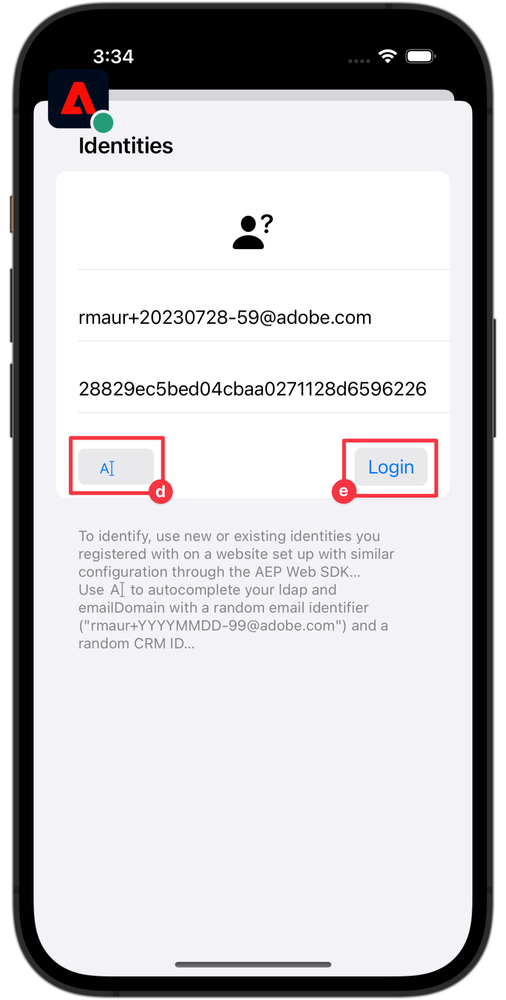

# イベント

モバイルアプリでイベントを追跡する方法を説明します。

Edge Network 拡張機能は、Experience Events を Platform Edge Network に送信する API を提供します。 エクスペリエンスイベントは、XDM ExperienceEvent スキーマ定義に準拠したデータを含むオブジェクトです。 より簡単に言えば、モバイルアプリでのユーザーの行動を取り込みます。 Platform Edge Network がデータを受信すると、Adobe AnalyticsやExperience Platformなど、データストリームで設定されたアプリケーションやサービスにデータを転送できます。 詳しくは、 [エクスペリエンスイベント](https://developer.adobe.com/client-sdks/documentation/getting-started/track-events/) （製品ドキュメント内）。

## 前提条件

* Xcode プロジェクトにすべてのパッケージの依存関係を配置します。
* AppDelegate に登録された拡張機能。
* 開発 appId を使用するように MobileCore を設定しました。
* SDK が読み込まれました。
* 上記の変更を含むアプリが正常にビルドされ、実行されました。

## 学習内容

このレッスンでは、次の操作を実行します。

* スキーマに基づいて XDM データを構造化する方法を説明します。
* 標準フィールドグループに基づいて XDM イベントを送信します。
* カスタムフィールドグループに基づいて XDM イベントを送信します。
* XDM 購入イベントを送信します。
* アシュランスを使用して検証します。

## エクスペリエンスイベントの作成

Adobe Experience Platform Edge 拡張機能は、以前に定義した XDM スキーマに従うイベントをAdobe Experience Platform Edge Network に送信できます。

プロセスは次のようになります…

1. 追跡しようとしているモバイルアプリのインタラクションを特定します。

1. スキーマを確認し、適切なイベントを特定します。

1. スキーマを確認し、イベントの説明に使用する必要がある追加のフィールドを特定します。

1. データオブジェクトを作成および設定します。

1. イベントを作成して送信します。

1. 検証.


### 標準フィールドグループ

標準フィールドグループの場合、処理は次のようになります。

* スキーマで、収集しようとしているイベントを特定します。 この例では、製品表示 (**[!UICONTROL productViews]**) イベントに関連付けられます。

  

* アプリ内でエクスペリエンスイベントデータを含むオブジェクトを作成するには、次のようなコードを使用します。

  ```swift {highlight="2-8"}
  var xdmData: [String: Any] = [
      "eventType": "commerce.productViews",
      "commerce": [
          "productViews": [
            "id": sku,
            "value": 1
          ]
      ]
  ]
  ```

   * `eventType`：発生したイベントを記述します。 [既知の値](https://github.com/adobe/xdm/blob/master/docs/reference/classes/experienceevent.schema.md#xdmeventtype-known-values) 可能な場合は。
   * `commerce.productViews.id`：製品の SKU を表す文字列値
   * `commerce.productViews.value`：イベントの数値を指定します。 ブール値 (Adobe Analyticsでは「カウンター」) の場合、値は常に 1 に設定されます。 数値イベントまたは通貨イベントの場合、値は 1 より大きい値になります。

* スキーマ内で、コマース製品表示イベントに関連付けられた追加データを識別します。 この例では、 `productListItems` コマース関連のイベントで使用される標準のフィールドセットです。

  
   * 次の点に注意してください。 `productListItems` は配列なので、複数の製品を提供できます。

* このデータを追加するには、 `xdmData` 補足データを含むオブジェクト：

```swift {highlight="9-16"}
var xdmData: [String: Any] = [
    "eventType": "commerce.productViews",
        "commerce": [
        "productViews": [
            "id": sku,
            "value": 1
        ]
    ],
    "productListItems": [
        [
            "name":  productName,
            "SKU": sku,
            "priceTotal": priceString,
            "quantity": 1
        ]
    ]
]
```

* その後、データ構造を使用して `ExperienceEvent`:

  ```swift
  let productViewEvent = ExperienceEvent(xdm: xdmData)
  ```

* また、sendEvent API を使用して、イベントとデータを Platform Edge Network に送信します。

  ```swift
  Edge.sendEvent(experienceEvent: productViewEvent)
  ```

次に、Xcode プロジェクトにこのコードを実装します。
アプリには、異なるコマース製品関連のアクション（表示、買い物かごに追加、後で保存するため、購入）があり、ユーザーが実行した操作に基づいてイベントを送信したい場合。

1. エクスペリエンスイベントの送信を構造化するには、 `MobileSDK`をクリックし、次の項目を `sendCommerceExperienceEvent` 関数に置き換えます。 この関数は、コマースエクスペリエンスのイベントと製品をパラメーターとして取ります。

   ```swift {highlight="2-22"}
   func sendCommerceExperienceEvent(commerceEventType: String, product: Product) {
     let xdmData: [String: Any] = [
         "eventType": "commerce." + commerceEventType,
         "commerce": [
             commerceEventType: [
                 "id": product.sku,
                 "value": 1
             ]
         ],
         "productListItems": [
             [
                 "name": product.name,
                 "priceTotal": product.price,
                 "SKU": product.sku
             ]
         ]
     ]
   
     Logger.viewCycle.info("About to send commerce experience event of type  \(commerceEventType)..."
     let commerceExperienceEvent = ExperienceEvent(xdm: xdmData)
     Edge.sendEvent(experienceEvent: commerceExperienceEvent)
   }
   ```

1. In `ProductView` 様々な呼び出しを `sendCommerceExperienceEvent` 関数：

   1. 次の場合： `.task` 修飾子 `ATTrackingManager.trackingAuthorizationStatus` クロージャ。 The `.task` 製品表示が初期化されて表示されると修飾子が呼び出されるので、特定の時点で製品表示イベントを送信できます。

      ```swift {highlight="4-5"}
      .task {
          if ATTrackingManager.trackingAuthorizationStatus == .authorized {
               // Send commerce experience event
              MobileSDK.shared.sendCommerceExperienceEvent(commerceEventType: "productView", product: product)
          }
      }
      ```

   1. 製品表示で使用できるツールバーの各ボタン（後で保存、買い物かごに追加、購入）に対して、関連する呼び出しを追加します。

      * 「後で使用するために保存」または「ウィッシュリストに追加」の場合：

        ```swift {highlight="5-6"}
        Button {
            Task {
                if ATTrackingManager.trackingAuthorizationStatus == .authorized {
                // Send saveForLater commerce experience event
                    MobileSDK.shared.sendCommerceExperienceEvent(commerceEventType: "saveForLaters", product: product)
                }
            }
            showSaveForLaterDialog.toggle()
        } label: {
            Label("", systemImage: "heart")
        }
        .alert(isPresented: $showSaveForLaterDialog, content: {
            Alert(title: Text( "Saved for later"), message: Text("The selected item is saved to your wishlist…"))
        })
        ```

      * 買い物かごに追加：

        ```swift {highlight="5-6"}
        Button {
            Task {
                if ATTrackingManager.trackingAuthorizationStatus == .authorized {
                    // Send productListAdds commerce experience event
                    MobileSDK.shared.sendCommerceExperienceEvent(commerceEventType: "productListAdds", product: product)
                }
            }
            showAddToCartDialog.toggle()
        } label: {
                Label("", systemImage: "cart.badge.plus")
        }
        alert(isPresented: $showAddToCartDialog, content: {
            Alert(title: Text( "Added to basket"), message: Text("The selected item is added to your basket…"))
        })
        ```

      * 購入の場合：

        ```swift {highlight="5-6"}
        Button {
            Task {
                if ATTrackingManager.trackingAuthorizationStatus == .authorized {
                    // Send purchase commerce experience event
                    MobileSDK.shared.sendCommerceExperienceEvent(commerceEventType: "purchases", product: product)
                }
            }
            showPurchaseDialog.toggle()
        } label: {
            Label("", systemImage: "creditcard")
        }
        .alert(isPresented: $showPurchaseDialog, content: {
            Alert(title: Text( "Purchases"), message: Text("The selected item is purchased…"))
        })
        ```

### カスタムフィールドグループ

アプリ自体の画面ビューやインタラクションを追跡するとします。 このタイプのイベントに対してカスタムフィールドグループを定義したことを忘れないでください。

* スキーマで、収集しようとしているイベントを特定します。
  

* オブジェクトの作成を開始します。

  >[!NOTE]
  >
  >  標準フィールドグループは、常にオブジェクトルートから始まります。
  >
  >  カスタムフィールドグループは、常にExperience Cloud組織に固有のオブジェクトの下で開始します。 `_techmarketingdemos` この例では、

  アプリのインタラクションイベントの場合は、次のようなオブジェクトを作成します。

  ```swift
  let xdmData: [String: Any] = [
    "eventType": "application.interaction",
    "_techmarketingdemos": [
      "appInformation": [
          "appInteraction": [
              "name": "login",
              "appAction": [
                  "value": 1
                  ]
              ]
          ]
      ]
  ]
  ```

  画面追跡イベントの場合は、次のようなオブジェクトを作成します。

  ```swift
  var xdmData: [String: Any] = [
    "eventType": "application.scene",
    "_techmarketingdemos": [
        "appInformation": [
            "appStateDetails": [
                "screenType": "App",
                    "screenName": "luma: content: ios: us: en: login",
                    "screenView": [
                        "value": 1
                    ]
                ]
            ] 
        ]
  ]
  ```


* 次に、 `ExperienceEvent`.

  ```swift
  let event = ExperienceEvent(xdm: xdmData)
  ```

* イベントとデータを Platform Edge Network に送信します。

  ```swift
  Edge.sendEvent(experienceEvent: event)
  ```


ここでも、Xcode プロジェクトにこのコードを実装します。

1. 利便性を考慮して、 `MobileSDK`.

   アプリのインタラクション用の 1 つ。 ハイライト表示されたコードを `sendAppInteractionEvent(actionName)` 機能する **[!UICONTROL MobileSDK]**:

   ```swift {highlight="2-16"}
   func sendAppInteractionEvent(actionName: String) {
        let xdmData: [String: Any] = [
           "eventType": "application.interaction",
           tenant : [
               "appInformation": [
                   "appInteraction": [
                       "name": actionName,
                       "appAction": [
                           "value": 1
                       ]
                   ]
               ]
           ]
       ]
       let appInteractionEvent = ExperienceEvent(xdm: xdmData)
       Edge.sendEvent(experienceEvent: appInteractionEvent)
   }
   ```

   画面追跡用のもの。 ハイライト表示されたコードを `sendTrackScreenEvent(stateName)` 機能する **[!UICONTROL MobileSDK]**:

   ```swift {highlight="2-17"}
   func sendTrackScreenEvent(stateName: String) {
      let xdmData: [String: Any] = [
          "eventType": "application.scene",
          tenant : [
              "appInformation": [
                  "appStateDetails": [
                      "screenType": "App",
                      "screenName": stateName,
                      "screenView": [
                          "value": 1
                      ]
                  ]
              ]
          ]
      ]
      let trackScreenEvent = ExperienceEvent(xdm: xdmData)
      Edge.sendEvent(experienceEvent: trackScreenEvent)
   }
   ```

1. に移動します。 **[!UICONTROL LoginSheet]**.

   * 次のハイライト表示されたコードを [ ログイン ] ボタンのクロージャに追加します。

     ```swift {highlight="3"}
     Button("Login") {                               
        // Send app interaction event
        MobileSDK.shared.sendAppInteractionEvent(actionName: "login")
        dismiss()
     }
     .disabled(currentEmailId.isValidEmail == false)
     .buttonStyle(.bordered)
     ```

   * 次のハイライト表示されたコードをに追加します。 `onAppear` 修飾子：

     ```swift {highlight="13"}
     .onAppear {
        Task {
            if currentEmailId == "testUser@gmail.com" || currentEmailId.isValidEmail == false {
                // still allow to log in
                disableLogin = false
            }
            else {
                disableLogin = true
            }
        }
        // Send track screen event
        MobileSDK.shared.sendTrackScreenEvent(stateName: "luma: content: ios: us: en: login")
     }
     ```

### 検証

1. 以下を確認します。 [設定手順](assurance.md) を参照し、シミュレーターまたはデバイスを Assurance に接続します。
1. アプリを実行してログインし、製品とやり取りします。

   1. アシュランスアイコンを左に移動します。
   1. 選択 **[!UICONTROL ホーム]** 」をクリックします。
   1. を選択します。 **[!UICONTROL ログイン]** ボタンをクリックして、ログインシートを開きます。
   1. を選択します。 **[!UICONTROL A|]** ボタンを使用して、ランダムな電子メールと顧客 id を挿入できます。
   1. 選択 **[!UICONTROL ログイン]**.
   1. 選択 **[!UICONTROL 製品]** 」をクリックします。
   1. 製品を選択します。
   1. 選択 **[!UICONTROL 後で使用するために保存]**.
   1. 選択 **[!UICONTROL 買い物かごに追加]**.
   1. 選択 **[!UICONTROL 購入]**.

        


1. を探します。 **[!UICONTROL hitReceived]** イベント **[!UICONTROL com.adobe.edge.conductor]** ベンダー。
1. イベントを選択し、 **[!UICONTROL メッセージ]** オブジェクト。
   


### Luma アプリケーションでの実装

これで、Luma アプリへのデータ収集の追加を開始するためのすべてのツールが用意されました。 ユーザーが製品とどのようにやり取りするかによりインテリジェンスを追加でき、アプリにより多くのアプリインタラクションや画面トラッキングコールを追加できます。

* 注文、チェックアウト、空のバスケット、その他の機能をアプリに実装し、関連するコマースエクスペリエンスイベントをこの機能に追加します。
* への呼び出しを繰り返します。 `sendAppInteractionEvent` を適切なパラメーターに置き換えて、アプリ内でのユーザーのその他のアプリの操作を追跡します。
* への呼び出しを繰り返します。 `sendTrackScreenEvent` を適切なパラメーターに設定して、アプリ内でユーザーが表示した各画面を追跡します。

>[!TIP]
>
>以下を確認します。 [完全に実装されたアプリ](https://github.com/Adobe-Marketing-Cloud/Luma-iOS-Mobile-App) その他の例を参照してください。


## Analytics と Platform へのイベントの送信

これで、イベントを収集して Platform Edge ネットワークに送信したので、イベントは、 [datastream](create-datastream.md). 後のレッスンでは、このデータをにマッピングします。 [Adobe Analytics](analytics.md) および [Adobe Experience Platform](platform.md).

>[!SUCCESS]
>
>これで、Adobe Experience Platform Edge Network と、データストリームで定義したすべてのサービスに対するコマース、アプリのインタラクション、画面のトラッキングイベントを追跡するアプリを設定しました。<br/>Adobe Experience Platform Mobile SDK の学習に時間を割いていただき、ありがとうございます。 ご質問がある場合、一般的なフィードバックを共有する場合、または今後のコンテンツに関する提案がある場合は、このドキュメントで共有します [Experience Leagueコミュニティディスカッション投稿](https://experienceleaguecommunities.adobe.com/t5/adobe-experience-platform-launch/tutorial-discussion-implement-adobe-experience-cloud-in-mobile/td-p/443796).

次へ： **[WebViews](web-views.md)**
