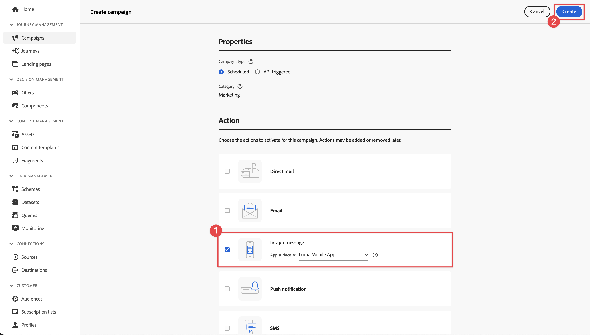
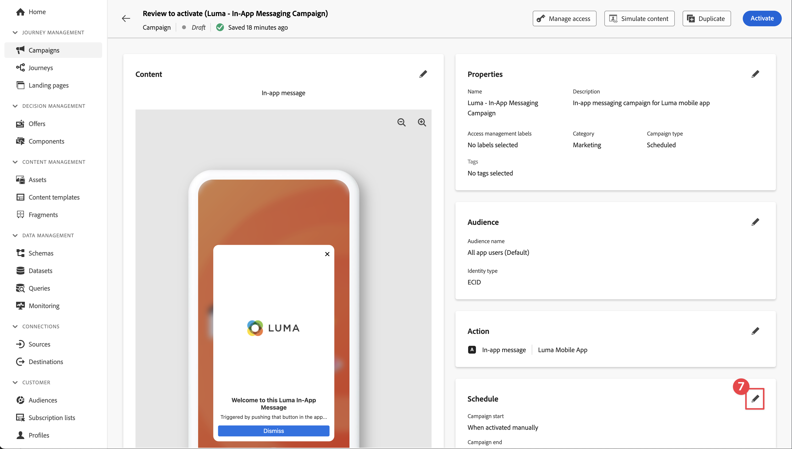

# Adobe Journey Optimizerのアプリ内メッセージ

Platform Mobile SDK およびAdobe Journey Optimizerを使用して、モバイルアプリ用のアプリ内メッセージを作成する方法について説明します。

Journey Optimizerでは、ジャーニーを作成し、ターゲットを絞ったオーディエンスにアプリ内メッセージを送信できます。 Journey Optimizerでアプリ内メッセージを送信する前に、適切な設定と統合がおこなわれていることを確認する必要があります。 Adobe Journey Optimizerのアプリ内メッセージデータフローについては、 [ドキュメント](https://experienceleague.adobe.com/docs/journey-optimizer/using/in-app/inapp-configuration.html?lang=en).

>[!NOTE]
>
>このレッスンはオプションで、アプリ内メッセージの送信を希望するAdobe Journey Optimizerユーザーにのみ適用されます。


## 前提条件

* SDK が正常に構築され、インストールされ、設定された状態でアプリが実行されました。
* Adobe Journey Optimizerへのアクセスと十分な権限（説明を参照） [ここ](https://experienceleague.adobe.com/docs/journey-optimizer/using/configuration/configuration-message/push-config/push-configuration.html?lang=en). また、次のAdobe Journey Optimizer機能に対する十分な権限が必要です。
   * キャンペーンの作成.
* 証明書、識別子、キーを作成するのに十分なアクセス権を持つ有料Apple開発者アカウント。
* 物理iOSデバイスまたはテスト用のシミュレーター。
* [APN で登録されたアプリ ID](journey-optimizer-push.md#register-app-id-with-apn)
* [データ収集にアプリのプッシュ資格情報を追加しました](journey-optimizer-push.md#add-your-app-push-credentials-in-data-collection)
* [Adobe Journey Optimizer Tags 拡張機能のインストール](journey-optimizer-push.md#install-adobe-journey-optimizer-tags-extension)
* [アプリにAdobe Journey Optimizerを実装](journey-optimizer-push.md#implement-adobe-journey-optimizer-in-the-app)


## アシュランスで検証

1. 以下を確認します。 [設定手順](assurance.md) 」セクションに入力します。
1. 物理デバイスまたはシミュレーターにアプリをインストールします。
1. Assurance で生成された URL を使用して、アプリを起動します。
1. Assurance UI で、 **[!UICONTROL 設定]**.
   
1. を選択します。  隣のボタン **[!UICONTROL アプリ内メッセージ]**.
1. 「**[!UICONTROL 保存]**」を選択します。
   
1. 選択 **[!UICONTROL アプリ内メッセージ]** をクリックします。
1. を選択します。 **[!UICONTROL 検証]** タブをクリックします。
1. エラーが表示されていないことを確認します。
   


## 独自のアプリ内メッセージの作成

独自のアプリ内メッセージを作成するには、発生したイベントに基づいてアプリ内メッセージをトリガーするキャンペーンをJourney Optimizerで定義する必要があります。 以下のイベントが発生します。

* Adobe Experience Platformに送信されたデータ
* Mobile Core の汎用 API を使用した、アクション、PII データの状態やコレクションなどのコアトラッキングイベント
* アプリケーションのライフサイクルイベント（起動、インストール、アップグレード、閉じる、クラッシュなど）
* 目標地点の入力や終了などの位置情報イベント。

このチュートリアルでは、Mobile Core の汎用 API と拡張機能に依存しない API を使用して、ユーザー画面、アクション、PII データのイベントトラッキングを容易にします。 これらの API で生成されたイベントは、SDK イベントハブに公開され、拡張機能で使用できます。 例えば、Analytics 拡張機能がインストールされると、すべてのユーザーアクションとアプリ画面のイベントデータが、適切な Analytics レポートエンドポイントに送信されます。

1. Journey Optimizer UI で、 **[!UICONTROL キャンペーン]** をクリックします。
1. 選択 **[!UICONTROL キャンペーンを作成]**.
1. Adobe Analytics の **[!UICONTROL キャンペーンを作成]** 画面：
   1. 選択 **[!UICONTROL アプリ内メッセージ]** を選択し、 **[!UICONTROL Luma モバイルアプリ]** から **[!UICONTROL アプリサーフェス]** リスト。
   1. 選択 **[!UICONTROL 作成]**
      
1. キャンペーンの定義画面で、 **[!UICONTROL プロパティ]**、 **[!UICONTROL 名前]** （例：キャンペーン） `Luma - In-App Messaging Campaign`、および **[!UICONTROL 説明]**&#x200B;例： `In-app messaging campaign for Luma app`.
   
1. 下にスクロールして **[!UICONTROL アクション]**&#x200B;をクリックし、次を選択します。 **[!UICONTROL コンテンツを編集]**.
1. Adobe Analytics の **[!UICONTROL アプリ内メッセージ]** 画面：
   1. 選択 **[!UICONTROL モーダル]** として **[!UICONTROL メッセージのレイアウト]**.
   2. 入力 `https://luma.enablementadobe.com/content/dam/luma/en/logos/Luma_Logo.png` 対象： **[!UICONTROL メディア URL]**.
   3. を入力します。 **[!UICONTROL ヘッダー]**&#x200B;例： `Welcome to this Luma In-App Message` を入力し、 **[!UICONTROL 本文]**&#x200B;例： `Triggered by pushing that button in the app...`.
   4. 入力 **[!UICONTROL 解除]** として **[!UICONTROL ボタン#1テキスト（プライマリ）]**.
   5. プレビューの更新方法を確認します。
   6. 選択 **[!UICONTROL 有効化するレビュー]**.
      
1. Adobe Analytics の **[!UICONTROL 有効化のレビュー（Luma — アプリ内メッセージキャンペーン）]** 画面、選択  （内） **[!UICONTROL スケジュール]** タイル。
   
1. 戻る **[!UICONTROL Luma — アプリ内メッセージキャンペーン]** 画面、選択  **[!UICONTROL 編集トリガー]**.
1. Adobe Analytics の **[!UICONTROL アプリ内メッセージトリガー]** ダイアログで、アプリ内メッセージをトリガーにするトラックアクションの詳細を設定します。
   1. 削除するには **[!UICONTROL アプリケーション起動イベント]**&#x200B;を選択します。  .
   1. 用途  **[!UICONTROL 条件を追加]** 次の論理を繰り返し構築する **[!UICONTROL 次の場合にメッセージを表示]**.
   1. 「**[!UICONTROL 完了]**」をクリックします。
      

   トラックアクションを定義し、 **[!UICONTROL アクション]** 次と等しい `in-app` そして **[!UICONTROL コンテキストデータ]** がのキーと値のペア `"showMessage" : "true"`.

1. 戻る **[!UICONTROL Luma — アプリ内メッセージキャンペーン]** 画面、選択 **[!UICONTROL 有効化するレビュー]**.
1. Adobe Analytics の **[!UICONTROL 有効化のレビュー（Luma — アプリ内メッセージキャンペーン）]** 画面、選択 **[!UICONTROL 有効化]**.
1. 表示される **[!UICONTROL Luma — アプリ内メッセージキャンペーン]** ステータス別 **[!UICONTROL ライブ]** （内） **[!UICONTROL キャンペーン]** リスト。
   


## アプリ内メッセージのトリガー

アプリ内メッセージを送信するためのすべての材料が揃っています。 残りの点は、コードでこのアプリ内メッセージにトリガーを設定する方法です。

1. Xcode プロジェクトナビゲーターで、Luma/Luma/Utils/MobileSDK に移動し、 `func sendTrackAction(action: String, data: [String: Any]?)` 関数を呼び出し、次のコードを追加します。このコードは、 `MobileCore.track` 関数、パラメーターに基づく `action` および `data`.


   ```swift
   // send trackAction event
   MobileCore.track(action: action, data: data)
   ```

1. に移動します。 **[!UICONTROL Luma]** > **[!UICONTROL Luma]** > **[!UICONTROL 件数]** > **[!UICONTROL 一般]** > **[!UICONTROL ConfigView]** Xcode Project Navigator の下に表示されます。 アプリ内メッセージボタンのコードを探し、次のコードを追加します。

   ```swift
   Task {
       AEPService.shared.sendTrackAction(action: "in-app", data: ["showMessage": "true"])
   }
   ```

## アプリを使用した検証

1. デバイスまたはシミュレーターでアプリを開きます。

1. 次に移動： **[!UICONTROL 設定]** タブをクリックします。

1. タップ **[!UICONTROL アプリ内メッセージ]**. アプリ内メッセージがアプリに表示されます。
   


## アシュランスで検証

Assurance UI でアプリ内メッセージを検証できます。

1. 選択 **[!UICONTROL アプリ内メッセージ]**.
1. 選択 **[!UICONTROL イベントリスト]**.
1. を選択します。 **[!UICONTROL メッセージを表示]** エントリ。
1. Inspect未加工のイベント、特に `html`：アプリ内メッセージの完全なレイアウトとコンテンツを含む。
   


## アプリへの実装

これで、プッシュ通知を（関連する場合に）Luma アプリに追加するためのすべてのツールが揃いました。 例えば、アプリにログインする際や、特定の位置情報に近づいた際に、ユーザーを歓迎する場合などです。

>[!SUCCESS]
>
>これで、アプリでアプリ内メッセージを有効にし、Adobe Journey OptimizerとAdobe Experience Platform Mobile SDK 用のAdobe Journey Optimizer拡張機能を使用して、アプリ内メッセージキャンペーンを追加しました。<br/>Adobe Experience Platform Mobile SDK の学習に時間を割いていただき、ありがとうございます。 ご質問がある場合、一般的なフィードバックを共有する場合、または今後のコンテンツに関する提案がある場合は、このドキュメントで共有します [Experience Leagueコミュニティディスカッション投稿](https://experienceleaguecommunities.adobe.com/t5/adobe-experience-platform-launch/tutorial-discussion-implement-adobe-experience-cloud-in-mobile/td-p/443796).

次へ： **[まとめと次のステップ](conclusion.md)**
