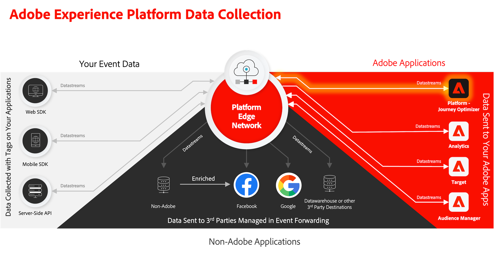
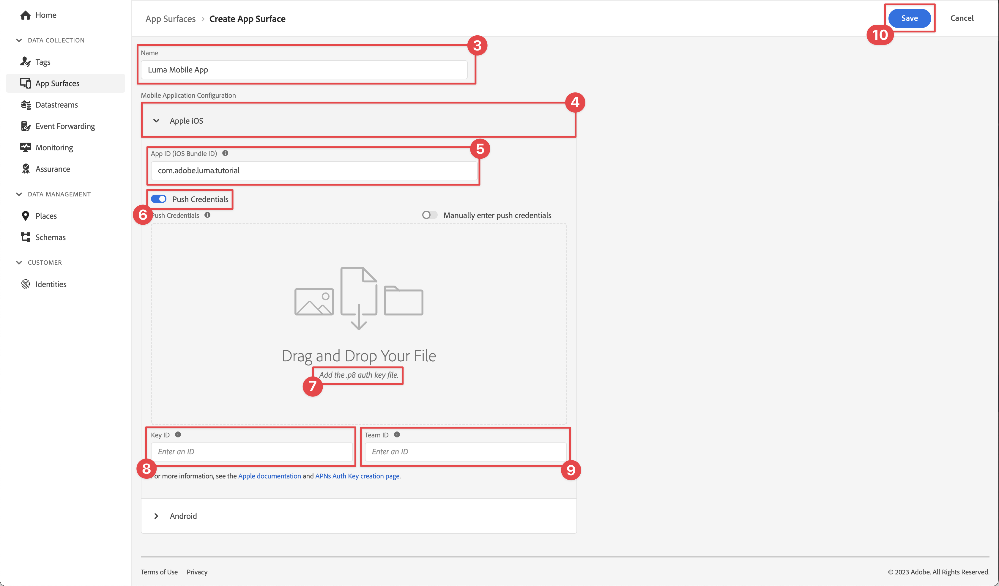
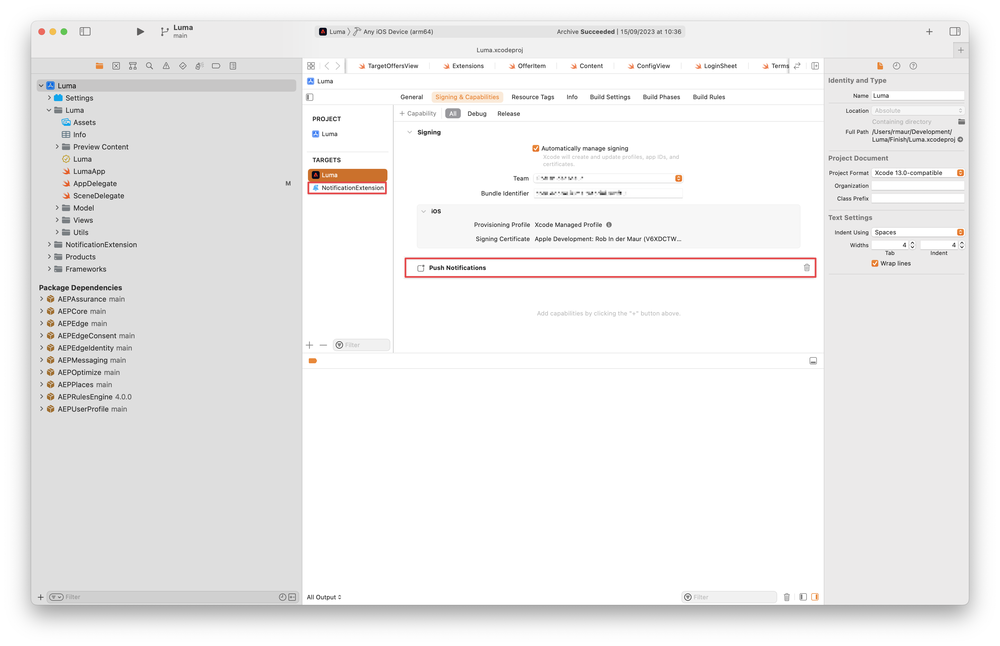
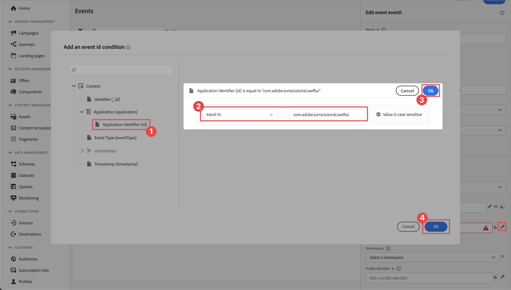

# プッシュ通知の作成と送信

Experience PlatformMobile SDK とJourney Optimizerを使用して、モバイルアプリ用のプッシュ通知を作成する方法について説明します。

Journey Optimizerでは、ジャーニーを作成し、ターゲットを絞ったオーディエンスにメッセージを送信できます。 Journey Optimizerでプッシュ通知を送信する前に、適切な設定と統合がおこなわれていることを確認する必要があります。 Journey Optimizerのプッシュ通知データフローについては、 [ドキュメント](https://experienceleague.adobe.com/docs/journey-optimizer/using/configuration/configuration-message/push-config/push-gs.html).



>[!NOTE]
>
>このレッスンはオプションで、プッシュ通知の送信を希望するJourney Optimizerユーザーにのみ適用されます。


## 前提条件

* SDK が正常にビルドされ、インストールされ、設定された状態でアプリを実行しました。
* アプリをAdobe Experience Platform用に設定します。
* Journey Optimizerへのアクセスと十分な権限（説明を参照） [ここ](https://experienceleague.adobe.com/docs/journey-optimizer/using/configuration/configuration-message/push-config/push-configuration.html?lang=en). また、次のJourney Optimizer機能に対する十分な権限が必要です。
   * アプリケーションサーフェスを作成します。
   * ジャーニーの作成.
   * メッセージを作成。
   * メッセージプリセットの作成.
* 証明書、識別子、キーを作成するのに十分なアクセス権を持つ有料Apple開発者アカウント。
* 物理iOSデバイスまたはテスト用のシミュレーター。

## 学習内容

このレッスンでは、次の操作を行います

* アプリ ID をAppleプッシュ通知サービス (APNs) に登録します。
* Journey Optimizerでアプリサーフェスを作成します。
* スキーマを更新して、プッシュメッセージフィールドを含めます。
* Journey Optimizerタグ拡張機能をインストールして設定します。
* アプリを更新して、Journey Optimizerタグ拡張を登録します。
* アシュランスで設定を検証します。
* アシュランスからテストメッセージを送信する
* Journey Optimizerで独自のプッシュ通知イベント、ジャーニー、エクスペリエンスを定義します。
* アプリ内から独自のプッシュ通知を送信します。


## セットアップ

>[!TIP]
>
>環境を既に [Journey Optimizerのアプリ内メッセージ](journey-optimizer-inapp.md) レッスンでは、このセットアップセクションの手順の一部を既に実行している可能性があります。

### アプリ ID を APNs に登録

次の手順は、Adobe Experience Cloud固有のものではなく、APNs 設定を順を追って説明するように設計されています。

#### 秘密鍵の作成

1. Apple開発者ポータルで、に移動します。 **[!UICONTROL キー]**.
1. キーを作成するには、「 」を選択します。 **[!UICONTROL +]**.
   

1. 次を提供： **[!UICONTROL キー名]**.
1. を選択します。 **[!UICONTROL Apple Push Notification service] (APNs)** チェックボックス。
1. 「**[!UICONTROL 続行]**」を選択します。
   
1. 設定を確認し、「 」を選択します。 **[!UICONTROL 登録]**.
1. をダウンロードします。 `.p8` 秘密鍵。 このレッスンの後半では、App Surface 設定で使用します。
1. 次の項目をメモします。 **[!UICONTROL キー ID]**. これは、App Surface 設定で使用されます。
1. 次の項目をメモします。 **[!UICONTROL チーム ID]**. これは、App Surface 設定で使用されます。
   

追加のドキュメントは、 [ここにある](https://help.apple.com/developer-account/#/devcdfbb56a3).

#### データ収集にアプリケーションサーフェスを追加する

1. 次から： [データ収集インターフェイス](https://experience.adobe.com/data-collection/)を選択します。 **[!UICONTROL アプリのサーフェス]** をクリックします。
1. 設定を作成するには、「 」を選択します。 **[!UICONTROL アプリサーフェスを作成]**.
   
1. を入力します。 **[!UICONTROL 名前]** 設定の場合、例： `Luma App Tutorial`  .
1. 送信者 **[!UICONTROL モバイルアプリケーション設定]**&#x200B;を選択します。 **[!UICONTROL Apple iOS]**.
1. 「**[!UICONTROL アプリ ID（iOS バンドル ID）]**」フィールドにモバイルアプリのバンドル ID を入力します。例：`com.adobe.luma.tutorial.swiftui`。
1. をオンにします。 **[!UICONTROL プッシュ認証情報]** を切り替えて、資格情報を追加します。
1. をドラッグ&amp;ドロップします。 `.p8` **Appleプッシュ通知認証キー** ファイル。
1. 次を提供： **[!UICONTROL キー ID]**: `p8` 認証キー。 これは、 **[!UICONTROL キー]** 」タブをクリックします。 **証明書、識別子、およびプロファイル** Apple Developer Portal ページのページ。 関連トピック [秘密鍵の作成](#create-a-private-key).
1. **[!UICONTROL チーム ID]** を指定します。チーム ID は、 **メンバーシップ** 」タブまたはApple Developer Portal ページの上部に表示されます。 関連トピック [秘密鍵の作成](#create-a-private-key).
1. 「**[!UICONTROL 保存]**」を選択します。

   

### データストリーム設定を更新

モバイルアプリから Edge ネットワークにデータが確実に送信されるようにするには、 Experience Edge 設定を更新します。

1. データ収集 UI で、「 」を選択します。 **[!UICONTROL データストリーム]**&#x200B;を選択し、例えば、データストリームを選択します。 **[!DNL Luma Mobile App]**.
1. 選択  対象： **[!UICONTROL Experience Platform]** を選択し、  **[!UICONTROL 編集]** を選択します。
1. Adobe Analytics の **[!UICONTROL データストリーム]** >  >  **[!UICONTROL Adobe Experience Platform]** 画面：

   1. まだ選択していない場合は、「 」を選択します。 **[!UICONTROL AJO プッシュプロファイルデータセット]** から **[!UICONTROL プロファイルデータセット]**. このプロファイルデータセットは、 `MobileCore.setPushIdentifier` API 呼び出し ( [プッシュ通知用のデバイストークンの登録](#register-device-token-for-push-notifications)) と呼ばれ、プッシュ通知の一意の識別子（プッシュ識別子）が、ユーザーのプロファイルの一部として保存されます。

   1. **[!UICONTROL Adobe Journey Optimizer]** が選択されている。 詳しくは、 [Adobe Experience Platform設定](https://experienceleague.adobe.com/docs/experience-platform/datastreams/configure.html?lang=en#aep) を参照してください。

   1. データストリーム設定を保存するには、 **[!UICONTROL 保存]**.

   


### Journey Optimizer Tags 拡張機能のインストール

アプリがJourney Optimizerで動作するようにするには、タグプロパティを更新する必要があります。

1. に移動します。 **[!UICONTROL タグ]** > **[!UICONTROL 拡張機能]** > **[!UICONTROL カタログ]**,
1. プロパティを開きます（例： ）。 **[!DNL Luma Mobile App Tutorial]**.
1. 選択 **[!UICONTROL カタログ]**.
1. を検索します。 **[!UICONTROL Adobe Journey Optimizer]** 拡張子。
1. 拡張機能のインストール.
1. Adobe Analytics の **[!UICONTROL 拡張機能のインストール]** ダイアログ
   1. 環境を選択します（例： ）。 **[!UICONTROL 開発]**.
   1. を選択します。 **[!UICONTROL AJO プッシュトラッキングエクスペリエンスイベントデータセット]** データセット **[!UICONTROL イベントデータセット]** リスト。
   1. 選択 **[!UICONTROL ライブラリに保存してビルドする]**.
      

>[!NOTE]
>
>表示されない場合 **[!UICONTROL AJO プッシュトラッキングエクスペリエンスイベントデータセット]** 必要に応じて、カスタマーケアにお問い合わせください。
>

## アシュランスを使用して設定を検証

1. 以下を確認します。 [設定手順](assurance.md#connecting-to-a-session) シミュレーターまたはデバイスを Assurance に接続するには、「 」セクションを参照してください。
1. Assurance UI で、 **[!UICONTROL 設定]**.
   
1. 選択  次の **[!UICONTROL プッシュデバッグ]**.
1. 「**[!UICONTROL 保存]**」を選択します。
   
1. 選択 **[!UICONTROL プッシュデバッグ]** をクリックします。
1. を選択します。 **[!UICONTROL 設定の検証]** タブをクリックします。
1. 次の場所からデバイスを選択します。 **[!UICONTROL クライアント]** リスト。
1. エラーが表示されていないことを確認します。
   
1. を選択します。 **[!UICONTROL テストプッシュの送信]** タブをクリックします。
1. （オプション）次のデフォルトの詳細を変更します： **[!UICONTROL タイトル]** および **[!UICONTROL 本文]**
1. 選択  **[!UICONTROL テストプッシュ通知の送信]**.
1. 次を確認します。 **[!UICONTROL テスト結果]**.
1. アプリにテストプッシュ通知が表示されます。

   


## アプリへのプッシュ通知機能の追加

>[!IMPORTANT]
>
>iOSアプリでプッシュ通知を実装およびテストするには、 **有料** Apple開発者アカウント。 有料Apple開発者アカウントを持っていない場合は、このレッスンの残りをスキップできます。

1. Xcode で、「 **[!DNL Luma]** から **[!UICONTROL ターゲット]** リストで、 **[!UICONTROL 署名と機能]** タブで、 **[!UICONTROL +機能]** 「 」ボタンをクリックし、「 **[!UICONTROL プッシュ通知]**. これにより、アプリがプッシュ通知を受信できるようになります。

1. 次に、通知拡張機能をアプリに追加する必要があります。 に戻ります。 **[!DNL General]** 」タブで「 **[!UICONTROL +]** アイコン **[!UICONTROL ターゲット]** 」セクションに入力します。

1. 新しいターゲットのテンプレートを選択するよう求めるプロンプトが表示されます。 選択 **[!UICONTROL 通知サービス拡張]** 次に、 **[!UICONTROL 次へ]**.

1. 次のウィンドウで、 `NotificationExtension` 拡張機能の名前として追加し、「 **[!UICONTROL 完了]** 」ボタンをクリックします。

これで、以下の画面のように、プッシュ通知拡張機能がアプリに追加されました。




## アプリでのJourney Optimizerの実装

前のレッスンで説明したように、モバイルタグ拡張機能のインストールでは設定のみが提供されます。 次に、メッセージング SDK をインストールして登録する必要があります。 これらの手順が明確でない場合は、 [SDK のインストール](install-sdks.md) 」セクションに入力します。

>[!NOTE]
>
>以下を完了した場合、 [SDK のインストール](install-sdks.md) 」セクションに移動した場合は、SDK が既にインストールされているので、この手順をスキップできます。
>

1. Xcode で、 [AEP メッセージ](https://github.com/adobe/aepsdk-messaging-ios.git) は、パッケージの依存関係にパッケージのリストに追加されます。 詳しくは、 [Swift Package Manager](install-sdks.md#swift-package-manager).
1. に移動します。 **[!DNL Luma]** > **[!DNL Luma]** > **[!UICONTROL AppDelegate]** 」をクリックします。
1. 確認 `AEPMessaging` は、インポートのリストの一部です。

   `import AEPMessaging`

1. 確認 `Messaging.self` は、登録する拡張機能の配列の一部です。

   ```swift
   let extensions = [
       AEPIdentity.Identity.self,
       Lifecycle.self,
       Signal.self,
       Edge.self,
       AEPEdgeIdentity.Identity.self,
       Consent.self,
       UserProfile.self,
       Places.self,
       Messaging.self,
       Optimize.self,
       Assurance.self
   ]
   ```

## プッシュ通知用のデバイストークンの登録

1. 次を追加： [`MobileCore.setPushIdentifier`](https://developer.adobe.com/client-sdks/documentation/mobile-core/api-reference/#setpushidentifier) への API `func application(_ application: UIApplication, didRegisterForRemoteNotificationsWithDeviceToken deviceToken: Data)` 関数に置き換えます。

   ```swift
   // Send push token to Mobile SDK
   MobileCore.setPushIdentifier(deviceToken)
   ```

   この関数は、アプリがインストールされているデバイスに固有のデバイストークンを取得します。 次に、設定済みの設定を使用し、Appleのプッシュ通知サービス (APNs) に依存するプッシュ通知配信用のトークンを設定します。

>[!IMPORTANT]
>
>The `MobileCore.updateConfigurationWith(configDict: ["messaging.useSandbox": true])` プッシュ通知を送信する際に、プッシュ通知が APNs サンドボックスを使用するか、本番サーバーを使用するかを決定します。 シミュレーターまたはデバイスでアプリをテストする際に、 `messaging.useSandbox` が `true` プッシュ通知を受け取るために使用します。 Apple Testflight を使用して実稼動用にアプリをデプロイしてテストする場合は、 `messaging.useSandbox` から `false` そうしないと、実稼動アプリはプッシュ通知を受け取れなくなります。


## 独自のプッシュ通知を作成する

独自のプッシュ通知を作成するには、プッシュ通知の送信を処理するジャーニーをトリガーするイベントをJourney Optimizerで定義する必要があります。

### スキーマを更新

新しいイベントタイプを定義します。スキーマで定義されているイベントのリストの一部として、まだ使用できません。 後でプッシュ通知をトリガーする際に、このイベントタイプを使用します。

1. Journey Optimizer UI で、 **[!UICONTROL スキーマ]** をクリックします。
1. 選択 **[!UICONTROL 参照]** 」をクリックします。
1. スキーマを選択します（例： ）。 **[!DNL Luma Mobile App Event Schema]** をクリックして開きます。
1. スキーマエディターで、次の操作を実行します。
   1. を選択します。 **[!UICONTROL eventType]** フィールドに入力します。
   1. Adobe Analytics の **[!UICONTROL フィールドのプロパティ]** ウィンドウ領域を下にスクロールして、イベントタイプに使用可能な値のリストを表示します。 選択 **[!UICONTROL 行を追加]**、を追加します。 `application.test` として **[!UICONTROL 値]** および `[!UICONTROL Test event for push notification]` として `DISPLAY NAME`.
   1. 「**[!UICONTROL 適用]**」を選択します。
   1. 「**[!UICONTROL 保存]**」を選択します。
      

### イベントの定義

Journey Optimizerのイベントを使用すると、ジャーニーを一元的にトリガーして、プッシュ通知などのメッセージを送信できます。 詳しくは、 [イベントについて](https://experienceleague.adobe.com/docs/journey-optimizer/using/configuration/configure-journeys/events-journeys/about-events.html?lang=en) を参照してください。

1. Journey Optimizer UI で、 **[!UICONTROL 設定]** をクリックします。

1. Adobe Analytics の **[!UICONTROL ダッシュボード]** 画面で、 **[!UICONTROL 管理]** ボタン **[!UICONTROL イベント]** タイル。

1. Adobe Analytics の **[!UICONTROL イベント]** 画面、選択 **[!UICONTROL イベントを作成]**.

1. Adobe Analytics の **[!UICONTROL event1 を編集]** ペイン：

   1. 入力 `LumaTestEvent` として **[!UICONTROL 名前]** イベントの。
   1. 次を提供： **[!UICONTROL 説明]**&#x200B;例： `Test event to trigger push notifications in Luma app`.

   1. 前の手順で作成したモバイルアプリエクスペリエンスイベントスキーマを選択します。 [XDM スキーマの作成](create-schema.md) から **[!UICONTROL スキーマ]** 例えば、リスト **[!DNL Luma Mobile App Event Schema v.1]**.
   1. 選択  の横 **[!UICONTROL フィールド]** リスト。

      

      Adobe Analytics の **[!UICONTROL フィールド]** ダイアログで、次のフィールドが選択されていることを確認します ( 常に選択されているデフォルトのフィールドの上部 (**[!UICONTROL _id]**, **[!UICONTROL id]**、および **[!UICONTROL timestamp]**)) を参照してください。 ドロップダウンリストを使用して、次の間で切り替えることができます。 **[!UICONTROL 選択済み]**, **[!UICONTROL すべて]** および **[!UICONTROL プライマリ]** または  フィールドに入力します。

      * **[!UICONTROL 特定されたアプリケーション (id)]**,
      * **[!UICONTROL イベントタイプ (eventType)]**,
      * **[!UICONTROL プライマリ（プライマリ）]**.

      

      次に、 **[!UICONTROL OK]**.

   1. 選択  の横 **[!UICONTROL イベント ID 条件]** フィールドに入力します。

      1. Adobe Analytics の **[!UICONTROL イベント ID 条件の追加]** ダイアログ、ドラッグ&amp;ドロップ **[!UICONTROL イベントタイプ (eventType)]** 次に対して **[!UICONTROL ここに要素をドラッグ&amp;ドロップ]**.
      1. ポップオーバーで、下までスクロールし、「 」を選択します。 **[!UICONTROL application.test]** ( これは、 [スキーマを更新](#update-your-schema)) をクリックします。 次に、上までスクロールし、「 」を選択します。 **[!UICONTROL OK]**.
      1. 選択 **[!UICONTROL OK]** をクリックして条件を保存します。
         

   1. 選択 **[!UICONTROL ECID (ECID)]** から **[!UICONTROL 名前空間]** リスト。 自動的に **[!UICONTROL プロファイル識別子]** フィールドに **[!UICONTROL マップ identityMap のキー ECID の最初の要素の ID。]**.
   1. 「**[!UICONTROL 保存]**」を選択します。
      

このチュートリアルの一部として前に作成したモバイルアプリエクスペリエンスイベントスキーマに基づくイベント設定を作成しました。 このイベント設定は、特定のイベントタイプ (`application.test`) を使用する場合、次の手順で構築するジャーニーをトリガーにできるのは、モバイルアプリから開始した特定のタイプを持つイベントのみです。 実際のシナリオでは、外部サービスからプッシュ通知を送信する場合も同じ概念が当てはまります。外部アプリケーションから、ジャーニーをトリガーする前に、特定のフィールドを持つExperience Platformにエクスペリエンスイベントを送信します。

### ジャーニーの作成

次の手順では、適切なイベントを受信した際にプッシュ通知の送信をトリガーにするジャーニーを作成します。

1. Journey Optimizer UI で、 **[!UICONTROL ジャーニー]** をクリックします。
1. 選択 **[!UICONTROL 「作成」ジャーニー]**.
1. Adobe Analytics の **[!UICONTROL ジャーニーのプロパティ]** パネル：

   1. を入力します。 **[!UICONTROL 名前]** ジャーニーの例 `Luma - Test Push Notification Journey`.
   1. を入力します。 **[!UICONTROL 説明]** ジャーニーの例 `Journey for test push notifications in Luma mobile app`.
   1. 確認 **[!UICONTROL 再エントリを許可]** が選択され、設定されている **[!UICONTROL 再入場待機期間]** から **[!UICONTROL 30]** **[!UICONTROL 秒]**.
   1. 「**[!UICONTROL OK]**」を選択します。
      

1. ジャーニーキャンバスに戻る、 **[!UICONTROL イベント]**&#x200B;をドラッグ&amp;ドロップし、  **[!DNL LumaTestEvent]** それが表示されるキャンバス上で **[!UICONTROL エントリイベントまたはオーディエンスの閲覧アクティビティを選択]**.

   * Adobe Analytics の **[!UICONTROL イベント：LumaTestEvent]** パネル、 **[!UICONTROL ラベル]**&#x200B;例： `Luma Test Event`.

1. 次から： **[!UICONTROL アクション]** ドロップダウン、ドラッグ&amp;ドロップ  **[!UICONTROL プッシュ]** の  あなたの右に現れて **[!DNL LumaTestEvent]** アクティビティ。 Adobe Analytics の **[!UICONTROL アクション：プッシュ]** ペイン：

   1. 次を提供： **[!UICONTROL ラベル]**&#x200B;例： `Luma Test Push Notification`、 **[!UICONTROL 説明]**&#x200B;例： `Test push notification for Luma mobile app`を選択します。 **[!UICONTROL トランザクション]** から **[!UICONTROL カテゴリ]** リストと選択 **[!DNL Luma]** から **[!UICONTROL 押し出しサーフェス]**.
   1. 選択  **[!UICONTROL コンテンツを編集]** 実際のプッシュ通知の編集を開始する場合。
      

      Adobe Analytics の **[!UICONTROL プッシュ通知]** 編集者：

      1. を入力します。 **[!UICONTROL タイトル]**&#x200B;例： `Luma Test Push Notification` を入力し、 **[!UICONTROL 本文]**&#x200B;例： `Test push notification for Luma mobile app`.
      1. エディターを保存して終了するには、「 」を選択します。 .
         

   1. プッシュ通知の定義を保存して終了するには、 **[!UICONTROL OK]**.

1. ジャーニーは次のようになります。 選択 **[!UICONTROL 公開]** ジャーニーを公開してアクティブ化する。
   


## プッシュ通知のトリガー

プッシュ通知を送信するためのすべての構成要素が揃っている。 残りの点は、このプッシュ通知のトリガー方法です。 基本的に、これは以前に見たのと同じです。適切なペイロードを持つエクスペリエンスイベントを ( [イベント](events.md)) をクリックします。

今回は、送信しようとしているエクスペリエンスイベントは、単純な XDM 辞書を構築して構築されていません。 次を使用します： `struct` プッシュ通知ペイロードを表します。 アプリケーションでエクスペリエンスイベントペイロードを作成する方法として、専用のデータタイプを定義する方法があります。

1. に移動します。 **[!DNL Luma]** > **[!DNL Luma]** > **[!UICONTROL モデル]** > **[!UICONTROL XDM]** > **[!UICONTROL TestPushPayload]** をクリックし、コードを調べます。

   ```swift
   import Foundation
   
   // MARK: - TestPush
   struct TestPushPayload: Codable {
      let application: Application
      let eventType: String
   }
   
   // MARK: - Application
   struct Application: Codable {
      let id: String
   }
   ```

   コードは、テストプッシュ通知ジャーニーをトリガーするために送信する、次のシンプルなペイロードを表しています

   ```json
   {
      "eventType": string,
      "application" : [
          "id": string
      ]
   }
   ```

1. に移動します。 **[!DNL Luma]** > **[!DNL Luma]** > **[!DNL Utils]** > **[!UICONTROL MobileSDK]** をクリックし、次のコードをに追加します。 `func sendTestPushEvent(applicationId: String, eventType: String)`:

   ```swift
   // Create payload and send experience event
   Task {
       let testPushPayload = TestPushPayload(
           application: Application(
               id: applicationId
           ),
           eventType: eventType
       )
       // send the final experience event
       await sendExperienceEvent(
           xdm: testPushPayload.asDictionary() ?? [:]
       )
   }
   ```

   このコードにより、 `testPushPayload` 関数に指定されたパラメーター (`applicationId` および `eventType`) と呼び出し `sendExperienceEvent` ペイロードを辞書に変換する際に発生した問題を修正しました。 また、このコードは、今回は、に基づく Swift の同時実行モデルを使用してAdobe Experience Platform SDK を呼び出す際の非同期的な側面も考慮します `await` および `async`.

1. に移動します。 **[!DNL Luma]** > **[!DNL Luma]** > **[!DNL Views]** > **[!DNL General]** > **[!UICONTROL ConfigView]** 」をクリックします。 プッシュ通知ボタンの定義で、次のコードを追加して、テストプッシュ通知エクスペリエンスイベントペイロードを、そのボタンがタップされるたびにジャーニーをトリガーに送信します。

   ```swift
   // Setting parameters and calling function to send push notification
   Task {
       let eventType = testPushEventType
       let applicationId = Bundle.main.bundleIdentifier ?? "No bundle id found"
       await MobileSDK.shared.sendTestPushEvent(applicationId: applicationId, eventType: eventType)
   }
   ```


## アプリを使用した検証

1. を使用して、シミュレーターまたは Xcode の物理デバイスでアプリを再構築し、実行します。 .

1. 次に移動： **[!UICONTROL 設定]** タブをクリックします。

1. タップ **[!UICONTROL プッシュ通知]**. アプリにプッシュ通知が表示されます。

   


## 次の手順

これで、アプリ内のプッシュ通知を処理するすべてのツールが用意されました。 例えば、アプリのユーザーがログインしたときにウェルカムプッシュ通知を送信するジャーニーをJourney Optimizerで構築できます。 または、ユーザーがアプリで製品を購入した際の確認プッシュ通知。 または、場所のジオフェンスを入力します ( [場所](places.md) レッスン )。

>[!SUCCESS]
>
>これで、Journey Optimizerと、Experience PlatformMobile SDK 用のJourney Optimizer拡張機能を使用して、アプリのプッシュ通知を有効にしました。<br/>Adobe Experience Platform Mobile SDK の学習に時間を割いていただき、ありがとうございます。 ご質問がある場合、一般的なフィードバックを共有する場合、または今後のコンテンツに関する提案がある場合は、このドキュメントで共有します [Experience Leagueコミュニティディスカッション投稿](https://experienceleaguecommunities.adobe.com/t5/adobe-experience-platform-launch/tutorial-discussion-implement-adobe-experience-cloud-in-mobile/td-p/443796).

次へ： **[アプリ内メッセージの作成と送信](journey-optimizer-inapp.md)**
