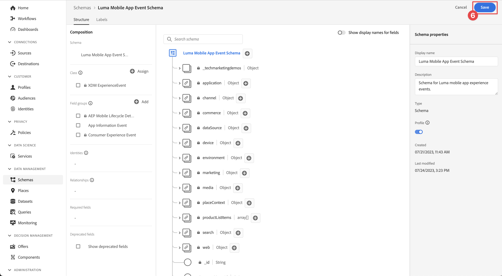
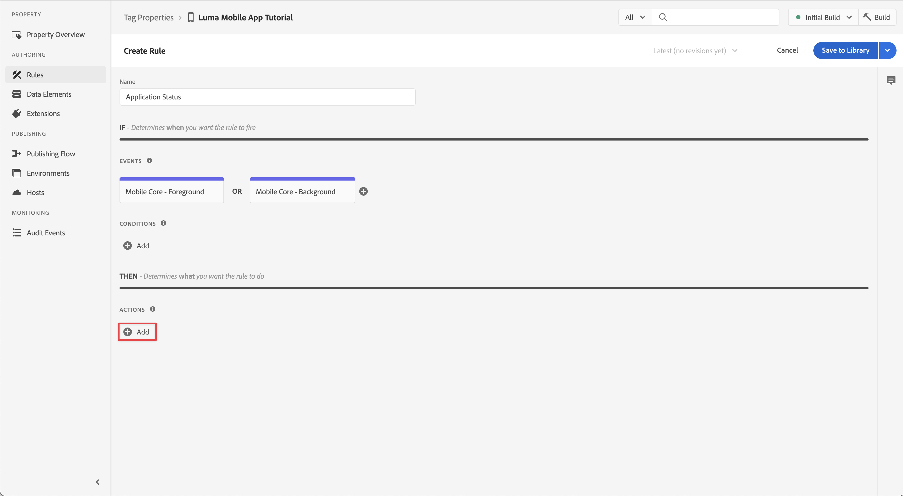

# ライフサイクルデータ

モバイルアプリでライフサイクルデータを収集する方法を説明します。

Adobe Experience Platform Mobile SDK Lifecycle 拡張機能を使用すると、モバイルアプリからの収集のライフサイクルデータを有効にします。 Adobe Experience Platform Edge Network 拡張機能は、このライフサイクルデータを Platform Edge Network に送信し、そこで、データストリーム設定に従って、他のアプリケーションやサービスに転送されます。 詳しくは、 [ライフサイクル拡張](https://developer.adobe.com/client-sdks/documentation/lifecycle-for-edge-network/) （製品ドキュメント内）。


## 前提条件

* SDK が正常に構築され、インストールされ、設定された状態でアプリが実行されました。
* Assurance 拡張機能を登録しました ( [前のレッスン](install-sdks.md).

## 学習内容

このレッスンでは、次の操作を実行します。

<!--
* Add lifecycle field group to the schema.
* -->
* アプリがフォアグラウンドとバックグラウンドの間を移動する際に正しく開始/一時停止することで、正確なライフサイクル指標を有効にします。
* アプリから Platform Edge ネットワークにデータを送信します。
* アシュランスで検証します。

<!--
## Add lifecycle field group to schema

The Consumer Experience Event field group you added in the [previous lesson](create-schema.md) already contains the lifecycle fields, so you can skip this step. If you don't use Consumer Experience Event field group in your own app, you can add the lifecycle fields by doing the following:

1. Navigate to the schema interface as described in the [previous lesson](create-schema.md).
1. Open the **Luma Mobile App Event Schema** schema and select **[!UICONTROL Add]** next to Field groups.
    
1. In the search bar, enter "lifecycle".
1. Select the checkbox next to **[!UICONTROL AEP Mobile Lifecycle Details]**.
1. Select **[!UICONTROL Add field groups]**.
    
1. Select **[!UICONTROL Save]**.
    
-->

## 実装の変更

これで、プロジェクトを更新して、ライフサイクルイベントを登録できます。

1. に移動します。 **[!UICONTROL Luma]** > **[!UICONTROL Luma]** > **[!UICONTROL SceneDelegate]** 」をクリックします。

1. アプリが起動されたときにバックグラウンド状態から再開されている場合、iOSは、 `sceneWillEnterForeground:` delegate メソッドと、ライフサイクル開始イベントをトリガーする場所です。 このコードを `func sceneWillEnterForeground(_ scene: UIScene)`:

   ```swift
   // When in foreground start lifecycle data collection
   MobileCore.lifecycleStart(additionalContextData: nil)
   ```

1. アプリがバックグラウンドに入ると、アプリの `sceneDidEnterBackground:` delegate メソッド。 このコードを  `func sceneDidEnterBackground(_ scene: UIScene)`:

   ```swift
   // When in background pause lifecycle data collection
   MobileCore.lifecyclePause()
   }
   ```

## アシュランスで検証

1. 以下を確認します。 [設定手順](assurance.md) を参照し、シミュレーターまたはデバイスを Assurance に接続します。
1. アプリを起動します。
1. アプリをバックグラウンドに送信します。 次を確認 **[!UICONTROL LifecyclePause]** イベントを含めることができます。
1. アプリをフォアグラウンドに移動します。 次を確認 **[!UICONTROL LifecycleResume]** イベントを含めることができます。
   


## データを Platform Edge ネットワークに転送する

前の演習では、フォアグラウンドイベントとバックグラウンドイベントをAdobe Experience Platform Mobile SDK にディスパッチします。 これらのイベントを Platform Edge Network に転送するには：

1. 選択 **[!UICONTROL ルール]** （データ収集 UI）を参照してください。
   
1. 選択 **[!UICONTROL 初期ビルド]** を使用するライブラリとして追加しました。
1. 「**[!UICONTROL 新規ルールを作成]**」を選択します。
   
1. Adobe Analytics の **[!UICONTROL ルールを作成]** 画面、入力 `Application Status` 対象： **[!UICONTROL 名前]**.
1. 選択  **[!UICONTROL 追加]** below **[!UICONTROL イベント]**.
   
1. Adobe Analytics の **[!UICONTROL イベント設定]** 手順：
   1. 選択 **[!UICONTROL Mobile Core]** として **[!UICONTROL 拡張]**.
   1. 選択 **[!UICONTROL 前景]** として **[!UICONTROL イベントタイプ]**.
   1. 「**[!UICONTROL 変更を保持]**」を選択します。
      
1. 戻る **[!UICONTROL ルールを作成]** 画面、選択  **[!UICONTROL 追加]** 次の **[!UICONTROL Mobile Core - Foreground]**.
   
1. Adobe Analytics の **[!UICONTROL イベント設定]** 手順：
   1. 選択 **[!UICONTROL Mobile Core]** として **[!UICONTROL 拡張]**.
   1. 選択 **[!UICONTROL 背景]** として **[!UICONTROL イベントタイプ]**.
   1. 「**[!UICONTROL 変更を保持]**」を選択します。
      
      
1. Adobe Analytics の **[!UICONTROL アクションの設定]** 手順：
   1. 選択 **[!UICONTROL AdobeExperience Edge ネットワーク]** として **[!UICONTROL 拡張]**.
   1. 選択 **[!UICONTROL イベントを Edge ネットワークに転送する]** として **[!UICONTROL アクションタイプ]**.
   1. 「**[!UICONTROL 変更を保持]**」を選択します。
      
1. 選択 **[!UICONTROL ライブラリに保存]**.
   
1. 選択 **[!UICONTROL ビルド]** ライブラリを再構築します。
   

プロパティが正常に構築されると、イベントは Platform Edge ネットワークに送信され、イベントはデータストリーム設定に従って他のアプリケーションやサービスに転送されます。

次のようになります。 **[!UICONTROL アプリケーションの終了（背景）]** および **[!UICONTROL アプリケーション起動（フォアグラウンド）]** アシュランスに XDM データを含むイベント。


>[!SUCCESS]
>
>これで、アプリの状態（フォアグラウンド、バックグラウンド）イベントをAdobe Experience Platform Edge Network と、データストリームで定義したすべてのサービスに送信するようにアプリを設定しました。<br>Adobe Experience Platform Mobile SDK の学習に時間を割いていただき、ありがとうございます。 ご質問がある場合、一般的なフィードバックを共有する場合、または今後のコンテンツに関する提案がある場合は、このドキュメントで共有します [Experience Leagueコミュニティディスカッション投稿](https://experienceleaguecommunities.adobe.com/t5/adobe-experience-platform-launch/tutorial-discussion-implement-adobe-experience-cloud-in-mobile/td-p/443796)

次へ： **[イベントの追跡](events.md)**
