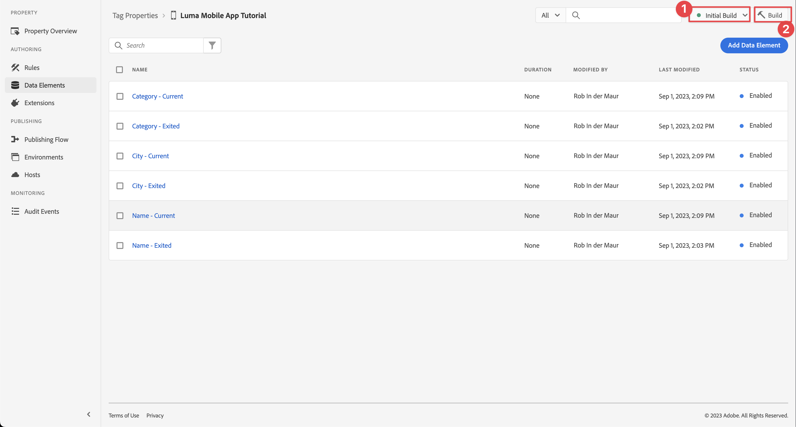

# Places

アプリで位置情報サービスを使用する方法を説明します。

Adobe Experience Platform Data Collection Places Service は、位置認識を持つモバイルアプリで場所のコンテキストを理解できるようにする位置情報サービスです。 このサービスは、柔軟な目標地点 (POI) データベースに加えて、豊富で使いやすい SDK インターフェイスを使用しています。

## 前提条件

* パッケージの依存関係はすべて、Xcode プロジェクトに配置されます。
* AppDelegate に登録された拡張機能。
* 開発 appId を使用するように MobileCore を設定しました。
* SDK が読み込まれました。
* 上記の変更を含むアプリが正常にビルドされ、実行されました。

## 学習内容

このレッスンでは、次の操作を行います

* Places サービスで目標地点を定義する方法を説明します。
* Places 拡張機能でタグプロパティを更新します。
* スキーマを更新して位置情報イベントをキャプチャします。
* アシュランスで設定を検証します。
* Places 拡張機能を含めるようにアプリを更新します。
* アプリに Places サービスから位置情報トラッキングを実装します。


## 前提条件

* 適切な SDK が正常に構築され、設定された状態でアプリが実行されました。


## 学習内容

このレッスンでは、次の操作を行います

* 決定管理のための Edge 設定を更新します。
* Journey Optimizer - Decisioning 拡張機能でタグプロパティを更新します。
* 提案イベントをキャプチャするためにスキーマを更新します。
* アシュランスで設定を検証します。
* Journey Optimizer — 決定管理でのオファーに基づいて、オファーの決定を作成します。
* Optimizer 拡張機能を含めるようにアプリを更新します。
* アプリに、決定管理からオファーを実装します。


## セットアップ

Places サービスをアプリ内および Mobile SDK 内で動作させるには、いくつかの設定をおこなう必要があります。

### 場所を定義

Places サービスで目標地点を定義します。

1. データ収集 UI で、「 」を選択します。 **[!UICONTROL 場所]**.
1. 選択 .
1. コンテキストメニューから、「 」を選択します。 **[!UICONTROL ライブラリを管理]**.
   
1. Adobe Analytics の **[!UICONTROL ライブラリを管理]** ダイアログ、選択 **[!UICONTROL 新規]**.
1. Adobe Analytics の **[!UICONTROL ライブラリを作成]** ダイアログを入力 **[!UICONTROL 名前]**&#x200B;例： `Luma`.
1. 選択 **[!UICONTROL 確認]**.
   
1. を閉じるには、以下を実行します。 **[!UICONTROL ライブラリを管理]** ダイアログ、選択 **[!UICONTROL 閉じる]**.
1. 戻る **[!UICONTROL POI 管理]**&#x200B;を選択します。 **[!UICONTROL POI をインポート]**.
1. 選択 **[!UICONTROL 開始]** t**で[!UICONTROL 場所をインポート]**ダイアログ。
1. 選択 **[!UICONTROL Luma]** ライブラリのリストから、
1. 「**[!UICONTROL 次へ]**」を選択します。
   
1. をダウンロードします。 [Luma POI ZIP ファイル](assets/luma_pois.csv.zip) コンピュータ上の場所に抽出します。
1. Adobe Analytics の **[!UICONTROL 場所を読み込み]** ダイアログで、抽出した `luma_pois.csv` ～について申し出る **[!UICONTROL CSV ファイルを選択 — ファイルをドラッグ&amp;ドロップします]**. 次のようになります。 **[!UICONTROL 検証成功]** - **[!UICONTROL CSV ファイルが正常に検証されました]**.
1. 選択 **[!UICONTROL 読み込みを開始]**. 次のようになります。 **[!UICONTROL 成功]** - **[!UICONTROL 6 個の新しい POI が正常に追加されました]**.
1. 「**[!UICONTROL 完了]**」を選択します。
1. In **[!UICONTROL POI 管理]**&#x200B;を探すと、6 つの新しい Luma ストアがリストに追加されています。 切り替え可能な  リストと  マップビュー。
   .


### Places 拡張機能のインストール

1. に移動します。 **[!UICONTROL タグ]** モバイルタグプロパティを見つけて、プロパティを開きます。
1. 選択 **[!UICONTROL 拡張機能]**.
1. 選択 **[!UICONTROL カタログ]**.
1. を検索します。 **[!UICONTROL Adobe Journey Optimizer — 判定]** 拡張子。
1. 拡張機能のインストール. 拡張機能に追加の設定は必要ありません。

   

1. Adobe Analytics の **[!UICONTROL 拡張機能のインストール]** ダイアログ：
   1. 選択 **[!UICONTROL Luma]** から **[!UICONTROL ライブラリを選択]** リスト。
   1. 作業用ライブラリが選択されていることを確認します（例： ）。 **[!UICONTROL 初期ビルド]**.
   1. 選択 **[!UICONTROL ライブラリに保存してビルドする]** から **[!UICONTROL ライブラリに保存]**.
      .

1. ライブラリを再構築します。


### スキーマの検証

スキーマが [スキーマを作成](create-schema.md)は、POI および位置情報データを収集するために必要なフィールドグループとクラスを組み込みます。

1. データ収集 UI に移動し、「 」を選択します。 **[!UICONTROL スキーマ]** をクリックします。
1. 選択 **[!UICONTROL 参照]** 上部のバーから。
1. スキーマを選択して開きます。
1. スキーマエディターで、「 」を選択します。 **[!UICONTROL 消費者エクスペリエンスイベント]**.
1. 次のように表示されます。 **[!UICONTROL placeContext]** オブジェクトを、POI の操作と位置情報データを取り込むためのオブジェクトとフィールドで指定します。
   .


### タグを更新する

Places 拡張機能は、位置情報イベントを監視する機能を提供し、これらのイベントに基づいてアクションをトリガー化できます。 この機能を使用して、アプリケーションに実装する必要のある API コーディングを最小限に抑えることができます。

**データ要素**

最初に複数のデータ要素を作成します。

1. データ収集 UI でタグプロパティに移動します。
1. 選択 **[!UICONTROL データ要素]** をクリックします。
1. 「**[!UICONTROL データ要素を追加]**」を選択します。
1. Adobe Analytics の **[!UICONTROL データ要素を作成]** 画面（例： ） `Name - Entered`.
1. 選択 **[!UICONTROL 場所]** から **[!UICONTROL 拡張]** リスト。
1. 選択 **[!UICONTROL 名前]** から **[!UICONTROL データ要素タイプ]** リスト。
1. 選択**[!UICONTROL 現在の POI]**の下 **[!UICONTROL TARGET]**.
1. 選択 **[!UICONTROL ライブラリに保存]**.
   

1. 次の表の情報を使用して手順 4 ～ 8 を繰り返し、追加のデータ要素を作成します。

   | 名前 | 拡張機能 | データ要素タイプ | TARGET |
   |---|---|---|---|
   | `Name - Exited` | Places | 名前 | 前回の離脱 POI |
   | `Category - Current` | Places | カテゴリ | 現在の POI |
   | `Category - Exited` | Places | カテゴリ | 前回の離脱 POI |
   | `City - Current` | Places | 市区町村 | 現在の POI |
   | `City - Exited` | Places | 市区町村 | 前回の離脱 POI |

   次のリストのデータ要素が必要です。

   

**ルール**

次に、これらのデータ要素を使用するルールを定義します。

1. 選択 **[!UICONTROL ルール]** をクリックします。
1. 選択 **[!UICONTROL ルールを追加]**.
1. Adobe Analytics の **[!UICONTROL ルールを作成]** 画面で、ルールの名前を入力します。例： `POI - Entry`.
1. 選択  underthen **[!UICONTROL イベント]**.
   1. 選択 **[!UICONTROL 場所]** から **[!UICONTROL 拡張]** リストと選択 **[!UICONTROL POI を入力]** から **[!UICONTROL イベントタイプ]** リスト。
   1. 「**[!UICONTROL 変更を保持]**」を選択します。
      .
1. 選択  underthen **[!UICONTROL アクション]**.
   1. 選択 **[!UICONTROL Mobile Core]** から **[!UICONTROL 拡張]** リスト、選択 **[!UICONTROL データを添付]** から **[!UICONTROL アクションタイプ]** リスト。 このアクションは、ペイロードデータを添付します。
   1. Adobe Analytics の **[!UICONTROL JSON ペイロード]**、次のペイロードを貼り付けます。

      ```json
      {
          "xdm": {
              "eventType": "location.entry",
              "placeContext": {
                  "geo": {
                      "city": "{%%City - Current%%}"
                  },
                  "POIinteraction": {
                      "poiDetail": {
                          "name": "{%%Name - Current%%}",
                          "category": "{%%Category - Current%%}"
                      },
                      "poiEntries": {
                          "value": 1
                      }
                  }
              }
          }
      }
      ```

      The `{%% ... %%}` 値は、  ダイアログの横に表示され、ダイアログからデータ要素を選択します。

   1. 「**[!UICONTROL 変更を保持]**」を選択します。
      

1. 選択  の横 **[!UICONTROL Mobile Core — データを添付]** アクション。
   1. 選択 **[!UICONTROL Adobe Experience Platform Edge Network]** から **[!UICONTROL 拡張]** リストと選択 **[!UICONTROL イベントを Edge ネットワークに転送する]**. このアクションは、イベントと追加のペイロードデータが Edge ネットワークに確実に転送されるようにします。
   1. 「**[!UICONTROL 変更を保持]**」を選択します。

1. ルールを保存するには、「 **[!UICONTROL ライブラリに保存]**.

   

別のルールを作成しましょう

1. Adobe Analytics の **[!UICONTROL ルールを作成]** 画面で、ルールの名前を入力します。例： `POI - Exit`.
1. 選択  underthen **[!UICONTROL イベント]**.
   1. 選択 **[!UICONTROL 場所]** から **[!UICONTROL 拡張]** リストと選択 **[!UICONTROL POI を入力]** から **[!UICONTROL イベントタイプ]** リスト。
   1. 「**[!UICONTROL 変更を保持]**」を選択します。
1. 選択  underthen **[!UICONTROL アクション]**.
   1. 選択 **[!UICONTROL Mobile Core]** から **[!UICONTROL 拡張]** リスト、選択 **[!UICONTROL データを添付]** から **[!UICONTROL アクションタイプ]** リスト。
   1. Adobe Analytics の **[!UICONTROL JSON ペイロード]**、次のペイロードを貼り付けます。

      ```json
      {
          "xdm": {
              "eventType": "location.exit",
              "placeContext": {
                  "geo": {
                      "city": "{%%City - Exited%%}"
                  },
                  "POIinteraction": {
                      "poiExits": {
                          "value": 1
                      },
                      "poiDetail": {
                          "name": "{%%Name - Exited%%}",
                          "category": "{%%Category - Exited%%}"
                      }
                  }
              }
          }
      }
      ```

   1. 「**[!UICONTROL 変更を保持]**」を選択します。

1. 選択  の横 **[!UICONTROL Mobile Core — データを添付]** アクション。
   1. 選択 **[!UICONTROL Adobe Experience Platform Edge Network]** から **[!UICONTROL 拡張]** リストと選択 **[!UICONTROL イベントを Edge ネットワークに転送する]**.
   1. 「**[!UICONTROL 変更を保持]**」を選択します。


タグ内のすべての変更が確実に公開されるようにするには

1. 選択 **[!UICONTROL 初期ビルド]** をビルドするライブラリとして使用します。
1. 選択 **[!UICONTROL ビルド]**.
   


## アシュランスでの設定の検証

アシュランスで設定を検証するには、次の手順に従います。

1. Assurance UI に移動します。
1. 左側のパネルでまだ使用できない場合は、をクリックします。 選択 **[!UICONTROL 設定]** 左側のパネルで、「 」を選択します。  次の **[!UICONTROL イベント]** および **[!UICONTROL マップとシミュレーション]** underthen **[!UICONTROL PLACES SERVICE]**.
1. 「**[!UICONTROL 保存]**」を選択します。
1. 選択 **[!UICONTROL マップとシミュレーション]** をクリックします。
1. Places サービスで定義された POI の 1 つを選択し、ポップアップから次を選択します  **[!UICONTROL エントリイベントをシミュレート]**.
   
1. 選択 **[!UICONTROL イベント]** 左側のパネルから、シミュレーションしたイベントが表示されます。
   


## アプリケーションに場所を実装します

前のレッスンで説明したように、モバイルタグ拡張機能のインストールでは設定のみが提供されます。 次に、Places SDK をインストールして登録する必要があります。 これらの手順が明確でない場合は、 [SDK のインストール](install-sdks.md) 」セクションに入力します。

>[!NOTE]
>
>以下を完了した場合、 [SDK のインストール](install-sdks.md) 」セクションに移動した場合は、Places SDK が既にインストールされているので、この手順をスキップできます。
>

1. Xcode で、 [AEP Places](https://github.com/adobe/aepsdk-places-ios) は、パッケージの依存関係にパッケージのリストに追加されます。 詳しくは、 [Swift Package Manager](install-sdks.md#swift-package-manager).
1. に移動します。 **[!UICONTROL Luma]** > **[!UICONTROL Luma]** > **[!UICONTROL AppDelegate]** 」をクリックします。
1. 確認 `AEPPlaces` は、インポートのリストの一部です。

   `import AEPPlaces`

1. 確認 `Places.self` は、登録する拡張機能の配列の一部です。

   ```swift
   let extensions = [
       AEPIdentity.Identity.self,
       Lifecycle.self,
       Signal.self,
       Edge.self,
       AEPEdgeIdentity.Identity.self,
       Consent.self,
       UserProfile.self,
       Places.self,
       Messaging.self,
       Optimize.self,
       Assurance.self
   ]
   ```

1. Xcode プロジェクトナビゲーターで Luma / Luma / Utils / MobileSDK に移動し、関数 processRegionEvent(regionEvent: PlacesRegionEvent, forRegion: CLRegion) 非同期関数を探します。 この関数は、 [`Places.processRegionEvent`](https://developer.adobe.com/client-sdks/documentation/places/api-reference/#processregionevent) API.
1. Xcode のプロジェクトナビゲーターで、Luma / Luma /ビュー/場所/ジオフェンスシートに移動します。

   1. 「入力」ボタンに、次のコードを入力します。

   ```swift
   Task {
       await MobileSDK.shared.processRegionEvent(regionEvent: .entry, forRegion: region)
   }
   ```

   1. 「終了」ボタンに、次のコードを入力します。

   ```swift
   Task {
       await MobileSDK.shared.processRegionEvent(regionEvent: .exit, forRegion: region)
   }
   ```

このチュートリアルのトピックの外で、iOS内のロケーションマネージャー実装の詳細について説明します。


## アプリを使用した検証

1. デバイスまたはシミュレーターでアプリを開きます。

1. 次に移動： **[!UICONTROL 場所]** タブをクリックします。

1. マップを動かして、中央の青い円が POI の 1 つ（例：ロンドン）の上にあることを確認します。

1. 青をタップ  右下にカテゴリと名前が表示されるまで繰り返し繰り返し実行します。

1. POI のラベルをタップすると、近くの POI シートが開きます。

   

1. アプリからの位置情報イベントをシミュレートするには、「入口」または「終了」ボタンを押します。

   

1. Assurance UI にイベントが表示されます。


## 次の手順

これで、アプリ内の位置情報機能に機能を追加するためのすべてのツールが用意できました。 イベントを Edge ネットワークやデータストリームを通じてExperience Platformに転送すると、アプリで使用されるプロファイルに対してエクスペリエンスイベントが表示されます。 これらのエクスペリエンスイベントは、Journey Optimizerでのジャーニーのトリガーに使用できます ( [プッシュ通知](journey-optimizer-inapp.md) および [アプリ内メッセージ](journey-optimizer-push.md) (Journey Optimizer))。 例えば、物理ストアのジオフェンスに入る際にアプリユーザーにプッシュ通知を送信する通常の例です。

アプリの機能の実装は、主に Places サービス、タグプロパティで定義したデータ要素およびルールによって実行されています。 または、 [`Edge.sendEvent`](https://developer.adobe.com/client-sdks/documentation/edge-network/api-reference/#sendevent) API( [イベント](events.md) （詳しくは、を参照）が設定された placeContext オブジェクトを含む XDM ペイロードを使用している場合。

>[!SUCCESS]
>
>これで、Experience PlatformMobile SDK の Places 拡張機能を使用して、アプリの位置情報サービスを有効にしました。<br/>Adobe Experience Platform Mobile SDK の学習に時間を割いていただき、ありがとうございます。 ご質問がある場合、一般的なフィードバックを共有する場合、または今後のコンテンツに関する提案がある場合は、このドキュメントで共有します [Experience Leagueコミュニティディスカッション投稿](https://experienceleaguecommunities.adobe.com/t5/adobe-experience-platform-launch/tutorial-discussion-implement-adobe-experience-cloud-in-mobile/td-p/443796).

次へ： **[データをAdobe Analyticsにマッピング](analytics.md)**
