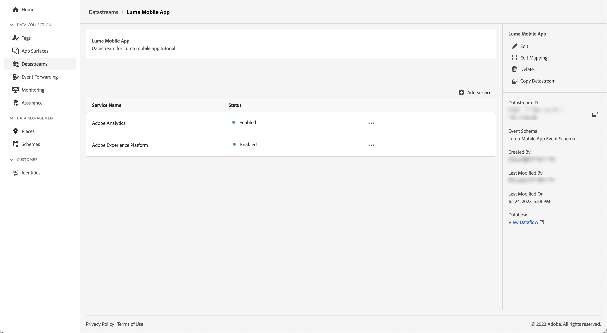
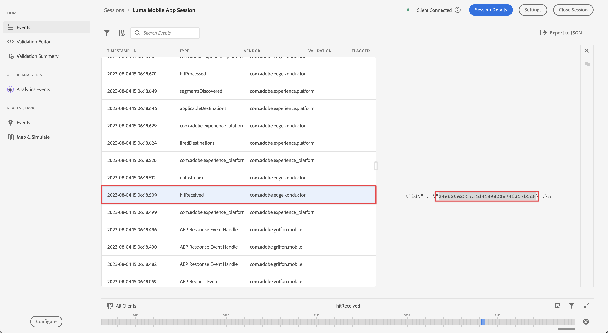
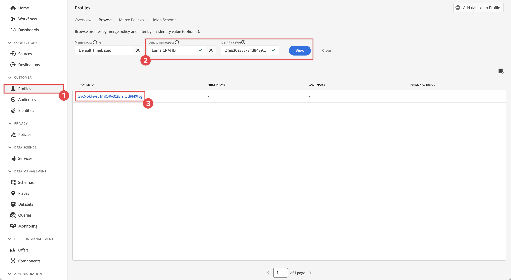
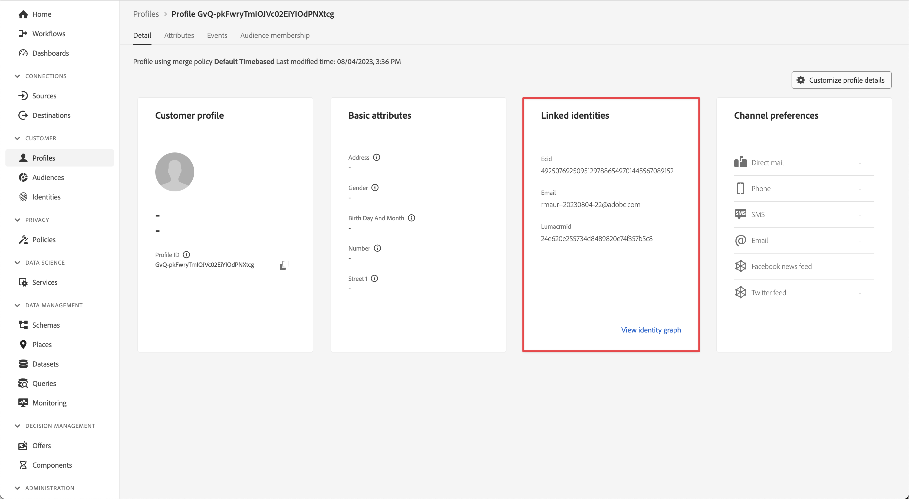

# データをExperience Platformに送信

モバイルアプリデータをAdobe Experience Platformに送信する方法を説明します。

このオプションのレッスンは、Real-time Customer Data Platform(Real-Time CDP)、Journey OptimizerおよびCustomer Journey Analyticsのすべてのお客様に関連しています。 Experience Platformは、Experience Cloud製品の基盤であり、すべてのデータ (AdobeとAdobe以外のデータ ) を堅牢な顧客プロファイルに変換するオープンシステムです。 これらの顧客プロファイルはリアルタイムで更新され、AI に基づくインサイトを使用して、すべてのチャネルにわたって適切なエクスペリエンスを提供できます。

The [イベント](events.md), [ライフサイクル](lifecycle-data.md)、および [id](identity.md) 以前のレッスンで収集し、Platform Edge Network に送信したデータは、Adobe Experience Platformを含む、データストリームで設定されたサービスに転送されます。

## 前提条件

組織がプロビジョニングされ、Adobe Experience Platformに対する権限が付与されている必要があります。

アクセス権がない場合は、 [このレッスンをスキップ](install-sdks.md).

## 学習内容

このレッスンでは、次の操作を実行します。

* Experience Platformデータセットを作成する。
* データをExperience Platformに転送するようにデータストリームを設定します。
* データセット内のデータを検証します。
* リアルタイム顧客プロファイルのスキーマとデータセットを有効にします。
* リアルタイム顧客プロファイルでデータを検証します。
* ID グラフのデータを検証します。

## データセットの作成

Adobe Experience Platformに正常に取り込まれたすべてのデータは、データレイク内にデータセットとして保持されます。 データセットは、スキーマ（列）とフィールド（行）を含むデータ（通常はテーブル）の集まりのストレージと管理の構成体です。 データセットには、保存するデータの様々な側面を記述したメタデータも含まれます。詳しくは、 [ドキュメント](https://experienceleague.adobe.com/docs/experience-platform/catalog/datasets/overview.html?lang=ja) 」を参照してください。

1. アプリからExperience Platformインターフェイスに移動します。  メニューを右上に表示します。

1. 選択 **[!UICONTROL データセット]** をクリックします。

1. 選択  **[!UICONTROL データセットを作成]**.

1. 「**[!UICONTROL スキーマからデータセットを作成]**」をクリックします。
   

1. スキーマを検索します。 例えば、 `Luma Mobile` 」と入力します。
1. スキーマを選択します（例： ）。 **[!DNL Luma Mobile App Event Schema]**.

1. 「**[!UICONTROL 次へ]**」を選択します。
   

1. 次を提供： **[!UICONTROL 名前]**&#x200B;例： `Luma Mobile App Events Dataset` および **[!UICONTROL 説明]**.

1. 「**[!UICONTROL 完了]**」を選択します。
   

## Adobe Experience Platform Datastream サービスの追加

Edge ネットワークからAdobe Experience Platformに XDM データを送信するには、Adobe Experience Platformサービスを、 [データストリームの作成](create-datastream.md).

>[!IMPORTANT]
>
>Adobe Experience Platformサービスは、イベントデータセットを作成した場合にのみ有効にできます。

1. データ収集 UI で、「 」を選択します。 **[!UICONTROL データストリーム]** お使いのデータストリーム。

1. 次に、  **[!UICONTROL サービスを追加]**.

1. [!UICONTROL サービス]リストから&#x200B;**[!UICONTROL Adobe Experience Platform]** を選択します。

1. 切り替えてサービスを有効にする **[!UICONTROL 有効]** オン。

1. を選択します。 **[!UICONTROL イベントデータセット]** 前に作成したもの。例： **[!DNL Luma Mobile App Event Dataset]**.

1. 「**[!UICONTROL 保存]**」を選択します。

   
1. 最終的な設定は次のようになります。

   

## データセット内のデータの検証

データセットを作成し、データストリームを更新してExperience Platformにデータを送信したので、Platform Edge Network に送信されるすべての XDM データが Platform に転送され、データセットに格納されます。

アプリを開き、イベントを追跡している画面に移動します。 また、ライフサイクル指標をトリガーすることもできます。

Platform インターフェイスでデータセットを開きます。 データセットにバッチで送信されたデータが表示されます。 データは通常、15 分ごとにマイクロバッチで届くので、データがすぐには表示されない場合があります。

また、 **[!UICONTROL データセットをプレビュー]** 機能：

データを検証するためのより堅牢なツールは、Platform の [クエリサービス](https://experienceleague.adobe.com/docs/platform-learn/tutorials/queries/explore-data.html?lang=ja).

## リアルタイム顧客プロファイルの有効化

Experience Platformのリアルタイム顧客プロファイルを使用すると、オンライン、オフライン、CRM、サードパーティデータなど、複数のチャネルのデータを組み合わせた、各顧客の全体像を構築できます。 プロファイルを使用すると、個別の顧客データを統合ビューに統合し、顧客のやり取りごとに実用的なタイムスタンプ付きの説明を提供できます。

### スキーマを有効にする

1. スキーマを開きます（例： ）。 **[!DNL Luma Mobile App Event Schema]**.
1. 有効にする **[!UICONTROL プロファイル]**.
1. 選択 **[!UICONTROL このスキーマのデータの identityMap フィールドには、プライマリ ID が含まれます。]** 」と入力します。
1. **[!UICONTROL スキーマを保存します。]**

   

### データセットの有効化

1. データセットを開きます（例： ）。 **[!DNL Luma Mobile App Event Dataset]**.
1. 有効にする **[!UICONTROL プロファイル]**.

   

### プロファイル内のデータの検証

アプリを開き、追跡イベントの画面に移動します（例：Luma アプリにログインして購入）。

アシュランスを使用して、identityMap に渡された ID（Email、lumaCrmId または ECID）の 1 つ、例えば CRM ID を検索します。

Platform インターフェイスで、

1. に移動します。 **[!UICONTROL プロファイル]**&#x200B;をクリックし、次を選択します。 **[!UICONTROL 参照]** 上部のバーから。
1. 取得した ID の詳細（例： ）を指定します。 `Luma CRM ID` 対象： **[!UICONTROL ID 名前空間]** にコピーした値 **[!UICONTROL ID 値]**. 次に、 **[!UICONTROL 表示]**.
1. 詳細を表示するには、プロファイルを選択します。

次の日： **[!UICONTROL 詳細]** 画面には、 **[!UICONTROL **&#x200B;リンクされた ID **]**:

次の日： **[!UICONTROL イベント]**&#x200B;を使用すると、このユーザーのモバイルアプリ実装から収集されたイベントを表示できます。

プロファイルの詳細画面で、次の操作を実行します。

1. ID グラフを表示するには、リンクをクリックするか、 **[!UICONTROL ID]**&#x200B;を選択し、「 **[!UICONTROL ID グラフ]** 上部のバーから。
1. ID 値を検索するには、 `Luma CRM ID` として **[!UICONTROL ID 名前空間]** をコピーし、 **[!UICONTROL ID 値]**. 次に、 **[!UICONTROL 表示]**.

   このビジュアライゼーションは、プロファイル内でリンクされているすべての ID とその接触チャネルを表示します。 以下に、この Mobile SDK チュートリアル（データソース 2）と [Web SDK チュートリアル](https://experienceleague.adobe.com/docs/platform-learn/implement-web-sdk/overview.html?lang=ja) （データソース 1）:

   

## 次の手順

マーケターや分析は、Experience Platformで取り込まれたデータを使用して、さらに多くのことを実行できます。Customer Journey Analyticsでの分析やReal-time Customer Data Platformでのセグメントの作成などです。 スタートは好いぞ！

>[!SUCCESS]
>
>これで、Edge ネットワークだけでなくAdobe Experience Platformにもデータを送信するアプリを設定しました。 Adobe Experience Platform Mobile SDK の学習に時間を割いていただき、ありがとうございます。 ご質問がある場合、一般的なフィードバックを共有する場合、または今後のコンテンツに関する提案がある場合は、このドキュメントで共有します [Experience Leagueコミュニティディスカッション投稿](https://experienceleaguecommunities.adobe.com/t5/adobe-experience-platform-data/tutorial-discussion-implement-adobe-experience-cloud-in-mobile/td-p/443796).

次へ： **[プッシュ通知の作成と送信](journey-optimizer-push.md)**
