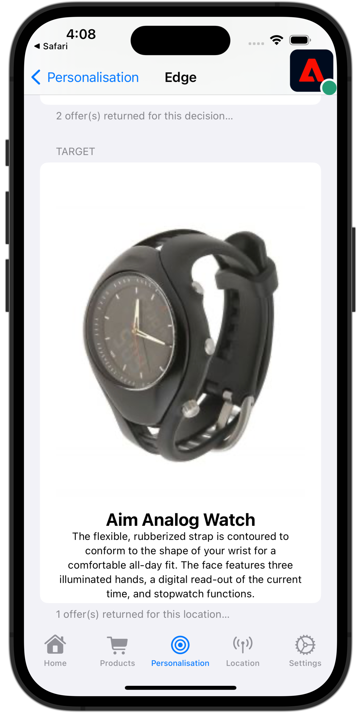

# Target での A/B テストの実行

Platform Mobile SDK およびAdobe Targetを使用して、モバイルアプリで A/B テストを実行する方法を説明します。

Target は、顧客体験をカスタマイズし、パーソナライズする必要のあるすべてのものを提供します。 Target は、Web サイト、モバイルサイト、アプリ、ソーシャルメディア、その他のデジタルチャネルに関する売上高を最大化するのに役立ちます。 このチュートリアルでは、Target の A/B テスト機能に焦点を当てます。 詳しくは、 [A/B テストの概要](https://experienceleague.adobe.com/docs/target/using/activities/abtest/test-ab.html?lang=en) を参照してください。

Target Premium で A/B テストを実行する前に、適切な設定と統合がおこなわれていることを確認する必要があります。

>[!NOTE]
>
>このレッスンはオプションで、A/B テストの実施を検討しているAdobe Target Premium のユーザーにのみ適用されます。


## 前提条件

* SDK が正常に構築され、インストールされ、設定された状態でアプリが実行されました。
* 権限、適切に設定された役割、ワークスペースおよびプロパティを持つAdobe Target Premium へのアクセス（説明を参照） [ここ](https://experienceleague.adobe.com/docs/target/using/administer/manage-users/enterprise/property-channel.html?lang=ja).
Target Standard も使用できるはずですが、このチュートリアルでは、Target Premium に特有の高度な概念（Target プロパティなど）を使用しています。


## 学習内容

このレッスンでは、次の操作を行います

* Target 統合用に Edge 設定を更新します。
* Journey Optimizer - Decisioning 拡張機能でタグプロパティを更新します。
* 提案イベントをキャプチャするためにスキーマを更新します。
* アシュランスで設定を検証します。
* Target で簡単な A/B テストを作成します。
* Optimizer 拡張機能を含めるようにアプリを更新します。
* アプリに A/B テストを実装します。
* アシュランスで実装を検証します。


## Edge 設定を更新

モバイルアプリから Edge ネットワークに送信されるデータをAdobe Targetに確実に転送するには、Experience Edge の設定を更新する必要があります。

1. データ収集 UI で、「 」を選択します。 **[!UICONTROL データストリーム]**&#x200B;を選択し、例えば、データストリームを選択します。 **[!UICONTROL Luma モバイルアプリ]**.
1. 選択 **[!UICONTROL サービスを追加]** を選択し、 **[!UICONTROL Adobe Target]** から **[!UICONTROL サービス]** リスト。
1. ターゲットを入力 **[!UICONTROL プロパティトークン]** の値を指定します。

   プロパティは、Target UI の **[!UICONTROL 管理]** > **[!UICONTROL プロパティ]**. 選択  をクリックして、使用するプロパティのプロパティトークンを表示します。 プロパティトークンの形式は次のとおりです。 `"at_property": "xxxxxxxx-xxxx-xxxxx-xxxx-xxxxxxxxxxxx"`；値のみを入力する必要があります `xxxxxxxx-xxxx-xxxxx-xxxx-xxxxxxxxxxxx`.

1. 「**[!UICONTROL 保存]**」を選択します。

   


## Adobe Journey Optimizer - Decisioning タグ拡張機能のインストール

1. に移動します。 **[!UICONTROL タグ]** モバイルタグプロパティを見つけて、プロパティを開きます。
1. 選択 **[!UICONTROL 拡張機能]**.
1. 選択 **[!UICONTROL カタログ]**.
1. を検索します。 **[!UICONTROL Adobe Journey Optimizer — 判定]** 拡張子。
1. 拡張機能のインストール. 拡張機能に追加の設定は必要ありません。

   


## スキーマを更新

1. データ収集 UI に移動し、左パネルから「スキーマ」を選択します。
1. 選択 **[!UICONTROL 参照]** 上部のバーから。
1. スキーマを選択して開きます。
1. スキーマエディターで、「 」を選択します。  **[!UICONTROL 追加]** 次の **[!UICONTROL フィールドグループ]**.
1. フィールドグループを追加ダイアログで、を検索します。 `proposition`を選択します。 **[!UICONTROL エクスペリエンスイベント — 提案インタラクション]** を選択し、 **[!UICONTROL フィールドグループを追加]**.
   
1. スキーマに対する変更を保存するには、「 **[!UICONTROL 保存]** .


## アシュランスでの設定の検証

アシュランスで設定を検証するには、次の手順に従います。

1. Assurance UI に移動します。
1. 選択 **[!UICONTROL 設定]** 左側のパネルで、「 」を選択します。  次の **[!UICONTROL 設定の検証]** underthen **[!UICONTROL ADOBE JOURNEY OPTIMIZER DECISIONING]**.
1. 「**[!UICONTROL 保存]**」を選択します。
1. 選択 **[!UICONTROL 設定の検証]** をクリックします。 データストリームの設定と、アプリケーションでの SDK の設定の両方が検証されます。
   

## A/B テストの作成

1. Target UI で、 **[!UICONTROL アクティビティ]** 上部のバーから。
1. 選択 **[!UICONTROL アクティビティを作成]** および **[!UICONTROL A/B テスト]** を選択します。
1. Adobe Analytics の **[!UICONTROL A/B テストアクティビティの作成]** モーダルを選択します。 **[!UICONTROL モバイル]** として **[!UICONTROL タイプ]**」で、 **[!UICONTROL ワークスペースを選択]** リストを開き、プロパティを **[!UICONTROL プロパティを選択]** リスト。
1. 「**[!UICONTROL 作成]**」を選択します。
   

1. Adobe Analytics の **[!UICONTROL 無題のアクティビティ]** 画面、 **[!UICONTROL エクスペリエンス]** 手順：

   1. 入力 `luma-mobileapp-abtest` in **[!UICONTROL 場所を選択]** L**の下[!UICONTROL 場所 1]**.
   1. 選択  次の **[!UICONTROL デフォルトコンテンツ]** を選択し、 **[!UICONTROL JSON オファーを作成]** を選択します。
   1. 次の JSON をにコピーします。 **[!UICONTROL 有効な JSON オブジェクトを入力してください]**.

      ```json
      { 
          "title": "Luma Anaolog Watch",
          "text": "Designed to stand up to your active lifestyle, this women's Luma Analog Watch features a tasteful brushed chrome finish and a stainless steel, water-resistant construction for lasting durability.", 
          "image": "https://luma.enablementadobe.com/content/dam/luma/en/products/gear/watches/Luma_Analog_Watch.jpg" 
      }
      ```

   1. 選択 **[!UICONTROL +エクスペリエンスを追加]**.

      

   1. エクスペリエンス B に対して手順 b と c を繰り返しますが、代わりに次の JSON を使用します。

      ```json
      { 
          "title": "Aim Analog Watch",
          "text": "The flexible, rubberized strap is contoured to conform to the shape of your wrist for a comfortable all-day fit. The face features three illuminated hands, a digital read-out of the current time, and stopwatch functions.", 
          "image": "https://luma.enablementadobe.com/content/dam/luma/en/products/gear/watches/Aim_Watch.jpg" 
      }
      ```

   1. 「**[!UICONTROL 次へ]**」を選択します。

      

1. Adobe Analytics の **[!UICONTROL ターゲット設定]** 手順を実行して、A/B テストの設定を確認します。 デフォルトでは、両方のオファーがすべての訪問者に均等に配分されます。 「**[!UICONTROL 次へ]**」をクリックして続行します。

   

1. Adobe Analytics の **[!UICONTROL 目標と設定]** 手順：

   1. 名称未設定アクティビティの名前をに変更します（例： ）。 `Luma Mobile SDK Tutorial - A/B Test Example`.
   1. を入力します。 **[!UICONTROL 目的]** （例： A/B テスト） `A/B Test for Luma mobile app tutorial`.
   1. 選択 **[!UICONTROL コンバージョン]**, **[!UICONTROL mbox をクリック済み]** （内） **[!UICONTROL 目標指標]** > **[!UICONTROL マイプライマリ目標]** タイル化し、場所 (mbox) 名を入力します。例： `luma-mobileapp-abtest`.
   1. 「**[!UICONTROL 保存して閉じる]**」を選択します。

      

1. 戻る **[!UICONTROL すべてのアクティビティ]** 画面：

   1. 選択  」をクリックします。
   1. 選択  **[!UICONTROL 有効化]** :A/B テストをアクティブ化します。

   


## アプリへの Target の実装

前のレッスンで説明したように、モバイルタグ拡張機能のインストールでは設定のみが提供されます。 次に、Optimize SDK をインストールして登録する必要があります。 これらの手順が明確でない場合は、 [SDK のインストール](install-sdks.md) 」セクションに入力します。

>[!NOTE]
>
>以下を完了した場合、 [SDK のインストール](install-sdks.md) 」セクションに移動した場合は、SDK が既にインストールされているので、手順#7に進むことができます。
>

1. Xcode で、 [AEP 最適化](https://github.com/adobe/aepsdk-messaging-ios.git) は、パッケージの依存関係にパッケージのリストに追加されます。 詳しくは、 [Swift Package Manager](install-sdks.md#swift-package-manager).
1. に移動します。 **[!UICONTROL Luma]** > **[!UICONTROL Luma]** > **[!UICONTROL AppDelegate]**.
1. 確認 `AEPMessaging` は、インポートのリストの一部です。

   `import AEPOptimize`

1. 確認 `Optimize.self` は、登録する拡張機能の配列の一部です。

   ```swift
   let extensions = [
       AEPIdentity.Identity.self,
       Lifecycle.self,
       Signal.self,
       Edge.self,
       AEPEdgeIdentity.Identity.self,
       Consent.self,
       UserProfile.self,
       Places.self,
       Messaging.self,
       Optimize.self,
       Assurance.self
   ]
   ```

1. に移動します。 **[!UICONTROL Luma]** > **[!UICONTROL Luma]** > **[!UICONTROL Utils]** > **[!UICONTROL MobileSDK]** 」をクリックします。 次を検索： ` func updatePropositionAT(ecid: String, location: String) async` 関数に置き換えます。 Inspectを設定するコード
   * XDM 辞書 `xdmData`:A/B テストを提示する必要があるプロファイルを識別する ECID を含み、
   * の `decisionScope`:A/B テストを提示する場所の配列。

   次に、関数は 2 つの API を呼び出します。 [`Optimize.clearCachePropositions`](https://support.apple.com/en-ie/guide/mac-help/mchlp1015/mac)  および [`Optimize.updatePropositions`](https://developer.adobe.com/client-sdks/documentation/adobe-journey-optimizer-decisioning/api-reference/#updatepropositions). これらの関数は、キャッシュされた提案をすべて消去し、このプロファイルの提案を更新します。

1. に移動します。 **[!UICONTROL Luma]** > **[!UICONTROL Luma]** > **[!UICONTROL 件数]** > **[!UICONTROL パーソナライズ]** > **[!UICONTROL TargetOffersView]** 」をクリックします。 次を検索： `func getPropositionAT(location: String) async` 関数を参照し、この関数のコードを調べます。 この関数の最も重要な部分は、  [`Optimize.getPropositions`](https://developer.adobe.com/client-sdks/documentation/adobe-journey-optimizer-decisioning/api-reference/#getpropositions) API 呼び出し (
   * は、決定範囲（A/B テストで定義した場所）に基づいて、現在のプロファイルの提案を取得し、
   * アプリに正しく表示できるコンテンツの結果の折り返しを解除します。

1. まだ **[!UICONTROL TargetOffersView]**、 f を見つけます。`unc updatePropositions(location: String) async` 関数を呼び出し、次のコードを追加します。

   ```swift
       Task {
           await self.updatePropositionAT(
               ecid: currentEcid,
               location: location
           )
       }
       try? await Task.sleep(seconds: 2.0)
       Task {
           await self.getPropositionAT(
               location: location
           )
       }
   ```

   このコードを使用すると、提案を更新し、手順 5 および 6 で説明した関数を使用して結果を取得できます。


## アプリを使用した検証

1. デバイスまたはシミュレーターでアプリを開きます。

1. 次に移動： **[!UICONTROL パーソナライズ]** タブをクリックします。

1. 選択 **[!UICONTROL Edge パーソナライゼーション]**.

1. 下にスクロールすると、A/B テストで定義した 2 つのオファーの 1 つが、 **[!UICONTROL TARGET]** タイル。

   


## アシュランスでの実装の検証

Assurance で A/B テストを検証するには、次の手順に従います。

1. Assurance UI に移動します。
1. 選択 **[!UICONTROL 設定]** 左側のパネルで、「 」を選択します。  次の **[!UICONTROL レビューとシミュレーション]** underthen **[!UICONTROL ADOBE JOURNEY OPTIMIZER DECISIONING]**.
1. 「**[!UICONTROL 保存]**」を選択します。
1. 選択 **[!UICONTROL レビューとシミュレーション]** をクリックします。 データストリームの設定と、アプリケーションでの SDK の設定の両方が検証されます。
1. 選択 **[!UICONTROL リクエスト]** 上部のバーに Target リクエストが表示されます。
   

1. 「シミュレート」タブと「イベントリスト」タブを調べて、Target オファーの設定を確認する機能を確認できます。

## アプリへの実装

これで、A/B テストや他の Target アクティビティ（関連する場合、適用可能な場合）を Luma アプリに追加するためのすべてのツールが揃いました。

>[!SUCCESS]
>
>これで、アプリの A/B テストを有効にし、Adobe TargetとAdobe Experience Platform Mobile SDK 用のAdobe Journey Optimizer - Decisioning 拡張機能を使用して A/B テストの結果を表示するようになりました。<br/>Adobe Experience Platform Mobile SDK の学習に時間を割いていただき、ありがとうございます。 ご質問がある場合、一般的なフィードバックを共有する場合、または今後のコンテンツに関する提案がある場合は、このドキュメントで共有します [Experience Leagueコミュニティディスカッション投稿](https://experienceleaguecommunities.adobe.com/t5/adobe-experience-platform-launch/tutorial-discussion-implement-adobe-experience-cloud-in-mobile/td-p/443796).

次へ： **[まとめと次のステップ](conclusion.md)**
