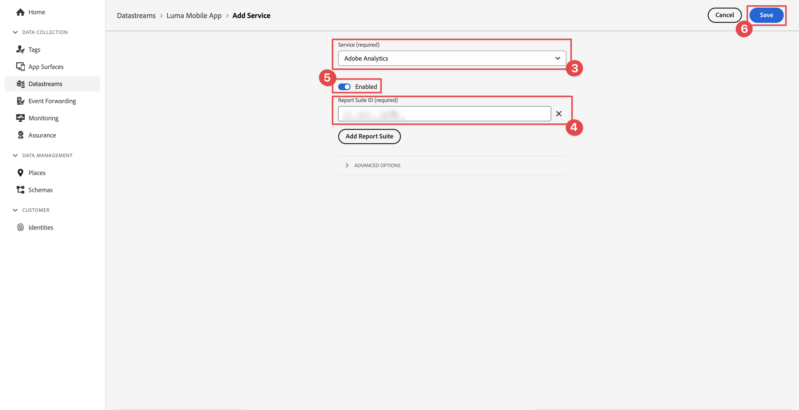

# Analytics データの収集とマッピング

モバイルデータをAdobe Analyticsにマッピングする方法を説明します。

The [イベント](events.md) 以前のレッスンで収集し、Platform Edge Network に送信したデータは、Adobe Analyticsを含む、データストリームで設定されたサービスに転送されます。 データをレポートスイート内の正しい変数にマッピングします。


## 前提条件

* ExperienceEvent 追跡について理解します。
* サンプルアプリに XDM データが正常に送信されました。
* このレッスンで使用できるAdobe Analyticsレポートスイート。

## 学習内容

このレッスンでは、次の操作を実行します。

* データストリームをAdobe Analyticsサービスで設定します。
* Analytics 変数の自動マッピングについて説明します。
* XDM データを Analytics 変数にマッピングする処理ルールを設定します。

## Adobe Analytics Datastream サービスの追加

XDM データを Edge ネットワークからAdobe Analyticsに送信するには、Adobe Analyticsサービスを、 [データストリームの作成](create-datastream.md).

1. データ収集 UI で、「 」を選択します。 **[!UICONTROL データストリーム]** お使いのデータストリーム。

1. 次に、  **[!UICONTROL サービスを追加]**.

1. 追加 **[!UICONTROL Adobe Analytics]** から [!UICONTROL サービス] リスト

1. Adobe Analyticsで使用するレポートスイートの名前を入力します。 **[!UICONTROL レポートスイート ID]**.

1. 切り替えてサービスを有効にする **[!UICONTROL 有効]** オン。

1. 「**[!UICONTROL 保存]**」を選択します。

   


## 自動マッピング

標準 XDM フィールドの多くは、Analytics 変数に自動的にマッピングされます。 完全なリストについては、[こちら](https://experienceleague.adobe.com/docs/analytics/implementation/aep-edge/variable-mapping.html?lang=en)を参照してください。

### 例#1 - s.products

好例は [products 変数](https://experienceleague.adobe.com/docs/analytics/implementation/vars/page-vars/products.html?lang=en) 処理ルールを使用して入力できない XDM 実装を使用すると、必要なデータをすべてに渡すことができます `productListItems` および `s.products` は、Analytics マッピングを使用して自動的に入力されます。

このオブジェクト：

```swift
"productListItems": [
    [
      "name":  "Yoga Mat",
      "SKU": "5829",
      "priceTotal": "49.99",
      "quantity": 1
    ],
    [
      "name":  "Water Bottle",
      "SKU": "9841",
      "priceTotal": "30.00",
      "quantity": 3
    ]
]
```

結果：

```
s.products = ";5829,1,49.99;9841,3,30.00"
```

>[!NOTE]
>
>次の場合 `productListItems[].SKU` および `productListItems[].name` 両方にデータが含まれ、 `productListItems[].SKU` が使用されます。 詳しくは、 [Analytics Experience Edge での Analytics 変数のマッピングAdobe](https://experienceleague.adobe.com/docs/analytics/implementation/aep-edge/variable-mapping.html?lang=en) を参照してください。


### 例#2 - scAdd

よく見ると、すべてのイベントには 2 つのフィールドがあります `value` （必須）および `id` （オプション）。 The `value` フィールドを使用して、イベント数を増分します。 The `id` フィールドはシリアル化に使用されます。

このオブジェクト：

```swift
"commerce" : {
  "productListAdds" : {
    "value" : 1
  }
}
```

結果：

```
s.events = "scAdd"
```

このオブジェクト：

```swift
"commerce" : {
  "productListAdds" : {
    "value" : 1,
    "id": "321435"
  }
}
```

結果：

```
s.events = "scAdd:321435"
```

## アシュランスで検証

の使用 [アシュランス](assurance.md) エクスペリエンスイベントの送信中で、XDM データが正しく、Analytics のマッピングが期待どおりにおこなわれていることを確認できます。

1. 以下を確認します。 [設定手順](assurance.md#connecting-to-a-session) シミュレーターまたはデバイスを Assurance に接続するには、「 」セクションを参照してください。

1. を送信します。 **[!UICONTROL productListAdds]** イベント（製品をバスケットに追加）を追加します。

1. ExperienceEvent ヒットを表示します。

   

1. JSON の XDM の部分を確認します。

   ```json
   "xdm" : {
     "productListItems" : [ {
       "SKU" : "LLWS05.1-XS",
       "name" : "Desiree Fitness Tee",
       "priceTotal" : 24
     } ],
   "timestamp" : "2023-08-04T12:53:37.662Z",
   "eventType" : "commerce.productListAdds",
   "commerce" : {
     "productListAdds" : {
       "value" : 1
     }
   }
   // ...
   ```

1. 以下を確認します。 **[!UICONTROL analytics.mapping]** イベント。

   

Analytics マッピングでは、次の点に注意してください。

* **[!UICONTROL イベント]** が `scAdd` 基準： `commerce.productListAdds`.
* **[!UICONTROL pl]** （products 変数）は、 `productListItems`.
* このイベントには、すべてのコンテキストデータを含む他の興味深い情報が含まれています。


## コンテキストデータを使用したマッピング

Analytics に転送された XDM データは、 [コンテキストデータ](https://experienceleague.adobe.com/docs/mobile-services/ios/getting-started-ios/proc-rules.html?lang=en) 標準フィールドとカスタムフィールドの両方を含む。

コンテキストデータキーは、次の構文に従って生成されます。

```
a.x.[xdm path]
```

以下に例を示します。

```
// Standard Field
a.x.commerce.saveforlaters.value

// Custom Field
a.x._techmarketingdemos.appinformation.appstatedetails.screenname
```

>[!NOTE]
>
>カスタムフィールドは、Experience CloudOrg ID の下に配置されます。
>
>`_techmarketingdemos` は組織の一意の値に置き換えられます。


この XDM コンテキストデータをレポートスイートの Analytics データにマッピングするには、次の操作を実行します。

### フィールドグループを使用

* 次を追加： **[!UICONTROL Adobe Analytics ExperienceEvent Full 拡張機能]** フィールドグループをスキーマに追加します。

  

* Adobe Analytics ExperienceEvent Full Extension フィールドグループに従って、アプリで XDM ペイロードを作成します。これは、 [イベントデータの追跡](events.md) レッスンまたは
* ルールアクションを使用してAdobe Analytics ExperienceEvent Full Extension フィールドグループにデータを添付または変更する、Tags プロパティでルールを作成します。 詳細は、を参照してください。 [SDK イベントへのデータのアタッチ](https://developer.adobe.com/client-sdks/documentation/user-guides/attach-data/) または [SDK イベントのデータを変更する](https://developer.adobe.com/client-sdks/documentation/user-guides/attach-data/).


### 処理ルールの使用

このデータを使用する処理ルールは次のようになります。

* あなた **[!UICONTROL の値を上書き]** 1) **[!UICONTROL アプリの画面名 (eVar2)]** (2) **[!UICONTROL a.x._techmarketingdemo.appinformation.appstatedetails.screenname]** (3) **[!UICONTROL a.x._techmarketingdemo.appinformation.appstatedetails.screenname]** 4) **[!UICONTROL 設定済み]** (5)

* あなた **[!UICONTROL イベントを設定]** (6) **[!UICONTROL ウィッシュリストに追加（イベント 3）]** (7) から **[!UICONTROL a.x.commerce.saveForLaters.value(Context)]** (8) **[!UICONTROL a.x.commerce.saveForLaters.value(Context)]** (9) **[!UICONTROL 設定済み]** (10).


>[!IMPORTANT]
>
>
>自動的にマッピングされた変数の一部は、処理ルールで使用できない場合があります。
>
>
>初めて処理ルールにマッピングする場合、インターフェイスには XDM オブジェクトのコンテキストデータ変数が表示されません。 任意の値を選択する場合は、「保存」をクリックし、再び編集を開始します。 これで、すべての XDM 変数が表示されます。


処理ルールとコンテキストデータに関する追加情報が見つかりました [ここ](https://experienceleague.adobe.com/docs/analytics-learn/tutorials/implementation/implementation-basics/map-contextdata-variables-into-props-and-evars-with-processing-rules.html?lang=en).

>[!TIP]
>
>以前のモバイルアプリの実装とは異なり、ページ/画面ビューと他のイベントとは区別されません。 代わりに、 **[!UICONTROL ページビュー]** 指標を設定して **[!UICONTROL ページ名]** ディメンションが含まれています。 カスタム `screenName` チュートリアルのフィールドでは、画面名を **[!UICONTROL ページ名]** 」と表示されます。


>[!SUCCESS]
>
>Experience Edge XDM オブジェクトをAdobe Analytics変数にマッピングするアプリを設定し、データストリームでAdobe Analyticsサービスを有効にし、必要に応じて処理ルールを使用します。<br/> Adobe Experience Platform Mobile SDK の学習に時間を割いていただき、ありがとうございます。 ご質問がある場合、一般的なフィードバックを共有する場合、または今後のコンテンツに関する提案がある場合は、このドキュメントで共有します [Experience Leagueコミュニティディスカッション投稿](https://experienceleaguecommunities.adobe.com:443/t5/adobe-experience-platform-data/tutorial-discussion-implement-adobe-experience-cloud-in-mobile/td-p/443796).

次へ： **[データをExperience Platformに送信](platform.md)**
