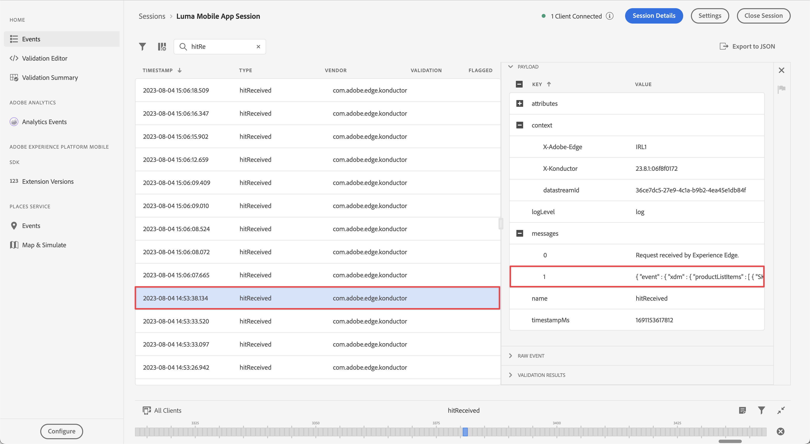
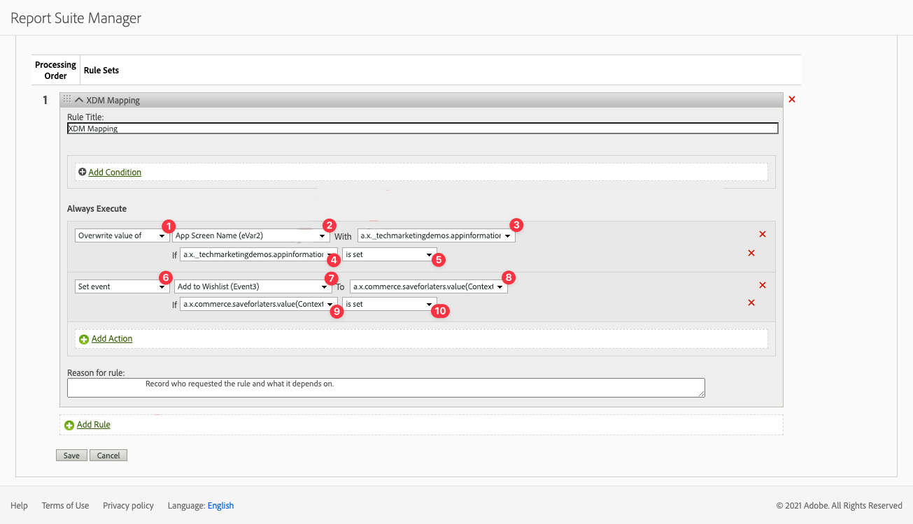

# Analytics データの収集とマッピング

モバイルデータをAdobe Analyticsにマッピングする方法について説明します。

以前のレッスンで収集して Platform Edge Networkに送信した [ イベント ](events.md) データは、Adobe Analyticsを含むデータストリームで設定されたサービスに転送されます。 データをレポートスイートの正しい変数にマッピングします。


## 前提条件

* ExperienceEvent トラッキングの理解。
* サンプルアプリで XDM データを正常に送信しました。
* このレッスンで使用できるAdobe Analytics レポートスイート。

## 学習目標

このレッスンでは、次の操作を行います。

* Adobe Analytics サービスを使用してデータストリームを設定します。
* Analytics 変数の自動マッピングについて説明します。
* XDM データを Analytics 変数にマッピングする処理ルールを設定します。

## Adobe Analytics データストリームサービスを追加

Edge NetworkからAdobe Analyticsに XDM データを送信するには、[ データストリームの作成 ](create-datastream.md) の一部として設定したデータストリームに対して、Adobe Analytics サービスを設定します。

1. データ収集 UI で、「**[!UICONTROL データストリーム]** とデータストリームを選択します。

1. 次に、「**[!UICONTROL サービスを追加]**」を選択します。

1. [!UICONTROL &#x200B; サービス &#x200B;]&#x200B;**リストから**&#x200B;[!UICONTROL &#x200B; Adobe Analytics] を追加します。

1. **[!UICONTROL レポートスイート ID]** で使用する、Adobe Analyticsのレポートスイートの名前を入力します。

1. **[!UICONTROL 有効]** をオンにしてサービスを有効にします。

1. 「**[!UICONTROL 保存]**」を選択します。

   


## 自動マッピング

標準 XDM フィールドの多くは、Analytics 変数に自動的にマッピングされます。 完全なリストについては、[こちら](https://experienceleague.adobe.com/docs/analytics/implementation/aep-edge/variable-mapping.html?lang=en)を参照してください。

### 例#1 - s.products

良い例は、処理ルールを使用して入力できない [products 変数 ](https://experienceleague.adobe.com/docs/analytics/implementation/vars/page-vars/products.html?lang=en) です。 XDM 実装を使用すると、必要なデータをすべて `productListItems` に渡し、Analytics マッピング `s.products` よってデータが自動的に入力されます。

このオブジェクトは、

```swift
"productListItems": [
    [
      "name":  "Yoga Mat",
      "SKU": "5829",
      "priceTotal": "49.99",
      "quantity": 1
    ],
    [
      "name":  "Water Bottle",
      "SKU": "9841",
      "priceTotal": "30.00",
      "quantity": 3
    ]
]
```

結果：

```
s.products = ";5829;1;49.99,9841;3;30.00"
```

>[!NOTE]
>
>`productListItems[].SKU` と `productListItems[].name` の両方にデータが含まれている場合、`productListItems[].SKU` の値が使用されます。 詳しくは、[Adobe Experience Edgeの Analytics 変数のマッピング ](https://experienceleague.adobe.com/docs/analytics/implementation/aep-edge/variable-mapping.html?lang=en) を参照してください。


### 例#2 - scAdd

詳しく見ると、すべてのイベントには（必須）と（オプション）の 2 つのフィールド `value` あ `id` ます。 `value` フィールドは、イベント数を増分するために使用されます。 シリアル化には `id` フィールドを使用します。

このオブジェクトは、

```swift
"commerce" : {
  "productListAdds" : {
    "value" : 1
  }
}
```

結果：

```
s.events = "scAdd"
```

このオブジェクトは、

```swift
"commerce" : {
  "productListAdds" : {
    "value" : 1,
    "id": "321435"
  }
}
```

結果：

```
s.events = "scAdd:321435"
```

## Assurance での検証

[Assuranceを使用すると ](assurance.md) エクスペリエンスイベントを送信しており、XDM データが正しく、Analytics マッピングが期待どおりに行われていることを確認できます。

1. [ 設定手順 ](assurance.md#connecting-to-a-session) の節を参照して、シミュレーターまたはデバイスをAssuranceに接続します。

1. **[!UICONTROL productListAdds]** イベントを送信します（バスケットに製品を追加します）。

1. ExperienceEvent ヒットを表示します。

   

1. JSON の XDM 部分を確認します。

   ```json
   "xdm" : {
     "productListItems" : [ {
       "SKU" : "LLWS05.1-XS",
       "name" : "Desiree Fitness Tee",
       "priceTotal" : 24
     } ],
   "timestamp" : "2023-08-04T12:53:37.662Z",
   "eventType" : "commerce.productListAdds",
   "commerce" : {
     "productListAdds" : {
       "value" : 1
     }
   }
   // ...
   ```

1. **[!UICONTROL analytics.mapping]** イベントを確認します。

   

Analytics マッピングには、以下のことに注意してください。

* **[!UICONTROL イベント]** には、`commerce.productListAdds` に基づく `scAdd` が入力されます。
* **[!UICONTROL pl]** （products 変数）には、`productListItems` に基づいて連結された値が入力されます。
* このイベントには、すべてのコンテキストデータを含む他の興味深い情報があります。


## コンテキストデータを使用したマッピング

Analytics に転送された XDM データは、標準フィールドとカスタムフィールドの両方を含む [ コンテキストデータ ](https://experienceleague.adobe.com/docs/mobile-services/ios/getting-started-ios/proc-rules.html?lang=en) に変換されます。

コンテキストデータキーは、次の構文に従って作成されます。

```
a.x.[xdm path]
```

例：

```
// Standard Field
a.x.commerce.saveforlaters.value

// Custom Field
a.x._techmarketingdemos.appinformation.appstatedetails.screenname
```

>[!NOTE]
>
>カスタムフィールドは、Experience Cloud組織識別子の下に配置されます。
>
>`_techmarketingdemos` は組織の一意の値に置き換えられます。


この XDM コンテキストデータをレポートスイートの Analytics データにマッピングするには、次の操作を実行します。

### フィールドグループの使用

* **[!UICONTROL Adobe Analytics ExperienceEvent Full Extension]** フィールドグループをスキーマに追加します。

  

* [ イベントデータを追跡 ](events.md) レッスン、またはで行ったのと同様に、Adobe Analytics ExperienceEvent フル拡張機能フィールドグループに従って、アプリに XDM ペイロードを作成します
* ルールアクションを使用してAdobe Analytics ExperienceEvent 完全拡張フィールドグループにデータを添付または変更するルールを、タグプロパティ内に作成します。 詳しくは、[SDK イベントへのデータの添付 ](https://developer.adobe.com/client-sdks/documentation/user-guides/attach-data/) または [SDK イベントでのデータの変更 ](https://developer.adobe.com/client-sdks/documentation/user-guides/attach-data/) を参照してください。


### マーチャンダイジング eVar

`&&products = ...;evar1=red;event10=50,...;evar1=blue;event10=60` などの製品の色を取得するなど、Analytics 設定で [ マーチャンダイジング eVar](https://experienceleague.adobe.com/docs/analytics/admin/admin-tools/manage-report-suites/edit-report-suite/conversion-variables/merchandising-evars.html?lang=en) を使用している場合は、[ イベントデータの追跡 ](events.md) で定義した XDM ペイロードを拡張して、そのマーチャンダイジング情報を取得する必要があります。

* JSON の場合：

  ```json
  {
    "productListItems": [
        {
            "SKU": "LLWS05.1-XS",
            "name": "Desiree Fitness Tee",
            "priceTotal": 24,
            "_experience": {
                "analytics": {
                    "events1to100": {
                        "event10": {
                            "value": 50
                        }
                    },
                    "customDimensions": {
                        "eVars": {
                            "eVar1": "red",
                        }
                    }
                }
            }
        }
    ],
    "eventType": "commerce.productListAdds",
    "commerce": {
        "productListAdds": {
            "value": 1
        }
    }
  }
  ```

* コード内：

  ```swift
  var xdmData: [String: Any] = [
    "productListItems": [
      [
        "name":  productName,
        "SKU": sku,
        "priceTotal": priceString,
        "_experience" : [
          "analytics": [
            "events1to100": [
              "event10": [
                "value:": value
              ]
            ],
            "customDimensions": [
              "eVars": [
                "eVar1": color
              ]
            ]
          ]
        ]
      ]
    ],
    "eventType": "commerce.productViews",
    "commerce": [
      "productViews": [
        "value": 1
      ]
    ]
  ]
  ```


### 処理ルールの使用

このデータを使用した処理ルールは、次のようになります。

* **[!UICONTROL a.x._techmarketingdemo.appinformation.appstatedetails.screenname]** （4） **[!UICONTROL が設定されている場合、（1）]** アプリ画面名（eVar2） **[!UICONTROL 2）**&#x200B;[!UICONTROL &#x200B; アプリ画面名を上書きします &#x200B;]&#x200B;**（3）**&#x200B;**5]**。

* **[!UICONTROL a.x.commerce.saveForLaters.value （コンテキスト）]** （9） **[!UICONTROL が設定されている場合は、（イベント]** （6） **[!UICONTROL ウィッシュリストに追加（イベント 3）]** （7）を **[!UICONTROL a.x.commerce.saveForLaters.value （コンテキスト）]** （8）に **[!UICONTROL 追加]** （10）します。



>[!IMPORTANT]
>
>
>自動的にマッピングされた変数の一部は、処理ルールで使用できない場合があります。
>
>
>処理ルールに初めてマッピングする場合、インターフェイスには XDM オブジェクトからのコンテキストデータ変数は表示されません。 この問題を修正するには、任意の値を選択し、保存してから、編集に戻ります。 すべての XDM 変数が表示されます。


処理ルールとコンテキストデータについて詳しくは、[ こちら ](https://experienceleague.adobe.com/docs/analytics-learn/tutorials/implementation/implementation-basics/map-contextdata-variables-into-props-and-evars-with-processing-rules.html?lang=en) を参照してください。

>[!TIP]
>
>以前のモバイルアプリ実装とは異なり、ページ/画面ビューと他のイベントの区別はありません。 代わりに、処理ルールで **[!UICONTROL ページ名]** ディメンションを設定して、**[!UICONTROL ページビュー]** 指標を増分できます。 このチュートリアルではカスタム `screenName` フィールドを収集しているので、処理ルールで画面名を **[!UICONTROL ページ名]** にマッピングすることを強くお勧めします。

## Analytics モバイル拡張機能からの移行

[Adobe Analytics モバイル拡張機能を使用してモバイルアプリケーションを開発した場合は ](https://developer.adobe.com/client-sdks/solution/adobe-analytics/#add-analytics-to-your-application) [`MobileCore.trackAction`](https://developer.adobe.com/client-sdks/home/base/mobile-core/api-reference/#trackaction) および [`MobileCore.trackState`](https://developer.adobe.com/client-sdks/home/base/mobile-core/api-reference/#trackstate) の API 呼び出しを使用している可能性が最も高くなります。

推奨Edge Networkを使用して移行する場合は、次の選択肢があります。

* [ イベントデータのトラッキング ](events.md) 方法のレッスンで示すように [&#128279;](configure-tags.md#extension-configuration)Edge Network拡張機能を実装し、[`Edge.sendEvent`](https://developer.adobe.com/client-sdks/edge/edge-network/api-reference/#sendevent) API を使用します。 このチュートリアルでは、この実装に焦点を当てています。
* [Edge Bridge拡張機能 ](https://developer.adobe.com/client-sdks/solution/adobe-analytics/migrate-to-edge-network/#implement-the-edge-bridge-extension) を実装し、[`MobileCore.trackAction`](https://developer.adobe.com/client-sdks/home/base/mobile-core/api-reference/#trackaction) および [`MobileCore.trackState`](https://developer.adobe.com/client-sdks/home/base/mobile-core/api-reference/#trackstate) API 呼び出しを引き続き使用します。 詳細と別のチュートリアルについては、[Edge Bridge拡張機能の実装 ](https://developer.adobe.com/client-sdks/solution/adobe-analytics/migrate-to-edge-network/#implement-the-edge-bridge-extension) を参照してください。


>[!SUCCESS]
>
>Experience Edge XDM オブジェクトをAdobe Analytics変数にマッピングするようにアプリを設定し、データストリームでAdobe Analytics サービスを有効にし、必要に応じて処理ルールを使用します。<br/> Adobe Experience Platform Mobile SDK の学習に時間を費やしていただき、ありがとうございます。 ご不明な点がある場合や、一般的なフィードバックをお寄せになる場合、または今後のコンテンツに関するご提案がある場合は、この [Experience League コミュニティ ディスカッションの投稿 ](https://experienceleaguecommunities.adobe.com:443/t5/adobe-experience-platform-data/tutorial-discussion-implement-adobe-experience-cloud-in-mobile/td-p/443796) でお知らせください。

次のトピック：**[Experience Platformへのデータの送信](platform.md)**
