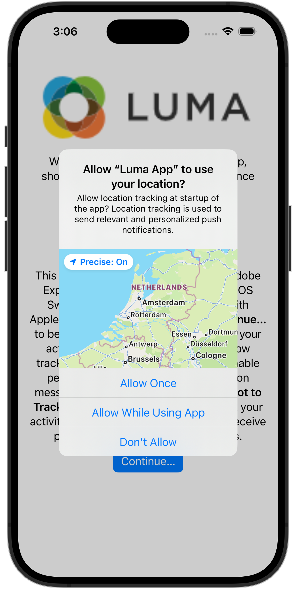

# Assuranceの設定

モバイルアプリでAdobe Experience Platform Assuranceを設定する方法を説明します。

Assurance（旧称：プロジェクトグリフォン）は、モバイルアプリでデータを収集したりエクスペリエンスを提供したりする方法の検査、配達確認、シミュレーションおよび検証に役立つように設計されています。

Assuranceは、Adobe Experience Platform Mobile SDKで生成された生のSDK イベントを調べるのに役立ちます。 SDKで収集されたすべてのイベントは、閲覧できます。 SDK イベントは、時間順に並べ替えられたリストビューに読み込まれます。 各イベントには、詳細を提供する詳細ビューがあります。 SDK設定、データ要素、共有状態、SDK拡張機能の各バージョンを参照するための追加のビューも提供されます。 [0&rbrace;Assurance&rbrace; について詳しくは、製品ドキュメントを参照してください。](https://experienceleague.adobe.com/ja/docs/experience-platform/assurance/home)


## 前提条件

* SDK がインストールおよび設定された状態で、アプリが正常にセットアップされました。

## 学習目標

このレッスンでは、次の操作を行います。

* 組織がアクセス権を持っていることを確認します（持っていない場合はリクエストします）。
* ベース URL を設定します。
* iOS固有の必須コードを追加します。
* セッションに接続します。

## アクセスを確認

組織がAssuranceにアクセスできることを確認します。 ユーザーとして、Adobe Experience Platformのプロファイルに追加される必要があります。 詳しくは、Assurance ガイドの [&#x200B; ユーザーアクセス &#x200B;](https://experienceleague.adobe.com/ja/docs/experience-platform/assurance/user-access) を参照してください。

## 実装方法

Assuranceをアプリに実装するには：

>[!BEGINTABS]

>[!TAB iOS]

iOSでアプリケーションのAssurance セッションを開始するには、[0&rbrace;SDKの一般的なインストール &rbrace; に加えて、次のコードが必要です。](install-sdks.md)

1. Xcode のプロジェクトナビゲーターで **[!DNL Luma]** > **[!DNL Luma]** > **[!UICONTROL SceneDelegate]** に移動します。

1. 次のコードを `func scene(_ scene: UIScene, openURLContexts URLContexts: Set<UIOpenURLContext>` に追加します。

   ```swift
   // Called when the app in background is opened with a deep link.
   if let deepLinkURL = URLContexts.first?.url {
       // Start the Assurance session
       Assurance.startSession(url: deepLinkURL)
   }
   ```

   このコードは、アプリがバックグラウンドにあり、ディープリンクを使用して開かれたときに、アシュランスセッションを開始します。

>[!TAB Android]

AndroidでアプリケーションのAssurance セッションを開始するには、[0&rbrace;SDKの一般的なインストール &rbrace; に加えて、次のコードが必要です。](install-sdks.md)

1. Android Studio の **[!UICONTROL Android]** ビューで、**[!UICONTROL app]**/**[!UICONTROL kotlin+java]**/**[!UICONTROL com.adobe.luma.tutorial.android]**/**[!UICONTROL LumaApplication]** に移動します。

1. 次のコードを `fun handleDeeplink(deeplink: String?)` に追加します。

   ```kotlin
   // Called when the app in background is opened with a deep link.
   if (deeplink.isNullOrEmpty()) {
      Log.w("Luma", "Deeplink is null or empty")
      return
   }
   
   Log.i("Luma", "Handling deeplink: $deeplink")
   Assurance.startSession(deeplink)
   ```

   このコードは、アプリがバックグラウンドにあり、ディープリンクを使用して開かれたときに、アシュランスセッションを開始します。

>[!ENDTABS]


詳しくは、[Assurance API リファレンス &#x200B;](https://developer.adobe.com/client-sdks/documentation/platform-assurance-sdk/api-reference/){target="_blank"} を参照してください。


## バンドル識別子の定義

アプリに一意のバンドル ID を指定する必要があります。

>[!BEGINTABS]

>[!TAB iOS]

1. Xcode でプロジェクトを開きます。
1. プロジェクト ナビゲータで [**[!DNL Luma]**] を選択します。
1. **[!DNL Luma]** ターゲットを選択します。
1. 「**署名と機能**」タブを選択します。
1. **[!UICONTROL バンドル識別子]** を定義します。

各バンドル ID は一意である必要があるので、_unique_ バンドル ID を使用し、`com.adobe.luma.tutorial.swiftui` バンドル ID を置き換えてください。 通常は、バンドル ID 文字列（`com.organization.brand.uniqueidentifier` など）に逆 DNS 形式を使用します。 たとえば、このチュートリアルの完成バージョンでは `com.adobe.luma.tutorial.swiftui` を使用します。

{zoomable="yes"}

>[!TAB Android]

1. Android Studio でプロジェクトを開きます。
1. ナビゲーターで **[!UICONTROL build.gradle.kts （Module :app）]** を選択します。
1. 必ず _unique_ バンドル ID を使用し、`com.adobe.luma.tutorial.android` の `namespace` の `android` 値を
1. 必ず、同じ _一意の_ バンドル ID を使用し、`com.adobe.luma.tutorial.android` の `applicationId` の `defaultConfig` の `android` を置き換えてください

通常は、バンドル ID 文字列（`com.organization.brand.uniqueidentifier` など）に逆 DNS 形式を使用します。 たとえば、このチュートリアルの完成バージョンでは `com.adobe.luma.tutorial.android` を使用します。

{zoomable="yes"}{zoomable="yes"}

>[!ENDTABS]


## ベース URL の設定

ディープリンクが確実に機能するようにベース URL を設定する必要があります。

>[!BEGINTABS]

>[!TAB iOS]

1. Xcode のプロジェクトに移動します。
1. プロジェクト ナビゲータで [**[!DNL Luma]**] を選択します。
1. **[!DNL Luma]** ターゲットを選択します。
1. 「**情報**」タブを選択します。
1. ベース URL を追加するには、下にスクロールして **URL タイプ** を表示し、「**+**」ボタンを選択します。
1. **識別子** を任意のバンドル識別子に設定し、任意の **URL スキーム** を設定します。

   {zoomable="yes"}

各バンドル ID は一意である必要があるので、_unique_ バンドル ID を使用し、`com.adobe.luma.tutorial.swiftui` バンドル ID を置き換えてください。 通常は、バンドル ID 文字列（`com.organization.brand.uniqueidentifier` など）に逆 DNS 形式を使用します。 [&#x200B; バンドル識別子の定義 &#x200B;](#define-bundle-identifier) で使用したのと同じバンドル識別子を使用できます。<br/> 同様に、一意の URL スキームを使用し、既に提供されている `lumatutorialswiftui` を一意の URL スキームに置き換えます。

iOSの URL スキームについて詳しくは、[Appleのドキュメント &#x200B;](https://developer.apple.com/documentation/xcode/defining-a-custom-url-scheme-for-your-app){target="_blank"} を参照してください。

Assuranceは、ブラウザーまたは QR コードを使用して URL を開くことで機能します。 この URL は、アプリを開くベース URL で始まり、追加のパラメーターが含まれています。 これらの一意のパラメーターは、セッションへの接続に使用されます。 サンプルアプリでは、ディープリンクは `lumatutorialswiftui://` です。

>[!TAB Android]

1. Android Studio のプロジェクトの **[!UICONTROL 0&rbrace;Android&rbrace; ビューに移動します。]**
1. ナビゲーターで **[!UICONTROL app]**/**[!UICONTROL manifest]**/**[!UICONTROL AndroidManifest.xml]** を選択します。
1. **[!UICONTROL manifest]**/**[!UICONTROL application]**/**[!UICONTROL activity]** XML 要素が次のようになっていることを確認します。

   ```xml
   <activity
      android:name=".MainActivity"
      android:exported="true"
      android:theme="@style/Theme.LumaAndroid">
      <intent-filter>
            <action android:name="android.intent.action.MAIN" />
            <category android:name="android.intent.category.LAUNCHER" />
      </intent-filter>
      <intent-filter
            android:label="@string/app_name">
            <action android:name="android.intent.action.VIEW" />
            <category android:name="android.intent.category.DEFAULT" />
            <category android:name="android.intent.category.BROWSABLE" />
            <data android:scheme="lumatutorialandroid"
               android:host="default" />
      </intent-filter>
   </activity>
   ```

必ず `android:scheme` （例：）を指定します。 `lumatutorialandroid`）と `android:host` （例：`default`）を使用して、ベース URL を定義します。

Androidのディープリンクについて詳しくは、[&#x200B; アプリコンテンツへのディープリンクの作成 &#x200B;](https://developer.apple.com/documentation/xcode/defining-a-custom-url-scheme-for-your-app){target="_blank"} を参照してください。

Assuranceは、ブラウザーまたは QR コードを使用して URL を開くことで機能します。 その URL はベース URL で始まり、アプリが開き、追加のパラメーターが含まれます。 これらの一意のパラメーターは、セッションへの接続に使用されます。  サンプルアプリでは、ディープリンクは `lumatutorialandroid://default` です。

>[!ENDTABS]


## セッションへの接続

Assuranceを使用してセッションに接続できるようになりました。

>[!BEGINTABS]

>[!TAB iOS]

Xcode で：

1.  を使用して、シミュレータまたは Xcode の物理デバイスでアプリを構築または再構築して実行します。

   必要に応じて、特に予期しない結果が発生した場合に、ビルドを *クリーン* する必要がある場合があります。 Xcode **[!UICONTROL 製品]** メニューから「**[!UICONTROL ビルドフォルダーをクリーン]**」を選択します。


1. **[!UICONTROL Luma アプリが場所を使用することを許可する]** ダイアログで、「アプリの使用中に許可 **[!UICONTROL を選択し]** す。

   

1. **[!UICONTROL Luma アプリ」が通知を送信したい]** ダイアログで、「**[!UICONTROL 許可]**」を選択します。

   

1. 「**[!UICONTROL 続行…]**」を選択し、アプリがアクティビティを追跡できるようにします。

   

1. **[!UICONTROL 「Luma アプリ」が他社のアプリや web サイトをまたいだアクティビティを追跡することを許可する」ダイアログで]** 「**[!UICONTROL 許可]**」を選択します。

   

1. 「**[!UICONTROL 続行]**」を選択します。


ブラウザーで以下を実行します。

1. データ収集 UI に移動します。
1. 左パネルから **[!UICONTROL 0&rbrace;Assurance&rbrace; を選択します。]**
1. 「**[!UICONTROL 新規セッションを作成]**」を選択し、「**[!UICONTROL ディープリンク接続]**」オプションを選択します。
1. **[!UICONTROL 開始]** を選択します。
1. **[!UICONTROL などの]** セッション名 `Luma Mobile App Session` と **[!UICONTROL ベース URL]** を指定します。これは、Xcode で入力した URL スキームであり、`://` の後に続きます。例：`lumatutorialswiftui://`
1. 「**[!UICONTROL 次へ]**」を選択します。
   {zoomable="yes"}
1. **[!UICONTROL 新規セッションを作成]** モーダルダイアログで、次の操作を行います。

   物理デバイスを使用している場合：

   * 「**[!UICONTROL QR コードをスキャン]**」を選択します。 アプリを開くには、物理デバイスのカメラを使用して QR コードをスキャンし、リンクをタップします。

     {zoomable="yes"}

   シミュレーターを使用する場合：

   1. **[!UICONTROL リンクをコピー]** を選択します。
   1.  を使用してディープリンクをコピーし、ディープリンクを使用してシミュレーターの Safari でアプリを開きます。
      {zoomable="yes"}

1. アプリが読み込まれると、手順 7 に示すように、PIN を入力するよう求めるモーダルダイアログが表示されます。

   

   PIN を入力し、「**[!UICONTROL 接続]**」を選択します。


1. 接続に成功した場合は、次のように表示されます。
   * アプリの上に浮かぶAssurance アイコン。

     

   * Assurance UI でのExperience Cloudの更新点は次のとおりです。

      1. アプリから発生するエクスペリエンスイベント。
      1. 選択したイベントの詳細。
      1. デバイスとタイムライン。

         {zoomable="yes"}

1. 「**[!UICONTROL 続行]**」を選択して、ホーム画面に移動します。

>[!TAB Android]

Android Studio で以下を行います。

1.  を使用して、シミュレーターまたはAndroid Studio の物理デバイスでアプリを作成または再構築して実行します。

   必要に応じて、特に予期しない結果が発生した場合に、ビルドを *クリーン* する必要がある場合があります。 Android Studio の **[!UICONTROL ビルド]** メニューから **[!UICONTROL プロジェクトをクリーン]** を選択します。


1. **[!UICONTROL Luma Androidが通知を送信することを許可する]** ダイアログで、「**[!UICONTROL 許可]**」を選択します。

   

1. **[!UICONTROL 権限ダイアログを表示]** を選択します。

   

1. **[!UICONTROL Luma Androidがこのデバイスの場所にアクセスすることを許可しますか？]**..

   

   * **[!UICONTROL 正確]** を選択します。
   * 「**[!UICONTROL アプリの使用中]**」を選択します。

1. アプリの紹介画面に戻り、「**[!UICONTROL デバイス設定を開く]**」を選択します。

1. **[!UICONTROL ロケーション権限]** 画面で、「**[!UICONTROL 常に許可]**」を選択します。 次に、「**[!UICONTROL ←]**」を選択して、アプリの紹介画面に戻ります。

   

1. 「**[!UICONTROL 続行]**」を選択して、ホーム画面に移動します。


ブラウザーで以下を実行します。

1. データ収集 UI に移動します。
1. 左パネルから **[!UICONTROL 0&rbrace;Assurance&rbrace; を選択します。]**
1. 「**[!UICONTROL 新規セッションを作成]**」を選択し、「**[!UICONTROL ディープリンク接続]**」オプションを選択します。
1. **[!UICONTROL 開始]** を選択します。
1. **[!UICONTROL などの]** セッション名 `Luma Mobile App Session` と、**[!UICONTROL ベース URL]** を指定します。これは、Android Studio の `android:scheme`AndroidManifest.xml`android:host` で定義した **[!UICONTROL と]** です（`://` で区切ります）。例：`lumatutorialandroid://default`
1. 「**[!UICONTROL 次へ]**」を選択します。
   {zoomable="yes"}

1. **[!UICONTROL 新規セッションを作成]** モーダルダイアログで、次の操作を行います。

   物理デバイスを使用している場合：

   * 「**[!UICONTROL QR コードをスキャン]**」を選択します。 アプリを開くには、物理デバイスのカメラを使用して QR コードをスキャンし、リンクをタップします。

     {zoomable="yes"}

   シミュレーターを使用する場合：

   1. **[!UICONTROL リンクをコピー]** を選択します。
   1.  を使用してディープリンクをコピーし、ディープリンクを使用してシミュレーターのChromeでアプリを開きます。

   {zoomable="yes"}

   Chromeで **Luma Androidを続行** するように求められたら、**続行** を選択します。

1. アプリが読み込まれると、手順 7 に示すように、PIN を入力するよう求めるモーダルダイアログが表示されます。

   

   PIN を入力し、「**[!UICONTROL 接続]**」を選択します。


1. 接続に成功した場合は、次のように表示されます。
   * アプリの上に浮かぶAssurance アイコン。

     

   * Assurance UI でのExperience Cloudの更新点は次のとおりです。

      1. アプリから発生するエクスペリエンスイベント。
      1. 選択したイベントの詳細。
      1. デバイスとタイムライン。

         {zoomable="yes"}

>[!ENDTABS]

課題が発生した場合は、[&#x200B; 技術ドキュメント &#x200B;](https://developer.adobe.com/client-sdks/documentation/platform-assurance-sdk/){target="_blank"} および [&#x200B; 一般ドキュメント &#x200B;](https://experienceleague.adobe.com/ja/docs/experience-platform/assurance/home){target="_blank"} を確認してください。


## 拡張機能の検証

アプリが最新の拡張機能を使用しているかどうかを確認するには：

1. **[!UICONTROL 設定]** を選択します。

1.   の場合は **[!UICONTROL 追加]** を選択します。

1. 「**[!UICONTROL 保存]**」を選択します。

   {zoomable="yes"}

1.  **[!UICONTROL 拡張機能のバージョン]** を選択すると、使用可能な最新の拡張機能と、お使いのバージョンのアプリで使用されている拡張機能の概要が表示されます。

>[!BEGINTABS]

>[!TAB iOS]

{zoomable="yes"}

拡張機能のバージョン（例：**[!UICONTROL Messaging]** および **[!UICONTROL Optimize]**）を更新するには、**[!UICONTROL パッケージの依存関係]** （例：**[!UICONTROL AEPMessaging]**）からパッケージ（拡張機能）を選択し、コンテキストメニューから「**[!UICONTROL パッケージを更新]**」を選択します。 Xcode はパッケージの依存関係を更新します。

>[!TAB Android]

{zoomable="yes"}

古い拡張機能が表示される場合は、[Android Studio のドキュメント &#x200B;](https://developer.android.com/build/agp-upgrade-assistant) でプロジェクトのディペンデンシーモジュールを更新する方法を参照してください。


>[!ENDTABS]

>[!NOTE]
>
>開発環境で拡張機能（パッケージ）を更新したら、現在のセッションを閉じて削除し、[&#x200B; セッションへの接続 &#x200B;](#connecting-to-a-session) および [&#x200B; 拡張機能の検証 &#x200B;](#verify-extensions) のすべての手順を繰り返して、Assuranceが新しいAssurance セッションで正しい拡張機能を適切にレポートしていることを確認します。
>


>[!SUCCESS]
>
>これで、チュートリアルの残りの部分でAssuranceを使用するようにアプリを設定しました。
>
>Adobe Experience Platform Mobile SDKの学習にご協力いただき、ありがとうございます。 ご不明な点がある場合や、一般的なフィードバックをお寄せになる場合、または今後のコンテンツに関するご提案がある場合は、この [Experience League Community Discussion の投稿でお知らせください &#x200B;](https://experienceleaguecommunities.adobe.com/t5/adobe-experience-platform-data/tutorial-discussion-implement-adobe-experience-cloud-in-mobile/td-p/443796?profile.language=ja)


次のトピック：**[同意の実装](consent.md)**
