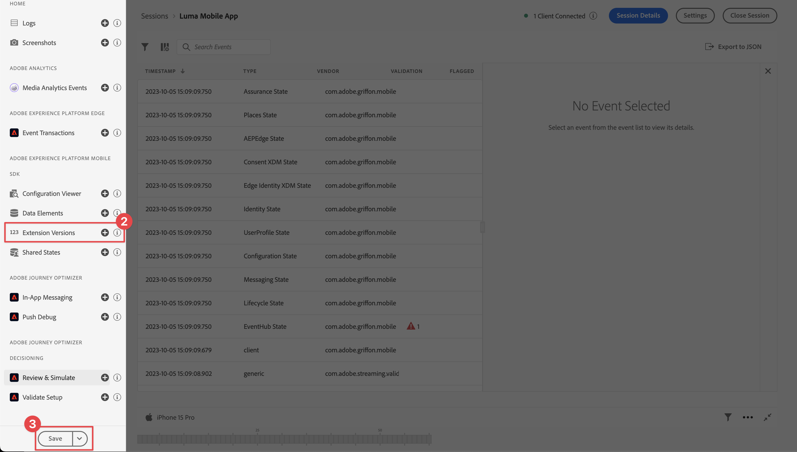

# Assurance の設定

モバイルアプリでAdobe Experience Platform Assurance を設定する方法を説明します。

Assurance （旧称：プロジェクトグリフォン）は、モバイルアプリでデータを収集したりエクスペリエンスを提供したりする方法の検査、配達確認、シミュレートおよび検証を支援することを目的としています。

Assurance は、Adobe Experience Platform Mobile SDK で生成された生の SDK イベントを調べるのに役立ちます。 SDK で収集されたすべてのイベントは、検査に使用できます。 SDK イベントは、時間順に並べ替えられたリスト表示で読み込まれます。 各イベントには、詳細を提供する詳細ビューがあります。 SDK 設定、データ要素、共有状態、SDK 拡張機能のバージョンを参照するための追加のビューも提供されます。 [Assurance](https://experienceleague.adobe.com/docs/experience-platform/assurance/home.html?lang=ja) について詳しくは、製品ドキュメントを参照してください。


## 前提条件

* SDK がインストールおよび設定された状態で、アプリが正常にセットアップされました。

## 学習目標

このレッスンでは、次の操作を行います。

* 組織がアクセス権を持っていることを確認します（持っていない場合はリクエストします）。
* ベース URL を設定します。
* iOS固有の必須コードを追加します。
* セッションに接続します。

## アクセスを確認

組織が Assurance へのアクセス権を持っていることを確認します。 ユーザーとして、Adobe Experience Platformのプロファイルに追加される必要があります。 詳しくは、Assurance ガイドの [ ユーザーアクセス ](https://experienceleague.adobe.com/docs/experience-platform/assurance/user-access.html?lang=ja) を参照してください。

## 実装方法

前のレッスンで完了した [SDK の一般的なインストール ](install-sdks.md) に加えて、iOSでは、アプリの Assurance セッションを開始するために、以下の追加も必要です。

1. Xcode のプロジェクトナビゲーターで **[!DNL Luma]** > **[!DNL Luma]** > **[!UICONTROL SceneDelegate]** に移動します。

1. 次のコードを `func scene(_ scene: UIScene, openURLContexts URLContexts: Set<UIOpenURLContext>` に追加します。

   ```swift
   // Called when the app in background is opened with a deep link.
   if let deepLinkURL = URLContexts.first?.url {
       // Start the Assurance session
       Assurance.startSession(url: deepLinkURL)
   }
   ```

   このコードは、アプリがバックグラウンドにあり、ディープリンクを使用して開かれたときに、アシュランスセッションを開始します。

詳しくは、[ こちら ](https://developer.adobe.com/client-sdks/documentation/platform-assurance-sdk/api-reference/){target="_blank"} を参照してください。


## バンドル識別子の定義

アプリに一意のバンドル ID を指定する必要があります。

1. Xcode でプロジェクトを開きます。
1. プロジェクト ナビゲータで [**[!DNL Luma]**] を選択します。
1. **[!DNL Luma]** ターゲットを選択します。
1. 「**署名と機能**」タブを選択します。
1. **[!UICONTROL バンドル識別子]** を定義します。

   >[!IMPORTANT]
   >
   >各バンドル ID は一意である必要があるので、_unique_ バンドル ID を使用し、`com.adobe.luma.tutorial.swiftui` バンドル ID を置き換えてください。 通常は、バンドル ID 文字列（`com.organization.brand.uniqueidentifier` など）に逆 DNS 形式を使用します。 たとえば、このチュートリアルの完成バージョンでは `com.adobe.luma.tutorial.swiftui` を使用します。


   {zoomable="yes"}


## ベース URL の設定

1. Xcode のプロジェクトに移動します。
1. プロジェクト ナビゲータで [**[!DNL Luma]**] を選択します。
1. **[!DNL Luma]** ターゲットを選択します。
1. 「**情報**」タブを選択します。
1. ベース URL を追加するには、下にスクロールして **URL タイプ** を表示し、「**+**」ボタンを選択します。
1. **識別子** を任意のバンドル識別子に設定し、任意の **URL スキーム** を設定します。

   

   >[!IMPORTANT]
   >
   >各バンドル ID は一意である必要があるので、_unique_ バンドル ID を使用し、`com.adobe.luma.tutorial.swiftui` バンドル ID を置き換えてください。 通常は、バンドル ID 文字列（`com.organization.brand.uniqueidentifier` など）に逆 DNS 形式を使用します。 [ バンドル識別子の定義 ](#define-bundle-identifier) で使用したのと同じバンドル識別子を使用できます。<br/> 同様に、一意の URL スキームを使用し、既に提供されている `lumatutorialswiftui` を一意の URL スキームに置き換えます。

iOSの URL スキームについて詳しくは、[Appleのドキュメント ](https://developer.apple.com/documentation/xcode/defining-a-custom-url-scheme-for-your-app){target="_blank"} を参照してください。

Assurance は、ブラウザーまたは QR コードを介して URL を開くことで機能します。 この URL は、アプリを開くベース URL で始まり、追加のパラメーターが含まれています。 これらの一意のパラメーターは、セッションへの接続に使用されます。


## セッションへの接続

Xcode で：

1.  を使用して、シミュレータまたは Xcode の物理デバイスでアプリを構築または再構築して実行します。

   >[!TIP]
   >
   >必要に応じて、特に予期しない結果が発生した場合に、ビルドを「クリーンアップ」する必要がある場合があります。 これを行うには、Xcode **[!UICONTROL 製品]** メニューから「**[!UICONTROL ビルドフォルダーをクリーンアップ…]**」を選択します。


1. **[!UICONTROL Luma アプリが場所を使用することを許可する]** ダイアログで、「アプリの使用中に許可 **[!UICONTROL を選択し]** す。

   

1. **[!UICONTROL Luma アプリ」が通知を送信したい]** ダイアログで、「**[!UICONTROL 許可]**」を選択します。

   

1. 「**[!UICONTROL 続行…]**」を選択し、アプリがアクティビティを追跡できるようにします。

   

1. **[!UICONTROL 「Luma アプリ」が他社のアプリや web サイトをまたいだアクティビティを追跡することを許可する」ダイアログで]** 「**[!UICONTROL 許可]**」を選択します。

   


ブラウザーで以下を実行します。

1. データ収集 UI に移動します。
1. 左パネルから「**[!UICONTROL Assurance]**」を選択します。
1. **[!UICONTROL セッションを作成]** を選択します。
1. **[!UICONTROL 開始]** を選択します。
1. `Luma Mobile App Session` などの **[!UICONTROL セッション名]** と **[!UICONTROL ベース URL]** を指定します。これは、Xcode で入力した URL スキームであり、`://` の後に続きます。例：`lumatutorialswiftui://`
1. 「**[!UICONTROL 次へ]**」を選択します。
   
1. **[!UICONTROL 新規セッションを作成]** モーダルダイアログで、次の操作を行います。

   物理デバイスを使用している場合：

   * 「**[!UICONTROL QR コードをスキャン]**」を選択します。 アプリを開くには、物理デバイスのカメラを使用して QR コードをスキャンし、リンクをタップします。

     

   シミュレーターを使用する場合：

   1. **[!UICONTROL リンクをコピー]** を選択します。
   1.  を使用してディープリンクをコピーし、ディープリンクを使用してシミュレーターの Safari でアプリを開きます。

      

1. アプリが読み込まれると、手順 7 に示すように、PIN を入力するよう求めるモーダルダイアログが表示されます。

   

   PIN を入力し、「**[!UICONTROL 接続]**」を選択します。


1. 接続に成功した場合は、次のように表示されます。
   * Assurance アイコンがアプリの上に浮かんでいます。

     

   * Assurance UI を使用して行われる次を示すExperience Cloudの更新。

      1. アプリから発生するエクスペリエンスイベント。
      1. 選択したイベントの詳細。
      1. デバイスとタイムライン。

         

課題が発生した場合は、[ 技術ドキュメント ](https://developer.adobe.com/client-sdks/documentation/platform-assurance-sdk/){target="_blank"} および [ 一般ドキュメント ](https://experienceleague.adobe.com/docs/experience-platform/assurance/home.html?lang=ja){target="_blank"} を確認してください。


## 拡張機能の検証

アプリが最新の拡張機能を使用しているかどうかを確認するには：

1. **[!UICONTROL 設定]** を選択します。

1.  **![[!UICONTROL 拡張機能バージョン &#x200B;]](https://spectrum.adobe.com/static/icons/workflow_18/Smock_AddCircle_18_N.svg) の場合は [ 追加]** を選択します。

1. 「**[!UICONTROL 保存]**」を選択します。

   

1.  **[!UICONTROL 拡張機能のバージョン]** を選択すると、使用可能な最新の拡張機能と、お使いのバージョンのアプリで使用されている拡張機能の概要が表示されます。

   

1. 拡張機能のバージョン（例：**[!UICONTROL Messaging]** および **[!UICONTROL Optimize]**）を更新するには、**[!UICONTROL パッケージの依存関係]** （例：**[!UICONTROL AEPMessaging]**）からパッケージ（拡張機能）を選択し、コンテキストメニューから「**[!UICONTROL パッケージを更新]**」を選択します。 Xcode はパッケージの依存関係を更新します。


>[!NOTE]
>
>Xcode で拡張機能（パッケージ）を更新したら、現在のセッションを閉じて削除し、[ セッションへの接続 ](#connecting-to-a-session) および [ 拡張機能の検証 ](#verify-extensions) のすべての手順を繰り返して、Assurance が新しい Assurance セッションで正しい拡張機能を適切に報告していることを確認します。


>[!SUCCESS]
>
>これで、チュートリアルの残りの部分で Assurance を使用するようにアプリを設定しました。
>
>Adobe Experience Platform Mobile SDK の学習に時間を費やしていただき、ありがとうございます。 ご不明な点がある場合や、一般的なフィードバックをお寄せになる場合、または今後のコンテンツに関するご提案がある場合は、この [Experience League コミュニティ ディスカッションの投稿でお知らせください ](https://experienceleaguecommunities.adobe.com/t5/adobe-experience-platform-data/tutorial-discussion-implement-adobe-experience-cloud-in-mobile/td-p/443796?profile.language=ja)


次のトピック：**[同意の実装](consent.md)**
