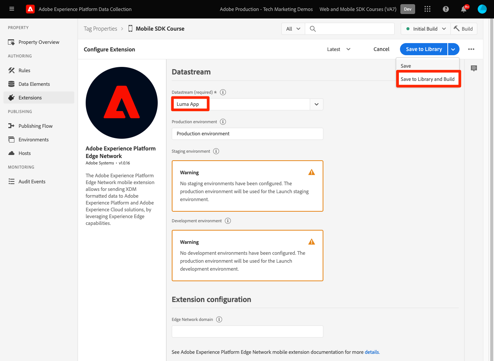

# タグプロパティの設定

タグプロパティを [!UICONTROL データ収集] インターフェイス。

Adobe Experience Platform のタグは、Adobe が提供する次世代のタグ管理機能です。タグを使用すると、関連する顧客体験を強化するために必要なすべての分析、マーケティング、広告などのタグを、簡単にデプロイして管理できます。詳細情報： [タグ](https://experienceleague.adobe.com/docs/experience-platform/tags/home.html?lang=ja) （製品ドキュメント内）。

## 前提条件

このレッスンを完了するには、タグプロパティを作成する権限が必要です。 また、タグの基本的な理解を得るのにも役立ちます。

>[!NOTE]
>
> platform launch（クライアント側）が [タグ](https://experienceleague.adobe.com/docs/experience-platform/tags/home.html?lang=ja)

## 学習内容

このレッスンでは、次の操作を実行します。

* モバイルタグ拡張機能をインストールして設定します。
* SDK のインストール手順を生成します。

## 初期設定

1. 新しいモバイルタグプロパティを作成します。
   1. 内 [データ収集インターフェイス](https://experience.adobe.com/data-collection/){target="_blank"}を選択します。 **[!UICONTROL タグ]** 左のナビゲーション
   1. 選択 **[!UICONTROL 新しいプロパティ]**

      .
   1. の **[!UICONTROL 名前]**&#x200B;を入力して、 `Mobile SDK Course`.
   1. の **[!UICONTROL Platform]**&#x200B;を選択します。 **[!UICONTROL モバイル]**.
   1. 「**[!UICONTROL 保存]**」を選択します。

      

      >[!NOTE]
      >
      > このチュートリアルでおこなう操作など、エッジベースのモバイル SDK 実装のデフォルトの同意設定は、 [!UICONTROL 同意拡張] そして、 [!UICONTROL プライバシー] の設定を使用して、タグプロパティの設定を行います。 このレッスンの後半で、同意拡張機能を追加して設定します。 詳しくは、 [ドキュメント](https://developer.adobe.com/client-sdks/documentation/privacy-and-gdpr/).

1. 新しいプロパティを開く
1. ライブラリの作成:

   1. に移動します。 **[!UICONTROL 公開フロー]** をクリックします。
   1. 選択 **[!UICONTROL ライブラリを追加]**.

      

   1. の **[!UICONTROL 名前]**&#x200B;を入力して、 `Initial Build`.
   1. の **[!UICONTROL 環境]**&#x200B;を選択します。 **[!UICONTROL 開発]**.
   1. 選択  **[!UICONTROL 変更されたリソースをすべて追加]**.
   1. 選択 **[!UICONTROL 開発用に保存およびビルド]**.

      

   1. 最後に、を **[!UICONTROL 作業ライブラリ]**.
      
1. 選択 **[!UICONTROL 拡張機能]**.

   Mobile Core および Profile 拡張機能は、事前にインストールされている必要があります。

1. 選択 **[!UICONTROL カタログ]**.

   

1. 以下を使用： [!UICONTROL 検索] 次の拡張機能をインストールする機能。 これらの拡張機能のどちらにも設定は必要ありません。
   * ID
   * AEP Assurance

## 拡張機能の設定

1. のインストール **同意** 拡張子。

   このチュートリアルの目的で、 **[!UICONTROL 保留中]**. の同意拡張機能について詳しくは、 [ドキュメント](https://developer.adobe.com/client-sdks/documentation/consent-for-edge-network/).

   

1. のインストール **Adobe Experience Platform Edge Network** 拡張子。

   内 **[!UICONTROL Edge 設定]** ドロップダウンから、 [前の手順](create-datastream.md).

1. 選択 **[!UICONTROL ライブラリに保存してビルド]**.

   

## SDK のインストール手順の生成

1. 選択 **[!UICONTROL 環境]**.

1. を選択します。 **[!UICONTROL 開発]** インストールアイコン。

   

1. 選択 **[!UICONTROL iOS]**.

1. 選択 **[!UICONTROL Swift]**.

   

1. インストール手順は、導入の出発点として適しています。

   追加情報を見つけることができます [ここ](https://developer.adobe.com/client-sdks/documentation/getting-started/get-the-sdk/).

   * **[!UICONTROL 環境ファイル ID]**:この一意の ID は開発環境を指します。この値をメモしておきます。 実稼動/ステージング/開発には、すべて異なる ID 値が設定されます。
   * **[!UICONTROL ポッドファイル]**:CocoaPods は、SDK のバージョンとダウンロードの管理に使用されます。 詳しくは、 [ドキュメント](https://cocoapods.org/).
   * **[!UICONTROL 初期化コード]**:このコードブロックは、必要な SDK を読み込んで、起動時に拡張機能を登録する方法を示します。

>[!NOTE]
>インストール手順は、最初の段階と見なされ、最終的なドキュメントではありません。 最新の SDK バージョンおよびコードサンプルは、公式の [ドキュメント](https://developer.adobe.com/client-sdks/documentation/).

## モバイルタグのアーキテクチャ

Web バージョンのタグ（以前の Launch）に詳しい場合は、モバイル上の違いを理解することが重要です。

Web 上では、タグプロパティが JavaScript にレンダリングされ、JavaScript は（通常は）クラウドでホストされます。 この JS ファイルは Web サイトで直接参照されます。

モバイルタグプロパティでは、ルールと設定は、クラウドでホストされる JSON ファイルにレンダリングされます。 この JSON ファイルがダウンロードされ、モバイルアプリの Mobile Core 拡張機能によって読み取られます。 拡張機能は、連携する個別の SDK です。 タグプロパティに拡張機能を追加する場合は、アプリも更新する必要があります。 拡張機能の設定を変更したり、ルールを作成したりすると、更新されたタグライブラリを公開すると、それらの変更がアプリに反映されます。

次へ： **[SDK のインストール](install-sdks.md)**

>[!NOTE]
>
>Adobe Experience Platform Mobile SDK の学習に時間を割いていただき、ありがとうございます。 ご質問がある場合、一般的なフィードバックを共有したい場合、または今後のコンテンツに関する提案がある場合は、こちらで共有してください [Experience Leagueコミュニティディスカッション投稿](https://experienceleaguecommunities.adobe.com/t5/adobe-experience-platform-launch/tutorial-discussion-implement-adobe-experience-cloud-in-mobile/td-p/443796)