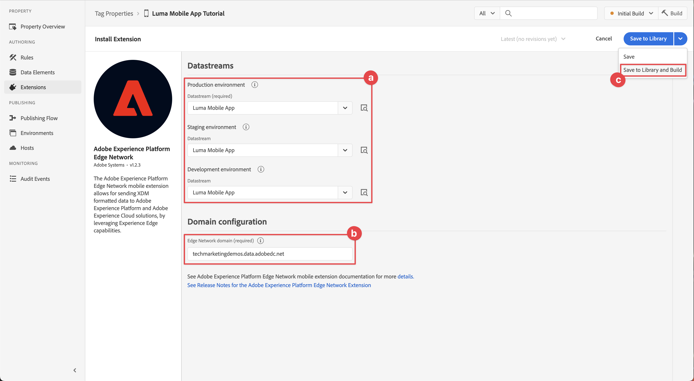

# タグプロパティの設定

タグのプロパティを設定する方法については、 [!UICONTROL データ収集] インターフェイス。

Adobe Experience Platform のタグは、Adobe が提供する次世代のタグ管理機能です。タグは、顧客体験の実現に必要な分析、マーケティングおよび広告のタグをデプロイおよび管理するためのシンプルな手段を提供します。 詳細情報： [タグ](https://experienceleague.adobe.com/docs/experience-platform/tags/home.html?lang=ja) （製品ドキュメント内）。

## 前提条件

このレッスンを完了するには、タグプロパティを作成する権限が必要です。 また、タグの基本的な理解を得るのにも役立ちます。

>[!NOTE]
>
> Platform launch（クライアント側）が [タグ](https://experienceleague.adobe.com/docs/experience-platform/tags/home.html?lang=ja)

## 学習内容

このレッスンでは、次の操作を実行します。

* モバイルタグ拡張機能をインストールして設定します。
* SDK のインストール手順を生成します。

## 初期設定

1. データ収集インターフェイスで新しいモバイルタグプロパティを作成します。
   1. 選択 **[!UICONTROL タグ]** をクリックします。
   1. 選択 **[!UICONTROL 新しいプロパティ]**
      .
   1. の **[!UICONTROL 名前]**，と入力します。 `Luma Mobile App Tutorial`.
   1. の **[!UICONTROL Platform]**&#x200B;を選択します。 **[!UICONTROL モバイル]**.
   1. 選択  **[!UICONTROL 保存]**.

      

      >[!NOTE]
      >
      > このレッスンでおこなう操作は、 [!UICONTROL 同意拡張] そして、 [!UICONTROL プライバシー] の設定を使用して、タグプロパティの設定を行います。 このレッスンの後半で、同意拡張機能を追加して設定します。 詳しくは、 [ドキュメント](https://developer.adobe.com/client-sdks/edge/consent-for-edge-network/).

1. 新しいプロパティを開きます。
1. ライブラリの作成：

   1. に移動します。 **[!UICONTROL 公開フロー]** をクリックします。
   1. 選択 **[!UICONTROL ライブラリを追加]**.

      

   1. の **[!UICONTROL 名前]**，と入力します。 `Initial Build`.
   1. の **[!UICONTROL 環境]**&#x200B;を選択します。 **[!UICONTROL 開発（開発）]**.
   1. 選択   **[!UICONTROL 変更されたリソースをすべて追加]**.
   1. 選択 **[!UICONTROL 開発用に保存およびビルド]**.

      

   1. 最後に、 **[!UICONTROL 初期ビルド]** 作業用ライブラリとして **[!UICONTROL 作業ライブラリを選択]** メニュー。
      
1. 拡張機能を確認する：

   1. 以下を確認します。 **[!UICONTROL 初期ビルド]** はデフォルトのライブラリとして選択されています。

   1. 左パネルで「**[!UICONTROL 拡張機能]**」を選択します。

   1. を選択します。 **[!UICONTROL インストール済み]** タブをクリックします。

      The [!UICONTROL Mobile Core] および [!UICONTROL プロファイル] 拡張機能は、事前にインストールされている必要があります。

      

## 拡張機能の設定

1. 次の場所にいることを確認します。 **[!UICONTROL 拡張機能]** 」をクリックします。

1. 選択 **[!UICONTROL カタログ]**.

   

1. 以下を使用します。  **[!UICONTROL 検索]** を検索する **ID** 拡張子。

   1. `Identity` を検索します。

   2. を選択します。 **[!UICONTROL ID]** 拡張子。

   3. 選択 **[!UICONTROL インストール]**.

      

   この拡張機能には、それ以上の設定は必要ありません。

1. 以下を使用します。  **[!UICONTROL 検索]** 検索してインストールするフィールド **AEP アシュランス** 拡張子。

   この拡張機能には、それ以上の設定は必要ありません。

1. 以下を使用します。  **[!UICONTROL 検索]** 検索してインストールするフィールド **同意** 拡張子。 設定画面で、次の操作を行います。

   1. 選択 **[!UICONTROL 保留中]**. このチュートリアルでは、アプリケーションで同意をさらに管理します。 の同意拡張機能について詳しくは、 [ドキュメント](https://developer.adobe.com/client-sdks/documentation/consent-for-edge-network/).
   1. 選択 **[!UICONTROL ライブラリに保存]**.

      

1. 以下を使用します。  **[!UICONTROL 検索]** 検索してインストールするフィールド **Adobe Experience Platform Edge Network** 拡張子。

   1. In **[!UICONTROL データストリーム]** 「 」を選択します。 **[!UICONTROL Datastream]** 作成した [前の手順](create-datastream.md) 各環境の例 **[!DNL Luma Mobile App]**.

   1. まだ入力されていない場合は、 **[!UICONTROL Edge Network ドメイン]** 範囲 **[!UICONTROL ドメイン設定]**. Edge Network ドメインは組織の名前で、その後にが続きます `data.adobedc.net`例： `techmarketingdemos.data.adobedc.net`.

   1. 次から： **[!UICONTROL ライブラリに保存]** メニュー、選択 **[!UICONTROL ライブラリに保存してビルドする]**.

      

ライブラリは、新しい拡張機能と設定用に構築されています。 正常なビルドは、 ● （内） **[!UICONTROL 初期ビルド]** 」ボタンをクリックします。

## SDK のインストール手順の生成

1. 選択 **[!UICONTROL 環境]** をクリックします。

1. を選択します。 **[!UICONTROL 開発]** インストールアイコン  .

   

1. Adobe Analytics の **[!UICONTROL モバイルインストール手順]** ダイアログで、 **[!UICONTROL iOS]** タブをクリックします。

1. コピー可能  CocoaPods を使用してプロジェクトを設定する手順 CocoaPods は、SDK のバージョンとダウンロードの管理に使用されます。 詳しくは、 [CocoaPods ドキュメント](https://cocoapods.org/). Android™を開発プラットフォームとして使用している場合、Gradle は SDK のバージョン、ダウンロード、依存関係を管理するためのツールです。 詳しくは、 [Gradle ドキュメント](https://gradle.org/)

   インストール手順は、導入の出発点として適しています。 追加情報を見つけることができます [ここ](https://developer.adobe.com/client-sdks/documentation/getting-started/get-the-sdk/).

   >[!INFO]
   >
   >このチュートリアルの残りの部分では、次の操作をおこないます。 **not** CocoaPods の手順を使用しますが、代わりにネイティブの Swift Package Manager(SPM) ベースの設定を使用します。
   >

1. を選択します。 **[!UICONTROL Swift]** 下のタブ **[!UICONTROL 初期化コードの追加]**. このコードブロックは、必要な SDK を読み込んで、起動時に拡張機能を登録する方法を示します。 詳しくは、 [SDK のインストール](install-sdks.md).

1. コピー  の **[!UICONTROL 環境ファイル ID]** 後で必要な場所に保存します。 この一意の ID は開発環境を指します。 各環境（実稼動、ステージング、開発）には、独自の一意の ID 値があります。

   

>[!NOTE]
>
>インストール手順は、最初の段階と見なされ、最終的なドキュメントではありません。 最新の SDK バージョンおよびコードサンプルは、公式の [ドキュメント](https://developer.adobe.com/client-sdks/home/).

## モバイルタグのアーキテクチャ

タグの Web バージョン（以前の Launch）に詳しい方は、モバイル上の違いを理解することが重要です。

* Web 上では、タグプロパティが JavaScript にレンダリングされ、JavaScript は（通常は）クラウドでホストされます。 この JavaScript ファイルが Web サイトで直接参照されます。

* モバイルタグプロパティでは、ルールと設定は、クラウドでホストされる JSON ファイルにレンダリングされます。 この JSON ファイルがダウンロードされ、モバイルアプリの Mobile Core 拡張機能によって読み取られます。 拡張機能は、連携する個別の SDK です。 タグプロパティに拡張機能を追加する場合は、アプリも更新する必要があります。 拡張機能の設定を変更したり、ルールを作成したりすると、更新されたタグライブラリを公開すると、それらの変更がアプリに反映されます。 この柔軟性により、アプリ内のコードを変更してアプリストアを再送信する必要なく、設定 (Adobe Analyticsレポートスイート ID など ) を変更したり、アプリの動作（後のレッスンで確認するように、データ要素とルールを使用）を変更したりできます。

>[!SUCCESS]
>
>これで、このチュートリアルの残りの部分で使用するモバイルタグプロパティが作成されました。
>
>Adobe Experience Platform Mobile SDK の学習に時間を割いていただき、ありがとうございます。 ご質問がある場合、一般的なフィードバックを共有する場合、または今後のコンテンツに関する提案がある場合は、このドキュメントで共有します [Experience Leagueコミュニティディスカッション投稿](https://experienceleaguecommunities.adobe.com/t5/adobe-experience-platform-data/tutorial-discussion-implement-adobe-experience-cloud-in-mobile/td-p/443796)

次へ： **[SDK のインストール](install-sdks.md)**
