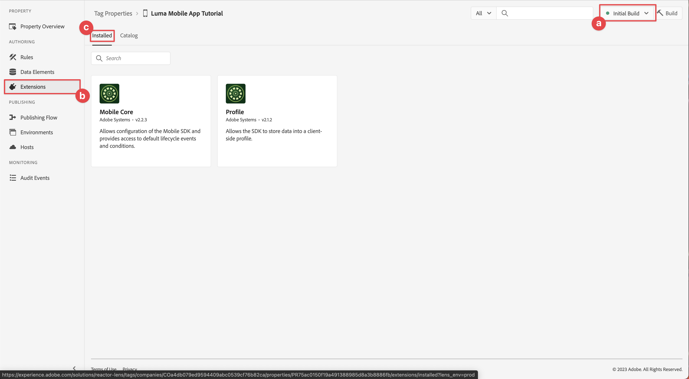

# タグプロパティの設定

[!UICONTROL データ収集]インターフェイスでタグプロパティを設定する方法を説明します。

Adobe Experience Platform のタグは、Adobe が提供する次世代のタグ管理機能です。タグは、適切な顧客体験の実現に必要な分析、マーケティングおよび広告タグをデプロイおよび管理するためのシンプルな手段を提供します。 [ タグ ](https://experienceleague.adobe.com/docs/experience-platform/tags/home.html?lang=ja) について詳しくは、製品ドキュメントを参照してください。

## 前提条件

このレッスンを完了するには、タグ プロパティを作成する権限が必要です。 タグの基本的な理解も役に立ちます。

>[!NOTE]
>
> Platform launch（クライアントサイド）は [ タグ ](https://experienceleague.adobe.com/docs/experience-platform/tags/home.html?lang=ja) になりました

## 学習目標

このレッスンでは、次の操作を行います。

* モバイルタグ拡張機能をインストールして設定します。
* SDK のインストール手順を生成します。

## 初期設定

1. データ収集インターフェイスで新しいモバイルタグプロパティを作成します。
   1. 左側のナビゲーションで「**[!UICONTROL タグ]**」を選択します。
   1. **[!UICONTROL 新規プロパティ]** を選択します。
      。
   1. **[!UICONTROL 名前]** に `Luma Mobile App Tutorial` と入力します。
   1. **[!UICONTROL プラットフォーム]** には、「**[!UICONTROL モバイル]**」を選択します。
   1. **[!UICONTROL 保存]** を選択します。

      

      >[!NOTE]
      >
      > このレッスンでやっていることなど、エッジベースの Mobile SDK 実装のデフォルトの同意設定は、タグプロパティ設定の [!UICONTROL  プライバシー ] 設定ではなく、[!UICONTROL  同意拡張機能 ] から取得されます。 同意拡張機能を追加および設定する方法は、このレッスンの後半で説明します。 詳しくは、[ ドキュメント ](https://developer.adobe.com/client-sdks/edge/consent-for-edge-network/) を参照してください。

1. 新規プロパティを開きます。
1. ライブラリを作成します。

   1. 左側のナビゲーションで **[!UICONTROL 公開フロー]** に移動します。
   1. **[!UICONTROL ライブラリを追加]** を選択します。

      

   1. **[!UICONTROL 名前]** に `Initial Build` と入力します。
   1. 「**[!UICONTROL 環境]**」には、「**[!UICONTROL 開発（開発）]**」を選択します。
   1. **[!UICONTROL 変更されたすべてのリソースを追加]** を選択します。
   1. **[!UICONTROL 開発用に保存およびビルド]** を選択します。

      

   1. 最後に、「**[!UICONTROL 作業ライブラリを選択]** メニューから作業ライブラリとして **[!UICONTROL 初期ビルド]** を選択します。
      
1. 拡張機能を確認：

   1. **[!UICONTROL 初期ビルド]** がデフォルトライブラリとして選択されていることを確認します。

   1. 左パネルで **[!UICONTROL 拡張機能]** を選択します。

   1. 「**[!UICONTROL インストール済み]**」タブを選択します。

      [!UICONTROL Mobile Core] および [!UICONTROL Profile] 拡張機能は、事前にインストールしておく必要があります。

      

## 拡張機能の設定

1. モバイルアプリプロパティ内の **[!UICONTROL 拡張機能]** にいることを確認します。

1. **[!UICONTROL カタログ]** を選択します。

   

1. **[!UICONTROL 検索]** フィールドを使用して、**ID** 拡張機能を検索します。

   1. `Identity` を検索します。

   2. **[!UICONTROL ID]** 拡張機能を選択します。

   3. **[!UICONTROL インストール]** を選択します。

      

   この拡張機能には、それ以上の設定は必要ありません。

1. 「 **[!UICONTROL 検索]**」フィールドを使用し、**AEP Assurance** 拡張機能を検索してインストールします。

   この拡張機能には、それ以上の設定は必要ありません。

1. 「 **[!UICONTROL 検索]**」フィールドを使用し、「**同意** 拡張機能を検索してインストールします。 設定画面で、次の操作を行います。

   1. 「**[!UICONTROL 保留中]**」を選択します。 このチュートリアルでは、アプリケーションで同意をさらに管理します。 同意拡張機能について詳しくは、[ ドキュメント ](https://developer.adobe.com/client-sdks/documentation/consent-for-edge-network/) を参照してください。
   1. **[!UICONTROL ライブラリに保存]** を選択します。

      

1. 「 **[!UICONTROL 検索]**」フィールドを使用して、**Adobe Experience Platform Edge Network** 拡張機能を検索してインストールします。

   1. **[!UICONTROL データストリーム]** で、[ 前の手順 ](create-datastream.md) で作成した **[!UICONTROL データストリーム]** を各環境に対して選択します（例：**[!DNL Luma Mobile App]**）。

   1. まだ入力していない場合は、{Domain Configuration ]**内で]** 0}Edge Networkドメイン **[!UICONTROL を指定します。**[!UICONTROL  Edge Networkドメインは組織の名前で、その後に `data.adobedc.net` が続きます（例：`techmarketingdemos.data.adobedc.net`）。

   1. **[!UICONTROL ライブラリに保存]** メニューから **[!UICONTROL ライブラリとビルドに保存]** を選択します。

      

ライブラリは、新しい拡張機能と設定用に構築されています。 ビルドが成功したことを示す ● が **[!UICONTROL 初期ビルド]** ボタンに表示されます。

## SDK のインストール手順の生成

1. 左パネルから **[!UICONTROL 環境]** を選択します。

1. **[!UICONTROL 開発]** インストールアイコン  を選択します。

   

1. **[!UICONTROL モバイルインストール手順]** ダイアログで、「**[!UICONTROL iOS]**」タブを選択します。

1. CocoaPods を使用してプロジェクトを設定する手順をコピー  できます。 CocoaPods は、SDK のバージョンおよびダウンロードの管理に使用されます。 詳しくは、[CocoaPods のドキュメント ](https://cocoapods.org/) を参照してください。 Android™ を開発プラットフォームとして使用している場合、SDK のバージョン、ダウンロードおよび依存関係を管理するツールは Gradle です。 詳しくは、[Gradle のドキュメント ](https://gradle.org/) を参照してください。

   このインストール手順は、実装の出発点として役立ちます。 追加情報については、[ こちら ](https://developer.adobe.com/client-sdks/documentation/getting-started/get-the-sdk/) を参照してください。

   >[!INFO]
   >
   >このチュートリアルの残りの部分では、CocoaPods 命令ではなく **ネイティブの Swift パッケージマネージャー（SPM）ベースの設定を使用します**。
   >

1. **[!UICONTROL 初期化コードの追加]** の下の **[!UICONTROL Swift]** タブを選択します。 このコードブロックは、必要な SDK を読み込み、起動時に拡張機能を登録する方法を示しています。 詳しくは、「[SDK のインストール ](install-sdks.md)」を参照してください。

1. **[!UICONTROL 環境ファイル ID]** をコピー  し、後で必要に応じて場所に保存します。 この一意の ID は開発環境を指します。 各環境（実稼働、ステージング、開発）には、独自の ID 値があります。

   

>[!NOTE]
>
>インストールの手順は、決定的なドキュメントではなく、出発点と見なす必要があります。 最新の SDK バージョンとコードサンプルについては、公式の [ ドキュメント ](https://developer.adobe.com/client-sdks/home/) を参照してください。

## モバイルタグのアーキテクチャ

Tags （以前の Launch）の web バージョンを熟知している場合は、モバイルでの違いを理解することが重要です。

* Web では、タグプロパティはJavaScriptにレンダリングされ、（通常は）クラウドでホストされます。 そのJavaScript ファイルは web サイト内で直接参照されます。

* モバイルタグプロパティでは、ルールと設定はクラウドでホストされる JSON ファイルにレンダリングされます。 JSON ファイルがダウンロードされ、モバイルアプリの Mobile Core 拡張機能によって読み取られます。 拡張機能は、連携して動作する個別の SDK です。 タグプロパティに拡張機能を追加する場合は、アプリも更新する必要があります。 拡張機能の設定を変更したり、ルールを作成したりすると、更新されたタグライブラリを公開した後で、それらの変更がアプリに反映されます。 この柔軟性により、設定（Adobe Analytics レポートスイート id など）を変更したり、アプリの動作を変更したりできます（後のレッスンで説明するように、データ要素とルールを使用）。アプリのコードを変更したり、アプリストアを再送信したりする必要はありません。

>[!SUCCESS]
>
>これで、このチュートリアルの残りの部分で使用するモバイルタグプロパティが作成されました。
>
>Adobe Experience Platform Mobile SDK の学習に時間を費やしていただき、ありがとうございます。 ご不明な点がある場合や、一般的なフィードバックをお寄せになる場合、または今後のコンテンツに関するご提案がある場合は、この [Experience League コミュニティ ディスカッションの投稿でお知らせください ](https://experienceleaguecommunities.adobe.com/t5/adobe-experience-platform-data/tutorial-discussion-implement-adobe-experience-cloud-in-mobile/td-p/443796)

次のトピック：**[SDK のインストール](install-sdks.md)**
