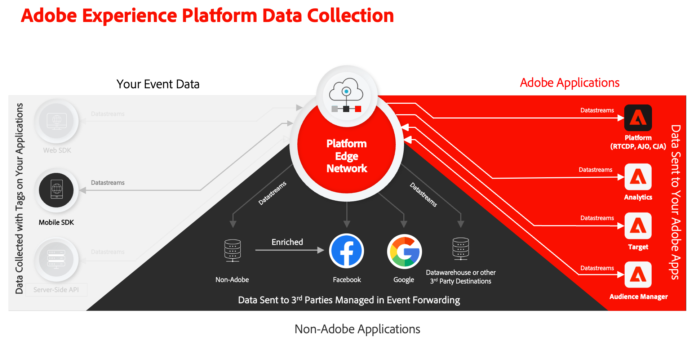

# データストリームの作成

Experience Platform でデータストリームを作成する方法を説明します。

データストリームは、Platform Edge Network上のサーバーサイド設定です。 データストリームは、Platform Edge Networkへの受信データがAdobe Experience Cloud アプリケーションおよびサービスに適切にルーティングされるようにします。 詳しくは、[ ドキュメント ](https://experienceleague.adobe.com/docs/experience-platform/datastreams/overview.html?lang=ja) またはこの [ ビデオ ](https://experienceleague.adobe.com/docs/platform-learn/data-collection/edge-network/configure-datastreams.html?lang=ja) を参照してください。

## 前提条件

データストリームを作成するには、組織がデータ収集インターフェイス（旧称 [!UICONTROL Launch]）でこの機能に対してプロビジョニングされ、データストリームの管理と表示を行うユーザー権限が必要です。

## 学習目標

このレッスンでは、次の操作を行います。

* データストリームを使用するタイミングを把握する。
* データストリームを作成します。
* データストリームを設定します。

## データストリームの作成

データストリームは、[!UICONTROL  データストリーム ] 設定ツールを使用して、[!UICONTROL  データ収集 ] インターフェイスで作成できます。 データストリームを作成するには：

1. データストリームはサンドボックスレベルで定義されているので、正しいExperience Platformのサンドボックスに属していることを確認します。
1. 左パネルで **[!UICONTROL データストリーム]** を選択します。
1. **[!UICONTROL 新規データストリーム]** を選択します。

   

1. **[!UICONTROL 名前]** を入力（例：`Luma Mobile App`）し、**[!UICONTROL 説明]** を入力（例：`Datastream for Luma Mobile App`）します。

   >[!NOTE]
   >
   >最後に、このチュートリアルを 1 つのサンドボックスで複数のユーザーと共に行う場合や、共有アカウントを使用する場合は、命名規則の一部として ID を追加またはプレフィックスすることを検討してください。 例えば、`Luma Mobile App Event Dataset` の代わりに `Luma Mobile App Event Dataset - Joe Smith` を使用します。 [ 概要 ](overview.md) のメモも参照してください。

1. 前のレッスンで作成したスキーマを「**イベントスキーマ**」リストから選択します。
1. 「**[!UICONTROL 保存]**」を選択します。

   

## サービスを追加

このチュートリアルで（オプション） [Analytics](analytics.md) と [Experience Platform](platform.md) のレッスンを進めていくと、データストリームにサービスが追加され、Platform Edge Networkに送信されたデータがこれらのアプリケーションに転送されるようになります。

<!--

### Adobe Analytics

1. Select **[!UICONTROL Add Service]**.

1. Add **[!UICONTROL Adobe Analytics]** from the [!UICONTROL Service] list, 

1. Enter the name of the report site that you want to use in **[!UICONTROL Report Suite ID]**.

1. Enable the service by switching **[!UICONTROL Enabled]** on.

1. Select **[!UICONTROL Save]**.

   

### Adobe Experience Platform

You might also want to enable the Adobe Experience Platform service. 

>[!IMPORTANT]
>
>You can only enable the Adobe Experience Platform service when having created an event dataset. If you don't already have an event dataset created, follow the instructions [here](platform.md).

1. Click  **[!UICONTROL Add Service]** to add another service.

1. Select **[!UICONTROL Adobe Experience Platform]** from the [!UICONTROL Service] list.

1. Enable the service by switching **[!UICONTROL Enabled]** on.

1. Select the **[!UICONTROL Event Dataset]** that you created as part of the [Create a dataset](platform.md#create-a-dataset) instructions, for example **Luma Mobile App Event Dataset**

1. Select **[!UICONTROL Save]**.

   
1. The final configuration should look something like this.
   
   

-->

>[!NOTE]
>
>組織が使用する各サービスを有効にすると、モバイルアプリで収集されたデータをどこでも使用できるようになります。 データストリーム設定について詳しくは、[ こちら ](https://experienceleague.adobe.com/docs/experience-platform/datastreams/overview.html?lang=ja) のドキュメントを参照してください。

独自のアプリに Platform Mobile SDK を実装する場合は、3 つのタグ環境（開発、ステージ、実稼動）にマッピングするために、最終的に 3 つのデータストリームを作成する必要があります。 Adobe Real-time Customer Data PlatformやAdobe Journey Optimizerなどの Platform ベースのアプリケーションで Platform Mobile SDK を使用している場合は、適切なサンドボックスでこれらのデータストリームを作成する必要があります。

>[!SUCCESS]
>
>これで、チュートリアルの残りの部分で使用するデータストリームが作成されました。
>
>Adobe Experience Platform Mobile SDK の学習に時間を費やしていただき、ありがとうございます。 ご不明な点がある場合や、一般的なフィードバックをお寄せになる場合、または今後のコンテンツに関するご提案がある場合は、この [Experience League コミュニティ ディスカッションの投稿でお知らせください ](https://experienceleaguecommunities.adobe.com/t5/adobe-experience-platform-data/tutorial-discussion-implement-adobe-experience-cloud-in-mobile/td-p/443796)

次のトピック：**[タグプロパティの設定](configure-tags.md)**
