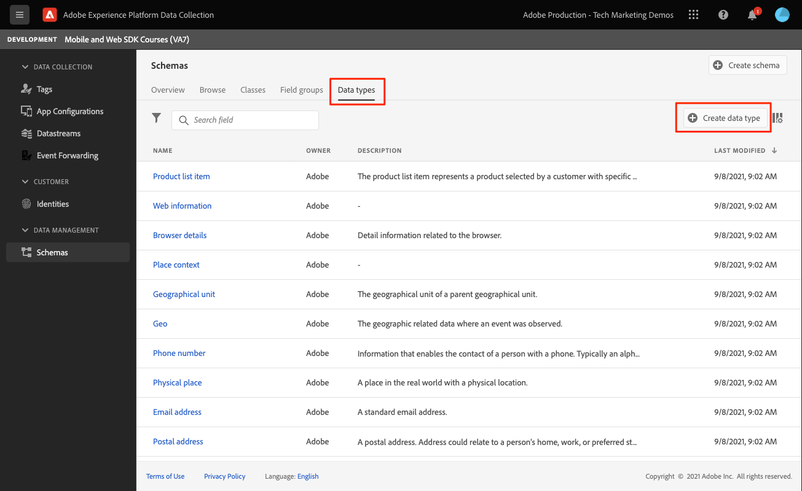

# XDM スキーマの作成

モバイルアプリイベント用の XDM スキーマを作成する方法を説明します。

標準化と相互運用性は、Adobe Experience Platform の背後にある重要な概念です。アドビが推進するエクスペリエンスデータモデル（XDM）は、顧客体験データを標準化し、顧客体験管理のスキーマを定義する取り組みです。

## XDM スキーマとは

XDM はパブリックに文書化された仕様であり、デジタルエクスペリエンスのパワーを向上させるために設計されています。任意のアプリケーションが Platform サービスと通信するための共通の構造と定義を提供します。 XDM 標準に準拠することで、すべての顧客体験データを共通の表現に組み込み、より迅速かつ統合的な方法でインサイトを得ることができます。顧客の行動から貴重なインサイトを得たり、セグメントを使用して顧客のオーディエンスを定義したり、パーソナライゼーションを目的として顧客属性を表すことができます。

Experience Platform では、スキーマを使用して、一貫性のある再利用可能な方法でデータの構造を記述します。システムをまたいで一貫したデータを定義することで、意味を保有しやすくなり、データから価値を得ることができます。

データを Platform に取り込む前に、スキーマを構成して、データの構造を記述し、各フィールドに含めることができるデータの種類を制限する必要があります。スキーマは、基本クラスと 0 個以上のスキーマフィールドグループで構成されます。

デザインの原則やベストプラクティスなど、スキーマ構成モデルについて詳しくは、 [スキーマ構成の基本](https://experienceleague.adobe.com/docs/experience-platform/xdm/schema/composition.html?lang=ja) またはコース [XDM を使用した顧客体験データのモデル化](https://experienceleague.adobe.com/?recommended=ExperiencePlatform-D-1-2021.1.xdm&amp;lang=ja).

>[!TIP]
>
>Analytics ソリューションデザインリファレンス (SDR) に詳しい方は、スキーマをより堅牢な SDR と考えることができます。

## 前提条件

レッスンを完了するには、レッスンスキーマを作成する権限が必要ですExperience Platform。

## 学習内容

このレッスンでは、次の操作を実行します。

* データ収集インターフェイスでのスキーマの作成
* 標準フィールドグループをスキーマに追加する
* カスタムフィールドグループを作成してスキーマに追加する

## スキーマに移動

1. Adobe Experience Cloud にログインします。

1. アプリ切り替えボタンを開き、「 **[!UICONTROL データ収集]**

   

1. このチュートリアルで使用しているExperience Platformサンドボックス内にいることを確認します。

   >[!NOTE]
   >
   > Real-Time CDPなどの Platform ベースのアプリケーションのお客様は、このチュートリアルで開発サンドボックスを使用する必要があります。 他のお客様は、デフォルトの実稼動サンドボックスを使用します。

1. 選択 **[!UICONTROL スキーマ]** under **[!UICONTROL データ管理]**.

   

これで、メインスキーマページに移動し、既存のスキーマのリストが表示されます。 また、スキーマの主要な構築ブロックに対応するタブを確認できます。

* **フィールドグループ** は、個人の詳細、ホテルの環境設定、住所など、特定のデータを取り込むための 1 つ以上のフィールドを定義する再利用可能なコンポーネントです。
* **クラス** スキーマに含まれるデータの行動面を定義します。 例： `XDM ExperienceEvent` は時系列、イベントデータ、 `XDM Individual Profile` は、個人に関する属性データをキャプチャします。
* **データタイプ** は、基本リテラルフィールドと同じ方法で、クラスまたはフィールドグループの参照フィールドタイプとして使用されます。

上記の説明は、概要です。 詳しくは、 [スキーマ構築ブロック](https://experienceleague.adobe.com/docs/platform-learn/tutorials/schemas/schema-building-blocks.html?lang=ja) ビデオまたは読み取り [スキーマ構成の基本](https://experienceleague.adobe.com/docs/experience-platform/xdm/schema/composition.html?lang=ja) （製品ドキュメント内）。

このチュートリアルでは、消費者エクスペリエンスイベントフィールドグループを使用し、カスタムフィールドグループを作成してプロセスを示します。

>[!NOTE]
>
>Adobeは、引き続き標準のフィールドグループを追加します。これらのフィールドはExperience Platformサービスで暗黙的に認識され、Platform コンポーネント間で使用する場合は一貫性が高まるので、可能な限り使用する必要があります。 標準フィールドグループを使用すると、Platform の Analytics および AI 機能での自動マッピングなどの有形のメリットが得られます。

## Luma アプリスキーマのアーキテクチャ

実際のシナリオでは、スキーマのデザインプロセスは次のようになります。

* ビジネス要件の収集
* できるだけ多くの要件をカバーする事前に作成されたフィールドグループを見つけます。
* すき間のカスタムフィールドグループを作成します。

学習のために、事前に作成されたフィールドグループとカスタムフィールドグループを使用します。

* **消費者エクスペリエンスイベント**:多くの共通フィールドを持つ事前に作成されたフィールドグループ。
* **アプリの情報**:TrackState/TrackAction Analytics の概念を模倣するように設計されたカスタムフィールドグループ。

<!--Later in the tutorial, you can [update the schema](lifecycle-data.md) to include the **[!UICONTROL AEP Mobile Lifecycle Details]** field group.-->

## スキーマの作成

1. 選択 **[!UICONTROL スキーマを作成]** オプションドロップダウンメニューを表示するには、「 **[!UICONTROL XDM ExperienceEvent]**.

   

1. `Consumer Experience Event` を検索します。

1. 選択する前に、フィールドをプレビューしたり、詳細を読んだりできます。

1. チェックボックスを選択してから、 **[!UICONTROL フィールドグループを追加]**.

   

   メインスキーマの構成画面に戻り、使用可能なフィールドがすべて表示されます。

1. 「 」を選択して、スキーマに名前を付けます。 **[!UICONTROL 名称未設定のスキーマ]** 左上から、次に **[!UICONTROL 表示名]** &amp; **[!UICONTROL 説明]**&#x200B;例： `Luma Tutorial Mobile` および `"Luma App" schema for Adobe Tutorial`

1. 「**[!UICONTROL 保存]**」を選択します。

   

>[!NOTE]
>
>グループ内のすべてのフィールドを使用する必要はないことに注意してください。 役立つ場合は、スキーマを空のデータレイヤーと考えることができます。 アプリでは、適切な時間に関連する値を設定します。
>
>この `Consumer Experience Event` は、という名前のデータ型を持ちます `Web information`：ページビューやリンククリックなどのイベントを表します。 書き込み時には、この機能に対するモバイルアプリの同等性がないので、独自のを作成します。

## カスタムデータタイプの作成

最初に、2 つのイベントを説明するカスタムデータ型を作成します。

* 画面ビュー
* アプリのインタラクション

1. を選択します。 **[!UICONTROL データタイプ]** 「 」タブで、「 **[!UICONTROL データタイプを作成]**.

   

1. 以下を実行します。 **[!UICONTROL 表示名]** および **[!UICONTROL 説明]**&#x200B;例： `App Information` および `Custom data type describing "Screen Views" & "App Actions"`

   

   >[!TIP]
   >
   > 常に判読可能で説明的なを使用 [!UICONTROL 表示名] カスタムフィールドの場合は、フィールドがセグメントビルダーなどのダウンストリームサービスで表示される際に、マーケターがよりアクセスしやすくなります。

1. フィールドを追加するには、「+」ボタンを選択します。

   このフィールドは、アプリとのやり取りのためのコンテナオブジェクトです。 ラクダの箱を渡せ **[!UICONTROL フィールド名]** `appInteraction`, **[!UICONTROL 表示名]** `App Interaction`、および **[!UICONTROL type]** `Object`.

1. 「**[!UICONTROL 適用]**」を選択します。

   

1. アクションが発生した頻度を測定するには、フィールドを追加します。その際には、 `appInteraction` オブジェクトを作成しました。

1. ラクダの箱を渡せ **[!UICONTROL フィールド名]** `appAction`, **[!UICONTROL 表示名]** / `App Action` および **[!UICONTROL type]** `Measure`.

   この手順は、Adobe Analyticsの成功イベントと同じです。

1. 「**[!UICONTROL 適用]**」を選択します。

   

1. 横の (+) ボタンを選択して、インタラクションのタイプを説明するフィールドを追加します。 `appInteraction` オブジェクト。

1. 以下を実行します。 **[!UICONTROL フィールド名]** `name`, **[!UICONTROL 表示名]** / `Name` および **[!UICONTROL type]** `String`.

   この手順は、Adobe Analyticsのディメンションと同じです。

   

1. 右側のパネルの下までスクロールし、「 」を選択します。 **[!UICONTROL 適用]**.

1. 同じパターンに従って `appStateDetails` と呼ばれる測定フィールドを含むオブジェクト `screenView` と呼ばれる 2 つの文字列 `screenName` および `screenType`.

1. 「**[!UICONTROL 保存]**」を選択します。

   

## カスタムフィールドグループを追加する

次に、カスタムデータタイプを使用してカスタムフィールドグループを追加します。

1. このレッスンで先ほど作成したスキーマを開きます。

1. 選択 **[!UICONTROL 追加]** 次の **[!UICONTROL フィールドグループ]**.

   

1. 今回は、カスタムフィールドグループを作成する際に、 **[!UICONTROL 新しいフィールドグループを作成]** 上部近くにあるラジオボタンで、名前と説明を入力します（例： ）。 `App Interactions` および `Fields for app interactions`.

   

1. メインの構成画面から、スキーマのルートにフィールドを追加します。

1. スキーマ名の横にある (+) を選択します。

1. 右側のレールで、 **[!UICONTROL フィールド名]** / `appInformation`（の表示名） `App Information`.

1. 選択 `App Information` から **[!UICONTROL タイプ]** 」ドロップダウンに表示され、前の演習で作成したデータタイプを示します。

1. 「**[!UICONTROL 適用]**」を選択します。

   

>[!NOTE]
>
>カスタムフィールドグループは、常にExperience Cloud組織 ID の下に配置されます。
>
>`_techmarketingdemos` は組織の一意の値に置き換えられます。

これで、残りのチュートリアルで使用するスキーマが作成されました。

次へ： **[の作成 [!UICONTROL datastream]](create-datastream.md)**

>[!NOTE]
>
>Adobe Experience Platform Mobile SDK の学習に時間を割いていただき、ありがとうございます。 ご質問がある場合、一般的なフィードバックを共有したい場合、または今後のコンテンツに関する提案がある場合は、こちらで共有してください [Experience Leagueコミュニティディスカッション投稿](https://experienceleaguecommunities.adobe.com/t5/adobe-experience-platform-launch/tutorial-discussion-implement-adobe-experience-cloud-in-mobile/td-p/443796)