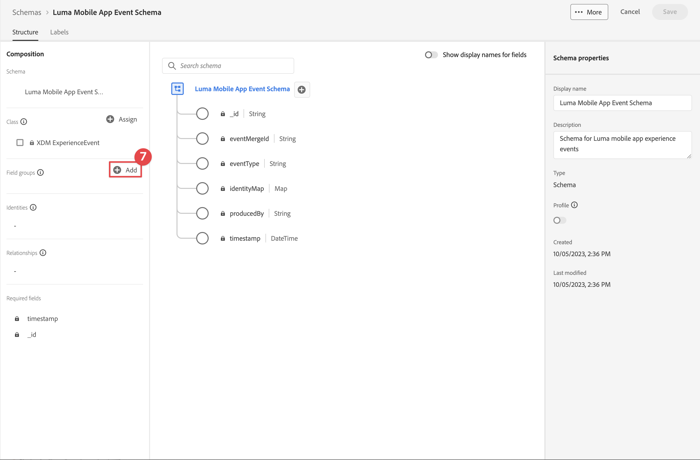

# XDM スキーマの作成

モバイルアプリイベント用の XDM スキーマを作成する方法を説明します。

標準化と相互運用性は、Adobe Experience Platform の背後にある重要な概念です。アドビが推進するエクスペリエンスデータモデル（XDM）は、顧客体験データを標準化し、顧客体験管理のスキーマを定義する取り組みです。

## XDM スキーマとは

XDM はパブリックに文書化された仕様であり、デジタルエクスペリエンスのパワーを向上させるために設計されています。あらゆるアプリケーションが Platform サービスと通信するための共通の構造と定義を提供します。 XDM 標準に準拠することで、すべての顧客体験データを共通の表現に組み込み、より迅速かつ統合的な方法でインサイトを得ることができます。顧客行動から有益なインサイトを得たり、セグメントを通じて顧客オーディエンスを定義したり、パーソナライゼーションのために顧客属性を使用したりできます。

Experience Platform では、スキーマを使用して、一貫性のある再利用可能な方法でデータの構造を記述します。システムをまたいで一貫したデータを定義することで、意味を保有しやすくなり、データから価値を得ることができます。

データを Platform に取り込む前に、スキーマを構成して、データの構造を記述し、各フィールドに含めることができるデータの種類を制限する必要があります。スキーマは、基本クラスと 0 個以上のスキーマフィールドグループで構成されます。

デザインの原則やベストプラクティスなど、スキーマ構成モデルについて詳しくは、[ スキーマ構成の基本 ](https://experienceleague.adobe.com/docs/experience-platform/xdm/schema/composition.html?lang=ja) またはプレイリスト [XDM を使用した顧客体験データのモデル化 ](https://experienceleague.adobe.com/en/playlists/experience-platform-model-your-customer-experience-data-with-xdm) を参照してください。

>[!TIP]
>
>分析ソリューションデザインリファレンス（SDR）を熟知している場合、スキーマは、より堅牢な SDR と考えることができます。 詳しくは、[ ソリューションデザインリファレンス（SDR）ドキュメントの作成と管理 ](https://experienceleague.adobe.com/docs/analytics-learn/tutorials/implementation/implementation-basics/creating-and-maintaining-an-sdr.html?lang=en) を参照してください。

## 前提条件

このレッスンを完了するには、Experience Platformスキーマを作成する権限が必要です。

## 学習目標

このレッスンでは、次の操作を行います。

* データ収集インターフェイスでのスキーマの作成
* 標準フィールドグループをスキーマに追加します
* カスタムフィールドグループを作成してスキーマに追加する

## スキーマへの移動

1. Adobe Experience Cloudにログインします。

1. このチュートリアルに使用するExperience Platformサンドボックスに属していることを確認します。

1. アプリ切り替えツール  右上）を開き、

1. メニューから **[!UICONTROL データ収集]** を選択します。

   

   >[!NOTE]
   >
   > Real-Time CDPなどの Platform ベースのアプリケーションを使用しているお客様は、このチュートリアルで開発用サンドボックスを使用する必要があります。 その他の顧客は、デフォルトの実稼動サンドボックスを使用します。

1. 左パネルの **[!UICONTROL データ管理**&#x200B;[!UICONTROL &#x200B; の下の &#x200B;]&#x200B;**スキーマ]** を選択します。

   

メインスキーマページが開き、既存のスキーマのリストが表示されます。 また、スキーマのコア構成要素に対応するタブも表示されます。

* **フィールドグループ** は、個人の詳細情報、ホテルの環境設定、住所などの特定のデータを取り込むために 1 つ以上のフィールドを定義する再利用可能なコンポーネントです。
* **クラス** スキーマに含まれるデータの行動の側面を定義します。 例：`XDM ExperienceEvent` は、時系列、イベントデータを取得し、`XDM Individual Profile` は、個人に関する属性データを取得します。
* **データ型** は、基本的なリテラルフィールドと同じ方法で、クラスまたはフィールドグループの参照フィールド型として使用されます。

上記の説明は概要です。 詳しくは、[ スキーマ構成要素 ](https://experienceleague.adobe.com/docs/platform-learn/tutorials/schemas/schema-building-blocks.html?lang=ja) ビデオを参照するか、製品ドキュメントの [ スキーマ構成の基本 ](https://experienceleague.adobe.com/docs/experience-platform/xdm/schema/composition.html?lang=ja) を参照してください。

このチュートリアルでは、「コンシューマーエクスペリエンスイベント」フィールドグループを使用して、プロセスを示すカスタムイベントを作成します。

>[!NOTE]
>
>Adobeは、より標準のフィールドグループを引き続き追加し、これらのフィールドはExperience Platformサービスによって暗黙的に理解され、Platform コンポーネント間で使用される場合は一貫性が高まるので、可能な限り使用する必要があります。 標準のフィールドグループを使用すると、Analytics での自動マッピングや Platform の AI 機能など、目に見えるメリットが得られます。

## Luma アプリスキーマアーキテクチャ

実際のシナリオでは、スキーマデザインプロセスは次のようになります。

* ビジネス要件を収集します。
* 可能な限り多くの要件に対応するために、事前に作成されたフィールドグループを見つけます。
* ギャップに対するカスタムフィールドグループの作成

学習目的で、事前定義済みフィールドグループとカスタムフィールドグループを使用します。

* **消費者エクスペリエンスイベント**：多くの共通フィールドを持つ事前に作成されたフィールドグループ。
* **アプリ情報**:TrackState/TrackAction Analytics の概念を模倣するように設計されたカスタムフィールドグループ。

<!--Later in the tutorial, you can [update the schema](lifecycle-data.md) to include the **[!UICONTROL AEP Mobile Lifecycle Details]** field group.-->

## スキーマの作成

1. 「**[!UICONTROL スキーマを作成]**」を選択します。

1. **[!UICONTROL スキーマを作成]** ウィザードの **[!UICONTROL クラスを選択]** 手順で、「**[!UICONTROL このスキーマの基本クラスを選択]** の下の **[!UICONTROL エクスペリエンスイベント]** を選択します。

1. 「**[!UICONTROL 次へ]**」を選択します。

   

1. **[!UICONTROL スキーマを作成]** ウィザードの **[!UICONTROL 名前とレビュー]** 手順で、**[!UICONTROL スキーマ表示名]** （例：`Luma Mobile Event Schema`）および [!UICONTROL &#x200B; 説明 &#x200B;] （例：`Schema for Luma mobile app experience events`）を入力します。

   >[!NOTE]
   >
   >このチュートリアルを 1 つのサンドボックスで複数のユーザーと共に行う場合、または共有アカウントを使用する場合は、命名規則の一部として ID を追加するか先頭に追加することを検討してください。 例えば、`Luma Mobile App Event Schema` の代わりに `Luma Mobile App Event Schema - Joe Smith` を使用します。 [ 概要 ](overview.md) のメモも参照してください。

1. 「**[!UICONTROL 完了]**」を選択して、ウィザードを終了します。

   

1.  の横にある「**[!UICONTROL プラス**&#x200B;**追加]**」を選択します。

   

1. `Consumer Experience Event` を検索します。

1.  を選択してフィールドをプレビューするか、フィールドグループを選択する前に説明を読んで詳細を確認します。

1. **消費者エクスペリエンスイベント** を選択します。

1. 「**[!UICONTROL フィールドグループを追加]**」を選択します。

   

   スキーマ構成のメイン画面に戻り、使用可能なすべてのフィールドを確認できます。

1. 「**[!UICONTROL 保存]**」を選択します。

>[!NOTE]
>
>グループ内のすべてのフィールドを使用する必要はないことに注意してください。 また、フィールドを削除して、スキーマを簡潔で理解可能な状態に保つこともできます。 役に立つ場合、スキーマは空のデータレイヤーと考えることができます。 アプリでは、適切なタイミングで関連する値を入力します。

[!UICONTROL &#x200B; 消費者エクスペリエンスイベント &#x200B;] フィールドグループのデータタイプは [!UICONTROL Web 情報 &#x200B;] で、ページビュー数やリンククリック数などのイベントを記述します。 執筆時点では、この機能にモバイルアプリの同等機能はないので、独自の機能を作成します。

## カスタムデータタイプの作成

まず、2 つのイベントを記述するカスタムデータタイプを作成します。

* 画面ビュー
* アプリの操作

1. 「**[!UICONTROL データタイプ]**」タブを選択します。

1. **[!UICONTROL データタイプを作成]** を選択します。

   

1. **[!UICONTROL 表示名]** および **[!UICONTROL 説明]** を入力（例：`App Information` および `Custom data type describing "Screen Views" & "App Actions"`）

   

   >[!TIP]
   >
   > カスタムフィールドには、常にわかりやすい [!UICONTROL &#x200B; 表示名 &#x200B;] を使用します。この方法では、セグメントビルダーなどのダウンストリームサービスにフィールドが表示される際に、マーケターがカスタムフィールドにアクセスしやすくなります。

1. フィールドを追加するには、「」ボタンを選択します。

1. このフィールドは、アプリインタラクションのコンテナオブジェクトなので、キャメルケースの **[!UICONTROL フィールド名]** `appInteraction`、**[!UICONTROL 表示名]** `App Interaction` を入力し、**[!UICONTROL タイプ]** リストから `Object` を選択します。

1. 「**[!UICONTROL 適用]**」を選択します。

   

1. アクションが発生した頻度を測定するには、作成した **[!UICONTROL appInteraction]** オブジェクトの横にある  ボタンを選択してフィールドを追加します。

1. キャメルケース **[!UICONTROL フィールド名]**`appAction`、**[!UICONTROL 表示名]**`App Action`、**[!UICONTROL タイプ]**`Measure` を入力します。

   この手順は、Adobe Analyticsの成功イベントに相当します。

1. 「**[!UICONTROL 適用]**」を選択します。

   

1. **[!UICONTROL appInteraction]** オブジェクトの横にある  ボタンを選択して、インタラクションのタイプを説明するフィールドを追加します。

1. **[!UICONTROL フィールド名]**`name`、**[!UICONTROL 表示名]**`Name`、**[!UICONTROL タイプ]**`String` を入力します。

   この手順はAdobe Analyticsのディメンションと同等です。

   

1. 右パネルの下部までスクロールし、「**[!UICONTROL 適用]**」を選択します。

1. `screenView` と呼ばれる **[!UICONTROL Measure]** フィールドと、`screenName` と `screenType` と呼ばれる 2 つの **[!UICONTROL String]** フィールドを含む `appStateDetails` オブジェクトを作成するには、**[!UICONTROL appInteraction]** オブジェクトの作成時と同じ手順に従います。

1. 「**[!UICONTROL 保存]**」を選択します。

   

## カスタムフィールドグループの追加

次に、カスタムデータタイプを使用してカスタムフィールドグループを追加します。

1. このレッスンで作成したスキーマを開きます。

1.  の横にある「**[!UICONTROL プラス]**&#x200B;**[!UICONTROL 追加]**」を選択します。

   

1. 「**[!UICONTROL 新しいフィールドグループを作成]**」を選択します。

1. **[!UICONTROL 表示名]** および **[!UICONTROL 説明]** を入力します（例：`App Interactions`、`Fields for app interactions`）。

1. 「**フィールドグループを追加**」を選択します。

   

1. メインのコンポジション画面から、「**[!UICONTROL &#x200B; アプリのインタラクション**]」を選択します。

1. スキーマ名の横にある  ボタンを選択して、スキーマのルートにフィールドを追加します。

1. 右側のパネルで、`appInformation` の **[!UICONTROL フィールド名]**、`App Information` の **[!UICONTROL 表示名]**、`App Information` の **[!UICONTROL タイプ]** を入力します。

1. **[!UICONTROL フィールドグループ]** ドロップダウンから「**[!UICONTROL アプリのインタラクション]**」を選択し、フィールドを新しいフィールドグループに割り当てます。

1. 「**[!UICONTROL 適用]**」を選択します。

1. 「**[!UICONTROL 保存]**」を選択します。

   

>[!NOTE]
>
>カスタムフィールドグループは、常にExperience Cloud組織識別子の下に配置されます。

>[!SUCCESS]
>
>これで、チュートリアルの残りの部分で使用するスキーマができました。
>
>Adobe Experience Platform Mobile SDK の学習に時間を費やしていただき、ありがとうございます。 ご不明な点がある場合や、一般的なフィードバックをお寄せになる場合、または今後のコンテンツに関するご提案がある場合は、この [Experience League コミュニティ ディスカッションの投稿 ](https://experienceleaguecommunities.adobe.com/t5/adobe-experience-platform-data/tutorial-discussion-implement-adobe-experience-cloud-in-mobile/td-p/443796) でお知らせください。

次のトピック：**[データストリーム [!UICONTROL &#x200B; の作成]](create-datastream.md)**
