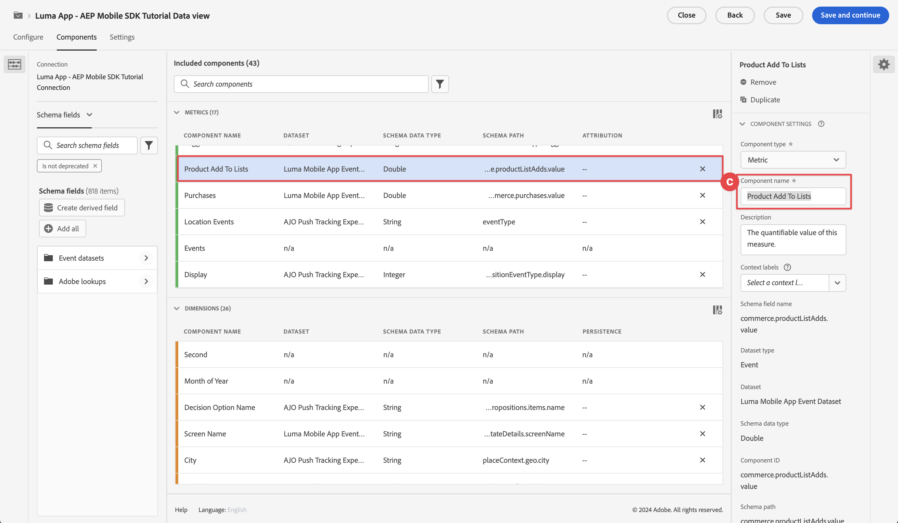

# Customer Journey Analyticsを使用したレポートと分析

モバイルアプリとCustomer Journey Analyticsとのやり取りをレポートおよび分析する方法について説明します。

以前のレッスンで Platform Edge Networkに収集して送信したモバイルアプリのイベントデータは、データストリームで設定されたサービスに転送されます。 を実行した場合 [Experience Platformへのデータの送信](platform.md) このレッスンでは、データはExperience Platformのデータレイクにデータセットとして保存されるようになりました。 その後、そのデータをCustomer Journey Analyticsで使用して、レポートや分析に使用できます。

Adobe Analyticsとは異なり、Customer Journey Analyticsとは次のような用途です *使用* Experience Platformで作成したデータセットから、アプリがデータを送信するデータです。 Adobe Experience Platform Mobile SDK を使用する場合、データをCustomer Journey Analyticsに直接送信しません。 代わりに、Customer Journey AnalyticsはExperience Platformのデータセットのデータを使用します。

チュートリアルのこのレッスンでは、Luma チュートリアルアプリから取得したデータのレポートと分析に焦点を当てています。 Customer Journey Analyticsのユニークな機能の 1 つは、複数のソース（CRM、POS、ロイヤルティアプリケーション、コールセンター）とチャネル（web、モバイル、オフライン）のデータを組み合わせて、カスタマージャーニーに関する深いインサイトを提供することです。 この機能はこのレッスンの範囲外です。 参照： [Customer Journey Analyticsの概要](https://experienceleague.adobe.com/en/docs/analytics-platform/using/cja-overview/cja-overview) を参照してください。

## 前提条件

組織にCustomer Journey Analyticsをプロビジョニングし、権限を付与する必要があります。 Customer Journey Analyticsへの管理アクセス権が必要です。

## 学習目標

このレッスンでは、次の操作を行います。

- 接続を作成して、Customer Journey Analyticsで使用するExperience Platformのデータセットを定義します。
- データビューを作成して、レポートおよび分析用にデータセットからデータを準備します
- プロジェクトを作成してレポートとビジュアライゼーションを作成し、モバイルアプリからデータを分析できるようにします。

この注文はわざとです。 Customer Journey Analyticsすると、Analysis Workspaceのレポートは、データビューに応じて異なります。 また、データビューは接続に依存します。

## 接続の作成

Customer Journey Analytics内の接続は、データセット（およびこれらのデータセット内のデータ）を、レポートおよび分析に使用するExperience Platformから定義します。

1. アプリを使用してCustomer Journey Analyticsインターフェイスに移動します  右上のメニュー。

1. を選択 **[!UICONTROL 接続]** 上部メニューバーから。

1. 必ずを選択してください **[!UICONTROL リスト]** 接続インターフェイスのタブ。 既存の接続のリストが表示されます。

1. を選択 **[!UICONTROL 新しい接続を作成]**.

1. が含まれる **[!UICONTROL 接続]** > **[!UICONTROL 名称未設定の接続]** 画面、内 **[!UICONTROL 接続設定]**

   1. を入力 **[!UICONTROL 接続名]**、例： `Luma App - AEP Mobile SDK Tutorial Connection`.
   2. を入力 **[!UICONTROL 接続の説明]**、例： `Connection for the Luma app used in the AEP Mobile SDK tutorial`.

      対象： **[!UICONTROL データ設定]**:

   3. モバイルアプリデータの収集に使用したサンドボックスを選択します。例： **[!UICONTROL Mobile および Web SDK コース]**.
   4. を選択 **[!UICONTROL 100 万未満]** から **[!UICONTROL 毎日のイベントの平均数]**.

   5. を選択 **[!UICONTROL データセットを追加]** をクリックし、Customer Journey Analyticsで使用するデータセットをExperience Platformから選択します。

      

   6. が含まれる **[!UICONTROL データセットを追加]** ウィザード、 **[!UICONTROL データセットを選択]** ステップ、

      1. 次のデータセットを選択します。

         - **[!UICONTROL Luma モバイルアプリイベントデータセット]**、の一部として作成したデータセット [データセットの作成](platform.md#create-a-dataset) Experience Platformのレッスンのセクション。
         - **[!UICONTROL ODE DecisionEvents - *サンドボックス名*] 決定**
         - **[!UICONTROL AJO プッシュトラッキングイベントデータセット]**

      1. 「**[!UICONTROL 次へ]**」を選択します。

         

   7. が含まれる **[!UICONTROL データセットを追加]** ウィザード、 **[!UICONTROL データセット設定]** 各イベントデータセットの詳細を定義する必要があります。
      1. 適切な設定については、次の表を参照してください。

         | データセット | 人物 ID ① | タイムスタンプ ② | データソースタイプ ③ | すべての新しいデータ④ースをインポート | 既存のすべてのデータ⑤ースをバックフィル |
         |---|---|---|---|---|---|
         | Luma モバイルアプリイベントデータセット | identityMap | タイムスタンプ | モバイルアプリデータ | enable | enable |
         | ODE DecisionEvents - *サンドボックス名* 決定 | identityMap | タイムスタンプ | モバイルアプリデータ | enable | enable |
         | AJO プッシュトラッキングエクスペリエンスイベントデータセット | identityMap | タイムスタンプ | モバイルアプリデータ | enable | enable |

      1. を選択 **[!UICONTROL データセットを追加]**.

         

1. 戻る **[!UICONTROL 接続]** > **[!UICONTROL Luma アプリ - AEP Mobile SDK チュートリアル接続]**&#x200B;を選択 **[!UICONTROL 保存]** ：接続を保存します。

   

これで、接続を定義し、Customer Journey Analyticsがデータセットから独自の内部データベースにデータを追加しました。 このデータ収集は、データ量によっては時間がかかる場合があります。 チュートリアルアプリでは、データがCustomer Journey Analyticsで表示されるまで 2、3 時間は想定してください。

接続のステータスを表示するには：

1. を選択 **[!UICONTROL 接続]** Customer Journey Analyticsのメインインターフェイスで。
1. 接続の名前（例：）を選択します **[!UICONTROL Luma アプリ - AEP Mobile SDK チュートリアル接続]**.

が含まれる **[!UICONTROL 接続]** > **[!UICONTROL Luma アプリ - AEP Mobile SDK チュートリアル接続]**&#x200B;以下が表示されます。

1. 追加された合計レコード数、スキップされたレコード数および削除されたレコード数に関する情報。 必ずを選択してください **[!UICONTROL すべてのデータセット]** を選択し、適切な期間を選択して接続に関する詳細を表示します。 次を使用できます  期間を選択するダイアログを開きます。
1. 追加されたレコード、スキップされたレコード、削除されたレコードなどに関する個々のデータセットの情報。

   

## データビューの作成

データセットからCustomer Journey Analyticsにレコードを追加したら、データビューを作成して、レポートするデータのコンポーネントを定義できます。

データビューはCustomer Journey Analyticsに特有のコンテナで、接続からデータを解釈する方法を決定できます。 標準フィールドとスキーマフィールドは、Analysis Workspaceのコンポーネント（ディメンション、指標）として、接続で定義した任意のデータセットから設定できます。

Customer Journey Analyticsのデータビューは、接続からのデータを適切に設定および定義する際に、非常に柔軟です。 このチュートリアルでは、レポートおよび分析に必要な機能のみを使用します。 参照： [データビュー](https://experienceleague.adobe.com/en/docs/analytics-platform/using/cja-dataviews/data-views) を参照してください。

データビューを作成するには：

1. アプリを使用してCustomer Journey Analyticsインターフェイスに移動します  右上のメニュー。

1. を選択 **[!UICONTROL データビュー]** 上部メニューバーから。
1. を選択 **[!UICONTROL 新しいデータビューを作成]**.
1. 対象： **[!UICONTROL データビュー >]**&#x200B;を使用する場合、必ず **[!UICONTROL 設定]** タブが選択されています。

   1. 例えば、「設定」接続ドロップダウンリストから接続を選択します **[!UICONTROL Luma アプリ - AEP Mobile SDK チュートリアル接続]**.
   1. データビューの名前（例：）を入力します。 `Luma App - AEP Mobile SDK Tutorial Data view`.
   1. を選択 **[!UICONTROL 保存して続行]**.

      

1. が含まれる **[!UICONTROL Components]** タブ **[!UICONTROL Luma アプリ - AEP Mobile SDK チュートリアルデータビュー]**&#x200B;を参照し、モバイルアプリでレポートを作成する際に使用する指標とディメンションを定義します。 デフォルトでは、多数の標準指標およびディメンション（コンポーネントと総称）がデータビューに既に設定されています。 ただし、データビューには、より多くのコンポーネントが必要です。  以前に定義したスキーマまたは標準スキーマからスキーマフィールドを追加するには（を参照） [スキーマの作成](create-schema.md) レッスン）の場合、コンポーネント（ディメンションまたは指標）として次の操作を行います。

   1. スキーマフィールドを見つけます。

      - を使用したコンポーネントの検索  ***[!UICONTROL スキーマフィールドを検索]*** 検索フィールド。 例： `productListAdd`、または

        

      - 内のスキーマフィールドまでトラバースします。  **[!UICONTROL イベントデータセット]** .  例：  **[!UICONTROL イベントデータセット]**   **[!UICONTROL コマース]**   **[!UICONTROL productListAdds]** 

        

   1. スキーマフィールドペインから特定のスキーマフィールドをドラッグし、 **[!UICONTROL 指標]** または **[!UICONTROL DIMENSION]** のリスト [!UICONTROL 含まれるコンポーネント] ペイン。

      

   1. コンポーネントの設定を指定できます。 コンポーネントを選択し、右側のパネルで設定を指定します。  例えば、の名前は変更できます **[!UICONTROL commerce.productListAdds]** 対象： `Product Add To Lists` の使用 **[!UICONTROL コンポーネント設定]** > **[!UICONTROL コンポーネント名]** 右側のペインのフィールド。

      

      または設定 **[!UICONTROL 値を含める/除外]**.

      

   1. これで、データビューにフィールドを追加し、結果のコンポーネントを設定する方法を理解できたので、以下の表をスキーマフィールドのリストに使用して、指標またはディメンションとして追加します。 の使用 **スキーマパス** 以下のテーブルの列の値で、特定のスキーマフィールドを検索またはトラバースします。 ドラッグ&amp;ドロップしたら、 **コンポーネント設定** コンポーネントの変更など、特定の設定がコンポーネントに必要かどうかを表で確認する列の値 **[!UICONTROL コンポーネント名]** または定義中 **[!UICONTROL 値を含める/除外]**.

      **指標**

      | コンポーネント名 | データセット | スキーマデータタイプ | スキーマパス | コンポーネント設定 |
      |---|---|---|---|---|
      | 閉じる | AJO プッシュトラッキングエクスペリエンスイベントデータセット、Luma モバイルアプリイベントデータセット | 整数 | _experience.decisioning. propositionEventType.dismiss | コンポーネント名： `Dismiss` |
      | 登録解除 | AJO プッシュトラッキングエクスペリエンスイベントデータセット、Luma モバイルアプリイベントデータセット | 整数 | _experience.decisioning. propositionEventType.unsubscribe | コンポーネント名： `Unsubscribe` |
      | トリガー | AJO プッシュトラッキングエクスペリエンスイベントデータセット、Luma モバイルアプリイベントデータセット | 整数 | _experience.decisioning. propositionEventType.トリガー | コンポーネント名： `Trigger` |
      | 表示 | AJO プッシュトラッキングエクスペリエンスイベントデータセット、Luma モバイルアプリイベントデータセット | 整数 | _experience.decisioning. propositionEventType.display | コンポーネント名： `Display` |
      | 送信 | AJO プッシュトラッキングエクスペリエンスイベントデータセット、Luma モバイルアプリイベントデータセット | 整数 | _experience.decisioning. propositionEventType.send | コンポーネント名： `Send` |
      | 操作 | AJO プッシュトラッキングエクスペリエンスイベントデータセット、Luma モバイルアプリイベントデータセット | 整数 | _experience.decisioning. propositionEventType.interact | コンポーネント名： `Interact` |
      | 場所のイベント | AJO プッシュトラッキングエクスペリエンスイベントデータセット、Luma モバイルアプリイベントデータセット、ODE DecisionEvents - mobile-and-web-sdk-courses decisioning | 文字列 | イベントタイプ | コンポーネント名： `Location Events`   |
      | 製品表示 | Luma モバイルアプリイベントデータセット | Double | commerce.productViews.value | コンポーネント名： `Product Views` |
      | リストへの製品追加 | Luma モバイルアプリイベントデータセット | Double | commerce.productListAdds.value | コンポーネント名： `Product Add To Lists` |
      | 購入 | Luma モバイルアプリイベントデータセット | Double | commerce.purchases.value | コンポーネント名： `Purchases` |
      | 後で使用するために保存 | Luma モバイルアプリイベントデータセット | Double | commerce.saveForLaters.value | コンポーネント名： `Save For Laters` |
      | アプリのインタラクション | Luma モバイルアプリイベントデータセット | Double | _techmarketingdemos.appInformation. appInteraction.appAction.value | コンポーネント名： `App Interactions` |
      | 画面ビュー | Luma モバイルアプリイベントデータセット | Double | _techmarketingdemos.appInformation. appStateDetails.screenView.value | コンポーネント名： `Screen Views` |

      {style="table-layout:auto"}

      「ロケーションイベント」指標のスキーマフィールドがどのように使用されているかを確認します **[!UICONTROL 値を含める/除外]** が含まれるイベントタイプをカウントするには `location`.

      上記の表のすべてのスキーマフィールドを指標コンポーネントとして追加したら、次のデータ表示設定を行います **[!UICONTROL 指標]** 次のようになります。

      

      **DIMENSION**

      | コンポーネント名 | データセット | スキーマデータタイプ | スキーマパス | コンポーネント設定 |
      |---|---|---|---|---|
      | 市区町村 | AJO プッシュトラッキングエクスペリエンスイベントデータセット、Luma モバイルアプリイベントデータセット | 文字列 | placeContext.geo.city | コンポーネント名： `City` |
      | イベントタイプ | AJO プッシュトラッキングエクスペリエンスイベントデータセット、Luma モバイルアプリイベントデータセット、ODE DecisionEvents - mobile-and-web-sdk-courses decisioning | 文字列 | eventType | コンポーネント名： `Event Types` |
      | 決定オプション名 | AJO プッシュトラッキングエクスペリエンスイベントデータセット、Luma モバイルアプリイベントデータセット、ODE DecisionEvents - mobile-and-web-sdk-courses decisioning | 文字列 | _experience.decisioning. propositions.items.name | コンポーネント名： `Decision Option Name` |
      | アプリインタラクション名 | Luma モバイルアプリイベントデータセット | 文字列 | _techmarketingdemos.appInformation. appInteraction.name | コンポーネント名： `App Interaction Name` |
      | 画面名 | Luma モバイルアプリイベントデータセット | 文字列 | _techmarketingdemos.appInformation. appStateDetails.screenName | コンポーネント名： `Screen Name` |
      | アクティビティ名 | ODE DecisionEvents - mobile-and-web-sdk-courses decisioning | 文字列 | _experience.decisioning. propositionDetails.activity.name | コンポーネント名： `Activity Name` |
      | オファー名 | ODE DecisionEvents - mobile-and-web-sdk-courses decisioning | 文字列 | _experience.decisioning. propositionDetails.selections.name | コンポーネント名： `Offer Name` |

      {style="table-layout:auto"}

      上記のテーブルのすべてのスキーマフィールドをディメンションコンポーネントとして追加したら、次のデータ表示設定を行います **[!UICONTROL DIMENSION]** 次のようになります。

      

   1. を選択 **[!UICONTROL 保存して続行]**.

1. この **[!UICONTROL 設定]** タブ **[!UICONTROL Luma アプリ - AEP Mobile SDK チュートリアルデータビュー]** フィルターとセッション設定を指定できます。 このチュートリアルでは、追加の設定は必要ありません。

   - を選択 **[!UICONTROL 保存して終了]**.

データビューを定義し、レポートとビジュアライゼーションの作成を開始するためのすべてが整いました。

## プロジェクトの作成

Customer Journey Analyticsで Workspace プロジェクトを使用して、レポートとビジュアライゼーションを作成します。 包括的なレポートと魅力的なビジュアライゼーションを作成する方法は多数ありますが、それらはすべて、このチュートリアルの範囲外です。 参照： [Workspace の概要](https://experienceleague.adobe.com/en/docs/customer-journey-analytics-learn/tutorials/analysis-workspace/workspace-projects/analysis-workspace-overview) および [新しいプロジェクトの作成](https://experienceleague.adobe.com/en/docs/customer-journey-analytics-learn/tutorials/analysis-workspace/workspace-projects/build-a-new-project) を参照してください。

レッスンのこのセクションでは、次の場所でレポートとビジュアライゼーションを表示するプロジェクトを作成します。

- アプリ使用状況：画面とアプリのインタラクションに関する情報の使用。
- Commerce：商品表示などのコマースイベントを使用して、買い物かごに追加して購入します。
- オファー：アプリで表示されたイベントのオファーを使用します。
- ストア訪問：アプリからの（シミュレートされた）ジオフェンスイベントを使用。

プロジェクトを作成するには：

1. アプリを使用してCustomer Journey Analyticsインターフェイスに移動します  右上のメニュー。

1. を選択 **[!UICONTROL ワークスペース]** 上部メニューバーから。

1. を選択 **[!UICONTROL プロジェクトを作成]**.

   1. を選択 **[!UICONTROL 空のワークスペースプロジェクト]** ポップアップダイアログから。

   1. 「**[!UICONTROL 作成]**」を選択します。

      

1. 「」が表示されます **[!UICONTROL 新規プロジェクト]** インターフェイス。 このインターフェイスでは、レポートとビジュアライゼーションを作成します。

1. プロジェクトの名前（**[!UICONTROL 新規プロジェクト]**）を選択し、プロジェクトに独自の名前を付けます。 例：`Luma App - AEP Mobile SDK Tutorial Project`。
   

1. プロジェクトを保存するには、を選択します。 **[!UICONTROL プロジェクト]** > **[!UICONTROL 保存]**.
   

1. が含まれる **[!UICONTROL 保存]** ダイアログで、他のすべてのフィールドを無視して選択 **[!UICONTROL 保存]**.
   

>[!IMPORTANT]
>
>   必ずプロジェクトを定期的に保存してください。そうしないと、変更内容が失われます。 を使用して、プロジェクトをすばやく保存できます **[!UICONTROL ctrl + s]** （Windows）または **[!UICONTROL ⌘ （cmd） + s]** （macOS）。

これで、プロジェクトの設定が完了しました。 既に、フリーフォームテーブルを含むフリーフォームパネルがメインキャンバスに存在します。 間もなくコンポーネントをこのテーブルに追加しますが、最初に、フリーフォームパネルで正しいデータビューと正しい期間が使用されていることを確認する必要があります。

1. ドロップダウンリストからデータ表示を選択します。 例： **[!UICONTROL Luma アプリ - AEP Mobile SDK チュートリアルデータビュー]**. リストにデータビューが表示されない場合は、次を選択します **[!UICONTROL すべてを表示]** ドロップダウンリストの下部。
   

1. パネルに適した期間を定義するには、デフォルト値を選択します **[!UICONTROL 今月]** ポップアップパネルで、開始日と終了日を定義します。 または **[!UICONTROL プリセット]**、など **[!UICONTROL 過去 6 ヶ月]** を選択して、 **[!UICONTROL 適用]**.
   

### アプリの使用状況

アプリの使用状況をレポートします。 アプリのインタラクションと、アプリで使用される画面を登録するために必要なコードをアプリに追加しました（ [トラックイベント](events.md) レッスン）を選択し、このデータについてレポートします。

#### 画面名

最初に、アプリで表示された画面に関するレポートを作成します。

1. の名前を変更 **[!UICONTROL フリーフォーム]** パネル先 `App Usage`.

1. の名前を変更 **[!UICONTROL フリーフォームテーブル]** 対象： `Screen Names`.

1. を選択 **[!UICONTROL すべてを表示]** の下 **[!UICONTROL 指標]** リスト。

1. をドラッグ&amp;ドロップ **[!UICONTROL 画面ビュー]** コンポーネントをオン [!UICONTROL _ドロップ a **指標**ここ（または他のコンポーネント_）].
   
フリーフォームテーブルに、選択した期間の日の画面ビューが表示されるようになりました。 ただし、アプリで使用される様々な画面の画面ビューを表示する必要があります。

1. を表示するには **[!UICONTROL DIMENSION]** コンポーネントのリスト、選択  を削除します  **[!UICONTROL 指標]** コンポーネントパネルからフィルタリングします。
   

1. を選択 **[!UICONTROL すべてを表示]** の下 **[!UICONTROL DIMENSION]** リスト。

1. をドラッグ&amp;ドロップ **[!UICONTROL 画面名]** 上のコンポーネント **[!UICONTROL 日]** ヘッダー。 操作が表示されます  **[!UICONTROL 置換]** 寸法の置き換えを示します。
   

最初のレポートの準備が整いました。アプリで定義した様々な画面名の画面ビューを表示します。

プロジェクトを保存することを忘れないでください。

#### アプリのインタラクション

また、ユーザーによるアプリの操作に関するレポートも作成します。

1. を選択  ポップアップから  新しいフリーフォームテーブルを追加する場合
   

1. 名前を変更 **[!UICONTROL フリーフォームテーブル （2）]** 対象： `App Interactions`.

1. をドラッグ&amp;ドロップ **[!UICONTROL アプリのインタラクション]** 指標： [!UICONTROL _ドロップ a **指標**ここ（または他のコンポーネント_）].

1. をドラッグ&amp;ドロップ **[!UICONTROL アプリインタラクション名]** のディメンション **[!UICONTROL 日]** このディメンションを置き換えるヘッダー。

これで 2 つ目のレポートの準備が整い、アプリのインタラクションが表示されます。

情報が制限される主な理由は、を実装したことです `MobileSDK.shared.sendAppInteractionEvent(actionName: "<actionName>")` API 呼び出しは、ログイン画面でのみ行います。 この API 呼び出しをアプリのより多くの画面に追加すると、このレポートはより多くの情報を提供します。

プロジェクトを保存することを忘れないでください。

### Commerce

次に、アプリで発生するコマースイベントを、別のパネルでレポートします。

#### Commerce イベント

1. を選択  電流の外で [!UICONTROL アプリの使用状況] パネル：新しいパネルを作成します。
   

1. 適切な期間を選択してください。

1. を選択  **[!UICONTROL フリーフォームテーブル]** 新しいフリーフォームテーブルを作成する手順は次のとおりです。
   

1. 名前を変更 **[!UICONTROL パネル]** 対象： `Commerce`.

1. 名前を変更 **[!UICONTROL フリーフォームテーブル]** 対象： `Commerce Events`.

1. ドラッグ&amp;ドロップ **[!UICONTROL 製品表示回数]** 指標：至 [!UICONTROL _ドロップ a **指標**ここ（または他のコンポーネント_）].

1. をドラッグ&amp;ドロップ **[!UICONTROL リストへの製品追加]** の右側にある指標 **[!UICONTROL 製品表示回数]** フリーフォームテーブルにこの列を挿入する列。 確保する **[!UICONTROL +追加]** （青色で）は、列の挿入時に表示されます。
   

1. 前の手順を繰り返して、 **[!UICONTROL 後のために保存]** 指標と **[!UICONTROL 購入数]** フリーフォームテーブルへの指標。

1. をドラッグ&amp;ドロップ **[!UICONTROL 月]** 上部のディメンション **[!UICONTROL 日]** レポートを日次から月次に変更するディメンション。

あなたの **[!UICONTROL Commerce イベント]** レポートの準備が完了し、ユーザーが商品を閲覧した方法、ウィッシュリストに商品を追加した方法、後で商品を保存した方法、または商品を購入した方法を表示できるようになりました。

プロジェクトを保存することを忘れないでください。

#### フォールアウト

前のレポートに基づいて、コマースファネルのフォールアウトを視覚化します。製品を表示したユーザーの数が、買い物かごにも製品を追加しました。 また、買い物かごに製品を追加したユーザーのうち、後で使用するためにこれらの製品を保存したユーザーの数。 その他。

1. を選択  内 **[!UICONTROL コマース]** パネルと、ポップアップからを選択します  （フォールアウトビジュアライゼーションを表す）。

1. を選択 **[!UICONTROL 製品表示回数]** から [!UICONTROL *タッチポイントを追加*] ドロップダウンリスト。
   
または、をドラッグ&amp;ドロップできます **[!UICONTROL 製品ビュー]** 次の下のディメンション **[!UICONTROL すべてのユーザー]** のディメンション **[!UICONTROL フォールアウト]** ビジュアライゼーション。

1. について、上記の手順を繰り返します **[!UICONTROL リストへの製品追加]** および **[!UICONTROL 購入数]** ディメンション。

あなたの **[!UICONTROL フォールアウト]** ビジュアライゼーションで、製品のコンバージョンファネルが視覚的に表示されるようになりました。

プロジェクトを保存することを忘れないでください。

### オファー

アプリのユーザーに表示されるオファーの数と内容をレポートします。

#### 毎月の概要

1. を選択  現在のCommerce パネルの外部で、新しいパネルを作成します。

1. の名前を変更 **[!UICONTROL パネル]** 対象： `Offers`.

1. 適切な期間を選択してください。

1. を選択  新しいフリーフォームテーブルを作成するためのフリーフォームテーブル。

1. の名前を変更 **[!UICONTROL フリーフォームテーブル]** 対象： `Monthly Overview`.

1. をドラッグ&amp;ドロップ **[!UICONTROL 表示]** 指標：至 [!UICONTROL _ドロップ a **指標**ここ（または他のコンポーネント_）].

1. をドラッグ&amp;ドロップ **[!UICONTROL 月]** のディメンション **[!UICONTROL 日]** ディメンションを置き換える列。

これで、アプリでユーザーに表示された月次オファーを示すレポートが作成されました。

プロジェクトを保存することを忘れないでください。

#### 人物に対するオファー

また、アプリのユーザーに表示されたオファーの数を示すレポートも必要です。

1. を選択  内 **[!UICONTROL オファー]** パネルと ポップアップから新しいフリーフォームテーブルを追加します。

1. 名前を変更 **[!UICONTROL フリーフォームテーブル （2）]** 対象： `People`.

1. をドラッグ&amp;ドロップ **[!UICONTROL 人物]** 指標：至 [!UICONTROL _ドロップ a **指標**ここ（または他のコンポーネント_）].

1. をドラッグ&amp;ドロップ **[!UICONTROL アクティビティ名]** 日 **[!UICONTROL 日]** ディメンションを置き換える列。

1. 行を右クリックし、 [意思決定管理によるオファーの作成および表示](journey-optimizer-offers.md) レッスン： 例： **[!UICONTROL Luma - モバイルアプリの決定]**.

1. コンテキストメニューから、 **[!UICONTROL 分類]** > **[!UICONTROL Dimension]** > **[!UICONTROL オファー名]**. これを選択すると、アクティビティ名ディメンションがオファー名に分類されます。
   

これで、選択した期間のこのオファー決定に対して表示される個々のオファーを示すレポートが、アプリのユーザーに作成されました。

プロジェクトを保存することを忘れないでください。

### ストアの訪問回数

最後に、ストアへの訪問に関するレポートを作成します。

1. を選択  現在のオファーパネルの外部で、新しいパネルを作成します。

1. の名前を変更 **[!UICONTROL パネル]** 対象： `Store Visits`.

1. 適切な期間を選択してください。

1. を選択  新しいフリーフォームテーブルを作成するためのフリーフォームテーブル。

1. 名前を変更 **[!UICONTROL フリーフォームテーブル]** 対象： `Store Entries / Exits Across Cities`.

1. をドラッグ&amp;ドロップ **[!UICONTROL 場所のイベント]** 指標：至 [!UICONTROL _ドロップ a **指標**ここ（または他のコンポーネント_）]. レポートには、アプリで発生したすべての場所イベントの日別概要が表示されるようになりました。 このディメンションを独自に設定した方法を、 [データビュー](#create-a-data-view).

1. をドラッグ&amp;ドロップ **[!UICONTROL 市区町村]** のディメンション **[!UICONTROL 日]** ディメンションを置き換える列ヘッダー。 このレポートには、場所イベントの市区町村が表示されます。

1. 都市が関連付けられていないジオロケーションイベントを削除するには、次を選択します 、およびから **[!UICONTROL 検索]** ポップアップ、オフ **[!UICONTROL 「値なし」を含める]**&#x200B;を選択してから、 **[!UICONTROL 適用]**.

   

   この操作により、が削除されます **[!UICONTROL 値なし]** 行（レポートから）。

1. テーブル内のすべての行を選択して右クリックし、コンテキストメニューから分類/Dimension/イベントタイプを選択します。

次に、ユーザーがストアの場所の近く内外にいることを示すレポートを作成します（これらの場所を [場所](places.md) レッスン）。

実際にお店を訪れた人について報告したい場合は、ビーコンを使用できます。 しかし、うまくいけば、位置情報データに関するレポートの概念を捉えることができます。

## 次の手順

これで、Customer Journey Analyticsを使用して、モバイルアプリの使用状況、インタラクション、その他をレポートおよび視覚化する方法の基本的な理解が整いました。

>[!SUCCESS]
>
>
>Adobe Experience Platform Mobile SDK の学習に時間を費やしていただき、ありがとうございます。 ご質問がある場合、一般的なフィードバックを共有する場合、将来のコンテンツに関する提案がある場合は、このページで共有します [Experience League コミュニティ ディスカッションの投稿](https://experienceleaguecommunities.adobe.com/t5/adobe-experience-platform-data/tutorial-discussion-implement-adobe-experience-cloud-in-mobile/td-p/443796).

次へ： **[まとめ、次のステップ](conclusion.md)**
