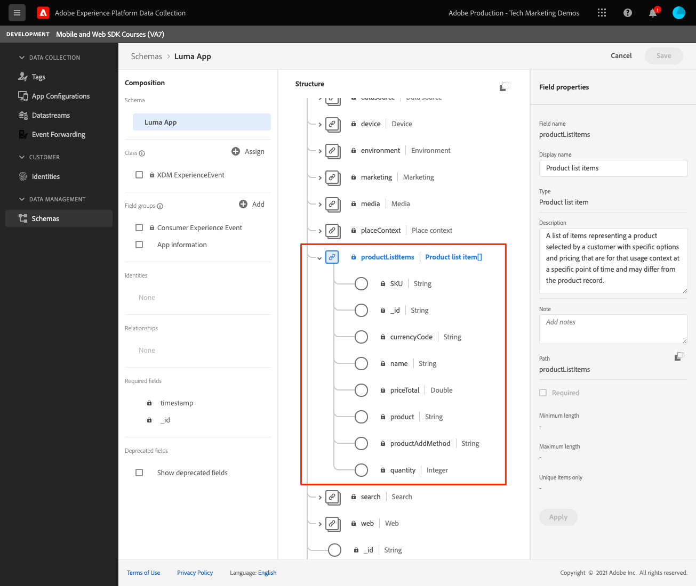
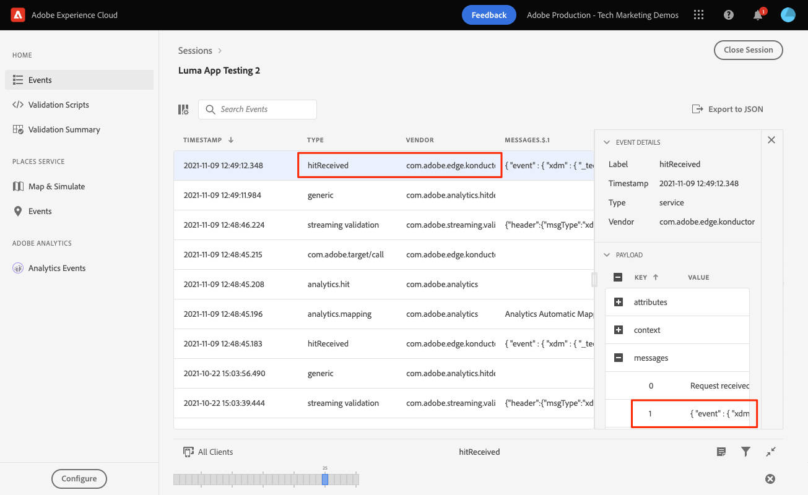
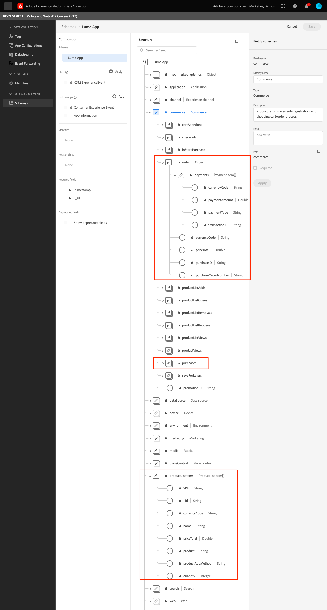

# イベント

モバイルアプリでイベントを追跡する方法を説明します。

Edge Network 拡張機能は、Experience Events を Platform Edge Network に送信する API を提供します。 エクスペリエンスイベントは、XDM ExperienceEvent スキーマ定義に準拠したデータを含むオブジェクトです。 より簡単に言えば、モバイルアプリでのユーザーの行動を取り込みます。 Platform Edge Network がデータを受信すると、Adobe AnalyticsやExperience Platformなど、データストリームで設定されたアプリケーションやサービスにデータを転送できます。 詳しくは、 [エクスペリエンスイベント](https://aep-sdks.gitbook.io/docs/getting-started/initialize-the-sdk) （製品ドキュメント内）。

## 前提条件

* 必要な SDK を追加して PodFile を更新しました。
* AppDelegate に登録された拡張機能。
* 開発用 AppId を使用するように MobileCore を設定しました。
* SDK が読み込まれました。
* 上記の変更を含むアプリが正常にビルドされ、実行されました。

## 学習内容

このレッスンでは、次の操作を実行します。

* スキーマに基づいて XDM データを構造化する方法を説明します。
* 標準フィールドグループに基づいて XDM イベントを送信します。
* カスタムフィールドグループに基づいて XDM イベントを送信します。
* XDM 購入イベントを送信します。
* アシュランスを使用して検証します。

## エクスペリエンスイベントの作成

Adobe Experience Platform Edge 拡張機能は、以前に定義した XDM スキーマに従うイベントをAdobe Experience Platform Edge Network に送信できます。

プロセスは次のようになります…

1. 追跡しようとしているモバイルアプリのインタラクションを特定します。

1. スキーマを確認し、適切なイベントを特定します。

1. スキーマを確認し、イベントの説明に使用する必要がある追加のフィールドを特定します。

1. データオブジェクトを作成および設定します。

1. イベントを作成して送信します。

1. 検証.

いくつか例を見てみましょう。

### 例#1 — 標準フィールドグループ

サンプルアプリケーションに実装せずに、次の例を確認します。

1. スキーマで、収集しようとしているイベントを識別します。この例では、製品表示を追跡しています。
   

1. オブジェクトの構築を開始します。

   ```swift
   var xdmData: [String: Any] = [
       "eventType": "commerce.productViews",
       "commerce": [
           "productViews": [
           "value": 1
           ]
       ]
   ]
   ```

   * eventType:発生したイベントを記述します。 [既知の値](https://github.com/adobe/xdm/blob/master/docs/reference/classes/experienceevent.schema.md#xdmeventtype-known-values) 可能な場合は。
   * commerce.productViews.value:イベントの数値を指定します。 ブール値 (Adobe Analyticsの場合は「カウンター」) の場合、値は常に 1 になります。 数値イベントまたは通貨イベントの場合、値は 1 より大きい値になります。

1. スキーマ内で、イベントに関連付けられている追加データを特定します。 この例では、 `productListItems` コマース関連のイベントで使用される標準のフィールドセットです。
   
   * 次の点に注意してください。 `productListItems` は配列なので、複数の製品を提供できます。

1. xdmData オブジェクトを展開して、補足データを含めます。

   ```swift
   var xdmData: [String: Any] = [
       "eventType": "commerce.productViews",
           "commerce": [
           "productViews": [
               "value": 1
           ]
       ],
       "productListItems": [
           [
               "name":  productName,
               "SKU": sku,
               "priceTotal": priceString,
               "quantity": 1
           ]
       ]
   ]
   ```

1. データ構造を使用して `ExperienceEvent`:

   ```swift
   let productViewEvent = ExperienceEvent(xdm: xdmData)
   ```

1. イベントとデータを Platform Edge Network に送信します。

   ```swift
   Edge.sendEvent(experienceEvent: productViewEvent)
   ```

### 例#2 — カスタムフィールドグループ

サンプルアプリケーションに実装せずに、次の例を確認します。

1. スキーマで、収集しようとしているイベントを特定します。 この例では、アプリアクションイベントと名前で構成される「アプリインタラクション」を追跡します。
   

1. オブジェクトの作成を開始します。

   >[!NOTE]
   >
   >  標準フィールドグループは、常にオブジェクトルートから始まります。
   >
   >  カスタムフィールドグループは、常にExperience Cloud組織に固有のオブジェクト（この例では「_techmarketingdemos」）の下で開始します。

   ```swift
   var xdmData: [String: Any] = [
   "_techmarketingdemos": [
       "appInformation": [
           "appInteraction": [
               "name": actionName,
               "appAction": [
                   "value": 1
                   ]
               ]
           ]
       ]
   ]
   ```

   あるいは…

   ```swift
   var xdmData: [String: Any] = [:]
   xdmData["_techmarketingdemos"] = [
       "appInformation": [
           "appInteraction": [
               "name": actionName,
               "appAction": [
                   "value": 1
               ]
           ]
       ]
   ]
   ```

1. データ構造を使用して `ExperienceEvent`.

   ```swift
   let appInteractionEvent = ExperienceEvent(xdm: xdmData)
   ```

1. イベントとデータを Platform Edge Network に送信します。

   ```swift
   Edge.sendEvent(experienceEvent: appInteractionEvent)
   ```

### Luma アプリへの画面ビュートラッキングの追加

上記の例では、XDM データオブジェクトを構築する際の考え方のプロセスを説明していると思います。 次に、Luma アプリに画面ビュートラッキングを追加します。

1. `Home.swift` に移動します。
1. 次のコードをに追加します。 `viewDidAppear(...)`.

   ```swift
           let stateName = "luma: content: ios: us: en: home"
           var xdmData: [String: Any] = [:]
           //Page View
           xdmData["_techmarketingdemos"] = [
               "appInformation": [
                   "appStateDetails": [
                       "screenType": "App",
                       "screenName": stateName,
                       "screenView": [
                           "value": 1
                       ]
                   ]
               ]
           ]
           let experienceEvent = ExperienceEvent(xdm: xdmData)
           Edge.sendEvent(experienceEvent: experienceEvent)
   ```

1. アプリの各画面で、を更新して繰り返します。 `stateName` 行く時に


### 検証

1. 以下を確認します。 [設定手順](assurance.md) を参照し、シミュレーターまたはデバイスを Assurance に接続します。
1. アクションを実行し、 `hitReceived` イベント `com.adobe.edge.konductor` ベンダー。
1. イベントを選択し、 `messages` オブジェクト。
   

### 例#3 - purchase

この例では、ユーザーが次の購入を正常に行ったとします。

* 製品#1 — ヨガマット。
   * $49.99 x1
   * SKU:5829
* 製品#2 — 水瓶。
   * $10.00 x3
   * SKU:9841
* 注文合計：$79.99
* 一意の注文 ID :298234720
* 支払いタイプ：Visa Credit Card
* 一意の支払トランザクション ID :847361

#### スキーマ

使用する関連するスキーマフィールドを次に示します。

* eventType:&quot;commerce.purchases&quot;
* commerce.purchases
* commerce.order
* productsListItems
* _techmarketingdemos.appStateDetails （カスタム）

>[!TIP]
>
>カスタムフィールドグループは、常にExperience Cloud組織 ID の下に配置されます。
>
>「_techmarketingdemos」は組織の一意の値に置き換えられます。




#### コード

次に、アプリで XDM オブジェクトを作成して送信する方法を示します。

```swift
let stateName = "luma: content: ios: us: en: orderconfirmation"
let currencyCode = "USD"
let orderTotal = "79.99"
let paymentType = "Visa Credit Card"
let orderId = "298234720"
let paymentTransactionId = "847361"
var xdmData: [String: Any] = [
  "eventType": "commerce.purchases",
  "commerce": [
    "purchases": [
      "value": 1
    ],
    "order": [
      "currencyCode": currencyCode,
      "priceTotal": orderTotal,
      "purchaseID": orderId,
      "purchaseOrderNumber": orderId,
      "payments": [ //Assuming only 1 payment type is used
        [
          "currencyCode": currencyCode,
          "paymentAmount": orderTotal,
          "paymentType": paymentType,
          "transactionID": paymentTransactionId
        ]
      ]
    ]
  ],
  "productListItems": [
      [
          "name":  "Yoga Mat",
          "SKU": "5829",
          "priceTotal": "49.99",
          "quantity": 1
      ],
      [
        "name":  "Water Bottle",
        "SKU": "9841",
        "priceTotal": "30.00",
        "quantity": 3
      ]
  ]
]

//Custom field group
xdmData["_techmarketingdemos"] = [
  "appInformation": [
    "appStateDetails": [
      "screenType": "App",
      "screenName": stateName,
      "screenView": [
        "value": 1
      ]
    ]
  ]
]
let experienceEvent = ExperienceEvent(xdm: xdmData)
Edge.sendEvent(experienceEvent: experienceEvent)
```

>[!NOTE]
>
>明確にするために、すべての値がハードコードされています。 実際の状況では、値は動的に設定されます。


### Luma アプリケーションでの実装

Luma サンプルアプリケーションへのデータ収集の追加を開始するには、すべてのツールが必要です。 以下に、従うことができる仮の追跡要件のリストを示します。

* 各画面ビューを追跡します。
   * スキーマフィールド：screenType, screenName, screenView
* 非コマースアクションを追跡します。
   * スキーマフィールド：appInteraction.name, appAction
* コマースアクション：
   * 製品ページ：productViews
   * 買い物かごに追加：productListAdds
   * 買い物かごから削除：productListRemovals
   * チェックアウトを開始：checkouts
   * 買い物かごを表示：productListViews
   * ウィッシュリストに追加：saveForLaters
   * 購入：購入、注文

>[!TIP]
>
>以下を確認します。 [完全に実装されたアプリ](https://github.com/Adobe-Marketing-Cloud/Luma-iOS-Mobile-App) その他の例

### 検証

1. 以下を確認します。 [設定手順](assurance.md) を参照し、シミュレーターまたはデバイスを Assurance に接続します。

1. アクションを実行し、 `hitReceived` イベント `com.adobe.edge.konductor` ベンダー。

1. イベントを選択し、 `messages` オブジェクト。
   

## Analytics と Platform へのイベントの送信

これで、イベントを収集して Platform Edge ネットワークに送信したので、イベントは、 [datastream](create-datastream.md). 後のレッスンでは、このデータをにマッピングします。 [Adobe Analytics](analytics.md) および [Adobe Experience Platform](platform.md).

次へ： **[WebViews](web-views.md)**

>[!NOTE]
>
>Adobe Experience Platform Mobile SDK の学習に時間を割いていただき、ありがとうございます。 ご質問がある場合、一般的なフィードバックを共有したい場合、または今後のコンテンツに関する提案がある場合は、こちらで共有してください [Experience Leagueコミュニティディスカッション投稿](https://experienceleaguecommunities.adobe.com/t5/adobe-experience-platform-launch/tutorial-discussion-implement-adobe-experience-cloud-in-mobile/td-p/443796)