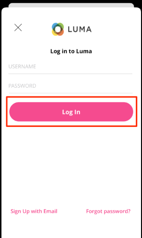

# ID

モバイルアプリで ID データを収集する方法を説明します。

>[!INFO]
>
> このチュートリアルは、2023 年 11 月後半に新しいサンプルモバイルアプリを使用した新しいチュートリアルに置き換えられます

Adobe Experience Platform ID サービスを使用すると、デバイスやシステム間で ID を結び付け、顧客とその行動をより良く把握でき、効果的な個人のデジタルエクスペリエンスをリアルタイムで提供できます。 ID フィールドと名前空間は、異なるデータソースを結合して、360 度のリアルタイム顧客プロファイルを構築するための接着剤です。

詳しくは、 [ID 拡張機能](https://developer.adobe.com/client-sdks/documentation/identity-for-edge-network/) そして [id サービス](https://experienceleague.adobe.com/docs/experience-platform/identity/home.html?lang=ja) 」を参照してください。

## 前提条件

* SDK が正常に構築され、インストールされ、設定された状態でアプリが実行されました。

## 学習内容

このレッスンでは、次の操作を実行します。

* 標準 ID を更新します。
* カスタム ID を設定します。
* カスタム ID を更新する。
* ID グラフを検証します。
* ECID やその他の ID を取得します。

## 標準 ID の更新

ログイン時に、ユーザーの ID マップを更新します。

1. に移動します。 `Login.swift` (Luma アプリケーションが起動し、 `loginButt`.

   Luma サンプルアプリでは、ユーザー名やパスワードの検証はおこなわれません。 ボタンをタップするだけで「ログイン」できます。

1. を作成します。 `IdentityMap` および `IdentityItem`.

   ```swift
   let identityMap: IdentityMap = IdentityMap()
   let emailIdentity = IdentityItem(id: emailAddress, authenticatedState: AuthenticatedState.authenticated)
   ```

1. 次を追加： `IdentityItem` から `IdentityMap`

   ```swift
   identityMap.add(item:emailIdentity, withNamespace: "Email")
   ```

1. 通話 `updateIdentities` を使用して、データを Platform Edge ネットワークに送信します。

   ```swift
   Identity.updateIdentities(with: identityMap)
   ```

>[!NOTE]
>
>1 回の updateIdentities の呼び出しで複数の ID を送信できます。 また、以前に送信した ID を変更することもできます。


## カスタム ID 名前空間の設定

ID 名前空間は、 [ID サービス](https://experienceleague.adobe.com/docs/experience-platform/identity/home.html?lang=ja) id が関連するコンテキストのインジケーターとして機能する 例えば、「name@email.com」の値を電子メールアドレスとして、または「443522」を数値 CRM ID として区別します。

1. データ収集インターフェイスで、「 」を選択します。 **[!UICONTROL ID]** をクリックします。
1. 「**[!UICONTROL ID 名前空間を作成]**」を選択します。
1. 次を提供： **[!UICONTROL 表示名]** / `Luma CRM ID` および **[!UICONTROL ID シンボル]** の値 `lumaCrmId`.
1. 選択 **[!UICONTROL クロスデバイス ID]**.
1. 「**[!UICONTROL 作成]**」を選択します。


## カスタム ID の更新

カスタム ID を作成したら、 `updateIdentities` 前の手順で追加したコード。 IdentityItem を作成し、IdentityMap に追加するだけです。 完全なコードブロックは次のようになります。

```swift
//Hardcoded identity values
let emailAddress = "testuser@gmail.com"
let crmId = "112ca06ed53d3db37e4cea49cc45b71e"

// Create identity map
let identityMap: IdentityMap = IdentityMap()
// Add email (standard)
let emailIdentity = IdentityItem(id: emailAddress, authenticatedState: AuthenticatedState.authenticated)
identityMap.add(item:emailIdentity, withNamespace: "Email")
// Add lumaCrmId (custom)
let crmIdentity = IdentityItem(id: crmId, authenticatedState: AuthenticatedState.authenticated)
identityMap.add(item: crmIdentity, withNamespace: "lumaCrmId")
// Update
Identity.updateIdentities(with: identityMap)
```

## ID の削除

以下を使用できます。 `removeIdentity` をクリックして、保存されたクライアント側の IdentityMap から id を削除します。 ID 拡張機能が Edge ネットワークへの識別子の送信を停止します。 この API を使用しても、サーバー側のユーザープロファイルグラフまたは ID グラフから識別子が削除されることはありません。

以下を追加します。 `removeIdentity` コードをログアウトボタンに追加します。 `Account.swift`.

```swift
// Logout
let logout = UIAlertAction(title: "Logout", style: .destructive, handler: { (action) -> Void in
    isLoggedIn = false;
    ////Hardcoded identity values
    let emailAddress = "testuser@gmail.com"
    let crmId = "112ca06ed53d3db37e4cea49cc45b71e"
    // Adobe Experience Platform - Remove Identity
    Identity.removeIdentity(item: IdentityItem(id: emailAddress), withNamespace: "Email")
    Identity.removeIdentity(item: IdentityItem(id: crmId), withNamespace: "lumaCrmId")
})
```

>[!NOTE]
>上記の例では、 `crmId` および `emailAddress` はハードコードされていますが、実際のアプリでは、値は動的です。

## アシュランスで検証

1. 以下を確認します。 [設定手順](assurance.md) を参照し、シミュレーターまたはデバイスを Assurance に接続します。
1. デスクトップアプリケーションで、右下の「アカウント」アイコンを選択します。

   
1. を選択します。 **ログイン** 」ボタンをクリックします。
1. ユーザー名とパスワードを入力するオプションが表示されます。両方ともオプションで、単に **ログイン**.

   
1. Assurance Web UI で `Edge Identity Update Identities` イベント `com.adobe.griffon.mobile` ベンダー。
1. イベントを選択し、 `ACPExtensionEventData` オブジェクト。 更新した ID が表示されます。
   

## ID グラフで検証

手順を完了したら、 [Experience Platformレッスン](platform.md)また、Platforms ID グラフビューアで ID の取り込みを確認できます。


次へ： **[プロファイル](profile.md)**

>[!NOTE]
>
>Adobe Experience Platform Mobile SDK の学習に時間を割いていただき、ありがとうございます。 ご質問がある場合、一般的なフィードバックを共有する場合、または今後のコンテンツに関する提案がある場合は、このドキュメントで共有します [Experience Leagueコミュニティディスカッション投稿](https://experienceleaguecommunities.adobe.com/t5/adobe-experience-platform-data/tutorial-discussion-implement-adobe-experience-cloud-in-mobile/td-p/443796)