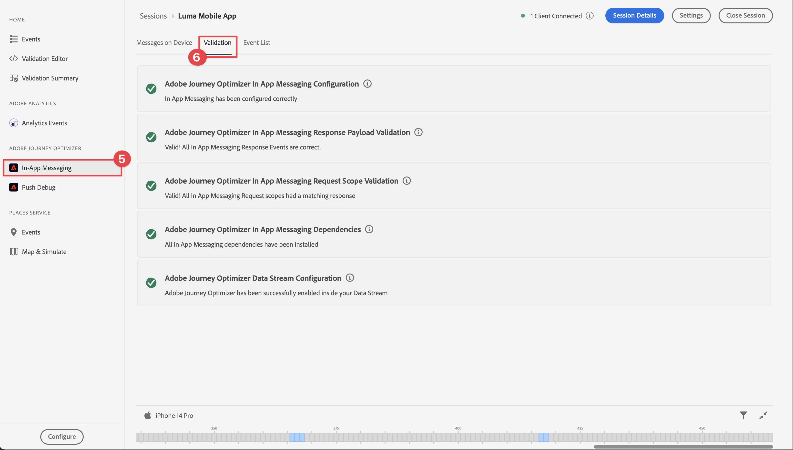

# アプリ内メッセージの作成と送信

Experience Platform Mobile SDKとJourney Optimizerを使用して、モバイルアプリ用のアプリ内メッセージを作成する方法を説明します。

Journey Optimizerでは、ターゲットオーディエンスにアプリ内メッセージを送信するキャンペーンを作成できます。 Journey Optimizerのキャンペーンは、様々なチャネルを使用して、特定のオーディエンスに 1 回限りのコンテンツを配信するために使用します。 キャンペーンでは、アクションは指定したスケジュールに基づいて同時にまたは即時に実行されます。 ジャーニーを使用すると（[Journey Optimizerのプッシュ通知 ](journey-optimizer-push.md) レッスンを参照）、アクションが順番に実行されます。

{zoomable="yes"}

Journey Optimizerでアプリ内メッセージを送信する前に、適切な設定と統合が行われていることを確認する必要があります。 Journey Optimizerのアプリ内メッセージデータフローについては、[ ドキュメント ](https://experienceleague.adobe.com/en/docs/journey-optimizer/using/in-app/inapp-configuration) を参照してください。

>[!NOTE]
>
>このレッスンはオプションで、アプリ内メッセージの送信を検討しているJourney Optimizer ユーザーにのみ適用されます。


## 前提条件

* SDK がインストールおよび設定された状態で、アプリケーションが正常に構築および実行されました。
* Adobe Experience Platform用にアプリを設定します。
* Journey Optimizerへのアクセスおよび [ プッシュ通知に対する十分な権限 ](https://experienceleague.adobe.com/en/docs/journey-optimizer/using/push/push-config/push-configuration)。 また、次のJourney Optimizer機能に対する十分な権限も必要です。
   * キャンペーンの管理。
* テスト用の物理的なiOSデバイスまたはシミュレーター。


## 学習目標

このレッスンでは、次の操作を行います

* Journey Optimizerでチャネル設定を作成します。
* Journey Optimizer タグ拡張機能をインストールして設定します。
* アプリを更新して、Journey Optimizer タグ拡張機能を登録します。
* Assuranceの設定を検証します。
* Journey Optimizerで独自のキャンペーンおよびアプリ内メッセージエクスペリエンスを定義します。
* アプリ内から独自のアプリ内メッセージを送信します。

## セットアップ

>[!TIP]
>
>[Journey Optimizer プッシュメッセージ ](journey-optimizer-push.md) レッスンの一部として既に環境を設定している場合は、この設定の節の手順のいくつかが既に実行されている可能性があります。


### チャネル設定の作成

まず、Journey Optimizerからアプリのメッセージ通知を送信できるように、チャネル設定を作成する必要があります。

1. Journey Optimizerのインターフェイスで、**[!UICONTROL チャンネル]**/**[!UICONTROL 一般設定]**/**[!UICONTROL チャンネル設定]** メニューを開き、「**[!UICONTROL チャンネル設定を作成]**」を選択します。

1. 設定の名前と説明（オプション）を入力します。 例えば、`LumaInAppMessaging` と `Channel for in-app messaging` です。

   >[!NOTE]
   >
   > 名前は、文字（A ～ Z）で始める必要があります。使用できるのは英数字のみです。アンダースコア（`_`）、ドット（`.`）、ハイフン（`-`）も使用できます。

1. 設定にカスタムまたはコアのデータ使用ラベルを割り当てるには、「**[!UICONTROL アクセスを管理]**」を選択します。[詳しくは、オブジェクトレベルのアクセス制御（OLAC）を参照してください](https://experienceleague.adobe.com/en/docs/journey-optimizer/using/access-control/object-based-access)。

1. **アプリ内メッセージ** チャネルを選択します。

1. **[!UICONTROL マーケティングアクション]** を選択し、この設定を使用して同意ポリシーをメッセージに関連付けます。 マーケティングアクションに関連するすべての同意ポリシーは、顧客の環境設定に従って活用されます。 [ マーケティングアクションの詳細情報 ](https://experienceleague.adobe.com/en/docs/journey-optimizer/using/privacy/consent/consent#surface-marketing-actions)。 例：プッシュターゲティング。

1. 設定を定義するプラットフォームを選択します。 この設定を使用すると、各プラットフォームに対してターゲットアプリを指定し、複数のプラットフォーム間で一貫したコンテンツ配信を確保できます。

   >[!NOTE]
   >
   >iOS および Android プラットフォームの場合、配信はアプリ ID のみに基づきます。両方のアプリが同じアプリ ID を共有する場合、**[!UICONTROL チャネル設定]** で選択したプラットフォームに関係なく、コンテンツは両方に配信されます。

1. サポートするプラットフォームのアプリ ID を入力します。

   {zoomable="yes"}

1. 「**[!UICONTROL 送信]**」を選択して変更を保存します。

### データストリーム設定を更新

モバイルアプリから Experience Edgeにデータが転送されるようにするには、Edge NetworkJourney Optimizerの設定を更新する必要があります。


1. データ収集 UI で「**[!UICONTROL データストリーム]**」を選択し、データストリームを選択します（例：**[!DNL Luma Mobile App]**）。
1.  の「詳細 **[!UICONTROL 」を選択し、コンテキストメニューから]** 編集  編集 **[!UICONTROL を選択します。]**
1. **[!UICONTROL データストリーム]**//**[!UICONTROL Adobe Experience Platform]** 画面で、「**[!UICONTROL Adobe Journey Optimizer]**」が選択されていることを確認します。 詳しくは、[Adobe Experience Platform](https://experienceleague.adobe.com/ja/docs/experience-platform/datastreams/configure) 設定を参照してください。
1. データストリーム設定を保存するには、「**[!UICONTROL 保存]**」を選択します。


   {zoomable="yes"}


### Journey Optimizer タグ拡張機能のインストール

アプリがJourney Optimizerと連携するには、タグプロパティを更新する必要があります。

1. **[!UICONTROL タグ]**/**[!UICONTROL 拡張機能]**/**[!UICONTROL カタログ]** に移動します。
1. プロパティを開きます（例：**[!DNL Luma Mobile App Tutorial]**）。
1. **[!UICONTROL カタログ]** を選択します。
1. **[!UICONTROL Adobe Journey Optimizer]** 拡張機能を検索します。
1. 拡張機能をインストールします。

*のみ* アプリでアプリ内メッセージを使用する場合、**[!UICONTROL 拡張機能のインストール]** または **[!UICONTROL 拡張機能の設定]** では、何も設定する必要はありません。 このチュートリアルの [ プッシュ通知 ](journey-optimizer-push.md) レッスンを既に完了している場合は、**[!UICONTROL 開発]** 環境で、**[!UICONTROL AJO プッシュトラッキングエクスペリエンスイベントデータセット]** データセットが **[!UICONTROL イベントデータセット]** リストから選択されていることがわかります。


### アプリへのJourney Optimizerの実装

前のレッスンで説明したように、モバイルタグ拡張機能をインストールしても、設定のみが提供されます。 次に、Messaging SDKをインストールして登録します。 これらの手順が明確でない場合は、「SDK のインストール [ の節を参照し ](install-sdks.md) ください。

>[!NOTE]
>
>[SDK のインストール ](install-sdks.md) の節を完了した場合、SDKは既にインストールされているので、この手順をスキップできます。
>

>[!BEGINTABS]

>[!TAB iOS]

1. Xcode で、[AEP Messaging](https://github.com/adobe/aepsdk-messaging-ios) がパッケージの依存関係のパッケージの一覧に追加されていることを確認します。 [Swift パッケージマネージャー ](install-sdks.md#swift-package-manager) を参照してください。
1. Xcode プロジェクトナビゲーターで **[!DNL Luma]**/**[!DNL Luma]**/**[!UICONTROL AppDelegate]** に移動します。
1. `AEPMessaging` が読み込みのリストに含まれていることを確認します。

   `import AEPMessaging`

1. `Messaging.self` が、登録している拡張機能の配列の一部であることを確認します。

   ```swift
   let extensions = [
       AEPIdentity.Identity.self,
       Lifecycle.self,
       Signal.self,
       Edge.self,
       AEPEdgeIdentity.Identity.self,
       Consent.self,
       UserProfile.self,
       Places.self,
       Messaging.self,
       Optimize.self,
       Assurance.self
   ]
   ```

>[!TAB Android]

1. Android Studio で、[aepsdk-messaging-android](https://github.com/adobe/aepsdk-messaging-android) が **[!UICONTROL Android]** **[!UICONTROL ChevronDown]** >  の **[!UICONTROL build.gradle.kts]** の依存関係に含まれていることを確認します。 [Gradle](install-sdks.md#gradle) を参照。
1. Android Studio プロジェクトナビゲーターの **[!UICONTROL Android]**  **[!DNL app]** > **[!DNL kotlin+java]** > **[!UICONTROL com.adobe.luma.tutorial.android]** > **[!UICONTROL LumaApplication]** に移動します。
1. `com.adobe.marketing.mobile.Messaging` が読み込みのリストに含まれていることを確認します。

   `import import com.adobe.marketing.mobile.Messaging`

1. `Messaging.EXTENSION` が、登録している拡張機能の配列の一部であることを確認します。

   ```kotlin
   val extensions = listOf(
       Identity.EXTENSION,
       Lifecycle.EXTENSION,
       Signal.EXTENSION,
       Edge.EXTENSION,
       Consent.EXTENSION,
       UserProfile.EXTENSION,
       Places.EXTENSION,
       Messaging.EXTENSION,
       Optimize.EXTENSION,
       Assurance.EXTENSION
   )
   ```

>[!ENDTABS]

## Assuranceでの設定の検証

1. [ 設定手順 ](assurance.md#connecting-to-a-session) の節を参照して、シミュレーターまたはデバイスをAssuranceに接続します。
1. Assurance UI で、「**[!UICONTROL 設定]**」を選択します。
   {zoomable="yes"}
1.  の横にある「**[!UICONTROL プラス]**」ボタンを選択します。
1. 「**[!UICONTROL 保存]**」を選択します。
   {zoomable="yes"}
1. 左側のナビゲーションから **[!UICONTROL アプリ内メッセージ]** を選択します。
1. 「**[!UICONTROL 検証]**」タブを選択します。 エラーがないことを確認します。

   {zoomable="yes"}


## 独自のアプリ内メッセージの作成

独自のアプリ内メッセージを作成するには、発生したイベントに基づいてアプリ内メッセージをトリガーにするキャンペーンをJourney Optimizerで定義する必要があります。 次のイベントがあります。

* Adobe Experience Platformに送信されるデータ
* mobile Core の汎用 API を使用した、アクションなどのコアトラッキングイベント、または PII データの状態や収集、
* アプリケーション・ライフサイクル・イベント（起動、インストール、アップグレード、終了、クラッシュなど）
* ジオロケーションイベント（目標点へのエントリや離脱など）。

このチュートリアルでは、Mobile Core の汎用 API と拡張機能に依存しない API （[Mobile Core の汎用 API](https://developer.adobe.com/client-sdks/documentation/mobile-core/#mobile-core-generic-apis) を参照）を使用して、ユーザー画面、アクション、PII データのイベントを簡単に追跡できるようにします。 これらの API で生成されたイベントは、SDK イベントハブに公開され、拡張機能で使用できます。 SDK イベントハブは、すべての Mobile Platform SDK拡張機能に関連付けられたコアデータ構造を提供します。 イベントハブは、登録された拡張機能と内部モジュールのリスト、登録されたイベントリスナーのリスト、および共有状態データベースを保持します。

SDK イベントハブは、Adobeやサードパーティソリューションとの統合を容易にするために、登録された拡張機能からイベントデータを公開および受け取ります。 例えば、最適化拡張機能がインストールされている場合、イベントハブは、すべてのリクエストとJourney Optimizer - Decision Management オファーエンジンとのやり取りを処理します。

1. Journey Optimizer UI の左パネルで「**[!UICONTROL キャンペーン]**」をクリックします。
1. **[!UICONTROL キャンペーンを作成]** を選択します。
1. **[!UICONTROL キャンペーンを作成]** ダイアログで、「**[!UICONTROL スケジュール済み – マーケティング]**」を選択し、「**[!UICONTROL 確認]**」を選択します。
1. **[!UICONTROL Campaign - *YYYY-MM-DD HH:MM:SS UTC+XX:XX*]**&#x200B;画面で、

   1. 「**[!UICONTROL プロパティ]**」タブで、次のように設定します。

      1. キャンペーンの名前（例：`Luma Mobile In-App Campaign`）を入力します。
      1. オプションで、説明を追加します。


   1. 「**[!UICONTROL アクション]**」タブを選択します。

      1. 「**[!UICONTROL メッセージの条件を表示]**」の下で、「**[!UICONTROL アクションを追加]**」を選択します。 ドロップダウンメニューから、「**[!UICONTROL アプリ内メッセージ]**」を選択します。
      1. **[!UICONTROL アプリ内メッセージ設定]** ドロップダウンメニューから、設定を選択します。 例えば、**[!UICONTROL LumaInAppMessaging]** です。
      1. 「**[!UICONTROL トリガーを編集]**」を選択します。
      1. **[!UICONTROL アプリ内メッセージトリガー]** ダイアログで、次の手順を実行します。

         1. **[!UICONTROL アプリケーションのローンチ]** を選択し、ドロップダウンメニューから **[!UICONTROL アクションを追跡]** を選択します。
         1.  **[!UICONTROL 条件の追加]** を選択します。
         1. ドロップダウンメニューから **[!UICONTROL アクション]** および **[!UICONTROL 次に等しい]** を選択します。
         1. `in-app` と入力します。
         1.  **[!UICONTROL 条件の追加]** を選択します。
         1. ドロップダウンメニューから **[!UICONTROL コンテキストデータ]** を選択し、`showMessage` と入力します。
         1. ドロップダウンメニューから「**[!UICONTROL 次に等しい]**」を選択し、`true` と入力します。

            {zoomable="yes"}
         1. 「**[!UICONTROL 完了]**」を選択します。

   1. メインのキャンペーン定義画面に戻り、「**[!UICONTROL コンテンツ]**」タブを選択します。

      1. **[!UICONTROL 詳細フォーマット]** を有効にします。
      1. **[!UICONTROL メッセージレイアウト]** として **[!UICONTROL モーダル]** を選択します。 **[!UICONTROL レイアウトを切り替え]** ダイアログで、**[!UICONTROL レイアウトを変更]** を選択します。
      1. 「**[!UICONTROL コンテンツ]**」タブで、次の操作を行います。
         1. `https://luma.enablementadobe.com/content/dam/luma/en/logos/Luma_Logo.png` メディア URL **[!UICONTROL の]** を入力します。
         1. **[!UICONTROL Header]** （例：`Welcome to this Luma In-App Message`）を入力し、**[!UICONTROL Body]** （例：`Triggered by pushing that button in the app...`）を入力します。

         {zoomable="yes"}

      1. **[!UICONTROL 設定]** タブを選択します。
         1. **[!UICONTROL メッセージ]** の **[!UICONTROL サイズをカスタマイズ]** を選択します。
         1. 「**[!UICONTROL コンテンツに合わせる]**」を無効にします。
         1. **[!UICONTROL 高さ]** を **[!UICONTROL 75%]** に設定します。

         {zoomable="yes"}

1. 「**[!UICONTROL アクティブ化するレビュー]**」を選択します。 **[!UICONTROL コンテンツ]**、**[!UICONTROL プロパティ]**、**[!UICONTROL アクション]** などの設定をオプションで編集するには、「」を選択します。
1. **[!UICONTROL アクティブ化するレビュー（*キャンペーン名*）]** 画面で「**[!UICONTROL アクティブ化]**」を選択します。
1. しばらくすると、**_キャンペーン名_** とステータス **[!UICONTROL ライブ]** が **[!UICONTROL キャンペーン]** リストに表示されます。
   {zoomable="yes"}


## アプリ内メッセージのトリガー

アプリ内メッセージを送信するための材料がすべて用意されています。 残っているのは、アプリにこのアプリ内メッセージをトリガーする方法です。

>[!BEGINTABS]

>[!TAB iOS]

1. Xcode プロジェクトナビゲーターで **[!DNL Luma]**/**[!DNL Luma]**/**[!DNL Utils]**/**[!UICONTROL MobileSDK]** に移動します。 `func sendTrackAction(action: String, data: [String: Any]?)` 関数を検索し、パラメーター [`MobileCore.track` および ](https://developer.adobe.com/client-sdks/documentation/mobile-core/api-reference/#trackaction) に基づいて `action` `data` 関数を呼び出す次のコードを追加します。


   ```swift
   // Send trackAction event
   MobileCore.track(action: action, data: data)
   ```

1. Xcode プロジェクトナビゲーターで **[!DNL Luma]** / **[!DNL Luma]** / **[!DNL Views]** / **[!DNL General]** / **[!UICONTROL ConfigView]** に移動します。 アプリ内メッセージ ボタンのコードを見つけて、次のコードを追加します。

   ```swift
   // Setting parameters and calling function to send in-app message
   Task {
       MobileSDK.shared.sendTrackAction(action: "in-app", data: ["showMessage": "true"])
   }
   ```

>[!TAB Android]

1. Android Studio ナビゲーターで **[!UICONTROL Android]** /**[!DNL app]**/**[!DNL kotlin+java]**/**[!DNL com.adobe.luma.tutorial.android]**/**[!DNL models]**/**[!UICONTROL MobileSDK]** に移動します。 `fun sendTrackAction(action: String, data: Map<String, String>?)` 関数を検索し、パラメーター [`MobileCore.track` および ](https://developer.adobe.com/client-sdks/documentation/mobile-core/api-reference/#trackaction) に基づいて `action` `data` 関数を呼び出す次のコードを追加します。


   ```kotlin
   // Send trackAction event
   MobileCore.track(action, data)
   ```

1. Android Studio ナビゲーターで、**[!UICONTROL Android]** /**[!DNL app]**/**[!DNL kotlin+java]**/**[!DNL com.adobe.luma.tutorial.androi]**/**[!DNL views]**/**[!UICONTROL ConfigView.kt]** に移動します。 `onInAppMessageClick` ハンドラーボタンのコードを検索し、次のコードを追加します。

   ```kotlin
   // Setting parameters and calling function to send in-app message
   MobileSDK.shared.sendTrackAction(
       "in-app",
       mapOf("showMessage" to "true")
   )
   ```

>[!ENDTABS]

## アプリを使用した検証

アプリ内メッセージは、アプリ内から検証できます。

>[!BEGINTABS]

>[!TAB iOS]

1.  を使用して、シミュレータまたは Xcode の物理デバイスでアプリを再構築して実行します。

1. 「**[!UICONTROL 設定]**」タブに移動します。

1. **[!UICONTROL アプリ内メッセージ]** をタップします。 アプリ内メッセージがアプリに表示されます。

   


>[!TAB Android]

1.  を使用して、シミュレーターまたはAndroid Studio の物理デバイスでアプリを再構築して実行します。

1. 「**[!UICONTROL 設定]**」タブに移動します。

1. **[!UICONTROL アプリ内メッセージ]** をタップします。 アプリ内メッセージがアプリに表示されます。

   


>[!ENDTABS]


## Assuranceでの実装の検証

Assurance UI でアプリ内メッセージを検証できます。

1. [ 設定手順 ](assurance.md#connecting-to-a-session) の節を参照して、シミュレーターまたはデバイスをAssuranceに接続します。
1. 「**[!UICONTROL アプリ内メッセージ]**」を選択します。
1. **[!UICONTROL イベントリスト]** を選択します。
1. **[!UICONTROL メッセージを表示]** エントリを選択します。
1. 生のイベント（特に、アプリ内メッセージの完全なレイアウトとコンテンツを含む `html`）を検査します。
   {zoomable="yes"}


## 次の手順

これで、関連する該当する場合は、アプリ内メッセージの追加を開始するためのすべてのツールが用意できました。 例えば、アプリで追跡している特定のインタラクションに基づいて製品をプロモーションする場合などです。

>[!SUCCESS]
>
>アプリ内メッセージ用にアプリを有効にし、Journey Optimizerと、Experience Platform Mobile SDK用のJourney Optimizer拡張機能を使用して、アプリ内メッセージキャンペーンを追加しました。
>
>Adobe Experience Platform Mobile SDKの学習にご協力いただき、ありがとうございます。 ご不明な点がある場合や、一般的なフィードバックをお寄せになる場合、または今後のコンテンツに関するご提案がある場合は、この [Experience League Community Discussion の投稿 ](https://experienceleaguecommunities.adobe.com/t5/adobe-experience-platform-data/tutorial-discussion-implement-adobe-experience-cloud-in-mobile/td-p/443796) でお知らせください。

次のトピック：**[オファーの作成および表示](journey-optimizer-offers.md)**
