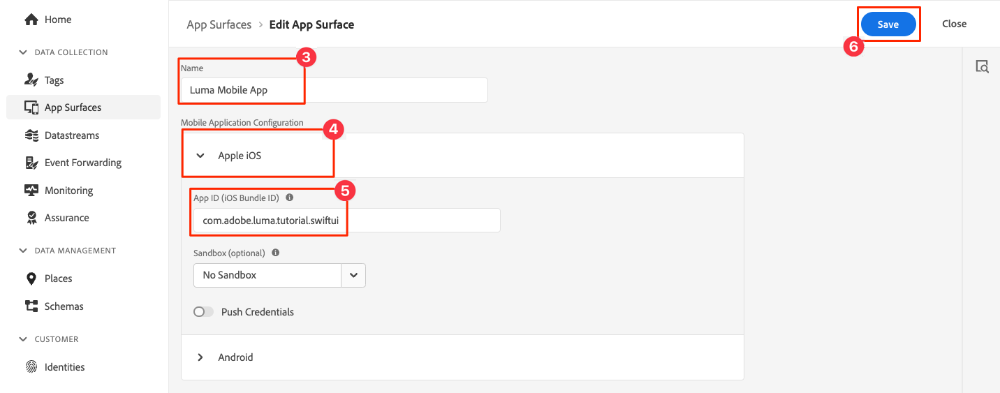
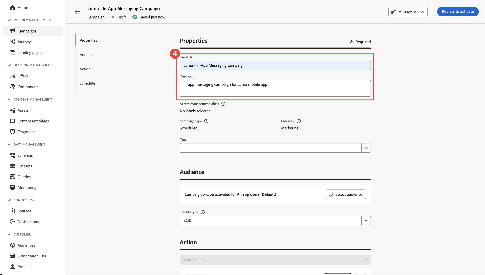

# アプリ内メッセージの作成と送信

Experience PlatformMobile SDK とJourney Optimizerを使用して、モバイルアプリ用のアプリ内メッセージを作成する方法について説明します。

Journey Optimizerでは、ターゲットを絞ったオーディエンスにアプリ内メッセージを送信するキャンペーンを作成できます。 Journey Optimizerのキャンペーンは、様々なチャネルを使用して、特定のオーディエンスに 1 回限りのコンテンツを配信する場合に使用します。 キャンペーンでは、アクションは即座に、または指定したスケジュールに基づいて、同時に実行されます。 ジャーニーを使用する場合 ( [Journey Optimizerプッシュ通知](journey-optimizer-push.md) レッスン ) では、アクションが順に実行されます。


Journey Optimizerでアプリ内メッセージを送信する前に、適切な設定と統合がおこなわれていることを確認する必要があります。 Journey Optimizerのアプリ内メッセージデータフローについては、 [ドキュメント](https://experienceleague.adobe.com/docs/journey-optimizer/using/in-app/inapp-configuration.html?lang=en).

>[!NOTE]
>
>このレッスンはオプションで、アプリ内メッセージの送信を希望するJourney Optimizerユーザーにのみ適用されます。


## 前提条件

* SDK が正常に構築され、インストールされ、設定された状態でアプリが実行されました。
* アプリをAdobe Experience Platform用に設定します。
* Journey Optimizerへのアクセスと十分な権限（説明を参照） [ここ](https://experienceleague.adobe.com/docs/journey-optimizer/using/push/push-config/push-configuration.html). また、次のJourney Optimizer機能に対する十分な権限が必要です。
   * キャンペーンを管理します。
* 物理iOSデバイスまたはテスト用のシミュレーター。


## 学習内容

このレッスンでは、次の操作を行います

* AJO でアプリサーフェスを作成します。
* Journey Optimizerタグ拡張機能をインストールして設定します。
* アプリを更新して、Journey Optimizerタグ拡張を登録します。
* アシュランスで設定を検証します。
* Journey Optimizerで独自のキャンペーンとアプリ内メッセージエクスペリエンスを定義する。
* アプリ内から独自のアプリ内メッセージを送信します。

## セットアップ

>[!TIP]
>
>環境を既に [Journey Optimizerプッシュメッセージ](journey-optimizer-push.md) レッスンでは、このセットアップセクションの手順の一部を既に実行している可能性があります。


### データ収集にアプリケーションサーフェスを追加する

1. 次から： [データ収集インターフェイス](https://experience.adobe.com/data-collection/)を選択します。 **[!UICONTROL アプリのサーフェス]** をクリックします。
1. 設定を作成するには、「 」を選択します。 **[!UICONTROL アプリサーフェスを作成]**.
   
1. を入力します。 **[!UICONTROL 名前]** 設定の場合、例： `Luma App Tutorial`  .
1. 送信者 **[!UICONTROL モバイルアプリケーション設定]**&#x200B;を選択します。 **[!UICONTROL Apple iOS]**.
1. にモバイルアプリのバンドル ID を入力します。 **[!UICONTROL アプリ ID (iOS Bundle ID)]** フィールドに入力します。 例：  `com.adobe.luma.tutorial.swiftui`.
1. 「**[!UICONTROL 保存]**」を選択します。

   

### データストリーム設定を更新

モバイルアプリから Edge ネットワークにデータが確実に送信されるようにするには、Experience Edge の設定を更新します。


1. データ収集 UI で、「 」を選択します。 **[!UICONTROL データストリーム]**&#x200B;を選択し、例えば、データストリームを選択します。 **[!DNL Luma Mobile App]**.
1. 選択  対象： **[!UICONTROL Experience Platform]** を選択し、  **[!UICONTROL 編集]** を選択します。
1. Adobe Analytics の **[!UICONTROL データストリーム]** >  >  **[!UICONTROL Adobe Experience Platform]** スクリーン、確認する **[!UICONTROL Adobe Journey Optimizer]** が選択されている。 詳しくは、 [Adobe Experience Platform設定](https://experienceleague.adobe.com/docs/experience-platform/datastreams/configure.html?lang=en#aep) を参照してください。
1. データストリーム設定を保存するには、 **[!UICONTROL 保存]**.


   


### Journey Optimizer Tags 拡張機能のインストール

アプリがJourney Optimizerで動作するようにするには、タグプロパティを更新する必要があります。

1. に移動します。 **[!UICONTROL タグ]** > **[!UICONTROL 拡張機能]** > **[!UICONTROL カタログ]**.
1. プロパティを開きます（例： ）。 **[!DNL Luma Mobile App Tutorial]**.
1. 選択 **[!UICONTROL カタログ]**.
1. を検索します。 **[!UICONTROL Adobe Journey Optimizer]** 拡張子。
1. 拡張機能をインストールします。
1. Adobe Analytics の **[!UICONTROL 拡張機能のインストール]** ダイアログ
   1. 環境を選択します（例： ）。 **[!UICONTROL 開発]**.
   1. を選択します。 **[!UICONTROL AJO プッシュトラッキングエクスペリエンスイベントデータセット]** データセット **[!UICONTROL イベントデータセット]** リスト。
   1. 選択 **[!UICONTROL ライブラリに保存してビルドする]**.
      

>[!NOTE]
>
>表示されない場合 `AJO Push Tracking Experience Event Dataset` 必要に応じて、カスタマーケアにお問い合わせください。
>

### アプリでのJourney Optimizerの実装

前のレッスンで説明したように、モバイルタグ拡張機能のインストールでは設定のみが提供されます。 次に、メッセージング SDK をインストールして登録する必要があります。 これらの手順が明確でない場合は、 [SDK のインストール](install-sdks.md) 」セクションに入力します。

>[!NOTE]
>
>以下を完了した場合、 [SDK のインストール](install-sdks.md) 」セクションに移動した場合は、SDK が既にインストールされているので、この手順をスキップできます。
>

1. Xcode で、 [AEP メッセージ](https://github.com/adobe/aepsdk-messaging-ios) は、パッケージの依存関係にパッケージのリストに追加されます。 詳しくは、 [Swift Package Manager](install-sdks.md#swift-package-manager).
1. に移動します。 **[!DNL Luma]** > **[!DNL Luma]** > **[!UICONTROL AppDelegate]** 」をクリックします。
1. 確認 `AEPMessaging` は、インポートのリストの一部です。

   `import AEPMessaging`

1. 確認 `Messaging.self` は、登録する拡張機能の配列の一部です。

   ```swift
   let extensions = [
       AEPIdentity.Identity.self,
       Lifecycle.self,
       Signal.self,
       Edge.self,
       AEPEdgeIdentity.Identity.self,
       Consent.self,
       UserProfile.self,
       Places.self,
       Messaging.self,
       Optimize.self,
       Assurance.self
   ]
   ```


## アシュランスを使用して設定を検証

1. 以下を確認します。 [設定手順](assurance.md#connecting-to-a-session) シミュレーターまたはデバイスを Assurance に接続するには、「 」セクションを参照してください。
1. Assurance UI で、 **[!UICONTROL 設定]**.
   
1. を選択します。  隣のボタン **[!UICONTROL アプリ内メッセージ]**.
1. 「**[!UICONTROL 保存]**」を選択します。
   
1. 選択 **[!UICONTROL アプリ内メッセージ]** をクリックします。
1. を選択します。 **[!UICONTROL 検証]** タブをクリックします。 エラーが表示されていないことを確認します。

   


## 独自のアプリ内メッセージの作成

独自のアプリ内メッセージを作成するには、発生したイベントに基づいてアプリ内メッセージをトリガーするキャンペーンをJourney Optimizerで定義する必要があります。 以下のイベントが発生します。

* Adobe Experience Platformに送信されたデータ
* Mobile Core の汎用 API を使用した、PII データのアクション、状態やコレクションなどのコアトラッキングイベント
* アプリケーションのライフサイクルイベント（起動、インストール、アップグレード、閉じる、クラッシュなど）
* 目標地点の入力や終了などの位置情報イベント。

このチュートリアルでは、Mobile Core の汎用 API と拡張機能に依存しない API を使用します ( [Mobile Core 汎用 API](https://developer.adobe.com/client-sdks/documentation/mobile-core/#mobile-core-generic-apis)) を使用して、ユーザー画面、アクションおよび PII データのイベント追跡を容易におこなえます。 これらの API で生成されたイベントは、SDK イベントハブに公開され、拡張機能で使用できます。 SDK イベントハブは、すべての Mobile Platform SDK 拡張機能に関連付けられたコアデータ構造を提供し、登録された拡張機能と内部モジュールのリスト、登録されたイベントリスナーのリスト、共有状態データベースを維持します。

SDK イベントハブは、登録済み拡張機能のイベントデータを公開および受け取り、Adobeやサードパーティソリューションとの統合を簡略化します。 例えば、 Optimize 拡張機能がインストールされている場合、Journey Optimizer - Decision Management オファーエンジンとのすべてのリクエストとインタラクションは、イベントハブによって処理されます。

1. Journey Optimizer UI で、 **[!UICONTROL キャンペーン]** をクリックします。
1. 選択 **[!UICONTROL キャンペーンを作成]**.
1. Adobe Analytics の **[!UICONTROL キャンペーンを作成]** 画面：
   1. 選択 **[!UICONTROL アプリ内メッセージ]** をクリックし、 **[!UICONTROL アプリサーフェス]** 例えば、リスト **[!DNL Luma Mobile App]**.
   1. 選択 **[!UICONTROL 作成]**
      
1. キャンペーンの定義画面で、 **[!UICONTROL プロパティ]**、 **[!UICONTROL 名前]** （例：キャンペーン） `Luma - In-App Messaging Campaign`、および **[!UICONTROL 説明]**&#x200B;例： `In-app messaging campaign for Luma app`.
   
1. 下にスクロールして **[!UICONTROL アクション]**&#x200B;をクリックし、次を選択します。 **[!UICONTROL コンテンツを編集]**.
1. Adobe Analytics の **[!UICONTROL アプリ内メッセージ]** 画面：
   1. 選択 **[!UICONTROL モーダル]** として **[!UICONTROL メッセージのレイアウト]**.
   2. 入力 `https://luma.enablementadobe.com/content/dam/luma/en/logos/Luma_Logo.png` （の） **[!UICONTROL メディア URL]**.
   3. を入力します。 **[!UICONTROL ヘッダー]**&#x200B;例： `Welcome to this Luma In-App Message` を入力し、 **[!UICONTROL 本文]**&#x200B;例： `Triggered by pushing that button in the app...`.
   4. 入力 **[!UICONTROL 解除]** として **[!UICONTROL ボタン#1テキスト（プライマリ）]**.
   5. プレビューの更新方法を確認します。
   6. 選択 **[!UICONTROL 有効化するレビュー]**.
      
1. Adobe Analytics の **[!UICONTROL 有効化のレビュー（Luma — アプリ内メッセージキャンペーン）]** 画面、選択  （内） **[!UICONTROL スケジュール]** タイル。
   
1. 戻る **[!DNL Luma - In-App Messaging Campaign]** 画面、選択  **[!UICONTROL 編集トリガー]**.
1. Adobe Analytics の **[!UICONTROL アプリ内メッセージトリガー]** ダイアログで、アプリ内メッセージをトリガーにするトラックアクションの詳細を設定します。
   1. 削除するには **[!UICONTROL アプリケーション起動イベント]**&#x200B;を選択します。  .
   1. 用途  **[!UICONTROL 条件を追加]** 次の論理を繰り返し構築する **[!UICONTROL 次の場合にメッセージを表示]**.
   1. 「**[!UICONTROL 完了]**」をクリックします。
      

   トラックアクションを定義し、 **[!UICONTROL アクション]** 次と等しい `in-app` そして **[!UICONTROL コンテキストデータ]** がのキーと値のペア `"showMessage" : "true"`.

1. 戻る **[!DNL Luma - In-App Messaging Campaign]** 画面、選択 **[!UICONTROL 有効化するレビュー]**.
1. Adobe Analytics の **[!UICONTROL 有効化のレビュー（Luma — アプリ内メッセージキャンペーン）]** 画面、選択 **[!UICONTROL 有効化]**.
1. 表示される **[!DNL Luma - In-App Messaging Campaign]** ステータス別 **[!UICONTROL ライブ]** （内） **[!UICONTROL キャンペーン]** リスト。
   


## アプリ内メッセージのトリガー

アプリ内メッセージを送信するためのすべての材料が揃っています。 残りの点は、アプリでこのアプリ内メッセージにトリガーを設定する方法です。

1. に移動します。 **[!DNL Luma]** > **[!DNL Luma]** > **[!DNL Utils]** > **[!UICONTROL MobileSDK]** 」をクリックします。 次を検索： `func sendTrackAction(action: String, data: [String: Any]?)` 関数を呼び出し、次のコードを追加します。このコードは、 [`MobileCore.track`](https://developer.adobe.com/client-sdks/documentation/mobile-core/api-reference/#trackaction) 関数、パラメーターに基づく `action` および `data`.


   ```swift
   // Send trackAction event
   MobileCore.track(action: action, data: data)
   ```

1. に移動します。 **[!DNL Luma]** > **[!DNL Luma]** > **[!DNL Views]** > **[!DNL General]** > **[!UICONTROL ConfigView]** をクリックします。 アプリ内メッセージボタンのコードを探し、次のコードを追加します。

   ```swift
   // Setting parameters and calling function to send in-app message
   Task {
       MobileSDK.shared.sendTrackAction(action: "in-app", data: ["showMessage": "true"])
   }
   ```

## アプリを使用した検証

1. を使用して、シミュレーターまたは Xcode の物理デバイスでアプリを再構築し、実行します。 .

1. 次に移動： **[!UICONTROL 設定]** タブをクリックします。

1. タップ **[!UICONTROL アプリ内メッセージ]**. アプリ内メッセージがアプリに表示されます。

   


## アシュランスでの実装の検証

Assurance UI でアプリ内メッセージを検証できます。

1. 以下を確認します。 [設定手順](assurance.md#connecting-to-a-session) シミュレーターまたはデバイスを Assurance に接続するには、「 」セクションを参照してください。
1. 選択 **[!UICONTROL アプリ内メッセージ]**.
1. 選択 **[!UICONTROL イベントリスト]**.
1. を選択します。 **[!UICONTROL メッセージを表示]** エントリ。
1. Inspect未加工のイベント、特に `html`：アプリ内メッセージの完全なレイアウトとコンテンツを含む。
   


## 次の手順

これで、関連する適用可能なアプリ内メッセージの追加を開始するためのすべてのツールが用意されました。 例えば、アプリ内で追跡している特定のインタラクションに基づいて製品をプロモーションする場合などです。

>[!SUCCESS]
>
>アプリでアプリ内メッセージを有効にし、Experience PlatformMobile SDK 用のJourney OptimizerとJourney Optimizer拡張機能を使用して、アプリ内メッセージキャンペーンを追加しました。
>
>Adobe Experience Platform Mobile SDK の学習に時間を割いていただき、ありがとうございます。 ご質問がある場合、一般的なフィードバックを共有する場合、または今後のコンテンツに関する提案がある場合は、このドキュメントで共有します [Experience Leagueコミュニティディスカッション投稿](https://experienceleaguecommunities.adobe.com/t5/adobe-experience-platform-data/tutorial-discussion-implement-adobe-experience-cloud-in-mobile/td-p/443796).

次へ： **[オファーの作成と表示](journey-optimizer-offers.md)**
