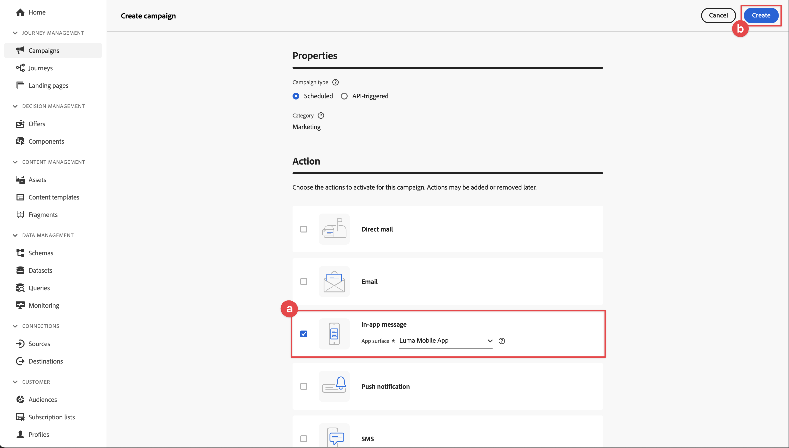

# アプリ内メッセージの作成と送信

Experience Platform Mobile SDKとJourney Optimizerを使用して、モバイルアプリ用のアプリ内メッセージを作成する方法を説明します。

Journey Optimizerでは、ターゲットオーディエンスにアプリ内メッセージを送信するキャンペーンを作成できます。 Journey Optimizerのキャンペーンは、様々なチャネルを使用して、特定のオーディエンスに 1 回限りのコンテンツを配信するために使用します。 キャンペーンでは、アクションは指定したスケジュールに基づいて同時にまたは即時に実行されます。 ジャーニーを使用すると（[Journey Optimizerのプッシュ通知 ](journey-optimizer-push.md) レッスンを参照）、アクションが順番に実行されます。


Journey Optimizerでアプリ内メッセージを送信する前に、適切な設定と統合が行われていることを確認する必要があります。 Journey Optimizerのアプリ内メッセージデータフローについては、[ ドキュメント ](https://experienceleague.adobe.com/docs/journey-optimizer/using/in-app/inapp-configuration.html?lang=en) を参照してください。

>[!NOTE]
>
>このレッスンはオプションで、アプリ内メッセージの送信を検討しているJourney Optimizer ユーザーにのみ適用されます。


## 前提条件

* SDK がインストールおよび設定された状態で、アプリケーションが正常に構築および実行されました。
* Adobe Experience Platform用にアプリを設定します。
* Journey Optimizerへのアクセスと、説明に従った十分な権限 [ こちら ](https://experienceleague.adobe.com/docs/journey-optimizer/using/push/push-config/push-configuration.html)。 また、次のJourney Optimizer機能に対する十分な権限も必要です。
   * キャンペーンの管理。
* テスト用の物理的なiOSデバイスまたはシミュレーター。


## 学習目標

このレッスンでは、次の操作を行います

* AJOでアプリサーフェスを作成します。
* Journey Optimizer タグ拡張機能をインストールして設定します。
* アプリを更新して、Journey Optimizer タグ拡張機能を登録します。
* Assuranceの設定を検証します。
* Journey Optimizerで独自のキャンペーンおよびアプリ内メッセージエクスペリエンスを定義します。
* アプリ内から独自のアプリ内メッセージを送信します。

## セットアップ

>[!TIP]
>
>[Journey Optimizer プッシュメッセージ ](journey-optimizer-push.md) レッスンの一部として既に環境を設定している場合は、この設定の節の手順のいくつかが既に実行されている可能性があります。


### Journey Optimizerでのチャネル設定の作成

まず、Journey Optimizerからアプリのメッセージ通知を送信できるように、チャネル設定を作成する必要があります。

1. Journey Optimizer インターフェイスで、**[!UICONTROL チャンネル]**/**[!UICONTROL 一般設定]**/**[!UICONTROL チャンネル設定]** メニューを開き、「**[!UICONTROL チャンネル設定を作成]**」を選択します。

   

1. 設定の名前と説明（オプション）を入力します。

   >[!NOTE]
   >
   > 名前は、文字（A ～ Z）で始める必要があります。使用できるのは英数字のみです。アンダースコア（`_`）、ドット（`.`）、ハイフン（`-`）も使用できます。


1. 設定にカスタムまたはコアのデータ使用ラベルを割り当てるには、「**[!UICONTROL アクセスを管理]**」を選択します。[詳しくは、オブジェクトレベルのアクセス制御（OLAC）を参照してください](https://experienceleague.adobe.com/en/docs/journey-optimizer/using/access-control/object-based-access)。

1. **アプリ内メッセージ** チャネルを選択します。

1. この設定を使用してメッセージに同意ポリシーを関連付けるには、**[!UICONTROL マーケティングアクション]**&#x200B;を選択します。顧客の環境設定に従うために、そのマーケティングアクションに関連付けられているすべての同意ポリシーが活用されます。[ マーケティングアクションの詳細情報 ](https://experienceleague.adobe.com/en/docs/journey-optimizer/using/privacy/consent/consent#surface-marketing-actions)。

1. 設定を定義するプラットフォームを選択します。 これにより、各プラットフォームに対してターゲットアプリを指定し、複数のプラットフォームをまたいで一貫したコンテンツ配信を確保できます。

   >[!NOTE]
   >
   >iOS および Android プラットフォームの場合、配信はアプリ ID のみに基づきます。両方のアプリが同じアプリ ID を共有している場合、**[!UICONTROL チャネル設定]**&#x200B;で選択したプラットフォームに関係なく、コンテンツは両方に配信されます。

1. 「**[!UICONTROL 送信]**」を選択して変更を保存します。

   

### データストリーム設定を更新

モバイルアプリから Experience Edgeにデータが転送されるようにするには、Edge NetworkJourney Optimizerの設定を更新する必要があります。


1. データ収集 UI で「**[!UICONTROL データストリーム]**」を選択し、データストリームを選択します（例：**[!DNL Luma Mobile App]**）。
1.  の「詳細 ]**」を選択し、コンテキストメニューから **[!UICONTROL  編集 ]**を選択します。**[!UICONTROL 
1. **[!UICONTROL データストリーム]**//**[!UICONTROL Adobe Experience Platform]** 画面で、「**[!UICONTROL Adobe Journey Optimizer]**」が選択されていることを確認します。 詳しくは、[Adobe Experience Platform](https://experienceleague.adobe.com/docs/experience-platform/datastreams/configure.html?lang=en#aep) 設定を参照してください。
1. データストリーム設定を保存するには、「**[!UICONTROL 保存]**」を選択します。


   


### Journey Optimizer タグ拡張機能のインストール

アプリがJourney Optimizerと連携するには、タグプロパティを更新する必要があります。

1. **[!UICONTROL タグ]**/**[!UICONTROL 拡張機能]**/**[!UICONTROL カタログ]** に移動します。
1. プロパティを開きます（例：**[!DNL Luma Mobile App Tutorial]**）。
1. **[!UICONTROL カタログ]** を選択します。
1. **[!UICONTROL Adobe Journey Optimizer]** 拡張機能を検索します。
1. 拡張機能をインストールします。

*のみ* アプリでアプリ内メッセージを使用する場合、**[!UICONTROL 拡張機能のインストール]** または **[!UICONTROL 拡張機能の設定]** では、何も設定する必要はありません。 ただし、このチュートリアルの [ プッシュ通知 ](journey-optimizer-push.md) レッスンを既に完了している場合は、**[!UICONTROL 開発]** 環境で、**[!UICONTROL AJO プッシュトラッキングエクスペリエンスイベントデータセット]** データセットが **[!UICONTROL イベントデータセット]** リストから選択されていることがわかります。


### アプリへのJourney Optimizerの実装

前のレッスンで説明したように、モバイルタグ拡張機能をインストールしても、設定のみが提供されます。 次に、Messaging SDKをインストールして登録します。 これらの手順が明確でない場合は、「SDK のインストール [ の節を参照し ](install-sdks.md) ください。

>[!NOTE]
>
>[SDK のインストール ](install-sdks.md) の節を完了した場合、SDKは既にインストールされているので、この手順をスキップできます。
>

1. Xcode で、[AEP Messaging](https://github.com/adobe/aepsdk-messaging-ios) がパッケージの依存関係のパッケージの一覧に追加されていることを確認します。 [Swift パッケージマネージャー ](install-sdks.md#swift-package-manager) を参照してください。
1. Xcode プロジェクトナビゲーターで **[!DNL Luma]**/**[!DNL Luma]**/**[!UICONTROL AppDelegate]** に移動します。
1. `AEPMessaging` が読み込みのリストに含まれていることを確認します。

   `import AEPMessaging`

1. `Messaging.self` が、登録している拡張機能の配列の一部であることを確認します。

   ```swift
   let extensions = [
       AEPIdentity.Identity.self,
       Lifecycle.self,
       Signal.self,
       Edge.self,
       AEPEdgeIdentity.Identity.self,
       Consent.self,
       UserProfile.self,
       Places.self,
       Messaging.self,
       Optimize.self,
       Assurance.self
   ]
   ```


## Assuranceでの設定の検証

1. [ 設定手順 ](assurance.md#connecting-to-a-session) の節を参照して、シミュレーターまたはデバイスをAssuranceに接続します。
1. Assurance UI で、「**[!UICONTROL 設定]**」を選択します。
   
1. **[!UICONTROL アプリ内メッセージ]** の横にある「」ボタンを選択します。
1. 「**[!UICONTROL 保存]**」を選択します。
   
1. 左側のナビゲーションから **[!UICONTROL アプリ内メッセージ]** を選択します。
1. 「**[!UICONTROL 検証]**」タブを選択します。 エラーがないことを確認します。

   


## 独自のアプリ内メッセージの作成

独自のアプリ内メッセージを作成するには、発生したイベントに基づいてアプリ内メッセージをトリガーにするキャンペーンをJourney Optimizerで定義する必要があります。 次のイベントがあります。

* Adobe Experience Platformに送信されるデータ
* mobile Core の汎用 API を使用した、アクションなどのコアトラッキングイベント、または PII データの状態や収集、
* アプリケーション・ライフサイクル・イベント（起動、インストール、アップグレード、終了、クラッシュなど）
* ジオロケーションイベント（目標点へのエントリや離脱など）。

このチュートリアルでは、Mobile Core の汎用 API と拡張機能に依存しない API （[Mobile Core の汎用 API](https://developer.adobe.com/client-sdks/documentation/mobile-core/#mobile-core-generic-apis) を参照）を使用して、ユーザー画面、アクション、PII データのイベントを簡単に追跡できるようにします。 これらの API で生成されたイベントは、SDK イベントハブに公開され、拡張機能で使用できます。 SDK イベントハブは、すべての Mobile Platform SDK拡張機能に関連付けられたコアデータ構造を提供し、登録済みの拡張機能と内部モジュールのリスト、登録済みのイベントリスナーのリスト、および共有状態データベースを維持管理します。

SDK イベントハブは、Adobeやサードパーティソリューションとの統合を容易にするために、登録された拡張機能からイベントデータを公開および受け取ります。 例えば、「最適化」拡張機能がインストールされている場合、Journey Optimizer - Decision Management オファーエンジンに対するすべてのリクエストとインタラクションは、イベントハブで処理されます。

1. Journey Optimizer UI の左パネルで「**[!UICONTROL キャンペーン]**」をクリックします。
1. **[!UICONTROL キャンペーンを作成]** を選択します。
1. **[!UICONTROL キャンペーンを作成]** 画面で、次の操作を行います。
   1. 「**[!UICONTROL アプリ内メッセージ]**」を選択し、「**[!UICONTROL アプリサーフェス]**」リストからアプリサーフェス（例：**[!DNL Luma Mobile App]**）を選択します。
   1. 「**[!UICONTROL 作成]**」を選択します。
      
1. キャンペーン定義画面の **[!UICONTROL プロパティ]** で、キャンペーンの **[!UICONTROL 名前]** （例：`Luma - In-App Messaging Campaign`）と **[!UICONTROL 説明]** （例：`In-app messaging campaign for Luma app`）を入力します。
   
1. **[!UICONTROL アクション]** までスクロールし、「**[!UICONTROL コンテンツを編集]**」を選択します。
1. **[!UICONTROL アプリ内メッセージ]** 画面で、次の操作を行います。
   1. **[!UICONTROL メッセージレイアウト]** として **[!UICONTROL モーダル]** を選択します。
   2. **[!UICONTROL メディア URL]** の `https://luma.enablementadobe.com/content/dam/luma/en/logos/Luma_Logo.png` を入力します。
   3. **[!UICONTROL Header]** （例：`Welcome to this Luma In-App Message`）を入力し、**[!UICONTROL Body]** （例：`Triggered by pushing that button in the app...`）を入力します。
   4. **[!UICONTROL ボタンの#1 のテキスト]** プライマリ） **** として「解除」と入力します。
   5. プレビューの更新方法に注意してください。
   6. 「**[!UICONTROL アクティブ化するレビュー]**」を選択します。
      
1. **[!UICONTROL アクティブ化するレビュー（Luma - アプリ内メッセージキャンペーン）画面]****[!UICONTROL スケジュール ](https://spectrum.adobe.com/static/icons/workflow_18/Smock_Edit_18_N.svg) タイルの ![ 編集]** を選択します。
   
1. **[!DNL Luma - In-App Messaging Campaign]** 画面に戻り、「**[!UICONTROL トリガーを編集]** を選択します。
1. **[!UICONTROL アプリ内メッセージのトリガー]** ダイアログでは、アプリ内メッセージをトリガーにするトラックアクションの詳細を設定します。
   1. **[!UICONTROL アプリケーションの起動イベント]** を削除するには、「」を選択します。
   1. **[!UICONTROL Add 条件]** を繰り返し使用して、「次の場合にメッセージを表示 **[!UICONTROL のロジックを作成し]** す。
   1. 「**[!UICONTROL 完了]**」をクリックします。
      

   **[!UICONTROL Action]** が `in-app` に等しく、**[!UICONTROL コンテキストデータ]** が `"showMessage" : "true"` のキー値ペアである追跡アクションを定義しました。

1. **[!DNL Luma - In-App Messaging Campaign]** の画面に戻り、「アクティブ化するレビュー **[!UICONTROL を選択し]** す。
1. **[!UICONTROL アクティブ化するレビュー（Luma - アプリ内メッセージキャンペーン）画面で]** 「**[!UICONTROL アクティブ化]**」を選択します。
1. ステータスが **[!UICONTROL ライブ]** の **[!DNL Luma - In-App Messaging Campaign]** が **[!UICONTROL キャンペーン]** リストに表示されます。
   


## アプリ内メッセージのトリガー

アプリ内メッセージを送信するための材料がすべて用意されています。 残っているのは、アプリにこのアプリ内メッセージをトリガーする方法です。

1. Xcode プロジェクトナビゲーターで **[!DNL Luma]**/**[!DNL Luma]**/**[!DNL Utils]**/**[!UICONTROL MobileSDK]** に移動します。 `func sendTrackAction(action: String, data: [String: Any]?)` 関数を検索し、パラメーター `action` および `data` に基づいて [`MobileCore.track`](https://developer.adobe.com/client-sdks/documentation/mobile-core/api-reference/#trackaction) 関数を呼び出す次のコードを追加します。


   ```swift
   // Send trackAction event
   MobileCore.track(action: action, data: data)
   ```

1. Xcode プロジェクトナビゲーターで **[!DNL Luma]** / **[!DNL Luma]** / **[!DNL Views]** / **[!DNL General]** / **[!UICONTROL ConfigView]** に移動します。 アプリ内メッセージ ボタンのコードを見つけて、次のコードを追加します。

   ```swift
   // Setting parameters and calling function to send in-app message
   Task {
       MobileSDK.shared.sendTrackAction(action: "in-app", data: ["showMessage": "true"])
   }
   ```

## アプリを使用した検証

1.  を使用して、シミュレータまたは Xcode の物理デバイスでアプリを再構築して実行します。

1. 「**[!UICONTROL 設定]**」タブに移動します。

1. **[!UICONTROL アプリ内メッセージ]** をタップします。 アプリ内メッセージがアプリに表示されます。

   


## Assuranceでの実装の検証

Assurance UI でアプリ内メッセージを検証できます。

1. [ 設定手順 ](assurance.md#connecting-to-a-session) の節を参照して、シミュレーターまたはデバイスをAssuranceに接続します。
1. 「**[!UICONTROL アプリ内メッセージ]**」を選択します。
1. **[!UICONTROL イベントリスト]** を選択します。
1. **[!UICONTROL メッセージを表示]** エントリを選択します。
1. 生のイベント（特に、アプリ内メッセージの完全なレイアウトとコンテンツを含む `html`）を検査します。
   


## 次の手順

これで、関連する該当する場合は、アプリ内メッセージの追加を開始するためのすべてのツールが用意できました。 例えば、アプリで追跡している特定のインタラクションに基づいて製品をプロモーションする場合などです。

>[!SUCCESS]
>
>アプリ内メッセージ用にアプリを有効にし、Journey Optimizerと、Experience Platform Mobile SDK用のJourney Optimizer拡張機能を使用して、アプリ内メッセージキャンペーンを追加しました。
>
>Adobe Experience Platform Mobile SDKの学習にご協力いただき、ありがとうございます。 ご不明な点がある場合や、一般的なフィードバックをお寄せになる場合、または今後のコンテンツに関するご提案がある場合は、この [Experience League Community Discussion の投稿 ](https://experienceleaguecommunities.adobe.com/t5/adobe-experience-platform-data/tutorial-discussion-implement-adobe-experience-cloud-in-mobile/td-p/443796) でお知らせください。

次のトピック：**[オファーの作成および表示](journey-optimizer-offers.md)**
