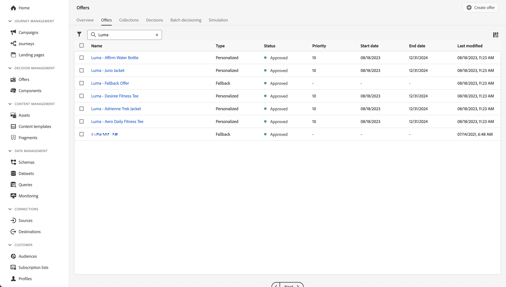

# 意思決定管理によるオファーの作成および表示

Experience Platform モバイル SDKを使用して、モバイルアプリにJourney Optimizer Decision Management からのオファーを表示する方法を説明します。

Journey Optimizerの意思決定管理は、すべてのタッチポイントをまたいで、適切なタイミングで最高のオファーとエクスペリエンスを顧客に提供するのに役立ちます。 設計を終えたら、パーソナライズされたオファーを使用してオーディエンスをターゲットに設定します。

{zoomable="yes"}

意思決定管理では、マーケティングオファーの一元化されたライブラリと、Adobe Experience Platformで作成されるリッチなリアルタイムプロファイルにルールと制約を適用する意思決定エンジンにより、パーソナライゼーションを簡単にします。 その結果、顧客に適切なオファーを適切なタイミングで送信できます。 詳しくは [ 意思決定管理について ](https://experienceleague.adobe.com/ja/docs/journey-optimizer/using/decisioning/offer-decisioning/get-started-decision/starting-offer-decisioning) を参照してください。


>[!NOTE]
>
>このレッスンはオプションで、意思決定管理機能を使用してモバイルアプリにオファーを表示することを検討しているJourney Optimizer ユーザーにのみ適用されます。


## 前提条件

* SDK がインストールおよび設定された状態で、アプリケーションが正常に構築および実行されました。
* Adobe Experience Platform用にアプリを設定します。
* Journey Optimizerへのアクセス - [ オファーと意思決定を管理する適切な権限 ](https://experienceleague.adobe.com/en/docs/journey-optimizer/using/access-control/high-low-permissions) を持つ意思決定管理。


## 学習目標

このレッスンでは、次の操作を行います

* 意思決定管理のEdge設定を更新します。
* Offer Decisioningと Target の拡張機能を使用してタグプロパティを更新します。
* 提案イベントを取り込むには、スキーマを更新します。
* Assuranceの設定を検証します。
* Journey Optimizer - Decision Management のオファーに基づいて、オファーの決定を作成します。
* アプリを更新して、Optimizer 拡張機能を登録します。
* アプリに意思決定管理のオファーを実装。


## セットアップ

>[!TIP]
>
>[Target を使用した A/B テストのセットアップ ](target.md) レッスンの一部として既に環境をセットアップしている場合は、このセットアップの節の手順のいくつかが既に実行されている可能性があります。

### データストリーム設定を更新

モバイルアプリから Platform Edge Networkに送信されたデータがJourney Optimizer - Decision Management に転送されるようにするには、データストリームを更新します。

1. データ収集 UI で「**[!UICONTROL データストリーム]**」を選択し、データストリームを選択します（例：**[!DNL Luma Mobile App]**）。
1.  の「詳細 **[!UICONTROL 」を選択し、コンテキストメニューから]** 編集  編集 **[!UICONTROL を選択します。]**
1. **[!UICONTROL データストリーム]**//**[!UICONTROL Adobe Experience Platform]** 画面で、**[!UICONTROL Offer Decisioning]**、**[!UICONTROL Edge セグメント化]**、**[!UICONTROL Adobe Journey Optimizer]** が選択されていることを確認します。 Target レッスンを行う場合は、「**[!UICONTROL Personalizationの宛先]**」も選択します。 詳しくは、[Adobe Experience Platform](https://experienceleague.adobe.com/ja/docs/experience-platform/datastreams/configure) 設定を参照してください。
1. データストリーム設定を保存するには、「**[!UICONTROL 保存]**」を選択します。

   {zoomable="yes"}


### Offer Decisioningと Target のタグ拡張機能のインストール

1. **[!UICONTROL タグ]** に移動し、モバイルタグプロパティを見つけてプロパティを開きます。
1. **[!UICONTROL 拡張機能]** を選択します。
1. **[!UICONTROL カタログ]** を選択します。
1. **[!UICONTROL Offer Decisioningと Target]** 拡張機能を検索します。
1. 拡張機能をインストールします。 拡張機能では、追加の設定は必要ありません。

   {zoomable="yes"}


### スキーマを更新

1. データ収集インターフェイスに移動し、左パネルから **[!UICONTROL スキーマ]** を選択します。
1. 上部のバーから **[!UICONTROL 参照]** を選択します。
1. スキーマを選択して開きます。
1. スキーマエディターで、「フィールドグループ」の横にある「**[!UICONTROL 追加]** を選択します。
1. **[!UICONTROL フィールドグループを追加]** ダイアログの `proposition` を検索し、**[!UICONTROL エクスペリエンスイベント – 提案インタラクション]** と **[!UICONTROL フィールドグループを追加]** を選択します。 このフィールドグループは、オファーに関連するエクスペリエンスイベントデータ（提示されるオファーなど）を、どの収集、決定、その他のパラメーターの一部として収集します（このレッスンの後半を参照）。 しかし、また、オファーには何が起こっていますか？ 表示、インタラクション、却下などが行われますか？
   {zoomable="yes"}
1. 「**[!UICONTROL 保存]**」を選択して、スキーマに対する変更を保存します。


## Assuranceでの設定の検証

Assuranceの設定を検証するには：

1. Assurance UI に移動します。
1. 左側のパネルで **[!UICONTROL 設定]** を選択し、&lbrace;6 の下にある **[!UICONTROL 設定を検証]** の横にある「追加 **[!UICONTROL を選択します。]**
1. 「**[!UICONTROL 保存]**」を選択します。
1. 左パネルで **[!UICONTROL 設定を検証]** を選択します。 アプリケーションでのデータストリーム設定とSDK設定の両方が検証されます。
   {zoomable="yes"}


## プレースメントを作成

実際にオファーを作成する前に、モバイルアプリでこれらのオファーを配置する方法と場所を定義する必要があります。 意思決定管理では、この用途に合わせたプレースメントを定義し、JSON ペイロードをサポートするモバイルチャネル用のプレースメントを定義します。

1. Journey Optimizer UI の左パネルで、「**[!UICONTROL から「コンポーネント]**&#x200B;**[!UICONTROL コンポーネント]** を選択します。

1. 上部バーの「**[!UICONTROL プレースメント]**」を選択します。

1. 名前が **[!UICONTROL モバイル JSON]**、**[!UICONTROL モバイル]** が **[!UICONTROL チャネルタイプ]**、**[!UICONTROL JSON]** が **[!UICONTROL コンテンツタイプ]** のプレースメントが表示されない場合は、プレースメントを作成する必要があります。 それ以外の場合は、引き続き [ オファーを作成 ](#create-offers) します。

モバイル JSON プレースメントを作成するには：

1. 「 プレースメントを作成」を選択します。

   1. 「**[!UICONTROL 詳細]**」セクションで、「`Mobile JSON` 名前 **[!UICONTROL 」に「]**」と入力し、「**[!UICONTROL チャネルタイプ]**」から「**[!UICONTROL モバイル]**」を選択し、「**[!UICONTROL コンテンツタイプ]**」から「**[!UICONTROL JSON]**」を選択します。
   1. 「**[!UICONTROL 保存]**」を選択して、プレースメントを保存します。

   {zoomable="yes"}


## オファーの作成

1. Journey Optimizer UI の左パネルで、「」から「**[!UICONTROL オファー]**&#x200B;**[!UICONTROL オファー]** を選択します。
1. **[!UICONTROL オファー]** 画面で、「**[!UICONTROL 参照]** を選択して、オファーのリストを表示します。
1. **[!UICONTROL オファーを作成]** を選択します。
1. **[!UICONTROL 新しいオファー]** ダイアログで、「**[!UICONTROL パーソナライズされたオファー]**」を選択し、「次へ **[!UICONTROL をクリックし]** す。
1. **[!UICONTROL 新しいパーソナライズされたオファーを作成]** の **[!UICONTROL 詳細]** 手順で、次の操作を行います。
   1. オファーの **[!UICONTROL 名前]** （例：`Luma - Juno Jacket`）を入力し、**[!UICONTROL 開始日時]** および **[!UICONTROL 終了日時]** を入力します。 決定エンジンでは、これらの日付内のオファーのみが選択されます。
   1. 「**[!UICONTROL 次へ]**」を選択します。
      {zoomable="yes"}

1. **[!UICONTROL 新しいパーソナライズされたオファーを作成]** の **[!UICONTROL 表示域を追加]** 手順で、以下を行います。
   1.  リストから **[!UICONTROL モバイル]**&#x200B;**[!UICONTROL モバイル]** を選択し、**[!UICONTROL プレースメント]** リストから **[!UICONTROL モバイル JSON]** を選択します。
   1. **[!UICONTROL コンテンツ]** に **[!UICONTROL カスタム]** を選択します。
   1. **[!UICONTROL コンテンツを追加]** を選択します。 **[!UICONTROL パーソナライゼーションを追加]** ダイアログで、次の手順を実行します。
      1. [!UICONTROL &#x200B; モード &#x200B;] セレクターが使用可能な場合は、そのセレクターが **[!UICONTROL JSON]** に設定されていることを確認します。
      1. 次の JSON を入力します。

         ```json
         { 
             "title": "Juno Jacket",
             "text": "On colder-than-comfortable mornings, you'll love warming up in the Juno All-Ways Performance Jacket, designed to compete with wind and chill. Built-in Cocona&trade; technology aids evaporation, while a special zip placket and stand-up collar keep your neck protected.", 
             "image": "https://luma.enablementadobe.com/content/dam/luma/en/products/women/tops/jackets/wj06-purple_main.jpg" 
         }  
         ```

      1. 「**[!UICONTROL 保存]**」を選択します。
         {zoomable="yes"}
   1. 「**[!UICONTROL 次へ]**」を選択します。
      {zoomable="yes"}

1. **[!UICONTROL 新しいパーソナライズされたオファーを作成]** の **[!UICONTROL 制約を追加]** 手順で、以下を行います。
   1. **[!UICONTROL 優先度]** を `10` に設定します。
   1. **[!UICONTROL キャッピングを含める]** をオフに切り替えます。
   1. 「**[!UICONTROL 次へ]**」を選択します。
      {zoomable="yes"}

1. **[!UICONTROL 新しいパーソナライズされたオファーを作成]** の **[!UICONTROL レビュー]** 手順で、次の操作を行います。
   1. オファーを確認し、「**[!UICONTROL 終了]**」を選択します。
   1. **[!UICONTROL オファーを保存]** ダイアログで、「**[!UICONTROL 保存して承認]**」を選択します。

1. 手順 3～8 を繰り返し、異なる名前とコンテンツを持つさらに 4 つのオファーを作成します。 開始日時や優先度などのその他の設定値はすべて、最初に作成したオファーに似ています。 重複するオファーをすばやく作成して編集できます。

   1. Journey Optimizerの UI で、左側のレールから **[!UICONTROL オファー]** を選択したあと、上部のバーから「オファー」を選択します。
   1. 作成したオファーの行を選択します。
   1. 右側のペインで **[!UICONTROL その他のアクション]** を選択し、コンテキストメニューから  **[!UICONTROL 複製]** を選択します。

      次の表を使用して、他の 4 つのオファーを定義します。

      | オファー名 | JSON 形式のオファーコンテンツ |
      |---|---|
      | Luma – 水ボトルを肯定 | `{ "title": "Affirm Water Bottle", "text": "You'll stay hydrated with ease with the Affirm Water Bottle by your side or in hand. Measurements on the outside help you keep track of how much you're drinking, while the screw-top lid prevents spills. A metal carabiner clip allows you to attach it to the outside of a backpack or bag for easy access.", "image": "https://luma.enablementadobe.com/content/dam/luma/en/products/gear/fitness-equipment/ug06-lb-0.jpg" }` |
      | Luma - Desiree フィットネス Tee | `{ "title": "Desiree Fitness Tee", "text": "When you're too far to turn back, thank yourself for choosing the Desiree Fitness Tee. Its ultra-lightweight, ultra-breathable fabric wicks sweat away from your body and helps keeps you cool for the distance.", "image": "https://luma.enablementadobe.com/content/dam/luma/en/products/women/tops/tees/ws05-yellow_main.jpg" }` |
      | Luma - Adrienne Trek ジャケット | `{ "title": "Adrienne Trek Jacket", "text": "You're ready for a cross-country jog or a coffee on the patio in the Adrienne Trek Jacket. Its style is unique with stand collar and drawstrings, and it fits like a jacket should.", "image": "https://luma.enablementadobe.com/content/dam/luma/en/products/women/tops/jackets/wj08-gray_main.jpg" }` |
      | Luma - Aero デイリーフィットネス Tee | `{ "title": "Aero Daily Fitness Tee", "text": "Need an everyday action tee that helps keep you dry? The Aero Daily Fitness Tee is made of 100% polyester wicking knit that funnels moisture away from your skin. Don't be fooled by its classic style; this tee hides premium performance technology beneath its unassuming look.", "image": "https://luma.enablementadobe.com/content/dam/luma/en/products/men/tops/tees/ms01-black_main.jpg" }` |

      {style="table-layout:fixed"}

1. 最後の手順として、フォールバックオファーを作成する必要があります。これは、顧客が他のオファーの対象でない場合に顧客に送信されるオファーです。
   1. **[!UICONTROL オファーを作成]** を選択します。
   1. **[!UICONTROL 新規オファー]** ダイアログで、「**[!UICONTROL パーソナライズされたオファー]**」を選択し、「**[!UICONTROL 次へ]**」を選択します。
   1. **[!UICONTROL 新しいフォールバックオファーを作成]** の **[!UICONTROL 詳細]** 手順で、オファーの **[!UICONTROL 名前]** （例：`Luma - Fallback Offer`）を入力し、「**[!UICONTROL 次へ]**」を選択します。

   1. **[!UICONTROL 新しいフォールバックオファーを作成]** の **[!UICONTROL 表示域を追加]** 手順で、以下を行います。
      1.  リストから **[!UICONTROL モバイル]**&#x200B;**[!UICONTROL モバイル]** を選択し、**[!UICONTROL プレースメント]** リストから **[!UICONTROL モバイル JSON]** を選択します。
      1. **[!UICONTROL コンテンツ]** に **[!UICONTROL カスタム]** を選択します。
      1. **[!UICONTROL コンテンツを追加]** を選択します。
      1. **[!UICONTROL パーソナライゼーションを追加]** ダイアログで、次の JSON を入力して「**[!UICONTROL 保存]**」を選択します。

         ```json
         {  
            "title": "Luma",
            "text": "Your store for sports wear and equipment.", 
            "image": "https://luma.enablementadobe.com/content/dam/luma/en/logos/Luma_Logo.png" 
         }  
         ```

      1. 「**[!UICONTROL 次へ]**」を選択します。


1. **[!UICONTROL 新しいフォールバックを作成]** オファーの **[!UICONTROL レビュー]** 手順で、次の操作を行います。
   1. オファーを確認し、「**[!UICONTROL 終了]**」を選択します。
   1. **[!UICONTROL オファーを保存]** ダイアログで、「**[!UICONTROL 保存して承認]**」を選択します。

これで、次のオファーリストが表示されます。
{zoomable="yes"}


## コレクションの作成

モバイルアプリユーザーにオファーを提示するには、作成した 1 つ以上のオファーで構成されるオファーコレクションを定義する必要があります。

1. Journey Optimizer UI の左パネルで「**[!UICONTROL オファー]**」をクリックします。
1. 上部バーの「**[!UICONTROL コレクション]**」を選択します。
1. 「**[!UICONTROL 作成]**」を選択します。
1. **[!UICONTROL 新規コレクション]** ダイアログで、コレクションの **[!UICONTROL 名前]** を入力（例：`Luma - Mobile App Collection`）し、「**[!UICONTROL 静的コレクションを作成]**」を選択して **[!UICONTROL 次へ]** をクリックします。
1. **[!DNL Luma - Mobile App Collection]** で、コレクションに含めるオファーを選択します。 このチュートリアルでは、作成した 5 つのオファーを選択します。 検索フィールドを使用して、**[!DNL Luma]** などを入力するなどしてリストを簡単にフィルタリングできます。
1. 「**[!UICONTROL 保存]**」を選択します。

   {zoomable="yes"}


## 決定の作成

最後の手順は、1 つ以上の決定範囲とフォールバックオファーを組み合わせた決定を定義することです。

決定範囲は、特定のプレースメント（メールでのHTML、モバイルアプリでの JSON など）と 1 つ以上の評価条件の組み合わせです。

評価基準は以下の組合せである：

* オファーコレクション
* 実施要件ルール：例えば、は、特定のオーディエンスに対してのみ使用できるオファーです。
* ランキング方法：複数のオファーを選択できる場合、ランク付けにどの方法を使用するか（オファーの優先度、式の使用、AI モデルなど）。

プレースメント、ルール、ランキング、オファー、表示域、コレクション、決定などの相互関係および関係性を理解するには、[ オファーを作成および管理するための主な手順 ](https://experienceleague.adobe.com/en/docs/journey-optimizer/using/decisioning/offer-decisioning/get-started-decision/key-steps) を参照してください。 このレッスンでは、Journey Optimizer - Decision Management 内で柔軟に意思決定を定義することよりも、意思決定の出力を使用することに重点を置いています。

1. Journey Optimizer UI の左パネルで「**[!UICONTROL オファー]**」をクリックします。
1. 上部バーの「**[!UICONTROL 決定]**」を選択します。
1. 「**[!UICONTROL 決定を作成]**」を選択します。
1. **[!UICONTROL 新しいオファー決定を作成]** の **[!UICONTROL 詳細]** 手順で、以下を行います。
   1. 決定の **[!UICONTROL 名前]** を入力します（例：`Luma - Mobile App Decision`）。**[!UICONTROL 開始日時]** および **[!UICONTROL 終了日時]** と入力します。
   1. 「**[!UICONTROL 次へ]**」を選択します。

1. **[!UICONTROL 新しいオファーの決定を作成]** の **[!UICONTROL 決定範囲を追加]** 手順で、以下を行います。
   1. **[!UICONTROL プレースメント]** リストから「**[!UICONTROL モバイル JSON]**」を選択します。
   1. **[!UICONTROL 評価条件]** タイルで、「 **[!UICONTROL 追加]**」を選択します。
      1. **[!UICONTROL オファーコレクションを追加]** ダイアログで、オファーコレクションを選択します。 例：**[!DNL Luma - Mobile App Collection]**。
      1. 「**[!UICONTROL 追加]**」を選択します。

         {zoomable="yes"}

   1. **[!UICONTROL 実施要件]** に対して **[!UICONTROL なし]** が選択され、**[!UICONTROL ランキングメソッド]** として **[!UICONTROL オファーの優先度]** が選択されていることを確認します。
   1. 「**[!UICONTROL 次へ]**」を選択します。

      {zoomable="yes"}

1. **[!UICONTROL 新しいオファー決定を作成]** の **[!UICONTROL フォールバックオファーを追加]** 手順で、以下を行います。
   1. フォールバックオファー（**[!DNL Luma - Fallback offer]** など）を選択します。
   1. 「**[!UICONTROL 次へ]**」を選択します。
1. **[!UICONTROL 新規オファー決定を作成]** の **[!UICONTROL 概要]** 手順で、以下を行います。
   1. 「**[!UICONTROL 完了]**」を選択します。
   1. **[!UICONTROL オファーの決定を保存]** ダイアログで、「**[!UICONTROL 保存して有効化]**」を選択します。
   1. 「**[!UICONTROL 決定]**」タブには、決定のステータスが **[!UICONTROL ライブ]** になります。

一連のオファーで構成されるオファー決定が、使用できるようになりました。 アプリで決定を使用するには、コードで決定範囲を参照する必要があります。

1. Journey Optimizer UI で、「**[!UICONTROL オファー]**」を選択します。
1. 上部バーの「**[!UICONTROL 決定]**」を選択します。
1. 決定を選択します（例：**[!DNL Luma - Mobile App Decision]**）。
1. **[!UICONTROL 決定範囲]** タイルで、「**[!UICONTROL コピー]**」を選択します。
1. コンテキストメニューから、「**[!UICONTROL 決定範囲]**」を選択します。

   {zoomable="yes"}

1. 任意のテキストエディターを使用して、後で使用するために決定範囲を貼り付けることができます。 決定範囲の JSON 形式は次のとおりです。

   ```json
   {
       "xdm:activityId":"xcore:offer-activity:xxxxxxxxxxxxxxx",
       "xdm:placementId":"xcore:offer-placement:xxxxxxxxxxxxxxx"
   }
   ```

## アプリへのオファーの実装

前のレッスンで説明したように、モバイルタグ拡張機能をインストールしても、設定のみが提供されます。 次に、Optimize SDKをインストールして登録する必要があります。 これらの手順が明確でない場合は、「SDK のインストール [ の節を参照し ](install-sdks.md) ください。

>[!NOTE]
>
>[SDK のインストール ](install-sdks.md) の節を完了した場合、SDKは既にインストールされているので、この手順をスキップできます。
>

>[!BEGINTABS]

>[!TAB iOS]

1. Xcode で、[AEP Optimize](https://github.com/adobe/aepsdk-messaging-ios) がパッケージの依存関係のパッケージの一覧に追加されていることを確認します。 [Swift パッケージマネージャー ](install-sdks.md#swift-package-manager) を参照してください。
1. Xcode プロジェクトナビゲーターで **[!DNL Luma]**/**[!DNL Luma]**/**[!UICONTROL AppDelegate]** に移動します。
1. `AEPOptimize` が読み込みのリストに含まれていることを確認します。

   ```swift
   import AEPOptimize
   ```

1. `Optimize.self` が、登録している拡張機能の配列の一部であることを確認します。

   ```swift
   let extensions = [
       AEPIdentity.Identity.self,
       Lifecycle.self,
       Signal.self,
       Edge.self,
       AEPEdgeIdentity.Identity.self,
       Consent.self,
       UserProfile.self,
       Places.self,
       Messaging.self,
       Optimize.self,
       Assurance.self
   ]
   ```

1. Xcode プロジェクトナビゲーターで **[!DNL Luma]**/**[!DNL Luma]**/**[!DNL Model]**/**[!DNL Data]**/**[!UICONTROL 決定]** に移動します。 Journey Optimizer インターフェイスからコピーした決定範囲の詳細を使用して、`activityId` と `placementId` の値を更新します。

1. Xcode プロジェクトナビゲーターで **[!DNL Luma]**/**[!DNL Luma]**/**[!DNL Utils]**/**[!UICONTROL MobileSDK]** に移動します。 `func updatePropositionOD(ecid: String, activityId: String, placementId: String, itemCount: Int) async` 関数を検索します。 次のコードを追加します。

   ```swift
   // set up the XDM dictionary, define decision scope and call update proposition API
   Task {
      let ecid = ["ECID" : ["id" : ecid, "primary" : true] as [String : Any]]
      let identityMap = ["identityMap" : ecid]
      let xdmData = ["xdm" : identityMap]
      let decisionScope = DecisionScope(activityId: activityId, placementId: placementId, itemCount: UInt(itemCount))
      Optimize.clearCachedPropositions()
      Optimize.updatePropositions(for: [decisionScope], withXdm: xdmData) { data, error in
            if let error = error {
               Logger.aepMobileSDK.error("MobileSDK - updatePropositionsAT: Error updating propositions: \(error.localizedDescription)")
            }
      }
   }
   ```

   この関数：

   * オファーを提示する必要があるプロファイルを識別する ECID を含む、XDM 辞書 `xdmData` ールを設定します。
   * Journey Optimizer - Decision Management インターフェイスで定義した決定に基づくオブジェクトで、`decisionScope` 決定を作成 [ からコピーした決定範囲を使用して定義される ](#create-a-decision) を定義します。  Luma アプリは、次の JSON 形式に基づいてスコープパラメーターを取得する設定ファイル（`decisions.json`）を使用します。

     ```json
     "scopes": [
         {
             "name": "name of the scope",
             "activityId": "xcore:offer-activity:xxxxxxxxxxxxxxx",
             "placementId": "xcore:offer-placement:xxxxxxxxxxxxxxx",
             "itemCount": 2
         }
     ]
     ```

     ただし、任意の種類の実装を使用して、最適化 API が適切なパラメーター（`activityId`、`placementId` および `itemCount`）を取得し、実装に対して有効な [`DecisionScope`](https://developer.adobe.com/client-sdks/documentation/adobe-journey-optimizer-decisioning/api-reference/#decisionscope) オブジェクトを構築できます。 <br/> 参考までに、`decisions.json` ファイルのその他のキー値は将来の使用を目的としており、現在このレッスンおよびチュートリアルで使用されているものではありません。

   * は 2 つの API （[`Optimize.clearCachePropositions`](https://developer.adobe.com/client-sdks/edge/adobe-journey-optimizer-decisioning/api-reference/#clearpropositions) と [`Optimize.updatePropositions`](https://developer.adobe.com/client-sdks/edge/adobe-journey-optimizer-decisioning/api-reference/#updatepropositionswithcompletionhandler)）を呼び出します。  これらの関数は、キャッシュされた提案をすべてクリアし、このプロファイルの提案を更新します。

1. Xcode プロジェクトナビゲーターで、**[!DNL Luma]**/**[!DNL Luma]**/**[!DNL Views]**/**[!UICONTROL Personalization]**/**[!UICONTROL EdgeOffersView]** に移動します。 `func onPropositionsUpdateOD(activityId: String, placementId: String, itemCount: Int) async` 関数を見つけて、この関数のコードを調べます。 この関数の最も重要な部分は、[`Optimize.onPropositionsUpdate`](https://developer.adobe.com/client-sdks/documentation/adobe-journey-optimizer-decisioning/api-reference/#onpropositionsupdate) API 呼び出しです。

   * （Journey Optimizer - Decision Management で定義した）決定範囲に基づいて、現在のプロファイルの提案を取得します。
   * 提案からオファーを取得します。
   * オファーのコンテンツを展開して、アプリで適切に表示できるようにします。
   * トリガーは、オファーが表示されたことを知らせるイベントをEdge Networkに送り返す、オファーの `displayed()` のアクションです。

1. **[!DNL EdgeOffersView]** のまま、次のコードを `.onFirstAppear` 修飾子に追加します。 このコードにより、オファーを更新するコールバックが 1 回だけ登録されるようになります。

   ```swift
   // Invoke callback for offer updates
   Task {
       await self.onPropositionsUpdateOD(activityId: decision.activityId, placementId: decision.placementId, itemCount: decision.itemCount)
   }
   ```

1. **[!UICONTROL EdgeOffersView]** のまま、次のコードを `.task` 修飾子に追加します。 このコードは、ビューが更新されると、オファーを更新します。

   ```swift
   // Clear and update offers
   await self.updatePropositionsOD(ecid: currentEcid, activityId: decision.activityId, placementId: decision.placementId, itemCount: decision.itemCount)
   ```

>[!TAB Android]


1. Android Studio で、[aepsdk-optimize-android](https://github.com/adobe/aepsdk-optimize-android) が **[!UICONTROL Android:app]** ChevronDown **[!UICONTROL >]** Gradle Scriptsbuild.gradle.kts （Module **[!UICONTROL ）]** の依存関係に含まれていることを確認します。 [Gradle](install-sdks.md#gradle) を参照。
1. Android Studio ナビゲーターで **[!UICONTROL Android]** /**[!DNL app]**/**[!DNL kotlin+java]**/**[!UICONTROL com.adobe.luma.tutorial.android]**/**[!UICONTROL MainActivity]** に移動します。
1. `Optimize` が読み込みのリストに含まれていることを確認します。

   ```kotlin
   import com.adobe.marketing.mobile.optimize.Optimize
   ```

1. `Optimize.EXTENSION` が、登録している拡張機能の配列の一部であることを確認します。

   ```kotlin
   val extensions = listOf(
      Identity.EXTENSION,
      Lifecycle.EXTENSION,
      Signal.EXTENSION,
      Edge.EXTENSION,
      Consent.EXTENSION,
      UserProfile.EXTENSION,
      Places.EXTENSION,
      Messaging.EXTENSION,
      Optimize.EXTENSION,
      Assurance.EXTENSION
   )
   ```

1. Xcode プロジェクトナビゲーターで **[!UICONTROL Android]** /**[!DNL app]**/**[!DNL assets]**/**[!DNL data]**/**[!UICONTROL decisions.json]** に移動します。 Journey Optimizer インターフェイスからコピーした決定範囲の詳細を使用して、`activityId` と `placementId` の値を更新します。

1. Android Studio ナビゲーターで **[!UICONTROL Android]** /**[!DNL app]**/**[!DNL kotlin+java]**/**[!DNL com.adobe.luma.tutorial.android]**/**[!UICONTROL models]**/**[!UICONTROL MobileSDK]** に移動します。 `suspend fun updatePropositionsOD(ecid: String,        activityId: String, placementId: String, itemCount: Int) ` 関数を検索します。 次のコードを追加します。

   ```kotlin
   // set up the XDM dictionary, define decision scope and call update proposition API
   withContext(Dispatchers.IO) {
      val ecidMap = mapOf("ECID" to mapOf("id" to ecid, "primary" to true))
      val identityMap = mapOf("identityMap" to ecidMap)
      val xdmData = mapOf("xdm" to identityMap)
      val decisionScope = DecisionScope(activityId, placementId, itemCount)
      Optimize.clearCachedPropositions()
      Optimize.updatePropositions(listOf(decisionScope), xdmData, null, object :
            AdobeCallbackWithOptimizeError<MutableMap<DecisionScope?, OptimizeProposition?>?> {
            override fun fail(optimizeError: AEPOptimizeError?) {
               val responseError = optimizeError
               Log.i("MobileSDK", "updatePropositionsOD error: ${responseError}")
            }
            override fun call(propositionsMap: MutableMap<DecisionScope?, OptimizeProposition?>?) {
               val responseMap = propositionsMap
               Log.i("MobileSDK", "updatePropositionsOD call: ${responseMap}")
            }
      })
   }
   ```

   この関数：

   * オファーを提示する必要があるプロファイルを識別する ECID を含む、XDM 辞書 `xdmData` ールを設定します。
   * Journey Optimizer - Decision Management インターフェイスで定義した決定に基づくオブジェクトで、`decisionScope` 決定を作成 [ からコピーした決定範囲を使用して定義される ](#create-a-decision) を定義します。  Luma アプリは、次の JSON 形式に基づいてスコープパラメーターを取得する設定ファイル（`decisions.json`）を使用します。

     ```json
     "scopes": [
         {
             "name": "name of the scope",
             "activityId": "xcore:offer-activity:xxxxxxxxxxxxxxx",
             "placementId": "xcore:offer-placement:xxxxxxxxxxxxxxx",
             "itemCount": 2
         }
     ]
     ```

     ただし、任意の種類の実装を使用して、最適化 API が適切なパラメーター（`activityId`、`placementId` および `itemCount`）を取得し、実装に対して有効な [`DecisionScope`](https://developer.adobe.com/client-sdks/documentation/adobe-journey-optimizer-decisioning/api-reference/#decisionscope) オブジェクトを構築できます。 <br/> 参考までに、`decisions.json` ファイルのその他のキー値は将来の使用を目的としており、現在このレッスンおよびチュートリアルで使用されているものではありません。

   * は 2 つの API （[`Optimize.clearCachePropositions`](https://developer.adobe.com/client-sdks/edge/adobe-journey-optimizer-decisioning/api-reference/#clearpropositions) と [`Optimize.updatePropositions`](https://developer.adobe.com/client-sdks/edge/adobe-journey-optimizer-decisioning/api-reference/#updatepropositionswithcompletionhandler)）を呼び出します。  これらの関数は、キャッシュされた提案をすべてクリアし、このプロファイルの提案を更新します。

1. Xcode プロジェクトナビゲーターで、**[!UICONTROL Android]** /**[!DNL app]**/**[!DNL kotlin+java]**/**[!DNL com.adobe.luma.tutorial.android]**/**[!UICONTROL views]**/**[!UICONTROL EdgeOffers.kt]** に移動します。 `suspend fun onPropositionsUpdateOD(ecid: String, activityId: String, placementId: String, itemCount: Int)` 関数を見つけて、この関数のコードを調べます。 この関数の最も重要な部分は、[`Optimize.onPropositionsUpdate`](https://developer.adobe.com/client-sdks/documentation/adobe-journey-optimizer-decisioning/api-reference/#onpropositionsupdate) API 呼び出しです。

   * （Journey Optimizer - Decision Management で定義した）決定範囲に基づいて、現在のプロファイルの提案を取得します。
   * 提案からオファーを取得します。
   * オファーのコンテンツを展開して、アプリで適切に表示できるようにします。
   * オファーを返します。

1. 引き続き **[!DNL EdgeOffers.kt]** で、「Personalization」タブを起動したときにオファーが確実に更新されるように、`LaunchedEffect` 関数を追加します。

   ```kotlin
   // recompose the view when the number of received offers changes
   LaunchedEffect(offersOD.count()) {
       updatePropositionsOD(
           currentEcid,
           decision.activityId,
           decision.placementId,
           decision.itemCount
       )
       offersOD =
           onPropositionsUpdateOD(decision.activityId, decision.placementId, decision.itemCount)
   }
   ```

>[!ENDTABS]

## アプリを使用した検証

>[!BEGINTABS]

>[!TAB iOS]

1.  を使用して、シミュレータまたは Xcode の物理デバイスでアプリを再構築して実行します。

1. 「**[!DNL Personalization]**」タブに移動します。

1. 上部までスクロールすると、**[!DNL DECISION LUMA - MOBILE APP DECISION]** タイルで定義したコレクションから 2 つのランダムオファーが表示されます。

   

   すべてのオファーに同じ優先度を指定し、決定のランキングが優先度に基づいているので、オファーはランダムです。


>[!TAB Android]

1.  を使用して、シミュレーターまたはAndroid Studio の物理デバイスでアプリを再構築して実行します。

1. 「**[!DNL Personalization]**」タブに移動します。

1. 上部までスクロールすると、**[!DNL DECISION LUMA - MOBILE APP DECISION]** ータタイルで定義したコレクションの上部ボックスに 2 つのランダムオファーが表示されます。

   

   すべてのオファーに同じ優先度を指定し、決定のランキングが優先度に基づいているので、オファーはランダムです。

>[!ENDTABS]

## Assuranceでの実装の検証

Assuranceでオファー実装を検証するには：

1. [ 設定手順 ](assurance.md#connecting-to-a-session) の節を参照して、シミュレーターまたはデバイスをAssuranceに接続します。
1. 左側のパネルで **[!UICONTROL 設定]** を選択し、&lbrace;6 の下の **[!UICONTROL レビューとシミュレーション]** の横にある「追加 **[!UICONTROL を選択します。]**
1. 「**[!UICONTROL 保存]**」を選択します。
1. 左パネルで **[!UICONTROL レビューとシミュレート]** を選択します。 データストリームの設定と、アプリケーションでのSDKの設定の両方が検証されます。
1. 上部のバーで「**[!UICONTROL リクエスト]**」を選択します。 **[!UICONTROL オファー]** リクエストが表示されます。
   {zoomable="yes"}

1. 「**[!UICONTROL シミュレート]**」タブや「**[!UICONTROL イベントリスト]** タブを調べて、さらに機能を追加したり、Journey Optimizer Decision Management の設定を確認したりできます。

## 次の手順

これで、Journey Optimizer - Decision Management 実装への機能追加を開始するためのすべてのツールが用意できました。 例：

* オファーに様々なパラメーター（優先度、キャッピングなど）を適用
* アプリでプロファイル属性（「プロファイル [ を参照 ](profile.md) を収集し、これらのプロファイル属性を使用してオーディエンスを構築します。 次に、これらのオーディエンスを決定の実施要件ルールの一部として使用します。
* 複数の決定範囲を組み合わせます。

>[!SUCCESS]
>
>Experience Platform Mobile SDKのOffer Decisioningおよび Target 拡張機能を使用してオファーを表示するように、アプリを有効にしました。
>
>Adobe Experience Platform Mobile SDKの学習にご協力いただき、ありがとうございます。 ご不明な点がある場合や、一般的なフィードバックをお寄せになる場合、または今後のコンテンツに関するご提案がある場合は、この [Experience League Community Discussion の投稿 ](https://experienceleaguecommunities.adobe.com/t5/adobe-experience-platform-data/tutorial-discussion-implement-adobe-experience-cloud-in-mobile/td-p/443796) でお知らせください。

次のトピック：**[A/B テストの実行](target.md)**
