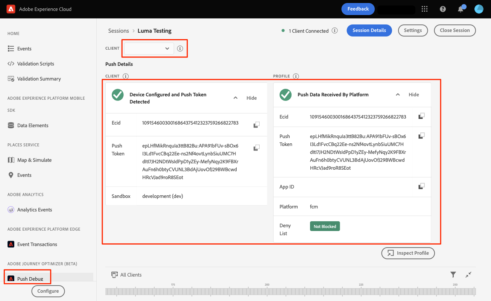

# Adobe Journey Optimizerプッシュメッセージ

Platform Mobile SDK とAdobe Journey Optimizerを使用して、モバイルアプリ用のプッシュメッセージを作成する方法について説明します。

Journey Optimizerでは、ジャーニーを作成し、ターゲットを絞ったオーディエンスにメッセージを送信できます。 Journey Optimizerでプッシュ通知を送信する前に、適切な設定と統合がおこなわれていることを確認する必要があります。 Adobe Journey Optimizerのプッシュ通知データフローについては、 [ドキュメント](https://experienceleague.adobe.com/docs/journey-optimizer/using/configuration/configuration-message/push-config/push-gs.html).

>[!NOTE]
>
>このレッスンはオプションで、プッシュメッセージの送信を希望するAdobe Journey Optimizerユーザーにのみ適用されます。


## 前提条件

* SDK が正常に構築され、インストールされ、設定された状態でアプリが実行されました。
* Adobe Journey Optimizerへのアクセスと十分な権限（説明を参照） [ここ](https://experienceleague.adobe.com/docs/journey-optimizer/using/configuration/configuration-message/push-config/push-configuration.html?lang=en). また、次のAdobe Journey Optimizer機能に対する十分な権限が必要です。
   * アプリケーションサーフェスを作成します。
   * ジャーニーの作成
   * メッセージを作成。
   * メッセージプリセットの作成.
* 証明書、識別子、キーを作成するのに十分なアクセス権を持つ有料Apple開発者アカウント。
* テスト用の物理iOSデバイス。

## 学習内容

このレッスンでは、次の操作を実行します。

* アプリ ID をApple Push Notification service(APN) に登録します。
* の作成 **[!UICONTROL アプリサーフェス]** AJO 内で
* の更新 **[!UICONTROL スキーマ]** プッシュメッセージフィールドを含めるには
* をインストールして設定します。 **[!UICONTROL Adobe Journey Optimizer]** タグ拡張。
* AJO タグ拡張を含めるようにアプリを更新します。
* アシュランスで設定を検証します。
* テストメッセージを送信します。


## アプリ ID を APN に登録

次の手順は、Adobe Experience Cloud固有のものではなく、APN 設定を順を追って説明するように設計されています。

### の作成 `.p8` 秘密鍵

1. Apple開発者ポータルで、に移動します。 **[!UICONTROL キー]**.
1. 「 + 」アイコンを選択して、キーを作成します。
   

1. 次を提供： **[!UICONTROL キー名]**.
1. を選択します。 **[!UICONTROL APN]** チェックボックス。
1. 「**[!UICONTROL 続行]**」を選択します。
   
1. 設定を確認し、「 」を選択します。 **[!UICONTROL 登録]**.
1. をダウンロードします。 `.p8` 秘密鍵。 これは、App Surface 設定で使用されます。
1. をメモして **[!UICONTROL キー ID]**. これは、App Surface 設定で使用されます。

追加のドキュメントは、 [ここにある](https://help.apple.com/developer-account/#/devcdfbb56a3).

### Apple開発者チーム ID の取得

1. Apple開発者ポータルで、に移動します。 **[!UICONTROL メンバーシップ]**.
1. お使いの **[!UICONTROL チーム ID]** は、他のメンバーシップ情報と共に表示されます。 これは、App Surface 設定で使用されます。

## データ収集にアプリのプッシュ資格情報を追加

1. 次の [データ収集インターフェイス](https://experience.adobe.com/data-collection/)をクリックし、左側のパネルで「 App Surfaces 」タブを選択します。
1. 選択 **[!UICONTROL アプリのサーフェスを作成]** 設定を作成します。
   
1. を入力します。 **[!UICONTROL 名前]** （例： ） `Luma App Tutorial`  .
1. 「モバイルアプリケーション設定」から、 **[!UICONTROL Apple iOS]**.
1. 「アプリ ID（iOS バンドル ID）」フィールドにモバイルアプリのバンドル ID を入力します。Luma アプリと共にフォローしている場合、その値は `com.adobe.luma.tutorial`.
1. をオンにします。 **[!UICONTROL プッシュ認証情報]** ボタンをクリックして、資格情報を追加します。
1. をドラッグ&amp;ドロップします。 `.p8` **Appleプッシュ通知認証キー** ファイル。
1. キー ID( `p8` 認証キー。 これは、**証明書、識別子およびプロファイル**&#x200B;ページの「キー」タブにあります。
1. チーム ID を指定します。これは、「**メンバーシップ**」タブの下にある文字列値です。
1. 「**[!UICONTROL 保存]**」を選択します。
   

## Adobe Journey Optimizer Tags 拡張機能のインストール

1. に移動します。 [!UICONTROL タグ] > [!UICONTROL 拡張機能] > [!UICONTROL カタログ]をクリックし、 **[!UICONTROL Adobe Journey Optimizer]** 拡張子。
1. 拡張機能のインストール.
   
1. 選択 `CJM Push Tracking Experience Event Dataset` Adobe Experience Platformデータセット
   
1. 選択 **[!UICONTROL ライブラリに保存してビルド]**.

>[!NOTE]
>「CJM プッシュトラッキングエクスペリエンスイベントデータセット」がオプションとして表示されない場合は、カスタマーケアにお問い合わせください。
>

## アプリにAdobe Journey Optimizerを実装

前のレッスンで説明したように、モバイルタグ拡張機能のインストールでは設定のみが提供されます。 次に、メッセージング SDK をインストールして登録する必要があります。 これらの手順が明確でない場合は、 [SDK のインストール](install-sdks.md) 」セクションに入力します。

>[!NOTE]
>
>以下を完了した場合、 [SDK のインストール](install-sdks.md) 」セクションに移動した場合は、SDK が既にインストールされているので、手順#7に進むことができます。

1. を開きます。 `Podfile` 次の行を追加して、ファイルを保存します。

   `pod 'AEPMessaging', '~>1'`
1. ターミナルを開き、 `Podfile`.
1. コマンドを実行して SDK をインストールします `pod install`.
   
1. Xcode を開き、に移動します。 `AppDelegate.swift`.
1. インポートのリストに次を追加します。

   `import AEPMessaging`
1. 追加 `Messaging.self` を登録する拡張機能の配列に追加します。
1. ファイルに次の関数を追加します。

   ```swift
   func application(_: UIApplication, didRegisterForRemoteNotificationsWithDeviceToken deviceToken: Data) {
       MobileCore.setPushIdentifier(deviceToken)
   }
   ```

   この関数は、アプリがインストールされているデバイスに固有のデバイストークンを取得し、プッシュメッセージ配信用にAdobe/Appleに送信します。

## テスト用プッシュメッセージを送信して検証

1. 以下を確認します。 [設定手順](assurance.md) 」セクションに入力します。
1. 物理デバイスにアプリをインストールします。
1. Assurance で生成された URL を使用して、アプリを起動します。
1. アプリをバックグラウンドに送信します。
1. Assurance UI で、 **[!UICONTROL 設定]**.
   
1. を選択します。 **[!UICONTROL +]** 隣のボタン **[!UICONTROL プッシュデバッグ]**.
1. 「**[!UICONTROL 保存]**」を選択します。
   
1. 選択 **[!UICONTROL プッシュデバッグ]** をクリックします。
1. デバイスを **[!UICONTROL クライアントリスト]**.
1. エラーが表示されていないことを確認します。
   
1. 下にスクロールして、「 」を選択します。 **[!UICONTROL テストプッシュ通知の送信]**.
1. 受信していないこととエラーがあること、およびデバイスでメッセージを受信していることを確認します。
   

次へ： **[まとめと次のステップ](conclusion.md)**

>[!NOTE]
>
>Adobe Experience Platform Mobile SDK の学習に時間を割いていただき、ありがとうございます。 ご質問がある場合、一般的なフィードバックを共有したい場合、または今後のコンテンツに関する提案がある場合は、こちらで共有してください [Experience Leagueコミュニティディスカッション投稿](https://experienceleaguecommunities.adobe.com/t5/adobe-experience-platform-launch/tutorial-discussion-implement-adobe-experience-cloud-in-mobile/td-p/443796)