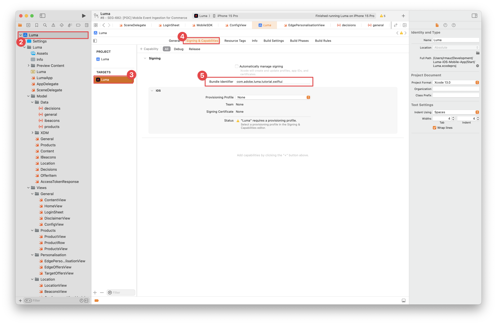

# プッシュ通知の作成と送信

Experience Platform Mobile SDKとJourney Optimizerを使用して、モバイルアプリ用のプッシュ通知を作成する方法を説明します。

Journey Optimizerでは、ジャーニーを作成し、ターゲットとなるオーディエンスにメッセージを送信できます。 Journey Optimizerでプッシュ通知を送信する前に、適切な設定と統合が行われていることを確認する必要があります。 Journey Optimizerでのプッシュ通知のデータフローについては、[ ドキュメント ](https://experienceleague.adobe.com/docs/journey-optimizer/using/push/push-config/push-gs.html?lang=ja) を参照してください。


>[!NOTE]
>
>このレッスンはオプションで、プッシュ通知の送信を検討しているJourney Optimizer ユーザーにのみ適用されます。


## 前提条件

* SDK がインストールおよび設定された状態で、アプリケーションが正常に構築および実行されました。
* Adobe Experience Platform用にアプリを設定します。
* Journey Optimizerへのアクセスと、説明に従った十分な権限 [ こちら ](https://experienceleague.adobe.com/docs/journey-optimizer/using/push/push-config/push-configuration.html?lang=ja)。 また、次のJourney Optimizer機能に対する十分な権限も必要です。
   * プッシュ資格情報を作成します。
   * プッシュチャネル設定を作成します。
   * ジャーニーを作成します。
   * メッセージを作成します。
   * メッセージプリセットの作成。
* **有料のApple開発者アカウント** で、証明書、識別子およびキーを作成するための十分なアクセス権。
* テスト用の物理的なiOSデバイスまたはシミュレーター。

## 学習目標

このレッスンでは、次の操作を行います

* アプリ ID をApple Push Notification Service （APN）に登録します。
* Journey Optimizerでチャネル設定を作成します。
* プッシュメッセージフィールドを含めるようにスキーマを更新します。
* Journey Optimizer タグ拡張機能をインストールして設定します。
* アプリを更新して、Journey Optimizer タグ拡張機能を登録します。
* Assuranceの設定を検証します。
* Assuranceからのテストメッセージを送信
* Journey Optimizerで独自のプッシュ通知イベント、ジャーニーおよびエクスペリエンスを定義します。
* アプリ内から独自のプッシュ通知を送信します。


## セットアップ

>[!TIP]
>
>[Journey Optimizerのアプリ内メッセージ ](journey-optimizer-inapp.md) レッスンの一部として既に環境を設定している場合は、この設定の節の手順のいくつかが既に実行されている可能性があります。

### アプリ ID を APN に登録

次の手順は、Adobe Experience Cloudに固有のものではなく、APN 設定の手順を示すように設計されています。

#### 秘密鍵の作成

1. Apple開発者ポータルで、「**[!UICONTROL キー]**」に移動します。
1. キーを作成するには、「**[!UICONTROL +]**」を選択します。
   

1. **[!UICONTROL キー名]** を入力します。
1. 「**[!UICONTROL Apple プッシュ通知サービス &#x200B;] （APN）**」チェックボックスをオンにします。
1. 「**[!UICONTROL 続行]**」を選択します。
   
1. 設定を確認し、「**[!UICONTROL 登録]**」を選択します。
1. `.p8` 秘密鍵をダウンロードします。 次の演習では、Journey Optimizer プッシュ資格情報を設定する際に使用します。
1. **[!UICONTROL キー ID]** をメモします。 次の演習では、Journey Optimizer プッシュ資格情報を設定する際に使用します。
1. **[!UICONTROL チーム ID]** をメモします。 次の演習では、Journey Optimizer プッシュ資格情報を設定する際に使用します。
   

その他のドキュメントについては [ こちらを参照 ](https://help.apple.com/developer-account/#/devcdfbb56a3) してください。


#### Journey Optimizerにアプリのプッシュ資格情報を追加する

次に、モバイルアプリケーションのプッシュ資格情報をJourney Optimizerに追加する必要があります。 （以前のバージョンの製品では、これらはデータ収集の「アプリサーフェス」設定の一部として追加されました）。

モバイルアプリのプッシュ資格情報の登録は、自分の代わりに Adobe がプッシュ通知を送信することを承認するために必要です。以下に説明する手順を参照してください。

1. Journey Optimizer インターフェイスで、**[!UICONTROL チャネル]**/**[!UICONTROL プッシュ設定]**/**[!UICONTROL プッシュ資格情報]** メニューを開きます。

1. 「**[!UICONTROL プッシュ認証情報を作成]**」を選択します。


   

1. **[!UICONTROL Platform]** ドロップダウンで、**iOS** オペレーティングシステムを選択します。

1. 「**[!UICONTROL アプリ ID]** （iOS バンドル ID）」フィールドにモバイルアプリのバンドル ID を入力します。 例：com.adobe.luma.tutorial.swiftui

1. これらのプッシュ資格情報をすべてのサンドボックスで使用できるようにするには、「**[!UICONTROL すべてのサンドボックスに適用]**」オプションを有効にします。特定のサンドボックスに同じプラットフォームとアプリ ID のペアに対する独自の資格情報がある場合、これらのサンドボックス固有の資格情報が優先されます。

1. 前の演習で取得した.p8 **Apple プッシュ通知認証キー** ファイルをドラッグ&amp;ドロップします。

1. 認証キーの作成時に割り当てられる 10 文字の文字列である **[!UICONTROL キー ID]**`p8` 指定します。 これは、Apple開発者ポータルページの「**[!UICONTROL 証明書、識別子、プロファイル** ページの「]&#x200B;**キー**」タブにあります。 （前の演習でメモしておく必要があります）。

1. **[!UICONTROL チーム ID]** を指定します。Team ID は値で、**メンバーシップ** タブまたはApple Developer Portal ページの上部にあります。 （前の演習でメモしておく必要があります）。

   

1. 「**[!UICONTROL 送信]**」をクリックして、プッシュ資格情報設定を作成します。

#### Journey Optimizerでプッシュのチャネル設定を作成します

プッシュ資格情報設定を作成したら、Journey Optimizerからプッシュ通知を送信できるように、設定を作成する必要があります。

1. Journey Optimizer インターフェイスで、**[!UICONTROL チャンネル]**/**[!UICONTROL 一般設定]**/**[!UICONTROL チャンネル設定]** メニューを開き、「**[!UICONTROL チャンネル設定を作成]**」を選択します。

   

1. 設定の名前と説明（オプション）を入力します。

   >[!NOTE]
   >
   > 名前は、文字（A ～ Z）で始める必要があります。使用できるのは英数字のみです。アンダースコア（`_`）、ドット（`.`）、ハイフン（`-`）も使用できます。


1. 設定にカスタムまたはコアのデータ使用ラベルを割り当てるには、「**[!UICONTROL アクセスを管理]**」を選択します。[詳しくは、オブジェクトレベルのアクセス制御（OLAC）を参照してください](https://experienceleague.adobe.com/ja/docs/journey-optimizer/using/access-control/object-based-access)。

1. **プッシュ** チャネルを選択します。


1. この設定を使用してメッセージに同意ポリシーを関連付けるには、**[!UICONTROL マーケティングアクション]**&#x200B;を選択します。顧客の環境設定に従うために、そのマーケティングアクションに関連付けられているすべての同意ポリシーが活用されます。[ マーケティングアクションの詳細情報 ](https://experienceleague.adobe.com/ja/docs/journey-optimizer/using/privacy/consent/consent#surface-marketing-actions)。

1. **[!UICONTROL プラットフォーム]**&#x200B;を選択します。

1. 上記で設定したプッシュ認証情報と同じ **[!UICONTROL アプリ ID]** を選択します。

1. 「**[!UICONTROL 送信]**」を選択して変更を保存します。

   


### データストリーム設定を更新

モバイルアプリから Experience Edgeに送信されるデータが確実にEdge Networkに転送されるようにするには、Journey Optimizer設定を更新します。

1. データ収集 UI で「**[!UICONTROL データストリーム]**」を選択し、データストリームを選択します（例：**[!DNL Luma Mobile App]**）。
1.  の「詳細 **」を選択し、コンテキストメニューから **&#x200B;[!UICONTROL &#x200B; 編集 &#x200B;]&#x200B;**を選択します。**
1. **[!UICONTROL データストリーム]**//**[!UICONTROL Adobe Experience Platform]** 画面で、次の操作を行います。

   1. まだ選択していない場合は、{ プロファイルデータセット **から**&#x200B;[!UICONTROL &#x200B; 0}AJO プッシュプロファイルデータセット &#x200B;]&#x200B;**を選択します。**&#x200B;このプロファイルデータセットは、`MobileCore.setPushIdentifier` API 呼び出し（[ プッシュ通知用のデバイストークンの登録 ](#register-device-token-for-push-notifications) を参照）を使用する場合に必要です。この呼び出しにより、プッシュ通知の一意の識別子（プッシュ識別子など）がユーザーのプロファイルの一部として保存されます。

   1. **[!UICONTROL Adobe Journey Optimizer]** が選択されました。 詳しくは、[Adobe Experience Platform](https://experienceleague.adobe.com/docs/experience-platform/datastreams/configure.html?lang=ja#aep) 設定を参照してください。

   1. データストリーム設定を保存するには、「**[!UICONTROL 保存]**」を選択します。

   


### Journey Optimizer タグ拡張機能のインストール

アプリがJourney Optimizerと連携するには、タグプロパティを更新する必要があります。

1. **[!UICONTROL タグ]**/**[!UICONTROL 拡張機能]**/**[!UICONTROL カタログ]** に移動します。
1. プロパティを開きます（例：**[!DNL Luma Mobile App Tutorial]**）。
1. **[!UICONTROL カタログ]** を選択します。
1. **[!UICONTROL Adobe Journey Optimizer]** 拡張機能を検索します。
1. 拡張機能をインストールします。
1. **[!UICONTROL 拡張機能をインストール]** ダイアログで、
   1. 環境（例：**[!UICONTROL 開発]** を選択します。
   1. **[!UICONTROL イベントデータセット]** リストから **[!UICONTROL AJO プッシュトラッキングエクスペリエンスイベントデータセット]** データセットを選択します。
   1. **[!UICONTROL ライブラリおよびビルドに保存]** を選択します。

      

>[!NOTE]
>
>**[!UICONTROL AJO プッシュトラッキングエクスペリエンスイベントデータセット]** がオプションとして表示されない場合は、カスタマーケアにお問い合わせください。
>

## Assuranceでの設定の検証

1. [ 設定手順 ](assurance.md#connecting-to-a-session) の節を参照して、シミュレーターまたはデバイスをAssuranceに接続します。
1. Assurance UI で、「**[!UICONTROL 設定]**」を選択します。
   
1.  の横にある **[!UICONTROL プラス]** を選択します。
1. 「**[!UICONTROL 保存]**」を選択します。
   
1. 左側のナビゲーションから **[!UICONTROL プッシュデバッグ]** を選択します。
1. 「**[!UICONTROL 設定を検証]**」タブを選択します。
1. **[!UICONTROL クライアント]** リストからお使いのデバイスを選択します。
1. エラーがないことを確認します。
   
1. 「**[!UICONTROL テストプッシュを送信]** タブを選択します。
1. （オプション）（タイトル **[!UICONTROL および**&#x200B;[!UICONTROL &#x200B; 本文 &#x200B;]&#x200B;**のデフォルトの詳細を変更]**
1. **[!UICONTROL テストプッシュ通知を送信]** を選択します。
1. **[!UICONTROL テスト結果]** を確認します。
1. テストプッシュ通知がアプリに表示されます。

   


## 署名

Luma アプリへの署名は、プッシュ通知を送信するために必要で、**Apple開発者の有料アカウントが必要** です。

アプリの署名を更新するには：

1. Xcode でアプリに移動します。
1. プロジェクト ナビゲータで [**[!DNL Luma]**] を選択します。
1. **[!DNL Luma]** ターゲットを選択します。
1. 「**署名と機能**」タブを選択します。
1. **[!UICONTROL 自動管理の署名]**、**[!UICONTROL チーム]**、および **[!UICONTROL バンドル ID]** を設定するか、特定のApple開発プロビジョニングの詳細を使用します。

   >[!IMPORTANT]
   >
   >各バンドル ID は一意である必要があるので、_unique_ バンドル ID を使用し、`com.adobe.luma.tutorial.swiftui` バンドル ID を置き換えてください。 通常は、バンドル ID 文字列（`com.organization.brand.uniqueidentifier` など）に逆 DNS 形式を使用します。 たとえば、このチュートリアルの完成バージョンでは `com.adobe.luma.tutorial.swiftui` を使用します。


   {zoomable="yes"}


## アプリへのプッシュ通知機能の追加

>[!IMPORTANT]
>
>iOS アプリでプッシュ通知を実装してテストするには、**有料** Apple開発者アカウントが必要です。 Appleの有料デベロッパーアカウントをお持ちでない場合は、このレッスンの残りの部分をスキップできます。

1. Xcode で、「**[!UICONTROL TARGETS]**」リストから「**[!DNL Luma]**」を選択し、「**[!UICONTROL 署名と機能]**」タブを選択します。次に、「**[!UICONTROL +機能]**」ボタンを選択し、「**[!UICONTROL プッシュ通知]**」を選択します。 これにより、アプリがプッシュ通知を受信できるようになります。

1. 次に、通知拡張機能をアプリに追加する必要があります。 「**[!DNL General]**」タブに戻り、「**[!UICONTROL TARGETS]**」セクションの下部にある **[!UICONTROL +]** アイコンを選択します。

1. 新しいターゲットのテンプレートを選択するよう求められます。 **[!UICONTROL 通知サービス拡張機能]** を選択してから、「**[!UICONTROL 次へ]**」を選択します。

1. 次のウィンドウで、拡張機能の名前として `NotificationExtension` を使用し、「**[!UICONTROL 完了]**」ボタンをクリックします。

以下の画面のように、プッシュ通知拡張機能がアプリに追加されました。


## アプリへのJourney Optimizerの実装

前のレッスンで説明したように、モバイルタグ拡張機能をインストールしても、設定のみが提供されます。 次に、Messaging SDKをインストールして登録します。 これらの手順が明確でない場合は、「SDK のインストール [ の節を参照し ](install-sdks.md) ください。

>[!NOTE]
>
>[SDK のインストール ](install-sdks.md) の節を完了した場合、SDKは既にインストールされているので、この手順をスキップできます。
>

1. Xcode で、[AEP Messaging](https://github.com/adobe/aepsdk-messaging-ios) がパッケージの依存関係のパッケージの一覧に追加されていることを確認します。 [Swift パッケージマネージャー ](install-sdks.md#swift-package-manager) を参照してください。
1. Xcode プロジェクトナビゲーターで **[!DNL Luma]**/**[!DNL Luma]**/**[!UICONTROL AppDelegate]** に移動します。
1. `AEPMessaging` が読み込みのリストに含まれていることを確認します。

   `import AEPMessaging`

1. `Messaging.self` が、登録している拡張機能の配列の一部であることを確認します。

   ```swift
   let extensions = [
       AEPIdentity.Identity.self,
       Lifecycle.self,
       Signal.self,
       Edge.self,
       AEPEdgeIdentity.Identity.self,
       Consent.self,
       UserProfile.self,
       Places.self,
       Messaging.self,
       Optimize.self,
       Assurance.self
   ]
   ```

## プッシュ通知用のデバイストークンの登録

1. [`MobileCore.setPushIdentifier`](https://developer.adobe.com/client-sdks/documentation/mobile-core/api-reference/#setpushidentifier) API を `func application(_ application: UIApplication, didRegisterForRemoteNotificationsWithDeviceToken deviceToken: Data)` 関数に追加します。

   ```swift
   // Send push token to Mobile SDK
   MobileCore.setPushIdentifier(deviceToken)
   ```

   この関数は、アプリがインストールされているデバイスに固有のデバイストークンを取得します。 次に、設定した設定を使用して、プッシュ通知配信のトークンを設定します。この設定は、Appleのプッシュ通知サービス（APN）に依存しています。

>[!IMPORTANT]
>
>`MobileCore.updateConfigurationWith(configDict: ["messaging.useSandbox": true])` は、プッシュ通知が APN サンドボックスまたは実稼動サーバーをプッシュ通知の送信に使用しているかどうかを判断します。 シミュレーターまたはデバイスでアプリをテストする場合は、プッシュ通知を受信できるように、`messaging.useSandbox` が `true` に設定されていることを確認します。 Appleの Testflight を使用してテストするために実稼動用にアプリをデプロイする場合は、`messaging.useSandbox` を `false` に設定します。そうしないと、実稼動アプリはプッシュ通知を受信できません。


## 独自のプッシュ通知を作成

独自のプッシュ通知を作成するには、プッシュ通知の送信を処理するジャーニーをトリガーにするイベントをJourney Optimizerで定義する必要があります。

### スキーマを更新

スキーマで定義されたイベントのリストの一部としてまだ使用できない新しいイベントタイプを定義しようとしています。 このイベントタイプは、後でプッシュ通知をトリガーするときに使用します。

1. Journey Optimizer UI の左パネルで「**[!UICONTROL スキーマ]**」をクリックします。
1. タブバーの **[!UICONTROL 参照]** を選択します。
1. スキーマ（例：**[!DNL Luma Mobile App Event Schema]**）を選択して開きます。
1. スキーマエディターで、次の手順を実行します。
   1. **[!UICONTROL eventType]** フィールドを選択します。
   1. **[!UICONTROL フィールドプロパティ]** ペインで、下にスクロールして、イベントタイプに指定可能な値のリストを表示します。 **[!UICONTROL 行を追加]** を選択し、**[!UICONTROL VALUE]** として `application.test` を追加し、`DISPLAY NAME` として `[!UICONTROL Test event for push notification]` を追加します。
   1. 「**[!UICONTROL 適用]**」を選択します。
   1. 「**[!UICONTROL 保存]**」を選択します。

      

### イベントを定義

Journey Optimizerのイベントを使用すると、プッシュ通知などのメッセージを送信するために、ジャーニーをまとめてトリガーできます。 詳しくは、[ イベントについて ](https://experienceleague.adobe.com/docs/journey-optimizer/using/configuration/configure-journeys/events-journeys/about-events.html?lang=ja) を参照してください。

1. Journey Optimizer UI の左パネルで「**[!UICONTROL 設定]**」をクリックします。

1. **[!UICONTROL ダッシュボード]** 画面で、**[!UICONTROL イベント]** タイルの **[!UICONTROL 管理]** ボタンを選択します。

1. **[!UICONTROL イベント]** 画面で、「**[!UICONTROL イベントを作成]**」を選択します。

1. **[!UICONTROL event1 を編集]** パネルで、次の操作を行います。

   1. イベントの **[!UICONTROL 名前]** として `LumaTestEvent` を入力します。
   1. **[!UICONTROL 説明]** を入力します（例：`Test event to trigger push notifications in Luma app`）。

   1. [XDM スキーマの作成 ](create-schema.md) で前に作成したモバイルアプリエクスペリエンスイベントスキーマを **[!UICONTROL スキーマ]** リストから選択します（例：**[!DNL Luma Mobile App Event Schema v.1]**）。
   1.  リストの横にある「**[!UICONTROL 編集]** を選択します。

      

      **[!UICONTROL フィールド]** ダイアログで、（常に選択されるデフォルトフィールド（**[!UICONTROL _id]**、**[!UICONTROL id]** および **[!UICONTROL timestamp]**）に加えて）次のフィールドが選択されていることを確認します。 ドロップダウンリストを使用して、「選択済み **[!UICONTROL 、「すべて]**、&lbrace;4 **[!UICONTROL プライマリ]** を切り替えたり **「」フィールドを使用したりできます。**

      * **[!UICONTROL アプリケーションが識別されました（ID）]**、
      * **[!UICONTROL イベントタイプ （eventType）]**、
      * **[!UICONTROL プライマリ（プライマリ）]**。

      

      次に、「**[!UICONTROL OK]**」を選択します。

   1.  フィールドの横にある **[!UICONTROL 編集]** を選択します。

      1. **[!UICONTROL イベント ID 条件を追加]** ダイアログで、**[!UICONTROL イベントタイプ （eventType）]**&#x200B;**[!UICONTROL ここに要素をドラッグ&amp;ドロップ]** にドラッグ&amp;ドロップします。
      1. ポップオーバーで、下までスクロールして「**[!UICONTROL application.test]**」を選択します（これは、[ スキーマを更新 ](#update-your-schema) の一部としてイベントタイプのリストに以前に追加したイベントタイプです）。 次に、上までスクロールして、「**[!UICONTROL OK]**」を選択します。
      1. 「**[!UICONTROL OK]**」を選択して、条件を保存します。

         

   1. **[!UICONTROL 名前空間]** リストから **[!UICONTROL ECID （ECID）]** を選択します。 **[!UICONTROL プロファイル識別子]** フィールドには、**[!UICONTROL マップ identityMap のキー ECID の最初の要素の ID]** が自動的に入力されます。
   1. 「**[!UICONTROL 保存]**」を選択します。

      

先ほど、このチュートリアルの一部として前に作成したモバイルアプリエクスペリエンスイベントスキーマに基づくイベント設定を作成しました。 このイベント設定は、特定のイベントタイプ（`application.test`）を使用して受信エクスペリエンスイベントをフィルタリングするので、モバイルアプリから開始された、特定のタイプを持つイベントのみが、次の手順で作成するジャーニーをトリガーします。 実際には、外部サービスからプッシュ通知を送信する場合もありますが、同じコンセプトが適用されます。外部アプリケーションから、特定のフィールドを持つExperience Platformにエクスペリエンスイベントを送信し、これらのイベントがジャーニーのトリガーになる前に条件を適用できます。

### ジャーニーの作成

次の手順では、適切なイベントを受け取ったときにプッシュ通知の送信をトリガーにするジャーニーを作成します。

1. Journey Optimizer UI の左パネルから **0&rbrace;ジャーニー&rbrace; を選択します。**
1. **[!UICONTROL ジャーニーを作成]** を選択します。
1. **[!UICONTROL ジャーニーのプロパティ]** パネルで、次の操作を行います。

   1. ジャーニーの **[!UICONTROL 名前]** を入力します（例：`Luma - Test Push Notification Journey`）。
   1. ジャーニーの **[!UICONTROL 説明]** を入力します（例：`Journey for test push notifications in Luma mobile app`）。
   1. **[!UICONTROL 再エントリを許可]** が選択されていることを確認し、**[!UICONTROL 再エントリ待機期間]** を **[!UICONTROL 30]**&#x200B;**[!UICONTROL 秒]** に設定します。
   1. 「**[!UICONTROL OK]**」を選択します。

      

1. ジャーニーキャンバスに戻り、**[!UICONTROL イベント]** から、**[!DNL LumaTestEvent]** をキャンバスの **[!UICONTROL エントリイベントまたはオーディエンスを読み取りアクティビティを選択]** にドラッグ&amp;ドロップします。

   * **[!UICONTROL Events:LumaTestEvent]** パネルに **[!UICONTROL Label]** （例：`Luma Test Event`）を入力します。

1. 「**[!UICONTROL アクション]**」ドロップダウンから、**[!DNL LumaTestEvent]** アクティビティの右側に表示される [ 追加 ]&#x200B;**の上に**![[!UICONTROL &#x200B; プッシュ &#x200B;]](https://spectrum.adobe.com/static/icons/workflow_18/Smock_PushNotification_18_N.svg) プッシュをドラッグ&amp;ドロップします。 **[!UICONTROL アクション：プッシュ]** パネルで、

   1. **[!UICONTROL ラベル]**、例えば `Luma Test Push Notification` を入力し、**[!UICONTROL 説明]**、例えば `Test push notification for Luma mobile app` を入力して、**[!UICONTROL カテゴリ]** リストから **[!UICONTROL トランザクション]** を選択し、**[!UICONTROL プッシュサーフェス]** から **[!DNL Luma]** を選択します。
   1. 実際のプッシュ通知の編集を開始するには、「**[!UICONTROL コンテンツを編集]**」を選択します。

      

      **[!UICONTROL プッシュ通知]** エディターで以下を行います。

      1. **[!UICONTROL タイトル]** を入力して（例：`Luma Test Push Notification`）、**[!UICONTROL 本文]** を入力して（例：`Test push notification for Luma mobile app`）。
      1. オプションで、「メディアを追加 **に画像へのリンク（.png または.jpg** を入力できます。 その場合、画像はプッシュ通知の一部になります。
      1. エディターを保存して終了するには、「」を選択します。

         

   1. プッシュ通知の定義を保存して終了するには、「**[!UICONTROL OK]**」を選択します。

1. ジャーニーは次のようになります。 「**[!UICONTROL 公開]**」を選択して、ジャーニーを公開およびアクティブ化します。
   


## プッシュ通知をトリガー

プッシュ通知を送信するためにすべての材料が用意されていること。 残っているのは、このプッシュ通知のトリガー方法です。 本質的には、以前に見たものと同じです。適切なペイロードでエクスペリエンスイベントを送信するだけです（[Events](events.md) など）。

今回は、送信しようとしているエクスペリエンスイベントは、単純な XDM ディクショナリを構築して構築されていません。 プッシュ通知ペイロードを表す `struct` を使用します。 専用のデータタイプを定義することは、アプリケーションでエクスペリエンスイベントペイロードの構築を実装する方法の代替方法です。

1. Xcode プロジェクトナビゲーターで **[!DNL Luma]**/**[!DNL Luma]**/**[!UICONTROL モデル]**/**[!UICONTROL XDM]**/**[!UICONTROL TestPushPayload]** に移動し、コードを調べます。

   ```swift
   import Foundation
   
   // MARK: - TestPush
   struct TestPushPayload: Codable {
      let application: Application
      let eventType: String
   }
   
   // MARK: - Application
   struct Application: Codable {
      let id: String
   }
   ```

   コードは、テストプッシュ通知ジャーニーをトリガーするために送信する、次のシンプルなペイロードを表します

   ```json
   {
      "eventType": string,
      "application" : [
          "id": string
      ]
   }
   ```

1. Xcode プロジェクトナビゲーターで **[!DNL Luma]**/**[!DNL Luma]**/**[!DNL Utils]**/**[!UICONTROL MobileSDK]** に移動し、以下のコードを `func sendTestPushEvent(applicationId: String, eventType: String)` に追加します。

   ```swift
   // Create payload and send experience event
   Task {
       let testPushPayload = TestPushPayload(
           application: Application(
               id: applicationId
           ),
           eventType: eventType
       )
       // send the final experience event
       await sendExperienceEvent(
           xdm: testPushPayload.asDictionary() ?? [:]
       )
   }
   ```

   このコードは、関数（`applicationId` および `eventType`）に提供されたパラメーターを使用して `testPushPayload` インスタンスを作成し、ペイロードをディクショナリに変換する際に `sendExperienceEvent` を呼び出します。 今回のコードでは、`await` と `async` に基づく Swift の同時実行モデルを使用して、Adobe Experience Platform SDKの呼び出しの非同期の側面も考慮しています。

1. Xcode プロジェクトナビゲーターで **[!DNL Luma]**/**[!DNL Luma]**/**[!DNL Views]**/**[!DNL General]**/**[!UICONTROL ConfigView]** に移動します。 次のコードをプッシュ通知ボタンの定義に追加して、そのボタンがタップされるたびにジャーニーをトリガーにテストプッシュ通知エクスペリエンスイベントペイロードを送信します。

   ```swift
   // Setting parameters and calling function to send push notification
   Task {
       let eventType = testPushEventType
       let applicationId = Bundle.main.bundleIdentifier ?? "No bundle id found"
       await MobileSDK.shared.sendTestPushEvent(applicationId: applicationId, eventType: eventType)
   }
   ```


## アプリを使用した検証

1.  を使用して、シミュレータまたは Xcode の物理デバイスでアプリを再構築して実行します。

1. 「**[!UICONTROL 設定]**」タブに移動します。

1. **[!UICONTROL プッシュ通知]** をタップします。 アプリにプッシュ通知が表示されます。

   


## 次の手順

これで、アプリでプッシュ通知を処理するためのすべてのツールが用意できました。 例えば、Journey Optimizerで、アプリのユーザーがログインしたときにウェルカムプッシュ通知を送信するジャーニーを作成できます。 または、ユーザーがアプリで製品を購入したときの確認プッシュ通知。 または、場所のジオフェンスに入ります（[ 場所 ](places.md) レッスンで確認できます）。

>[!SUCCESS]
>
>これで、Journey Optimizerと、Experience Platform Mobile SDK用のJourney Optimizer拡張機能を使用して、アプリにプッシュ通知を有効にしました。
>
>Adobe Experience Platform Mobile SDKの学習にご協力いただき、ありがとうございます。 ご不明な点がある場合や、一般的なフィードバックをお寄せになる場合、または今後のコンテンツに関するご提案がある場合は、この [Experience League Community Discussion の投稿 ](https://experienceleaguecommunities.adobe.com/t5/adobe-experience-platform-data/tutorial-discussion-implement-adobe-experience-cloud-in-mobile/td-p/443796?profile.language=ja) でお知らせください。

次のトピック：**[アプリ内メッセージの作成および送信](journey-optimizer-inapp.md)**
