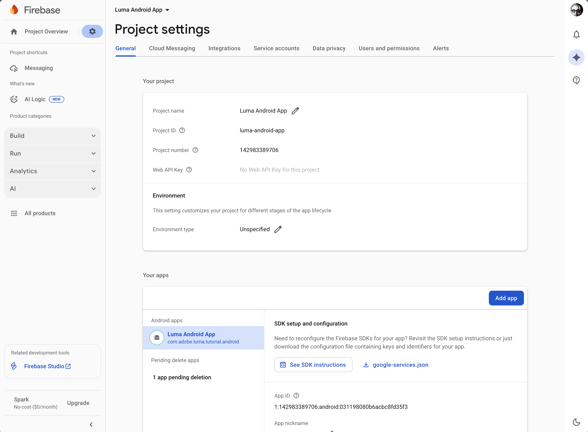
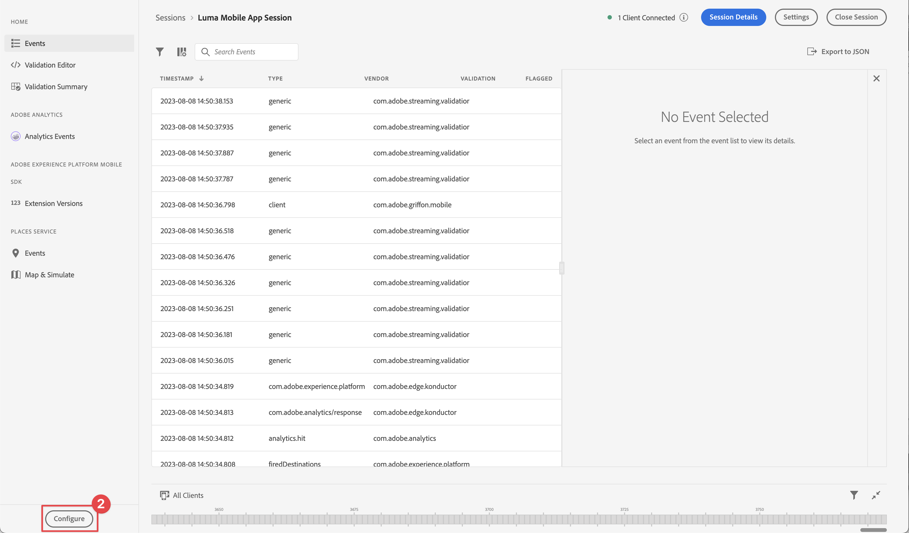

# プッシュ通知の作成と送信

Experience Platform Mobile SDKとJourney Optimizerを使用して、モバイルアプリ用のプッシュ通知を作成する方法を説明します。

Journey Optimizerでは、ジャーニーを作成し、ターゲットとなるオーディエンスにメッセージを送信できます。 Journey Optimizerでプッシュ通知を送信する前に、適切な設定と統合が行われていることを確認する必要があります。 Journey Optimizerでのプッシュ通知のデータフローについては、[ ドキュメント ](https://experienceleague.adobe.com/ja/docs/journey-optimizer/using/channels/push/push-config/push-gs) を参照してください。

{zoomable="yes"}

>[!NOTE]
>
>このレッスンはオプションで、プッシュ通知の送信を検討しているJourney Optimizer ユーザーにのみ適用されます。


## 前提条件

* SDK がインストールおよび設定された状態で、アプリケーションが正常に構築および実行されました。
* Adobe Experience Platform用にアプリを設定します。
* Journey Optimizerへのアクセスおよび [ 十分な権限 ](https://experienceleague.adobe.com/ja/docs/journey-optimizer/using/channels/push/push-config/push-configuration)。 また、次のJourney Optimizer機能に対する十分な権限も必要です。
   * プッシュ資格情報を作成します。
   * プッシュチャネル設定を作成します。
   * ジャーニーを作成します。
   * メッセージを作成します。
   * メッセージプリセットの作成。
* iOS：証明書、識別子、キーを作成するための十分なアクセス権を持つ **有料のApple開発者アカウント**。
* Androidの場合：証明書とキーを作成するための十分なアクセス権を持つGoogle開発者アカウント。
* テスト用の物理的なiOSまたはAndroidのデバイスまたはシミュレータ。

## 学習目標

このレッスンでは、次の操作を行います

* アプリ ID をApple Push Notification Service （APN）に登録します。
* Journey Optimizerでチャネル設定を作成します。
* プッシュメッセージフィールドを含めるようにスキーマを更新します。
* Journey Optimizer タグ拡張機能をインストールして設定します。
* アプリを更新して、Journey Optimizer タグ拡張機能を登録します。
* Assuranceの設定を検証します。
* Assuranceからのテストメッセージを送信
* Journey Optimizerで独自のプッシュ通知イベント、ジャーニーおよびエクスペリエンスを定義します。
* アプリ内から独自のプッシュ通知を送信します。


## セットアップ

>[!TIP]
>
>[Journey Optimizerのアプリ内メッセージ ](journey-optimizer-inapp.md) レッスンの一部として既に環境を設定している場合は、この設定の節の手順のいくつかが既に実行されている可能性があります。

### プッシュ資格情報を作成

プッシュ通知の場合、最初にアプリをプッシュ通知用に登録する必要があります。

>[!BEGINTABS]

>[!TAB iOS]

次の手順は、Adobe Experience Cloudに固有のものではなく、APN 設定の手順を示すように設計されています。

1. Apple開発者ポータルで、「**[!UICONTROL キー]**」に移動します。
1. キーを作成するには、「**[!UICONTROL +]**」を選択します。

   {zoomable="yes"}

1. **[!UICONTROL キー名]** を入力します。
1. 「**[!UICONTROL Apple プッシュ通知サービス &#x200B;] （APN）**」を選択し、「**[!UICONTROL 設定]**」を選択します。
   1. **[!UICONTROL キーを設定]** 画面で、**[!UICONTROL 環境]** ドロップダウンメニューから **[!UICONTROL サンドボックスと実稼動]** を選択します。
   1. 「**[!UICONTROL 保存]**」を選択します。
1. 「**[!UICONTROL 続行]**」を選択します。

   {zoomable="yes"}

1. 設定を確認し、「**[!UICONTROL 登録]**」を選択します。
1. `.p8` 秘密鍵をダウンロードします。 次の演習では、Journey Optimizer プッシュ資格情報を設定する際に使用します。
1. **[!UICONTROL キー ID]** をメモします。 次の演習では、Journey Optimizer プッシュ資格情報を設定する際に使用します。
1. **[!UICONTROL チーム ID]** をメモします。 次の演習では、Journey Optimizer プッシュ資格情報を設定する際に使用します。 チーム ID は、画面右上のログイン名の横にあります。
   {zoomable="yes"}

その他のドキュメントについては [ こちらを参照 ](https://help.apple.com/developer-account/#/devcdfbb56a3) してください。

>[!TAB Android]

次の手順は、Adobe Experience Cloudに固有のものではなく、Firebase の設定手順を示すように設計されています。

1. Firebase コンソールにアクセスします。
1. **[!UICONTROL Firebase プロジェクトの作成]** を選択します。
   1. **[!UICONTROL プロジェクト名]** を入力します。
   1. **[!UICONTROL プロジェクトを作成]** - **[!UICONTROL プロジェクトの名前から始めましょう]** で「**[!UICONTROL 続行]**」を選択します。 例：`Luma Android App.`
   1. 「**[!UICONTROL Firebase の Gemini]**」を無効にし、「**[!UICONTROL プロジェクトを作成する]**- **[!UICONTROL Firebase プロジェクトの AI アシスタンス]**」で「**[!UICONTROL 続行]**」を選択します。
   1. このプロジェクトの **[!UICONTROL Google Analyticsを無効にし]**&#x200B;**[!UICONTROL プロジェクトの作成]** - **[!UICONTROL Firebase プロジェクトのGoogle Analytics]** で **[!UICONTROL 続行]** を選択します。
   1. **[!UICONTROL プロジェクトを作成]** を選択します。
   1. プロジェクトの準備が整ったら、「**[!UICONTROL 続行]**」を選択します。

1. Firebase コンソールに戻り、上部でプロジェクトが選択されていることを確認します。 例えば、**[!UICONTROL Luma Android アプリ]** などです。

   {zoomable="yes"}

1. /**[!UICONTROL プロジェクト設定]** を選択します。

1. **[!UICONTROL プロジェクト設定]** で「**[!UICONTROL アプリを追加]**」を選択します。
   1. **[!UICONTROL アプリに Firebase を追加する]** で、プラットフォームとして **[!UICONTROL Android]** を選択します。
   1. **[!UICONTROL Android アプリに Firebase を追加する：]**
      1. 手順 1 の **[!UICONTROL アプリを登録]**:
         1. アプリ ID と同様に、Android パッケージ名を入力します。 例：`com.adobe.luma.tutorial.android`。
         1. オプションで **[!UICONTROL アプリのニックネーム]** を入力します。
         1. **[!UICONTROL アプリを登録]** を選択します。
      1. 手順 2 の **[!UICONTROL 設定ファイルをダウンロードして追加する]**。
         1. **[!UICONTROL Download google-services.json]** を選択します。 独自のバージョンのAndroid アプリケーションを作成する場合は、サンプル Android Studio プロジェクトの現在の `google-services.json` ファイルを、この新しいアプリケーション設定によって生成されたファイルのバージョンに置き換える必要があります。
その他の手順は、サンプルアプリ内で既に処理されています。

   画面は次のようになります。

   {zoomable="yes"}

1. **[!UICONTROL プロジェクト設定]** で「**[!UICONTROL サービスアカウント]**」を選択します。
1. **[!UICONTROL 新しい秘密鍵を生成]** を選択します。 `luma-android-app-firebase-adminsdk-xxxx-xxxxxxxx.json` ファイルが生成されます。 後で必要になるので、このファイルを安全な場所に保存します。

詳しくは、[Firebase 開発者向けドキュメント ](https://firebase.google.com/docs) を参照してください。

>[!ENDTABS]

### データ収集へのアプリのプッシュ資格情報の追加

次に、モバイルアプリケーションのプッシュ資格情報を追加して、自分の代わりにAdobeがプッシュ通知を送信することを承認する必要があります。 プッシュ資格情報は、データ収集またはJourney Optimizerのいずれかで追加できます。 このチュートリアルでは、データ収集インターフェイスを使用します。 プッシュ資格情報は、Journey Optimizerのチャネル設定にリンクされます。

1. データ収集で、「**[!UICONTROL アプリサーフェス]**」を選択します。
1. **[!UICONTROL アプリサーフェスを作成]** を選択します。
1. **[!UICONTROL アプリサーフェスを作成]** インターフェイスで、次の操作を行います。
   1. **[!UICONTROL 名前]** を入力します。
   1. iOSのプッシュ通知を送信する場合は **&#x200B;**&#x200B;Apple iOS&rbrace; を選択します。
      1. **[!UICONTROL アプリ ID]** （例：`com.adobe.luma.tutorial.swiftui`）を入力します。
      1. サンドボックスを選択します（オプション）。
      1. **[!UICONTROL プッシュ資格情報]** を有効にします。
      1. 保存した `.p8` 秘密鍵ファイルを **[!UICONTROL ファイルをドラッグ&amp;ドロップ]** にドロップします。
      1. **[!UICONTROL キー ID]** を入力します。
      1. **[!UICONTROL チーム ID]** を入力します。
   1. Androidのプッシュ通知を送信する場合は **&#x200B;**&#x200B;Android&rbrace; を選択します。
      1. **[!UICONTROL アプリ ID]** （例：`com.adobe.luma.tutorial.android`）を入力します。
      1. サンドボックスを選択します（オプション）。
      1. **[!UICONTROL プッシュ資格情報]** を有効にします。
      1. 保存した `luma-android-app-firebase-adminsdk-xxxx-xxxxxxxx.json` ファイルを **[!UICONTROL ファイルにドラッグ&amp;ドロップ]** します。

   {zoomable="yes"}

1. 「**[!UICONTROL 保存]**」を選択します。すべての情報が正しい場合は、チャネル設定に関連付けるプッシュ認証情報を作成しています。


### Journey Optimizerでプッシュのチャネル設定を作成します

プッシュ資格情報設定を作成したら、Journey Optimizerからプッシュ通知を送信できるように、設定を作成する必要があります。

1. Journey Optimizerのインターフェイスで、**[!UICONTROL チャンネル]**/**[!UICONTROL 一般設定]**/**[!UICONTROL チャンネル設定]** メニューを開き、「**[!UICONTROL チャンネル設定を作成]**」を選択します。

   {zoomable="yes"}

1. 設定の名前と説明（オプション）を入力します。

   >[!NOTE]
   >
   > 名前は、文字（A ～ Z）で始める必要があります。使用できるのは英数字のみです。アンダースコア（`_`）、ドット（`.`）、ハイフン（`-`）も使用できます。


1. 設定にカスタムまたはコアのデータ使用ラベルを割り当てるには、「**[!UICONTROL アクセスを管理]**」を選択します。[詳しくは、オブジェクトレベルのアクセス制御（OLAC）を参照してください](https://experienceleague.adobe.com/ja/docs/journey-optimizer/using/access-control/object-based-access)。

1. **プッシュ** チャネルを選択します。


1. 「**[!UICONTROL マーケティングアクション]**」を選択し、この設定を使用して同意ポリシーをメッセージに関連付けます。 マーケティングアクションに関連するすべての同意ポリシーは、顧客の環境設定に従って活用されます。 [ マーケティングアクションの詳細情報 ](https://experienceleague.adobe.com/ja/docs/journey-optimizer/using/privacy/consent/consent#surface-marketing-actions)。

1. **[!UICONTROL Platform]** を選択します。 チャネル設定には、**[!UICONTROL iOS]** と **[!UICONTROL Android]** の両方を設定できます。

1. プッシュ資格情報の定義に以前に使用した適切な **[!UICONTROL アプリ ID]** を選択します。 例えば、iOSの場合は **[!UICONTROL com.adobe.luma.tutorial.swiftui]**、Androidの場合は **[!UICONTROL com.adobe.luma.tutorial.android]** です。 緑の  は、有効なプッシュ資格情報がチャネル設定に関連付けられていることを示します。


   {zoomable="yes"}

1. 「**[!UICONTROL 送信]**」を選択して変更を保存します。


### データストリーム設定を更新

モバイルアプリから Experience Edgeに送信されるデータが確実にEdge Networkに転送されるようにするには、Journey Optimizer設定を更新します。

1. データ収集 UI で「**[!UICONTROL データストリーム]**」を選択し、データストリームを選択します（例：**[!DNL Luma Mobile App]**）。
1.  の「詳細 **[!UICONTROL 」を選択し、コンテキストメニューから]** 編集  編集 **[!UICONTROL を選択します。]**
1. **[!UICONTROL データストリーム]**//**[!UICONTROL Adobe Experience Platform]** 画面で、次の操作を行います。

   1. まだ選択していない場合は、{ プロファイルデータセット **[!UICONTROL から]** 0}AJO プッシュプロファイルデータセット **[!UICONTROL を選択します。]**&#x200B;このプロファイルデータセットは、`MobileCore.setPushIdentifier` API 呼び出しを使用する場合に必要です（[ プッシュ通知用のデバイストークンの登録 ](#register-device-token-for-push-notifications) を参照）。 また、この選択により、プッシュ通知の一意の識別子（プッシュ識別子など）がユーザーのプロファイルの一部として保存されます。

   1. **[!UICONTROL Adobe Journey Optimizer]** が選択されました。 詳しくは、[Adobe Experience Platform](https://experienceleague.adobe.com/ja/docs/experience-platform/datastreams/configure) 設定を参照してください。

   1. データストリーム設定を保存するには、「**[!UICONTROL 保存]**」を選択します。

   {zoomable="yes"}


### Journey Optimizer タグ拡張機能のインストール

アプリがJourney Optimizerと連携するには、タグプロパティを更新する必要があります。

1. **[!UICONTROL タグ]**/**[!UICONTROL 拡張機能]**/**[!UICONTROL カタログ]** に移動します。
1. プロパティを開きます（例：**[!DNL Luma Mobile App Tutorial]**）。
1. **[!UICONTROL カタログ]** を選択します。
1. **[!UICONTROL Adobe Journey Optimizer]** 拡張機能を検索します。
1. 拡張機能をインストールします。
1. **[!UICONTROL 拡張機能をインストール]** ダイアログで、
   1. 環境（例：**[!UICONTROL 開発]** を選択します。
   1. **[!UICONTROL イベントデータセット]** リストから **[!UICONTROL AJO プッシュトラッキングエクスペリエンスイベントデータセット]** データセットを選択します。
   1. **[!UICONTROL ライブラリおよびビルドに保存]** を選択します。
      {zoomable="yes"}

>[!NOTE]
>
>**[!UICONTROL AJO プッシュトラッキングエクスペリエンスイベントデータセット]** がオプションとして表示されない場合は、カスタマーケアにお問い合わせください。
>

## Assuranceでの設定の検証

1. [ 設定手順 ](assurance.md#connecting-to-a-session) の節を参照して、シミュレーターまたはデバイスをAssuranceに接続します。
1. Assurance UI で、「**[!UICONTROL 設定]**」を選択します。
   {zoomable="yes"}
1.  の横にある **[!UICONTROL プラス]** を選択します。
1. 「**[!UICONTROL 保存]**」を選択します。
   {zoomable="yes"}
1. 左側のナビゲーションから **[!UICONTROL プッシュデバッグ]** を選択します。
1. 「**[!UICONTROL 設定を検証]**」タブを選択します。
1. **[!UICONTROL クライアント]** リストからお使いのデバイスを選択します。
1. エラーがないことを確認します。
   {zoomable="yes"}
1. 「**[!UICONTROL テストプッシュを送信]** タブを選択します。
1. （オプション） **[!UICONTROL タイトル]** および **[!UICONTROL 本文]** のデフォルトの詳細を変更し、アプリで想定するすべてのパラメーター（**[!UICONTROL 詳細]**/**[!UICONTROL 通知チャネル]** （Androidでは必須、例：`LUMA_CHANNEL_ID`）を指定していることを確認します。
1. **[!UICONTROL テストプッシュ通知を送信]** を選択します。
1. **[!UICONTROL テスト結果]** を確認します。

   {zoomable="yes"}
1. テストプッシュ通知がアプリに表示されます。

>[!BEGINTABS]

>[!TAB iOS]


>[!TAB Android]


>[!ENDTABS]

## 署名

>[!IMPORTANT]
>
>iOSでプッシュ通知を送信するには、iOS アプリに署名する必要があり、**Apple開発者の有料アカウントが必要** す。 プッシュ通知を送信するためにAndroid アプリに署名する必要はありません。


アプリの署名を更新するには：

1. Xcode でアプリに移動します。
1. プロジェクト ナビゲータで [**[!DNL Luma]**] を選択します。
1. **[!DNL Luma]** ターゲットを選択します。
1. 「**署名と機能**」タブを選択します。
1. **[!UICONTROL 自動管理の署名]**、**[!UICONTROL チーム]**、および **[!UICONTROL バンドル ID]** を設定するか、特定のApple開発プロビジョニングの詳細を使用します。

   >[!IMPORTANT]
   >
   >各バンドル ID は一意である必要があるので、_unique_ バンドル ID を使用し、`com.adobe.luma.tutorial.swiftui` バンドル ID を置き換えてください。 通常は、バンドル ID 文字列（`com.organization.brand.uniqueidentifier` など）に逆 DNS 形式を使用します。 たとえば、このチュートリアルの完成バージョンでは `com.adobe.luma.tutorial.swiftui` を使用します。


   {zoomable="yes"}


## アプリへのプッシュ通知機能の追加

>[!IMPORTANT]
>
>iOS アプリでプッシュ通知を実装してテストするには、**有料** Apple開発者アカウントが必要です。

>[!BEGINTABS]

>[!TAB iOS]

1. Xcode で、「**[!DNL Luma]** TARGETS **[!UICONTROL 」リストから「]**」を選択し、「**[!UICONTROL 署名と機能]**」タブを選択します。次に、「**[!UICONTROL +機能]**」ボタンを選択し、「**[!UICONTROL プッシュ通知]**」を選択します。 これを選択すると、アプリがプッシュ通知を受信できるようになります。

1. 次に、通知拡張機能をアプリに追加する必要があります。 「**[!DNL General]**」タブに戻り、「**[!UICONTROL TARGETS]**」セクションの下部にある **[!UICONTROL +]** アイコンを選択します。

1. 新しいターゲットのテンプレートを選択するよう求められます。 **[!UICONTROL 通知サービス拡張機能]** を選択してから、「**[!UICONTROL 次へ]**」を選択します。

1. 次のウィンドウで、拡張機能の名前として `NotificationExtension` を使用し、「**[!UICONTROL 完了]**」ボタンをクリックします。

以下の画面のように、プッシュ通知拡張機能がアプリに追加されました。

{zoomable="yes"}

>[!TAB Android]

Android Studio プロジェクトは、プッシュ通知用に既に設定されています。 プッシュ通知用に Luma アプリのAndroid バージョンを有効にするために追加の手順を実行する必要はありません。 詳しくは、[ 通知について ](https://developer.android.com/develop/ui/views/notifications) を参照してください。

Androidのプッシュ通知では、アプリ内とプッシュ通知の送信時の両方で通知チャネル id を定義する必要があります。 Android Luma アプリで使用されるチャネル通知 ID は `LUMA_CHANNEL ID` です。

>[!ENDTABS]


## アプリへのJourney Optimizerの実装

前のレッスンで説明したように、モバイルタグ拡張機能をインストールしても、設定のみが提供されます。 次に、Messaging SDKをインストールして登録します。 これらの手順が明確でない場合は、「SDK のインストール [ の節を参照し ](install-sdks.md) ください。

>[!NOTE]
>
>[SDK のインストール ](install-sdks.md) の節を完了した場合、SDKは既にインストールされているので、この手順をスキップできます。
>

>[!BEGINTABS]

>[!TAB iOS]

1. Xcode で、[AEP Messaging](https://github.com/adobe/aepsdk-messaging-ios) がパッケージの依存関係のパッケージの一覧に追加されていることを確認します。 [Swift パッケージマネージャー ](install-sdks.md#swift-package-manager) を参照してください。
1. Xcode プロジェクトナビゲーターで **[!DNL Luma]**/**[!DNL Luma]**/**[!UICONTROL AppDelegate]** に移動します。
1. `AEPMessaging` が読み込みのリストに含まれていることを確認します。

   `import AEPMessaging`

1. `Messaging.self` が、登録している拡張機能の配列の一部であることを確認します。

   ```swift
   let extensions = [
       AEPIdentity.Identity.self,
       Lifecycle.self,
       Signal.self,
       Edge.self,
       AEPEdgeIdentity.Identity.self,
       Consent.self,
       UserProfile.self,
       Places.self,
       Messaging.self,
       Optimize.self,
       Assurance.self
   ]
   ```

>[!TAB Android]

1. Android Studio で、[aepsdk-messing-android](https://github.com/adobe/aepsdk-messaging-android) が **[!UICONTROL Android:app]** ChevronDown **&#x200B;**&#x200B;Gradle Scriptsbuild.gradle.kts （Module **[!UICONTROL ）]** の依存関係に含まれていることを確認します。 [Gradle](install-sdks.md#gradle) を参照。
1. Android Studio プロジェクトナビゲーターで **[!UICONTROL Android]** /**[!DNL app]**/**[!DNL kotlin+java]**/**[!UICONTROL com.adobe.luma.tutorial.android]**/**[!UICONTROL LumaApplication]** に移動します。
1. `com.adobe.marketing.mobile.Messaging` が読み込みのリストに含まれていることを確認します。

   `import import com.adobe.marketing.mobile.Messaging`

1. `Messaging.EXTENSION` が、登録している拡張機能の配列の一部であることを確認します。

   ```kotlin
   val extensions = listOf(
       Identity.EXTENSION,
       Lifecycle.EXTENSION,
       Signal.EXTENSION,
       Edge.EXTENSION,
       Consent.EXTENSION,
       UserProfile.EXTENSION,
       Places.EXTENSION,
       Messaging.EXTENSION,
       Optimize.EXTENSION,
       Assurance.EXTENSION
   )
   ```

>[!ENDTABS]


## プッシュ通知用のデバイストークンの登録

プッシュ通知用のデバイストークンを登録する必要があります。

>[!BEGINTABS]

>[!TAB iOS]

1. Xcode プロジェクトナビゲーターで **[!DNL Luma]**/**[!DNL Luma]**/**[!UICONTROL AppDelegate]** に移動します。
1. [`MobileCore.setPushIdentifier`](https://developer.adobe.com/client-sdks/documentation/mobile-core/api-reference/#setpushidentifier) API を `func application(_ application: UIApplication, didRegisterForRemoteNotificationsWithDeviceToken deviceToken: Data)` 関数に追加します。

   ```swift
   // Send push token to Mobile SDK
   MobileCore.setPushIdentifier(deviceToken)
   ```

   この関数は、アプリがインストールされているデバイスに固有のデバイストークンを取得します。 次に、設定した設定を使用して、プッシュ通知配信のトークンを設定します。この設定は、Appleのプッシュ通知サービス（APN）に依存しています。

>[!TAB Android]

1. Android Studio プロジェクトナビゲーターで **[!UICONTROL Android]** /**[!DNL app]**/**[!DNL kotlin+java]**/**[!UICONTROL com.adobe.luma.tutorial.android]**/**[!UICONTROL LumaApplication]** に移動します。
1. [`MobileCore.setPushIdentifier`](https://developer.adobe.com/client-sdks/documentation/mobile-core/api-reference/#setpushidentifier) API を `override fun onCreate()` の `class LumaAplication : Application` 関数に `FirebaseMessaging.getInstance().token.addOnCompleteListener` で追加します。

   ```kotlin
   // Send push token to Mobile SDK
   MobileCore.setPushIdentifier(token)
   ```

   この関数は、アプリがインストールされているデバイスに固有のデバイストークンを取得します。 次に、設定した設定と、Firebase Cloud Messaging （FCM）に基づく設定を使用して、プッシュ通知配信用のトークンを設定します。

>[!ENDTABS]

>[!IMPORTANT]
>
>**iOSのみ**：この `MobileCore.updateConfigurationWith(configDict: ["messaging.useSandbox": true])` 定により、プッシュ通知で APN サンドボックスまたは実稼動サーバーを使用してプッシュ通知を送信するかどうかが決まります。 シミュレーターまたはデバイスでアプリをテストする場合は、プッシュ通知を受信できるように、`messaging.useSandbox` が `true` に設定されていることを確認します。 Appleの Testflight を使用してテストするために実稼動用にアプリをデプロイする場合は、`messaging.useSandbox` を `false` に設定します。そうしないと、実稼動アプリはプッシュ通知を受信できません。<br/><br/>
>&#x200B;>Firebase Cloud Messaging （FCM）では、プッシュ通知用のサンドボックスの概念をサポート **していません**。


## 独自のプッシュ通知を作成

独自のプッシュ通知を作成するには、プッシュ通知の送信を処理するジャーニーをトリガーにするイベントをJourney Optimizerで定義する必要があります。

### スキーマを更新

スキーマで定義されたイベントのリストの一部としてまだ使用できない新しいイベントタイプを定義しようとしています。 このイベントタイプは、後でプッシュ通知をトリガーするときに使用します。

1. Journey Optimizer UI の左パネルで「**[!UICONTROL スキーマ]**」をクリックします。
1. タブバーの **[!UICONTROL 参照]** を選択します。
1. スキーマ（例：**[!DNL Luma Mobile App Event Schema]**）を選択して開きます。
1. スキーマエディターで、次の手順を実行します。
   1. **[!UICONTROL eventType]** フィールドを選択します。
   1. **[!UICONTROL フィールドプロパティ]** ペインで、下にスクロールして、イベントタイプに指定可能な値のリストを表示します。 **[!UICONTROL 行を追加]** を選択し、`application.test`VALUE **[!UICONTROL として]** を追加し、`[!UICONTROL Test event for push notification]` として `DISPLAY NAME` を追加します。
   1. 「**[!UICONTROL 適用]**」を選択します。
   1. 「**[!UICONTROL 保存]**」を選択します。

      {zoomable="yes"}

### イベントを定義

Journey Optimizerのイベントを使用すると、プッシュ通知などのメッセージを送信するジャーニーをトリガーに設定できます。 詳しくは、[ イベントについて ](https://experienceleague.adobe.com/ja/docs/journey-optimizer/using/configure-journeys/events-journeys/about-events) を参照してください。

1. Journey Optimizer UI の左パネルで「**[!UICONTROL 設定]**」をクリックします。

1. **[!UICONTROL ダッシュボード]** 画面で、**[!UICONTROL イベント]** タイルの **[!UICONTROL 管理]** ボタンを選択します。

1. **[!UICONTROL イベント]** 画面で、「**[!UICONTROL イベントを作成]**」を選択します。

1. **[!UICONTROL event1 を編集]** パネルで、次の操作を行います。

   1. イベントの `LumaTestEvent` 名前 **[!UICONTROL として]** を入力します。
   1. **[!UICONTROL 説明]** を入力します（例：`Test event to trigger push notifications in Luma app`）。

   1. [XDM スキーマの作成 ](create-schema.md) で前に作成したモバイルアプリエクスペリエンスイベントスキーマを **[!UICONTROL スキーマ]** リストから選択します（例：**[!DNL Luma Mobile App Event Schema v.1]**）。
   1.  リストの横にある「**[!UICONTROL 編集]** を選択します。

      {zoomable="yes"}

      **[!UICONTROL フィールド]** ダイアログで、（常に選択されるデフォルトフィールド（**[!UICONTROL _id]**、**[!UICONTROL id]** および **[!UICONTROL timestamp]**）に加えて）次のフィールドが選択されていることを確認します。 ドロップダウンリストを使用して、「選択済み **[!UICONTROL 、「すべて]**、&lbrace;4 **[!UICONTROL プライマリ]** を切り替えたり **[!UICONTROL 「]** 検索 

      * **[!UICONTROL アプリケーションが識別されました（ID）]**、
      * **[!UICONTROL イベントタイプ （eventType）]**、
      * **[!UICONTROL プライマリ（プライマリ）]**。

      {zoomable="yes"}

      次に、「**[!UICONTROL OK]**」を選択します。

   1.  フィールドの横にある **[!UICONTROL 編集]** を選択します。

      1. **[!UICONTROL イベント ID 条件を追加]** ダイアログで、**[!UICONTROL イベントタイプ （eventType）]**&#x200B;**[!UICONTROL ここに要素をドラッグ&amp;ドロップ]** にドラッグ&amp;ドロップします。
      1. ポップオーバーで、下までスクロールして「**[!UICONTROL application.test]**」を選択します（これは、[ スキーマを更新 ](#update-your-schema) の一部としてイベントタイプのリストに以前に追加したイベントタイプです）。 次に、上までスクロールして、「**[!UICONTROL OK]**」を選択します。
      1. 「**[!UICONTROL OK]**」を選択して、条件を保存します。
         {zoomable="yes"}

   1. **[!UICONTROL 名前空間]** リストから **[!UICONTROL ECID （ECID）]** を選択します。 **[!UICONTROL プロファイル識別子]** フィールドには、**[!UICONTROL マップ identityMap のキー ECID の最初の要素の ID]** が自動的に入力されます。
   1. 「**[!UICONTROL 保存]**」を選択します。
      {zoomable="yes"}

先ほど、このチュートリアルの一部として前に作成したモバイルアプリエクスペリエンスイベントスキーマに基づくイベント設定を作成しました。 このイベント設定は、特定のイベントタイプ（`application.test`）を使用して受信エクスペリエンスイベントをフィルタリングするので、モバイルアプリから開始された、特定のタイプを持つイベントのみが、次の手順で作成するジャーニーをトリガーします。 実際のシナリオでは、外部サービスからプッシュ通知を送信する必要がある場合があります。 ただし、同じコンセプトが適用されます。外部アプリケーションから、特定のフィールドを持つExperience Platformにエクスペリエンスイベントを送信し、これらのイベントがジャーニーをトリガーする前に条件を適用できます。

### ジャーニーの作成

次の手順では、適切なイベントを受け取ったときにプッシュ通知の送信をトリガーにするジャーニーを作成します。

1. Journey Optimizer UI の左パネルから **[!UICONTROL 0&rbrace;ジャーニー&rbrace; を選択します。]**
1. **[!UICONTROL ジャーニーを作成]** を選択します。
1. **[!UICONTROL ジャーニーのプロパティ]** パネルで、次の操作を行います。

   1. ジャーニーの **[!UICONTROL 名前]** を入力します（例：`Luma - Test Push Notification Journey`）。
   1. ジャーニーの **[!UICONTROL 説明]** を入力します（例：`Journey for test push notifications in Luma mobile app`）。
   1. **[!UICONTROL 再エントリを許可]** が選択されていることを確認し、**[!UICONTROL 再エントリ待機期間]** を **[!UICONTROL 30]**&#x200B;**[!UICONTROL 秒]** に設定します。
   1. 「**[!UICONTROL OK]**」を選択します。
      {zoomable="yes"}

1. ジャーニーキャンバスに戻り、**[!UICONTROL イベント]** から、**[!DNL LumaTestEvent]** をキャンバスの **[!UICONTROL エントリイベントまたはオーディエンスを読み取りアクティビティを選択]** にドラッグ&amp;ドロップします。

   * **[!UICONTROL Events:LumaTestEvent]** パネルに **[!UICONTROL Label]** （例：`Luma Test Event`）を入力します。

1. 「**[!UICONTROL アクション]**」ドロップダウンから、 追加 **[!UICONTROL の上に]** プッシュ  プッシュ **[!DNL LumaTestEvent]** プッシュをドラッグ&amp;ドロップします。 **[!UICONTROL アクション：プッシュ]** パネルで、

   1. **[!UICONTROL ラベル]**、例えば `Luma Test Push Notification` を入力し、**[!UICONTROL 説明]**、例えば `Test push notification for Luma mobile app` を入力して、**[!UICONTROL カテゴリ]** リストから **[!UICONTROL トランザクション]** を選択し、**[!DNL Luma]** プッシュサーフェス **[!UICONTROL から]** を選択します。
   1. 実際のプッシュ通知の編集を開始するには、「**[!UICONTROL コンテンツを編集]**」を選択します。

      {zoomable="yes"}

      **[!UICONTROL プッシュ通知]** エディターで以下を行います。

      1. **[!UICONTROL タイトル]** を入力して（例：`Luma Test Push Notification`）、**[!UICONTROL 本文]** を入力して（例：`Test push notification for Luma mobile app`）。
      1. オプションで、「メディアを追加 **[!UICONTROL に画像へのリンク（.png または.jpg]** を入力できます。 その場合、画像はプッシュ通知の一部になります。 その場合、モバイルアプリで画像を適切に処理する必要があります。
      1. エディターを保存して終了するには、「」を選択します。

         {zoomable="yes"}

   1. プッシュ通知の定義を保存して終了するには、「**[!UICONTROL OK]**」を選択します。

1. ジャーニーは次のようになります。 「**[!UICONTROL 公開]**」を選択して、ジャーニーを公開およびアクティブ化します。
   {zoomable="yes"}


## プッシュ通知をトリガー

プッシュ通知を送信するためにすべての材料が用意されていること。 残っているのは、このプッシュ通知のトリガー方法です。 本質的には、以前に見たものと同じです。適切なペイロードでエクスペリエンスイベントを送信するだけです（[Events](events.md) など）。

今回は、送信しようとしているエクスペリエンスイベントは、単純な XDM ディクショナリを構築して構築されていません。 プッシュ通知ペイロードを表す `struct` を使用します。 専用のデータタイプを定義することは、アプリケーションでエクスペリエンスイベントペイロードの構築を実装する方法の代替方法です。

なお、説明の目的でのみ、アプリ内からプッシュ通知を送信することに注意してください。 より典型的なシナリオは、別のアプリケーションまたはサービスからエクスペリエンスイベント（プッシュ通知ジャーニーをトリガーにする）を送信する場合です。

>[!BEGINTABS]

>[!TAB iOS]

1. Xcode プロジェクトナビゲーターで **[!DNL Luma]**/**[!DNL Luma]**/**[!UICONTROL モデル]**/**[!UICONTROL XDM]**/**[!UICONTROL TestPushPayload]** に移動し、コードを調べます。

   ```swift
   import Foundation
   
   // MARK: - TestPush
   struct TestPushPayload: Codable {
      let application: Application
      let eventType: String
   }
   
   // MARK: - Application
   struct Application: Codable {
      let id: String
   }
   ```

   コードは、テストプッシュ通知ジャーニーをトリガーするために送信する、次のシンプルなペイロードを表します。

   ```json
   {
      "eventType": string,
      "application" : [
          "id": string
      ]
   }
   ```

1. Xcode プロジェクトナビゲーターで **[!DNL Luma]**/**[!DNL Luma]**/**[!DNL Utils]**/**[!UICONTROL MobileSDK]** に移動し、以下のコードを `func sendTestPushEvent(applicationId: String, eventType: String)` に追加します。

   ```swift
   // Create payload and send experience event
   Task {
       let testPushPayload = TestPushPayload(
           application: Application(
               id: applicationId
           ),
           eventType: eventType
       )
       // send the final experience event
       await sendExperienceEvent(
           xdm: testPushPayload.asDictionary() ?? [:]
       )
   }
   ```

   このコードは、関数（`testPushPayload` および `applicationId`）に提供されたパラメーターを使用して `eventType` インスタンスを作成し、ペイロードをディクショナリに変換する際に `sendExperienceEvent` を呼び出します。 また、このコードでは、`await` と `async` に基づく Swift の同時実行モデルを使用して、Adobe Experience Platform SDKの呼び出しの非同期側面を考慮に入れています。

1. Xcode プロジェクトナビゲーターで **[!DNL Luma]**/**[!DNL Luma]**/**[!DNL Views]**/**[!DNL General]**/**[!UICONTROL ConfigView]** に移動します。 次のコードをプッシュ通知ボタンの定義に追加して、そのボタンがタップされるたびにジャーニーをトリガーにテストプッシュ通知エクスペリエンスイベントペイロードを送信します。

   ```swift
   // Setting parameters and calling function to send push notification
   Task {
       let eventType = testPushEventType
       let applicationId = Bundle.main.bundleIdentifier ?? "No bundle id found"
       await MobileSDK.shared.sendTestPushEvent(applicationId: applicationId, eventType: eventType)
   }
   ```

>[!TAB Android]

1. Android Studio ナビゲーターで **[!UICONTROL Android]** /**[!DNL app]**/**[!DNL kotlin+java]**/**[!UICONTROL com.adobe.luma.tutorial.android]**/**[!UICONTROL xdm]**/**[!UICONTROL TestPushPayload.kt]** に移動し、コードを調べます。

   ```kotlin
   import com.google.gson.annotations.SerializedName
   
   data class TestPushPayload(
      @SerializedName("application") val application: Application,
      @SerializedName("eventType") val eventType: String
   ) {
      fun asMap(): Map<String, Any> {
         return mapOf(
               "application" to application.asMap(),
               "eventType" to eventType
         )
      }
   }
   
   data class Application(
      @SerializedName("id") val id: String
   ) {
      fun asMap(): Map<String, Any> {
         return mapOf(
               "id" to id
         )
      }
   }
   ```

   コードは、テストプッシュ通知ジャーニーをトリガーするために送信する、次のシンプルなペイロードを表します。

   ```json
   {
      "eventType": string,
      "application" : [
          "id": string
      ]
   }
   ```

1. Android Studio ナビゲーターで **[!UICONTROL Android]** /**[!DNL app]**/**[!DNL kotlin+java]**/**[!DNL com.adobe.luma.tutorial.android]**/**[!UICONTROL models]**/**[!UICONTROL MobileSDK]** に移動し、次のコードを `func sendTestPushEvent(applicationId: String, eventType: String)` に追加します。

   ```kotlin
   // Create payload and send experience event
   val testPushPayload = TestPushPayload(
      Application(applicationId),
      eventType
   )
   sendExperienceEvent(testPushPayload.asMap())
   ```

   このコードは、関数（`testPushPayload` および `applicationId`）に提供されたパラメーターを使用して `eventType` インスタンスを作成し、ペイロードをマップに変換しながら `sendExperienceEvent` を呼び出します。

1. Android Studio ナビゲーターで、**[!UICONTROL Android]** /**[!DNL app]**/**[!DNL kotlin+java]**/**[!DNL com.adobe.luma.android.tutorial]**/**[!DNL views]**/**[!UICONTROL ConfigView.kt]** に移動します。 次のコードをプッシュ通知ボタンの定義に追加して、そのボタンがタップされるたびにジャーニーをトリガーにテストプッシュ通知エクスペリエンスイベントペイロードを送信します。

   ```kotlin
   // Setting parameters and calling function to send push notification
   val eventType = testPushEventType
   val applicationId = context.packageName
   scope.launch {
         MobileSDK.shared.sendTestPushEvent(
            applicationId,
            eventType
         )
   }
   ```


>[!ENDTABS]

## アプリを使用した検証

プッシュ通知イベントとジャーニーを検証するには：

>[!BEGINTABS]

>[!TAB iOS]

1.  を使用して、シミュレータまたは Xcode の物理デバイスでアプリを再構築して実行します。

1. 「**[!UICONTROL 設定]**」タブに移動します。

1. **[!UICONTROL プッシュ通知]** をタップします。


   アプリの上部にプッシュ通知が表示されます。

   

>[!TAB Android]

1.  を使用して、シミュレーターまたはAndroid Studio の物理デバイスでアプリを再構築して実行します。

1. 「**[!UICONTROL 設定]**」タブに移動します。

1. **[!UICONTROL プッシュ通知]** をタップします。

   アプリの上部にプッシュ通知が表示されます。

   

>[!ENDTABS]

アプリ自体でプッシュ通知を処理して表示する方法については、この節のトピックを超えています。 各プラットフォームは、処理を実装し、特定の方法で通知を表示します。 詳しくは、を参照してください。

* iOSの場合：[ ユーザー通知 ](https://developer.apple.com/documentation/usernotifications)
* Androidの場合：[Cloud Messaging](https://firebase.google.com/docs/cloud-messaging)

## 次の手順

これで、アプリでプッシュ通知を処理するためのすべてのツールが用意できました。 例えば、Journey Optimizerで、アプリのユーザーがログインしたときにウェルカムプッシュ通知を送信するジャーニーを作成できます。 または、ユーザーがアプリで製品を購入したときの確認プッシュ通知。 または、場所のジオフェンスに入ります（「場所 [ レッスンで確認でき ](places.md) ように）。

>[!SUCCESS]
>
>これで、Journey Optimizerと、Experience Platform Mobile SDK用のJourney Optimizer拡張機能を使用して、アプリにプッシュ通知を有効にしました。
>
>Adobe Experience Platform Mobile SDKの学習にご協力いただき、ありがとうございます。 ご不明な点がある場合や、一般的なフィードバックをお寄せになる場合、または今後のコンテンツに関するご提案がある場合は、この [Experience League Community Discussion の投稿 ](https://experienceleaguecommunities.adobe.com/t5/adobe-experience-platform-data/tutorial-discussion-implement-adobe-experience-cloud-in-mobile/td-p/443796?profile.language=ja) でお知らせください。

次のトピック：**[アプリ内メッセージの作成および送信](journey-optimizer-inapp.md)**
