# ライフサイクルデータの収集

モバイルアプリでライフサイクルデータを収集する方法を説明します。

Adobe Experience Platform Mobile SDK Lifecycle拡張機能を使用すると、モバイルアプリからライフサイクルデータを収集できます。 Adobe Experience Platform Edge Network拡張機能は、このライフサイクルデータをPlatform Edge Networkに送信し、データストリーム設定に従って他のアプリケーションやサービスに転送します。 [ ライフサイクル拡張機能](https://developer.adobe.com/client-sdks/documentation/lifecycle-for-edge-network/)について詳しくは、製品ドキュメントを参照してください。


## 前提条件

* SDKがインストールされ、設定されたアプリが正常に構築され、実行されました。 このレッスンの一環として、既にライフサイクルの監視を開始しました。 レビューについては、[SDKのインストール - AppDelegate](install-sdks.md#update-appdelegate)の更新を参照してください。
* 前のレッスン [の説明に従って、Assurance拡張機能を登録しました。](install-sdks.md)

## 学習目標

このレッスンでは、次の操作を行います。

<!--
* Add lifecycle field group to the schema.
* 
-->
* アプリが前景と背景の間を移動する際に正しく開始/一時停止することで、正確なライフサイクル指標を実現します。
* アプリからPlatform Edge Networkにデータを送信します。
* Assuranceでの検証：

<!--
## Add lifecycle field group to schema

The Consumer Experience Event field group you added in the [previous lesson](create-schema.md) already contains the lifecycle fields, so you can skip this step. If you don't use Consumer Experience Event field group in your own app, you can add the lifecycle fields by doing the following:

1. Navigate to the schema interface as described in the [previous lesson](create-schema.md).
1. Open the **Luma Mobile App Event Schema** schema and select **[!UICONTROL Add]** next to Field groups.
    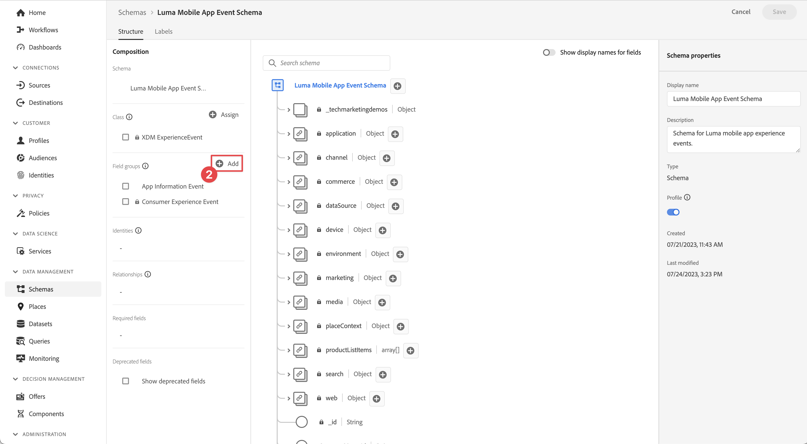{zoomable="yes"}
1. In the search bar, enter "lifecycle".
1. Select the checkbox next to **[!UICONTROL AEP Mobile Lifecycle Details]**.
1. Select **[!UICONTROL Add field groups]**.
    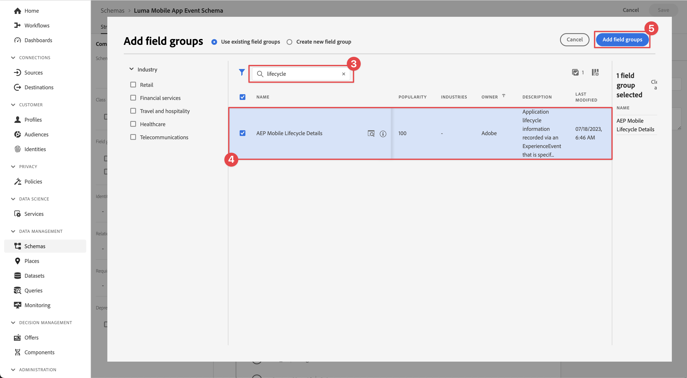{zoomable="yes"}
1. Select **[!UICONTROL Save]**.
    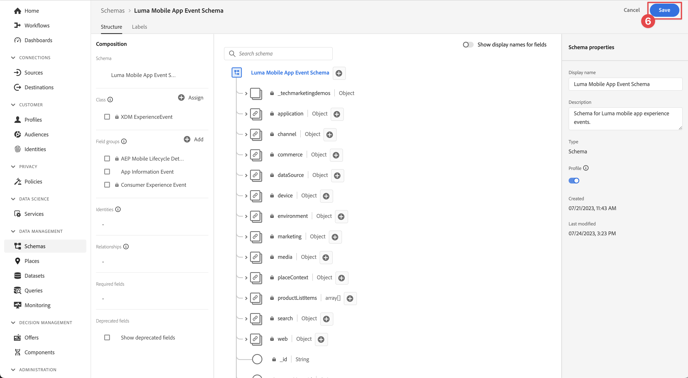{zoomable="yes"}
-->

## 実装の変更

これで、ライフサイクルイベントを登録するようにプロジェクトを更新できます。

>[!BEGINTABS]

>[!TAB iOS]

1. Xcode プロジェクトナビゲーターで&#x200B;**[!DNL Luma]** > **[!DNL Luma]** > **[!UICONTROL SceneDelegate]**&#x200B;に移動します。

1. アプリがバックグラウンド ステートから再開する場合、iOSは`sceneWillEnterForeground:` デリゲート メソッドを呼び出す可能性があり、このメソッドはライフサイクル開始イベントをトリガーする場所です。 このコードを`func sceneWillEnterForeground(_ scene: UIScene)`に追加します：

   ```swift
   // When in foreground start lifecycle data collection
   MobileCore.lifecycleStart(additionalContextData: nil)
   ```

1. アプリがバックグラウンドに入ると、アプリの`sceneDidEnterBackground:` デリゲート メソッドからのライフサイクルデータ収集を一時停止します。 このコードを`func sceneDidEnterBackground(_ scene: UIScene)`に追加します：

   ```swift
   // When in background pause lifecycle data collection
   MobileCore.lifecyclePause()
   ```

>[!TAB Android]

1. Android Studio ナビゲーターで、**[!UICONTROL app]** > **[!UICONTROL kotlin+java]** > **[!UICONTROL com.adobe.luma.tutorial.android]** > **[!UICONTROL LumaApplication]**&#x200B;に移動します。

1. アプリがバックグラウンド ステートから再開されている場合、Androidはオーバーライド `fun onActivityResumed function`を呼び出す可能性があり、この関数はライフサイクル開始イベントをトリガーする場所です。 このコードを`override fun onActivityResumed(activity: Activity)`に追加します：

   ```kotlin
   // When in foreground start lifecycle data collection
   MobileCore.lifecycleStart(null)
   ```

1. アプリがバックグラウンドに入ると、アプリの`override fun onActivityPaused`関数からのライフサイクルデータ収集を一時停止します。 このコードを`override fun onActivityPaused(activity: Activity)`に追加します：

   ```kotlin
   // When in background pause lifecycle data collection
   MobileCore.lifecyclePause()
   ```

>[!ENDTABS]


## Assurance での検証

1. シミュレーターまたはデバイスをAssuranceに接続するには、[設定の手順](assurance.md#connecting-to-a-session) セクションを確認してください。
1. アプリをバックグラウンドに送信します。 Assurance UIで&#x200B;**[!UICONTROL LifecyclePause]** イベントを確認します。
1. アプリを前面へ。 Assurance UIで&#x200B;**[!UICONTROL LifecycleResume]** イベントを確認します。
   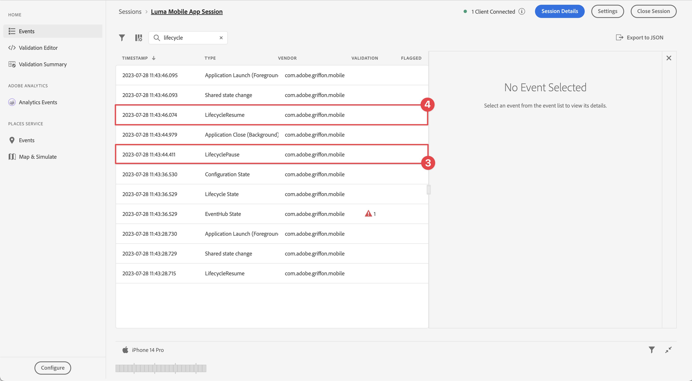{zoomable="yes"}


## データをPlatform Edge Networkに転送

前の演習では、前景イベントと背景イベントをAdobe Experience Platform Mobile SDKにディスパッチしました。 これらのイベントをPlatform Edge Networkに転送するには：

1. タグプロパティで「**[!UICONTROL ルール]**」を選択します。
   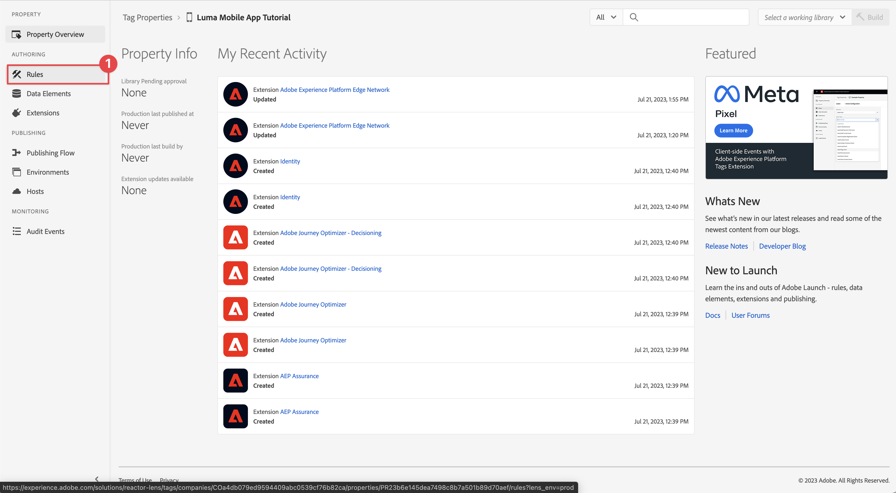{zoomable="yes"}
1. 使用するライブラリとして「**[!UICONTROL 初期ビルド]**」を選択します。
1. **[!UICONTROL 新しいルールを作成]**を選択します。
   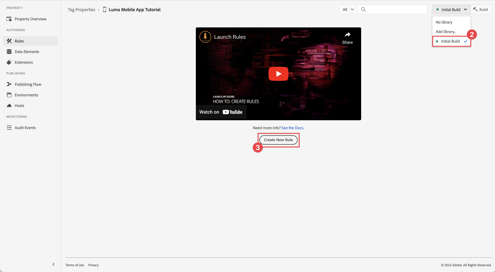{zoomable="yes"}
1. **[!UICONTROL ルールを作成]**&#x200B;画面で、`Application Status`名前&#x200B;**[!UICONTROL に]**&#x200B;と入力します。
1. の下の&#x200B;**[!UICONTROL 追加]** **[!UICONTROL 追加]**を選択します。
   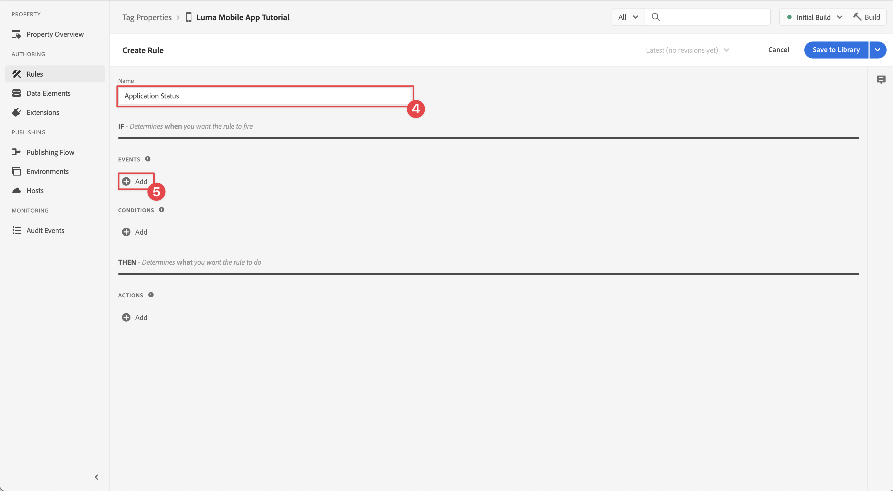{zoomable="yes"}
1. **[!UICONTROL イベント設定]**&#x200B;手順では、次の操作を行います。
   1. **[!UICONTROL Mobile Core]**&#x200B;を&#x200B;**[!UICONTROL 拡張機能]**&#x200B;として選択します。
   1. **[!UICONTROL 描画領域]**&#x200B;を&#x200B;**[!UICONTROL イベントタイプ]**&#x200B;として選択します。
   1. 「**[!UICONTROL 変更を保持]**」を選択します。
      {zoomable="yes"}
1. **[!UICONTROL ルールを作成]**&#x200B;画面に戻り、の横にある&#x200B;**[!UICONTROL Add]** **[!UICONTROL Add]**を選択します。
   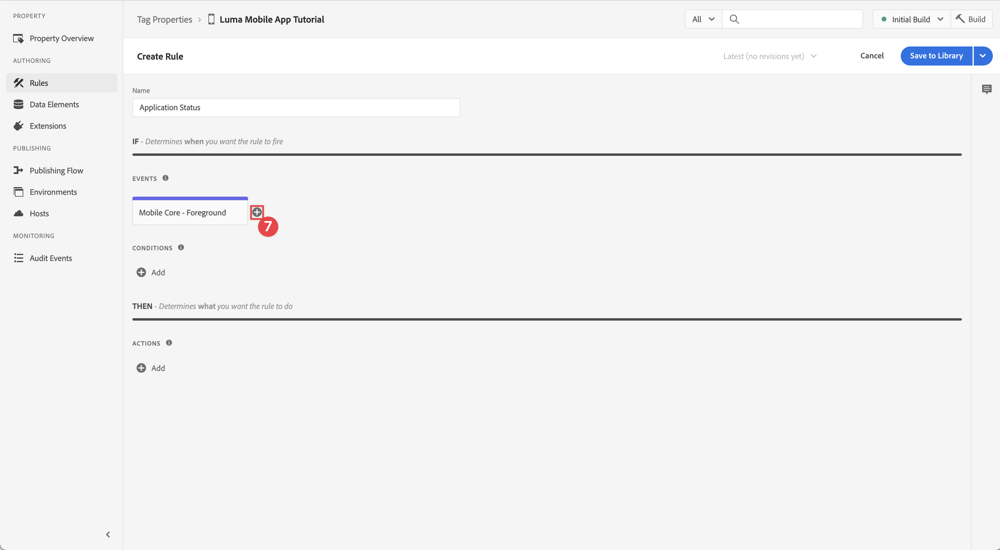{zoomable="yes"}
1. **[!UICONTROL イベント設定]**&#x200B;手順では、次の操作を行います。
   1. **[!UICONTROL Mobile Core]**&#x200B;を&#x200B;**[!UICONTROL 拡張機能]**&#x200B;として選択します。
   1. **[!UICONTROL 背景]**&#x200B;を&#x200B;**[!UICONTROL イベントタイプ]**&#x200B;として選択します。
   1. 「**[!UICONTROL 変更を保持]**」を選択します。
      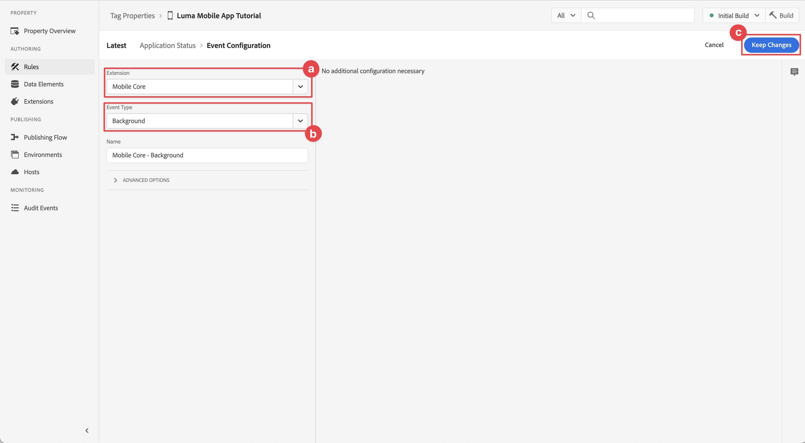{zoomable="yes"}
1. **[!UICONTROL ルールを作成]**&#x200B;画面に戻り、の下の&#x200B;**[!UICONTROL 追加]** **[!UICONTROL 追加]**&#x200B;を選択します。

   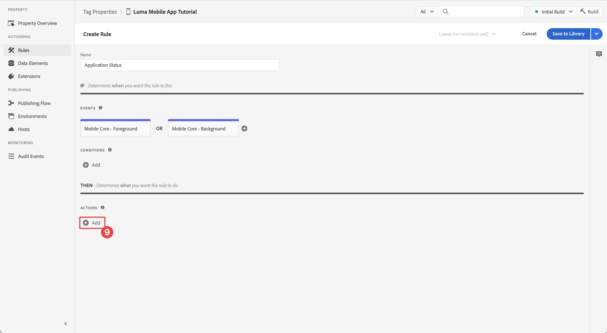{zoomable="yes"}

1. **[!UICONTROL アクション設定]**&#x200B;手順では、次の操作を行います。
   1. **[!UICONTROL Adobe Experience Edge Network]**&#x200B;を&#x200B;**[!UICONTROL 拡張機能]**&#x200B;として選択します。
   1. 「**[!UICONTROL イベントをEdge Network]**&#x200B;に転送」を「**[!UICONTROL アクションタイプ]**」として選択します。
   1. 「**[!UICONTROL 変更を保持]**」を選択します。
      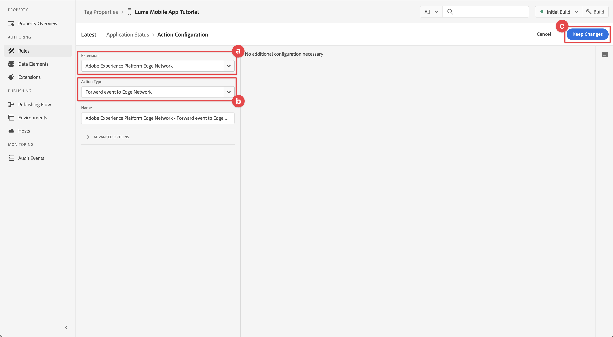{zoomable="yes"}
1. 「**[!UICONTROL ライブラリに保存]**」を選択します。
   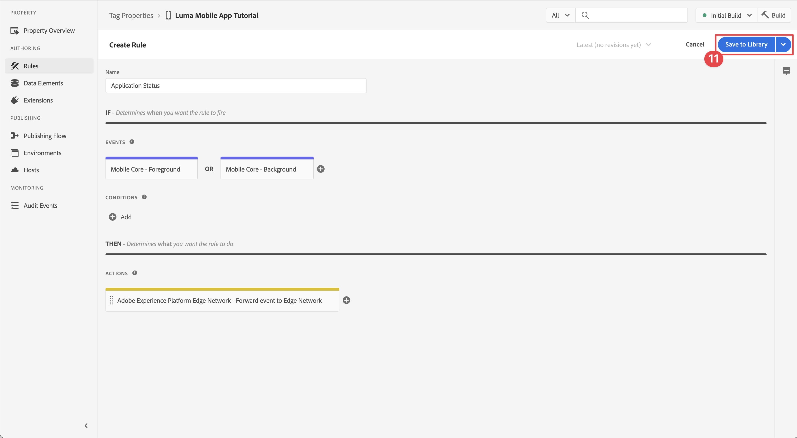{zoomable="yes"}
1. ライブラリを再構築するには、**[!UICONTROL ビルド]**を選択します。
   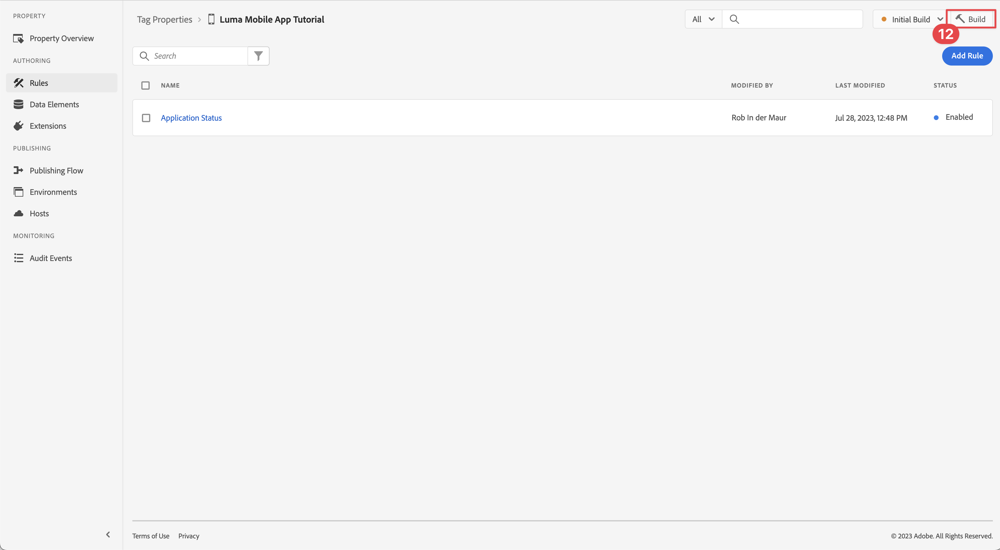{zoomable="yes"}

プロパティを正常に構築すると、イベントはPlatform Edge Networkに送信され、イベントはデータストリーム設定に従って他のアプリケーションやサービスに転送されます。

AssuranceでXDM データを含む&#x200B;**[!UICONTROL Application Close （Background）]**&#x200B;および&#x200B;**[!UICONTROL Application Launch （Foreground）]** イベントが表示されます。

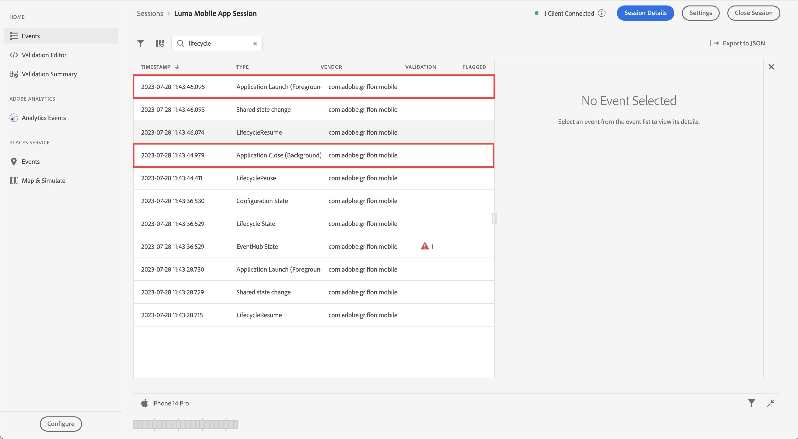{zoomable="yes"}

>[!SUCCESS]
>
>これで、アプリケーションのステート（前景、背景）イベントをAdobe Experience Platform Edge Networkおよびデータストリームで定義したすべてのサービスに送信するようにアプリを設定しました。
>
> Adobe Experience Platform Mobile SDKについて学ぶために時間を割いていただきありがとうございます。 ご質問がある場合、一般的なフィードバックを共有したい場合、または今後のコンテンツに関する提案がある場合は、この[Experience League コミュニティ ディスカッション投稿](https://experienceleaguecommunities.adobe.com/t5/adobe-experience-platform-data/tutorial-discussion-implement-adobe-experience-cloud-in-mobile/td-p/443796)で共有してください

次：**[イベントデータの追跡](events.md)**
