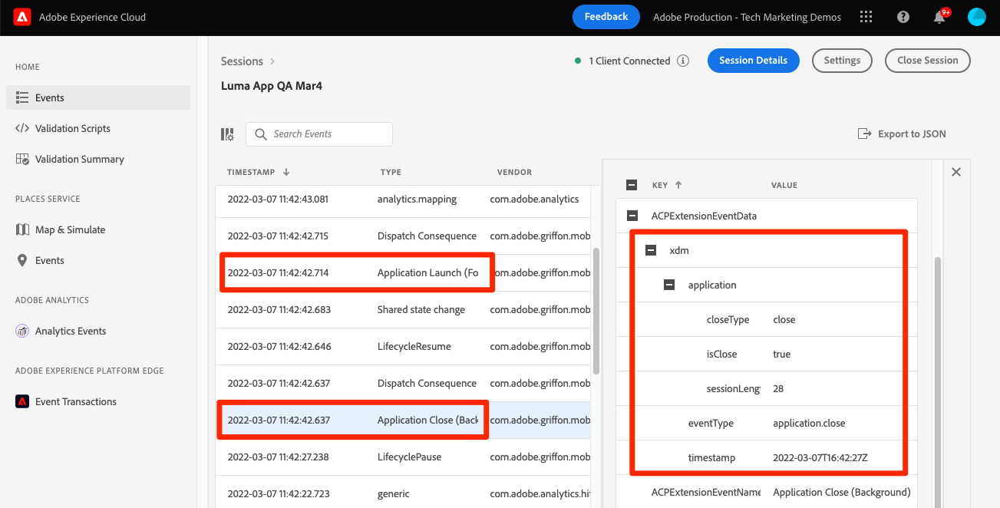

# ライフサイクルデータ

モバイルアプリでライフサイクルデータを収集する方法を説明します。

>[!INFO]
>
> このチュートリアルは、2023 年 11 月後半に新しいサンプルモバイルアプリを使用した新しいチュートリアルに置き換えられます

Adobe Experience Platform Mobile SDK Lifecycle 拡張機能を使用すると、モバイルアプリからの収集のライフサイクルデータを有効にします。 Adobe Experience Platform Edge Network 拡張機能は、このライフサイクルデータを Platform Edge Network に送信し、そこで、データストリーム設定に従って、他のアプリケーションやサービスに転送されます。 詳しくは、 [ライフサイクル拡張](https://developer.adobe.com/client-sdks/documentation/lifecycle-for-edge-network/) （製品ドキュメント内）。


## 前提条件

* SDK が正常に構築され、インストールされ、設定された状態でアプリが実行されました。
* Assurance SDK を読み込みました。

  ```swift
  import AEPAssurance
  ```

* Assurance 拡張機能を登録しました ( [前のレッスン](install-sdks.md).

## 学習内容

このレッスンでは、次の操作を実行します。

* スキーマにライフサイクルフィールドグループを追加します。
* アプリがフォアグラウンドとバックグラウンドの間を移動する際に正しく開始/一時停止することで、正確なライフサイクル指標を有効にします。
* アプリから Platform Edge ネットワークにデータを送信します。
* アシュランスで検証します。

## スキーマにライフサイクルフィールドグループを追加

「消費者エクスペリエンスイベント」フィールドグループを [前のレッスン](create-schema.md) には既にライフサイクルフィールドが含まれているので、この手順をスキップできます。 独自のアプリで「消費者エクスペリエンスイベント」フィールドグループを使用しない場合は、次の手順を実行してライフサイクルフィールドを追加できます。

1. スキーマインターフェイスに移動します ( [前のレッスン](create-schema.md).
1. 「Luma App」スキーマを開き、を選択します。 **[!UICONTROL 追加]**.
   
1. 検索バーに「lifecycle」と入力します。
1. の横にあるチェックボックスを選択します。 **[!UICONTROL AEP Mobile のライフサイクルの詳細]**.
1. 「**[!UICONTROL フィールドグループを追加]**」を選択します。
   
1. 「**[!UICONTROL 保存]**」を選択します。
   


## 実装の変更

次に、を更新できます。 `AppDelegate.swift` ライフサイクルイベントを登録するには：

1. アプリが起動されたときにバックグラウンド状態から再開されている場合、iOSは、 `applicationWillEnterForeground:` delegate メソッド。 追加 `lifecycleStart:`

   ```swift
   MobileCore.lifecycleStart(additionalContextData: nil)
   ```

1. アプリがバックグラウンドに入ると、アプリの `applicationDidEnterBackground:` delegate メソッド。

   ```swift
   MobileCore.lifecyclePause()
   ```

>[!NOTE]
>
>iOS 13 以降の場合は、 [ドキュメント](https://developer.adobe.com/client-sdks/documentation/mobile-core/lifecycle/#register-lifecycle-with-mobile-core-and-add-appropriate-startpause-calls) のコードが少し異なる場合にのみ有効です。

## アシュランスで検証

1. 以下を確認します。 [設定手順](assurance.md) を参照し、シミュレーターまたはデバイスを Assurance に接続します。
1. アプリを起動します。
1. アプリをバックグラウンドに送信します。 次を確認 `LifecyclePause`.
1. アプリをフォアグラウンドに移動します。 次を確認 `LifecycleResume`.
   


## データを Platform Edge ネットワークに転送する

前の演習では、フォアグラウンドイベントとバックグラウンドイベントを Mobile SDK にディスパッチします。 これらのイベントを Platform Edge Network に送信するには、以下の手順に従います [ここ](https://developer.adobe.com/client-sdks/documentation/lifecycle-for-edge-network/#configure-a-rule-to-forward-lifecycle-metrics-to-platform). イベントが Platform Edge ネットワークに送信されると、データストリーム設定に従って、他のアプリケーションやサービスに転送されます。

ライフサイクルイベントを Platform Edge Network に送信するルールを追加すると、次の内容が表示されます。 `Application Close (Background)` および `Application Launch (Foreground)` アシュランスに XDM データを含むイベント。




次へ： **[イベントの追跡](events.md)**

>[!NOTE]
>
>Adobe Experience Platform Mobile SDK の学習に時間を割いていただき、ありがとうございます。 ご質問がある場合、一般的なフィードバックを共有したい場合、または今後のコンテンツに関する提案がある場合は、こちらで共有してください [Experience Leagueコミュニティディスカッション投稿](https://experienceleaguecommunities.adobe.com/t5/adobe-experience-platform-launch/tutorial-discussion-implement-adobe-experience-cloud-in-mobile/td-p/443796)