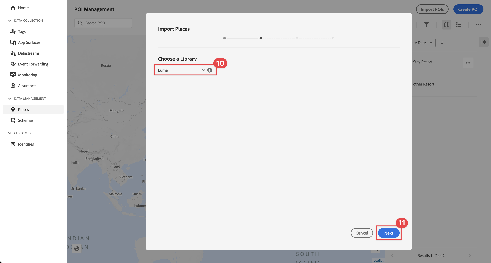
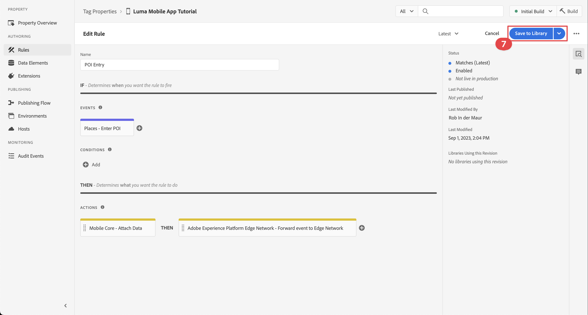

# 場所を使用

アプリで Places ジオロケーションサービスを使用する方法を説明します。

Adobe Experience Platform Data Collection Places Service は、位置認識機能を備えたモバイルアプリが位置のコンテキストを理解できるようにする位置情報サービスです。 このサービスは、豊富で使いやすいSDK インターフェイスと、柔軟な目標地点（POI）データベースを使用しています。

## 前提条件

* すべてのパッケージの依存関係は、Xcode プロジェクトに配置されます。
* AppDelegate に拡張機能を登録しました。
* 開発 appId を使用するように MobileCore を設定します。
* SDK を読み込みました。
* 上記の変更を含むアプリが正常に作成され、実行されました。

## 学習目標

このレッスンでは、次の操作を行います

* Places サービスで目標地点を定義する方法を理解します。
* 場所の拡張機能でタグプロパティを更新します。
* 位置情報イベントを取り込むようにスキーマを更新します。
* Assuranceの設定を検証します。
* アプリを更新して、Places 拡張機能を登録します。
* アプリの Places サービスから位置情報トラッキングを実装します。


## セットアップ

Places サービスがアプリ内および Mobile SDK内で機能するには、いくつかの設定を行う必要があります。

### 場所を定義

Places サービスでいくつかの目標点を定義します。

1. データ収集 UI で、「**[!UICONTROL 場所]**」を選択します。
1.  を選択します。
1. コンテキストメニューから、「**[!UICONTROL ライブラリを管理]**」を選択します。
   {zoomable="yes"}
1. **[!UICONTROL ライブラリを管理]** ダイアログで、「**[!UICONTROL 新規]**」を選択します。
1. **[!UICONTROL ライブラリを作成]** ダイアログで **[!UICONTROL 名前]** を入力（例：`Luma`）。
1. 「**[!UICONTROL 確認]**」を選択します。
   {zoomable="yes"}
1. **[!UICONTROL ライブラリを管理]** ダイアログを閉じるには、「**[!UICONTROL 閉じる]**」を選択します。
1. **[!UICONTROL POI 管理]** に戻り、「**[!UICONTROL POI を読み込み]**」を選択します。
1. **[!UICONTROL 場所を読み込み]** ダイアログで **[!UICONTROL 開始]** を選択します。
1. ライブラリのリストから **[!DNL Luma]** を選択します。
1. 「**[!UICONTROL 次へ]**」を選択します。
   {zoomable="yes"}
1. [Luma POI ZIP ファイルをダウンロードし ](assets/luma_pois.csv.zip) コンピューター上の場所に抽出します。
1. **[!UICONTROL 場所を読み込み]** ダイアログで、抽出した `luma_pois.csv` ファイルをにドラッグ&amp;ドロップします **[!UICONTROL CSV ファイルを選択 – ファイルをドラッグ&amp;ドロップ]**。 **[!UICONTROL 検証成功]** - **[!UICONTROL CSV ファイルの検証に成功しました]** と表示されます。
1. **[!UICONTROL 読み込みを開始]** を選択します。 **[!UICONTROL 成功]** - **[!UICONTROL 6 つの新しい POI が正常に追加されました]** が表示されます。
1. 「**[!UICONTROL 完了]**」を選択します。
1. **[!UICONTROL POI 管理]** で、6 つの新しい Luma ストアがリストに追加されます。  リストと  マップビューを切り替えることができます。
   {zoomable="yes"}。


### Places 拡張機能のインストール

1. **[!UICONTROL タグ]** に移動し、モバイルタグプロパティを見つけてプロパティを開きます。
1. **[!UICONTROL 拡張機能]** を選択します。
1. **[!UICONTROL カタログ]** を選択します。
1. **[!UICONTROL 場所]** 拡張機能を検索します。
1. 拡張機能をインストールします。

   

1. **[!UICONTROL 拡張機能をインストール]** ダイアログで、次の手順を実行します。
   1. **[!DNL Luma]** ライブラリを選択 **[!UICONTROL リストから「]**」を選択します。
   1. **[!UICONTROL 初期ビルド]** など、作業ライブラリが選択されていることを確認します。
   1. **[!UICONTROL ライブラリに保存]** から **[!UICONTROL ライブラリとビルドに保存]** を選択します。
      {zoomable="yes"} ます。

1. ライブラリが再構築されます。


### スキーマの検証

[ スキーマを作成 ](create-schema.md) で定義されているように、スキーマに POI およびジオロケーションデータを収集するために必要なフィールドグループとクラスが含まれているかどうかを確認します。

1. データ収集インターフェイスに移動し、左パネルから **[!UICONTROL スキーマ]** を選択します。
1. 上部のバーから **[!UICONTROL 参照]** を選択します。
1. スキーマを選択して開きます。
1. スキーマエディターで、「**[!UICONTROL 消費者エクスペリエンスイベント]**」を選択します。
1. POI インタラクションと位置情報データをキャプチャするオブジェクトとフィールドを持つ **[!UICONTROL placeContext]** オブジェクトが表示されます。
   {zoomable="yes"}.


### タグプロパティの更新

タグの Places 拡張機能は、位置情報イベントを監視する機能を提供し、それらのイベントに基づいてアクションをトリガーに設定できるようにします。 この機能を使用すると、アプリに実装する必要がある API コーディングを最小限に抑えることができます。

**データ要素**

最初に、複数のデータ要素を作成します。

1. データ収集 UI のタグプロパティに移動します。
1. 左パネルから **[!UICONTROL データ要素]** を選択します。
1. 「**[!UICONTROL データ要素を追加]**」を選択します。
1. **[!UICONTROL データ要素を作成]** 画面で、名前（例：`Name - Entered`）を入力します。
1. **[!UICONTROL 拡張機能]** リストから「**[!UICONTROL 場所]**」を選択します。
1. **[!UICONTROL データ要素タイプ]** リストから **[!UICONTROL 名前]** を選択します。
1. **[!UICONTROL TARGET]** の下の **[!UICONTROL 現在の POI]** を選択します。
1. **[!UICONTROL ライブラリに保存]** を選択します。
   {zoomable="yes"}

1. 以下の表の情報を使用して手順 4 ～ 8 を繰り返し、追加のデータ要素を作成します。

   | 名前 | 拡張機能 | データ要素タイプ | ターゲット |
   |---|---|---|---|
   | `Name - Exited` | Places | 名前 | 前回離脱した POI |
   | `Category - Current` | Places | カテゴリ | 現在の POI |
   | `Category - Exited` | Places | カテゴリ | 前回離脱した POI |
   | `City - Current` | Places | 市区町村 | 現在の POI |
   | `City - Exited` | Places | 市区町村 | 前回離脱した POI |

   次のデータ要素のリストが表示されます。

   {zoomable="yes"}

**ルール**

次に、これらのデータ要素を操作するためのルールを定義します。

1. タグプロパティで、左パネルから **[!UICONTROL ルール]** を選択します。
1. 「**[!UICONTROL ルールを追加]**」を選択します。
1. **[!UICONTROL ルールを作成]** 画面で、ルールの名前（例：`POI - Entry`）を入力します。
1.  の下の **[!UICONTROL 追加]** を選択します。
   1. **[!UICONTROL 拡張機能]** リストから **[!UICONTROL 場所]** を選択し、**[!UICONTROL イベントタイプ]** リストから **[!UICONTROL POI を入力]** を選択します。
   1. 「**[!UICONTROL 変更を保持]**」を選択します。
      。
1.  の下の「**[!UICONTROL 追加]**」を選択します。
   1. **[!UICONTROL 拡張機能]** リストから **[!UICONTROL Mobile Core]** を選択し、**[!UICONTROL アクションタイプ]** リストから **[!UICONTROL データを添付]** を選択します。 ペイロードデータを添付します。
   1. **[!UICONTROL JSON ペイロード]** に、次のペイロードを貼り付けます。

      ```json
      {
          "xdm": {
              "eventType": "location.entry",
              "placeContext": {
                  "geo": {
                      "city": "{%%City - Current%%}"
                  },
                  "POIinteraction": {
                      "poiDetail": {
                          "name": "{%%Name - Current%%}",
                          "category": "{%%Category - Current%%}"
                      },
                      "poiEntries": {
                          "value": 1
                      }
                  }
              }
          }
      }
      ```

      また、「`{%% ... %%}`Data 選択すると、JSON にデータ要素のプレースホルダー値を挿入できます。 ポップアップダイアログが表示され、作成したデータ要素を選択できます。

   1. 「**[!UICONTROL 変更を保持]**」を選択します。
      {zoomable="yes"}

1.  アクションの横にある **[!UICONTROL 追加]** を選択します。
   1. **[!UICONTROL 拡張機能]** リストから **[!UICONTROL Adobe Experience Platform Edge Network]** を選択し、「**[!UICONTROL イベントをEdge Networkに転送]**」を選択します。 これにより、イベントと追加のペイロードデータが Platform Edge Networkに転送されます。
   1. 「**[!UICONTROL 変更を保持]**」を選択します。

1. ルールを保存するには、「**[!UICONTROL ライブラリに保存]**」を選択します。

   {zoomable="yes"}

別のルールを作成しましょう

1. **[!UICONTROL ルールを作成]** 画面で、ルールの名前（例：`POI - Exit`）を入力します。
1.  の下の **[!UICONTROL 追加]** を選択します。
   1. **[!UICONTROL 拡張機能]** リストから **[!UICONTROL 場所]** を選択し、**[!UICONTROL イベントタイプ]** リストから **[!UICONTROL POI を終了]** を選択します。
   1. 「**[!UICONTROL 変更を保持]**」を選択します。
1.  の下の「**[!UICONTROL 追加]**」を選択します。
   1. **[!UICONTROL 拡張機能]** リストから **[!UICONTROL Mobile Core]** を選択し、**[!UICONTROL アクションタイプ]** リストから **[!UICONTROL データを添付]** を選択します。
   1. **[!UICONTROL JSON ペイロード]** に、次のペイロードを貼り付けます。

      ```json
      {
          "xdm": {
              "eventType": "location.exit",
              "placeContext": {
                  "geo": {
                      "city": "{%%City - Exited%%}"
                  },
                  "POIinteraction": {
                      "poiExits": {
                          "value": 1
                      },
                      "poiDetail": {
                          "name": "{%%Name - Exited%%}",
                          "category": "{%%Category - Exited%%}"
                      }
                  }
              }
          }
      }
      ```

   1. 「**[!UICONTROL 変更を保持]**」を選択します。

1.  アクションの横にある **[!UICONTROL 追加]** を選択します。
   1. **[!UICONTROL 拡張機能]** リストから **[!UICONTROL Adobe Experience Platform Edge Network]** を選択し、「**[!UICONTROL イベントをEdge Networkに転送]**」を選択します。
   1. 「**[!UICONTROL 変更を保持]**」を選択します。

1. ルールを保存するには、「**[!UICONTROL ライブラリに保存]**」を選択します。

   {zoomable="yes"}


タグ内のすべての変更が公開されていることを確認するには

1. ビルドするライブラリとして **[!UICONTROL 初期ビルド]** を選択します。
1. **[!UICONTROL ビルド]** を選択します。
   {zoomable="yes"}


## Assuranceでの設定の検証

Assuranceの設定を検証するには：

1. Assurance UI に移動します。
1. 左側のパネルに **[!UICONTROL まだ表示されていない場合は、左側のパネルの「]** 設定 」の横の「**[!UICONTROL 追加]** を選択し、「**[!UICONTROL PLACES SERVICE]**」の下の「**[!UICONTROL マップとシミュレート]** を選択します。
1. 「**[!UICONTROL 保存]**」を選択します。
1. 左パネルで「**[!UICONTROL マップとシミュレート]**」を選択します。
1. POI のいずれかの場所にマップを移動します。
1. 「 負荷 POI をシミュレート」を選択します。 POI は、円とピンを使用して識別されます。
1. POI を選択します。
1. ポップアップから、「 **[!UICONTROL 入力イベントをシミュレート]**」を選択します。

   {zoomable="yes"}

1. 左パネルから **[!UICONTROL イベント]** を選択すると、シミュレーションしたイベントが表示されます。

   {zoomable="yes"}


## アプリへの Places の実装

前のレッスンで説明したように、モバイルタグ拡張機能をインストールしても、設定のみが提供されます。 次に、場所SDKをインストールして登録する必要があります。 これらの手順が明確でない場合は、「SDK のインストール [ の節を参照し ](install-sdks.md) ください。

>[!NOTE]
>
>[SDK のインストール ](install-sdks.md) の節を完了した場合、Places SDKは既にインストールされているので、この手順をスキップできます。
>

>[!IMPORTANT]
>
>アプリでAndroidのマップ SDKを設定するには、使用状況に伴うコストとして請求を設定する必要があります。 一意のアプリケーション ID と SHA-1 キーを使用して、コストを制限できます。 詳しくは、[SDKをAndroidにマッピング ](https://developers.google.com/maps/documentation/android-sdk/overview) を参照してください。 請求を設定しない場合やコストを負担する場合は、このレッスンをスキップしてください。

>[!BEGINTABS]

>[!TAB iOS]

1. Xcode で、[AEP Places](https://github.com/adobe/aepsdk-places-ios) がパッケージの依存関係のパッケージの一覧に追加されていることを確認します。 [Swift パッケージマネージャー ](install-sdks.md#swift-package-manager) を参照してください。
1. Xcode プロジェクトナビゲーターで **[!DNL Luma]**/**[!DNL Luma]**/**[!DNL AppDelegate]** に移動します。
1. `AEPPlaces` が読み込みのリストに含まれていることを確認します。

   ```swift
   import AEPPlaces
   ```

1. `Places.self` が、登録している拡張機能の配列の一部であることを確認します。

   ```swift
   let extensions = [
       AEPIdentity.Identity.self,
       Lifecycle.self,
       Signal.self,
       Edge.self,
       AEPEdgeIdentity.Identity.self,
       Consent.self,
       UserProfile.self,
       Places.self,
       Messaging.self,
       Optimize.self,
       Assurance.self
   ]
   ```

1. Xcode プロジェクトナビゲーターで **[!DNL Luma]**/**[!DNL Luma]**/**[!DNL Utils]**/**[!UICONTROL MobileSDK]** に移動し、`func processRegionEvent(regionEvent: PlacesRegionEvent, forRegion region: CLRegion) async` 関数を見つけます。 次のコードを追加します。

   ```swift
   // Process geolocation event
   Places.processRegionEvent(regionEvent, forRegion: region)
   ```

   この [`Places.processRegionEvent`](https://developer.adobe.com/client-sdks/documentation/places/api-reference/#processregionevent) API は、位置情報を Places サービスに送信します。

1. Xcode のプロジェクトナビゲーターで **[!DNL Luma]**/**[!DNL Luma]**/**[!DNL Views]**/**[!DNL Location]**/**[!DNL GeofenceSheet]** に移動します。

   1. 「入力」ボタンに、次のコードを入力します。

      ```swift
      // Simulate geofence entry event
      Task {
          await MobileSDK.shared.processRegionEvent(regionEvent: .entry, forRegion: region)
      }
      ```

   1. 「終了」ボタンに、次のコードを入力します。

      ```swift
      // Simulate geofence exit event
      Task {
          await MobileSDK.shared.processRegionEvent(regionEvent: .exit, forRegion: region)
      }
      ```

>[!TAB Android]

1. Android Studio で、[aepsdk-places-android](https://github.com/adobe/aepsdk-places-android) が **[!UICONTROL Android:app]** ChevronDown **&#x200B;**&#x200B;Gradle Scriptsbuild.gradle.kts （Module **[!UICONTROL ）]** の依存関係に含まれていることを確認します。 [Gradle](install-sdks.md#gradle) を参照。
1. Android Studio プロジェクトナビゲーターで **[!UICONTROL Android]** /**[!DNL app]**/**[!DNL kotlin+java]**/**[!UICONTROL com.adobe.luma.tutorial.android]**/**[!UICONTROL LumaApplication]** に移動します。
1. `com.adobe.marketing.mobile.Messaging` が読み込みのリストに含まれていることを確認します。

   `import import com.adobe.marketing.mobile.Places`

1. `Places.EXTENSION` が、登録している拡張機能の配列の一部であることを確認します。

   ```kotlin
   val extensions = listOf(
       Identity.EXTENSION,
       Lifecycle.EXTENSION,
       Signal.EXTENSION,
       Edge.EXTENSION,
       Consent.EXTENSION,
       UserProfile.EXTENSION,
       Places.EXTENSION,
       Messaging.EXTENSION,
       Optimize.EXTENSION,
       Assurance.EXTENSION
   )
   ```

1. Android Studio プロジェクトナビゲーターで、**[!UICONTROL Android]** /**[!DNL app]**/**[!DNL kotlin+java]**/**[!UICONTROL com.adobe.luma.tutorial.android]**/**[!UICONTROL models]**/**[!UICONTROL MobileSDK]** に移動します。 `suspend fun processGeofence(geofence: Geofence?, transitionType: Int)` 関数を検索します。 次のコードを追加します。

   ```kotlin
   // Process geolocation event
   Places.processGeofence(geofence, transitionType)
   ```

   この [`Places.processRegionEvent`](https://developer.adobe.com/client-sdks/documentation/places/api-reference/#processregionevent) API は、位置情報を Places サービスに送信します。


1. Android Studio プロジェクトナビゲーターで、**[!UICONTROL Android]** /**[!DNL app]**/**[!DNL kotlin+java]**/**[!UICONTROL com.adobe.luma.tutorial.android]**/**[!UICONTROL views]**/**[!UICONTROL LocationView.k]** に移動します。

   1. 「入力」ボタンに、次のコードを入力します。

      ```kotlin
      // Simulate geofence entry event
      coroutineScope.launch {
          MobileSDK.shared.processGeofence(
             region,
             Geofence.GEOFENCE_TRANSITION_ENTER
          )
      }
      ```

   1. 「終了」ボタンに、次のコードを入力します。

      ```kotlin
      // Simulate geofence entry event
      coroutineScope.launch {
          MobileSDK.shared.processGeofence(
              region,
              Geofence.GEOFENCE_TRANSITION_EXIT
          )
      }
      ```

>[!ENDTABS]

## アプリを使用した検証

アプリでジオロケーション機能を検証するには：

>[!BEGINTABS]

>[!TAB iOS]

1. アプリをデバイスまたはシミュレーターで開きます。

1. 「**[!UICONTROL Location]**」タブに移動します。

1. マップを移動（ドラッグ）して、青い中央の円がいずれかの POI （例：ロンドン）の上にあることを確認します。

1. タップ カテゴリと名前がラベルの赤い場所にピンと共に表示されるまで  きます。

1. POI のラベルをタップすると、**[!UICONTROL 近くの POI]** シートが開きます。

   

1. **[!UICONTROL Entry]** または **[!UICONTROL Exit]** ボタンを押して、アプリからのジオフェンスの入口イベントと出口イベントをシミュレートします。

   

1. Assurance UI にイベントが表示されます。 イベントと Places Service イベントの両方で。

>[!TAB Android]

1. 「**[!UICONTROL Location]**」タブに移動します。

1. **[!UICONTROL ジオフェンスを使用またはシミュレート]** を選択します。

1. 表示される赤い円の中のどこかをタップします。

   


1. **[!UICONTROL Entry]** または **[!UICONTROL Exit]** ボタンを押して、アプリからのジオフェンスの入口イベントと出口イベントをシミュレートします。

   

1. Assurance UI にイベントが表示されます。


>[!ENDTABS]


## 次の手順

これで、アプリのジオロケーション機能にさらに機能を追加するためのツールがすべて揃いました。 イベントをEdge Networkに転送したので、[Experience Platform](platform.md) のアプリを設定すると、アプリで使用されるプロファイルにエクスペリエンスイベントが表示されます。

このチュートリアルのJourney Optimizerの節では、エクスペリエンスイベントを使用してジャーニーをトリガーJourney Optimizerできることを確認します（[ プッシュ通知 ](journey-optimizer-inapp.md) および [ アプリ内メッセージ ](journey-optimizer-push.md) を参照）。 例えば、通常の例では、アプリユーザーが物理的なストアのジオフェンスに入ると、製品プロモーションを伴うプッシュ通知が送信されます。

アプリのジオロケーション機能のこの実装により、コードが最小限に抑えられます。 タグプロパティで定義した Places サービス、データ要素、ルールが、ほとんどの機能を提供します。 または、入力された [`Edge.sendEvent` オブジェクトを含む XDM ペイロードで、](https://developer.adobe.com/client-sdks/documentation/edge-network/api-reference/#sendevent) [ API （詳しくは ](events.md) イベント `placeContext` を参照）を使用して、同じ機能をアプリに直接実装できます。

>[!SUCCESS]
>
>これで、Experience Platform Mobile SDKの Places 拡張機能を使用して、アプリにジオロケーションサービスを有効にしました。
>
>Adobe Experience Platform Mobile SDKの学習にご協力いただき、ありがとうございます。 ご不明な点がある場合や、一般的なフィードバックをお寄せになる場合、または今後のコンテンツに関するご提案がある場合は、この [Experience League Community Discussion の投稿 ](https://experienceleaguecommunities.adobe.com/t5/adobe-experience-platform-data/tutorial-discussion-implement-adobe-experience-cloud-in-mobile/td-p/443796) でお知らせください。

次のトピック：**[Adobe Analyticsへのデータのマッピング](analytics.md)**
