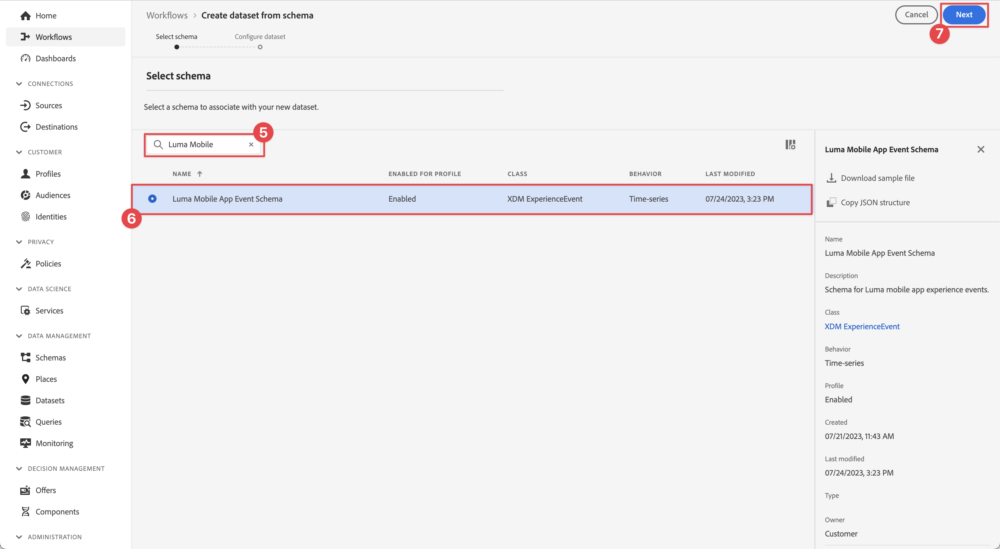

# Experience Platformへのデータの送信

モバイルアプリデータをAdobe Experience Platformに送信する方法を説明します。

このオプションレッスンは、Real-Time Customer Data Platform（Real-Time CDP）、Journey Optimizer、Customer Journey Analyticsのすべてのお客様に関連しています。 Experience Cloud製品の基盤となるExperience Platformは、すべてのデータ（Adobeおよび非Adobe）を堅牢な顧客プロファイルに変換するオープンシステムです。 これらの顧客プロファイルはリアルタイムで更新され、AI 駆動型のインサイトを使用して、すべてのチャネルにわたって適切なエクスペリエンスを提供するのに役立ちます。

以前のレッスンで収集して Platform Edge Networkに送信した [event](events.md)、[lifecycle](lifecycle-data.md) および [identity](identity.md) データは、Adobe Experience Platformを含むデータストリームで設定されたサービスに転送されます。

{zoomable="yes"}

## 前提条件

組織をプロビジョニングし、Adobe Experience Platformの権限を付与する必要があります。

アクセス権がない場合は、[ このレッスンをスキップ ](install-sdks.md) できます。

## 学習目標

このレッスンでは、次の操作を行います。

* Experience Platform データセットを作成します。
* Experience Platformにデータを転送するようにデータストリームを設定します。
* データセット内のデータを検証します。
* リアルタイム顧客プロファイルのスキーマとデータセットを有効にします。
* リアルタイム顧客プロファイルのデータを検証します。
* ID グラフ内のデータを検証します。

## データセットの作成

Adobe Experience Platformに正常に取り込まれたすべてのデータは、データレイク内にデータセットとして保持されます。 データセットは、スキーマ（列）とフィールド（行）を含んだデータのコレクション（通常はテーブル）のストレージおよび管理用の構成体です。 データセットには、保存するデータの様々な側面を記述したメタデータも含まれます。詳しくは、[ドキュメント](https://experienceleague.adobe.com/ja/docs/experience-platform/catalog/datasets/overview)を参照してください。

1. Experience Platform UI に移動します。 右上のアプリ **[!UICONTROL アプリ]** メニューから 

1. 左側のナビゲーションメニューから **[!UICONTROL データセット]** を選択します。

1. 「**[!UICONTROL 作成]**」を選択します。

1. 「**[!UICONTROL スキーマからデータセットを作成]**」をクリックします。
   {zoomable="yes"}

1. スキーマを検索します。 例えば、検索フィールドに `Luma Mobile` を使用します。
1. スキーマを選択します（例：**[!DNL Luma Mobile App Event Schema]**）。

1. 「**[!UICONTROL 次へ]**」を選択します。
   {zoomable="yes"}

1. **[!UICONTROL 名前]**、例：`Luma Mobile App Events Dataset` および **[!UICONTROL 説明]** を入力します。

1. 「**[!UICONTROL 完了]**」を選択します。
   {zoomable="yes"}

## Adobe Experience Platform データストリームサービスを追加

XDM データをEdge NetworkからAdobe Experience Platformに送信するには、[ データストリームの作成 ](create-datastream.md) の一部として設定したデータストリームにAdobe Experience Platform サービスを追加します。

>[!IMPORTANT]
>
>Adobe Experience Platform サービスは、イベントデータセットを作成した場合にのみ有効にできます。

1. データ収集 UI で、「**[!UICONTROL データストリーム]** とデータストリームを選択します。

1. 次に、「**[!UICONTROL サービスを追加]**」を選択します。

1. **[!UICONTROL サービス]** リストから [!UICONTROL Adobe Experience Platform] を選択します。

1. **[!UICONTROL 有効]** をオンにしてサービスを有効にします。

1. 前に作成した **[!UICONTROL イベントデータセット]** を選択します（例：**[!DNL Luma Mobile App Event Dataset]**）。

1. 「**[!UICONTROL 保存]**」を選択します。

   {zoomable="yes"}
1. 最終的な設定は次のようになります。

   {zoomable="yes"}

## データセット内のデータの検証

データセットを作成し、Platform にデータを送信するようにデータストリームを更新したので、Experience Platform Edge Networkに送信されるすべての XDM データは Platform に転送され、データセットに格納されます。

アプリを開き、イベントをトラッキングする画面に移動します。 また、ライフサイクル指標をトリガーにすることもできます。

Platform インターフェイスでデータセットを開きます。 データセットにバッチで到着するデータが表示されます。 通常、データは 15 分ごとにマイクロバッチで送信されるので、データがすぐに表示されない場合があります。

{zoomable="yes"}

また、**[!UICONTROL データセットをプレビュー]** 機能を使用してレコードとフィールドの例を確認することもできます。
{zoomable="yes"}

データを検証するためのより堅牢なツールは、Platform の [ クエリサービス ](https://experienceleague.adobe.com/en/docs/platform-learn/tutorials/queries/explore-data) です。

## リアルタイム顧客プロファイルを有効にする

Experience Platformのリアルタイム顧客プロファイルを使用すると、オンライン、オフライン、CRM、サードパーティデータなど、複数のチャネルのデータを組み合わせて、各顧客の全体像を構築できます。 プロファイルを使用すると、個別の顧客データを統合ビューに統合し、顧客のやり取りごとに実用的なタイムスタンプ付きの説明を提供できます。

### スキーマの有効化

1. スキーマ（例：**[!DNL Luma Mobile App Event Schema]**）を開きます。
1. **[!UICONTROL プロファイル]** を有効にします。
1. 「**[!UICONTROL このスキーマのデータには、identityMap フィールドにプライマリ ID が含まれる」を選択します。ダイアログで]** をクリックします。
1. **[!UICONTROL 保存]** スキーマ。

   {zoomable="yes"}

### データセットの有効化

1. データセット（例：**[!DNL Luma Mobile App Event Dataset]**）を開きます。
1. **[!UICONTROL プロファイル]** を有効にします。

   {zoomable="yes"}

### プロファイル内のデータの検証

アプリを開き、イベントをトラッキングしている画面に移動します。例：Luma アプリにログインして、購入します。

Assuranceを使用して、identityMap に渡される ID の 1 つ（メール、lumaCrmId、ECID）を検索します（例：CRM ID）。

{zoomable="yes"}

Platform インターフェイスで、

1. **[!UICONTROL プロファイル]** に移動し、上部バーから **[!UICONTROL 参照]** を選択します。
1. 取り込んだ ID の詳細（例：`Luma CRM ID`ID 名前空間 **[!UICONTROL の]**）と、コピーした値 **[!UICONTROL ID 値]** を指定します。 次に、「**[!UICONTROL 表示]**」を選択します。
1. 詳細を表示するには、プロファイルを選択します。

{zoomable="yes"}

**[!UICONTROL 詳細]** 画面には、**[!UICONTROL **&#x200B; リンクされた ID &#x200B;**]** など、ユーザーに関する基本情報が表示されます。
{zoomable="yes"}

**[!UICONTROL イベント]** には、このユーザーについてモバイルアプリ実装から収集されたイベントが表示されます。

{zoomable="yes"}

プロファイルの詳細画面から、次の操作を行います。

1. ID グラフを表示するには、リンクをクリックするか、**[!UICONTROL ID]** に移動し、上部バーから **[!UICONTROL ID グラフ]** を選択します。
1. ID 値を検索するには、`Luma CRM ID` を **[!UICONTROL ID 名前空間]** として指定し、コピーした値を **[!UICONTROL ID 値]** として指定します。 次に、「**[!UICONTROL 表示]**」を選択します。

   このビジュアライゼーションは、プロファイル内でリンクされている ID とその接触チャネルを表示します。 次に、この Mobile SDK チュートリアル（Data Source 2）と [Web SDK チュートリアル ](https://experienceleague.adobe.com/ja/docs/platform-learn/implement-web-sdk/overview) （Data Source 1）の両方で収集されたデータを使用して構成された ID グラフの例を示します。

   {zoomable="yes"}

## 次の手順

マーケターと Analytics がExperience Platformで取得したデータで実行できる操作は、Customer Journey Analyticsでの分析やReal-Time Customer Data Platformでのセグメントの構築など、他にもたくさんあります。 出だしがよかったね。

>[!SUCCESS]
>
>これで、Edge NetworkだけでなくAdobe Experience Platformにもデータを送信するようにアプリを設定しました。 Adobe Experience Platform Mobile SDKの学習に時間を費やしていただきありがとうございます。 ご不明な点がある場合や、一般的なフィードバックをお寄せになる場合、または今後のコンテンツに関するご提案がある場合は、この [Experience League Community Discussion の投稿 ](https://experienceleaguecommunities.adobe.com/t5/adobe-experience-platform-data/tutorial-discussion-implement-adobe-experience-cloud-in-mobile/td-p/443796) でお知らせください。
>

次のトピック：**[プッシュ通知の作成および送信](journey-optimizer-push.md)**
