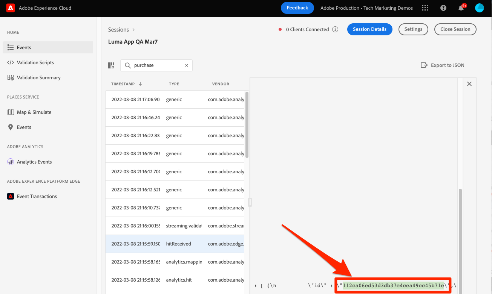

# Adobe Experience Platformにデータを送信

Adobe Experience Platformにデータを送信する方法を説明します。

>[!INFO]
>
> このチュートリアルは、2023 年 11 月後半に新しいサンプルモバイルアプリを使用した新しいチュートリアルに置き換えられます

このオプションのレッスンは、Real-time Customer Data Platform(Real-Time CDP)、Journey OptimizerおよびCustomer Journey Analyticsのすべてのお客様に関連しています。 Experience Platformは、AdobeとAdobe以外のすべてのデータを、リアルタイムで更新する堅牢な顧客プロファイルに変換し、AI に基づくインサイトを使用して、あらゆるチャネルで適切なエクスペリエンスを提供するオープンシステムです。

The [イベント](events.md), [ライフサイクル](lifecycle-data.md)、および [id](identity.md) 以前のレッスンで収集し、Platform Edge Network に送信したデータは、Adobe Experience Platformを含む、データストリームで設定されたサービスに転送されます。

## 前提条件

組織がプロビジョニングされ、Adobe Experience Platformに対する権限が付与されている必要があります。

アクセス権がない場合は、 [このレッスンをスキップ](install-sdks.md).

## 学習内容

このレッスンでは、次の操作を実行します。

* Experience Platformデータセットを作成する。
* データセット内のデータを検証します。
* リアルタイム顧客プロファイルのスキーマとデータセットを有効にします。
* リアルタイム顧客プロファイルでデータを検証します。
* ID グラフのデータを検証します。

## データセットの作成

Adobe Experience Platformに正常に取り込まれたすべてのデータは、データレイク内にデータセットとして保持されます。 データセットは、スキーマ（列）とフィールド（行）で構成されるデータコレクション（通常はテーブル）を格納し管理するための構造です。データセットには、保存するデータの様々な側面を記述したメタデータも含まれます。詳しくは、 [ドキュメント](https://experienceleague.adobe.com/docs/experience-platform/catalog/datasets/overview.html?lang=ja) 」を参照してください。

1. 右上の 3 x 3Experience Platformから選択して、メニューインターフェイスに移動します。
   

1. 選択 **[!UICONTROL データセット]** をクリックします。

1. **[!UICONTROL データセットの作成]**.
   

1. 「**[!UICONTROL スキーマからデータセットを作成]**」をクリックします。
   

1. スキーマを検索し、「 」を選択します。

1. 「**[!UICONTROL 次へ]**」を選択します。
   

1. 次を提供： **[!UICONTROL 名前]**, **[!UICONTROL 説明]**&#x200B;をクリックし、次を選択します。 **[!UICONTROL 完了]**.
   

## データストリームの更新

データセットを作成したら、必ず [データストリームの更新](create-datastream.md) をクリックしてAdobe Experience Platformを追加します。 この更新により、データが Platform に送られるようになります。

## データセット内のデータの検証

データセットを作成し、データストリームを更新してExperience Platformにデータを送信したので、Platform Edge Network に送信されるすべての XDM データが Platform に転送され、データセットに格納されます。

アプリを開き、イベントを追跡している画面に移動します。 また、ライフサイクル指標をトリガーすることもできます。

Platform インターフェイスでデータセットを開きます。 データセットにバッチで到着したデータを確認する必要があります

また、 **[!UICONTROL データセットをプレビュー]** 機能：

データを検証するためのより堅牢なツールは、Platform の [クエリサービス](https://experienceleague.adobe.com/docs/platform-learn/tutorials/queries/explore-data.html?lang=ja).

## リアルタイム顧客プロファイルの有効化

Experience Platformのリアルタイム顧客プロファイルを使用すると、オンライン、オフライン、CRM、サードパーティデータなど、複数のチャネルのデータを組み合わせた、各顧客の全体像を構築できます。 プロファイルを使用すると、個別の顧客データを統合ビューに統合し、顧客のやり取りごとに実用的なタイムスタンプ付きの説明を提供できます。

### スキーマを有効にする

1. スキーマを開く
1. 有効にする **[!UICONTROL プロファイル]**
1. 選択 **[!UICONTROL このスキーマのデータの identityMap フィールドには、プライマリ ID が含まれます。]** モーダル内
1. ****&#x200B;スキーマの保存

   

### データセットの有効化

1. データセットを開く
1. 有効にする **[!UICONTROL プロファイル]**

   

### プロファイル内のデータの検証

アプリを開き、イベントを追跡している画面に移動します。 Luma アプリにログインし、購入します。

アシュランスを使用して、identityMap に渡される ID(Email、lumaCrmId、ECID) の 1 つを見つけます。

>[!TIP]
>
>   の値 `lumaCrmId` 次に該当 `112ca06ed53d3db37e4cea49cc45b71e`

Platform インターフェイスで、に移動します。 **[!UICONTROL プロファイル]** > **[!UICONTROL 参照]**」をクリックし、取得した id 値を参照して、プロファイルを開きます。

次の日： **[!UICONTROL 詳細]** 画面には、 **[!UICONTROL **&#x200B;リンクされた ID **]**:

次の日： **[!UICONTROL イベント]**&#x200B;を使用すると、このユーザーのモバイルアプリ実装から収集されたイベントを表示できます。

プロファイルの詳細画面で、リンクをクリックして ID グラフを表示するか、に移動します。 **[!UICONTROL ID]** > **[!UICONTROL ID グラフ]** id 値を参照します。 このビジュアライゼーションは、プロファイル内でリンクされているすべての ID とその接触チャネルを表示します。 以下に、この Mobile SDK チュートリアル（データソース 2）と [Web SDK チュートリアル](https://experienceleague.adobe.com/docs/platform-learn/implement-web-sdk/overview.html?lang=ja) （データソース 1）:

マーケターや分析は、Experience Platformで取り込まれたデータを使用して、さらに多くのことを実行できます。Customer Journey Analyticsでの分析やReal-time Customer Data Platformでのセグメントの作成などです。 スタートは好いぞ！

次へ： **[Journey Optimizerを使用したプッシュメッセージ](journey-optimizer-push.md)**

>[!NOTE]
>
>Adobe Experience Platform Mobile SDK の学習に時間を割いていただき、ありがとうございます。 ご質問がある場合、一般的なフィードバックを共有する場合、または今後のコンテンツに関する提案がある場合は、このドキュメントで共有します [Experience Leagueコミュニティディスカッション投稿](https://experienceleaguecommunities.adobe.com/t5/adobe-experience-platform-data/tutorial-discussion-implement-adobe-experience-cloud-in-mobile/td-p/443796)
